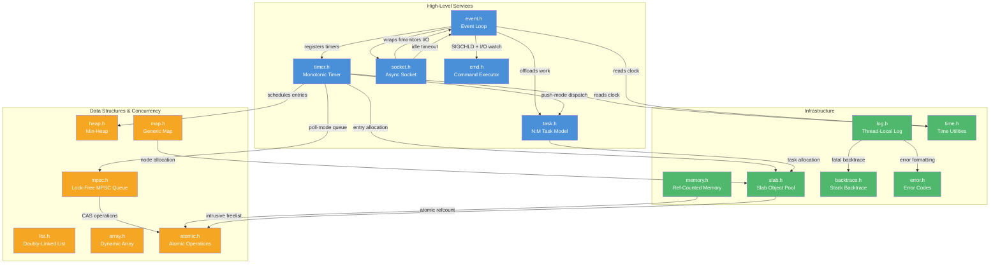
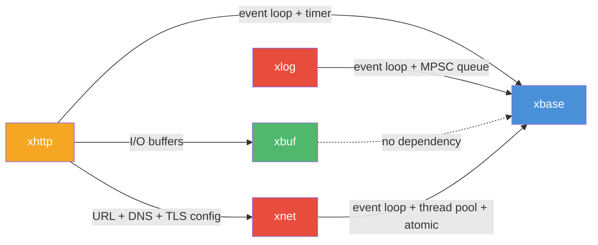

# xbase — Event-Driven Async Foundation

## Introduction

**xbase** is the foundational module of moo, providing the core primitives for building event-driven, asynchronous C applications on macOS and Linux. It delivers a cross-platform event loop, monotonic timers, an N:M task model (thread pool), async sockets, reference-counted memory management, lock-free data structures, and essential utilities — all in a minimal, zero-dependency C99 package.

xbase is designed to be the "kernel" that higher-level moo modules (xbuf, xhttp, xlog) build upon. Every I/O-bound or timer-driven feature in moo ultimately relies on xbase's event loop and concurrency primitives.

## Design Philosophy

1. **Edge-Triggered by Default** — The event loop operates in edge-triggered mode across all backends (kqueue, epoll, poll), encouraging callers to drain file descriptors completely. This yields higher throughput and fewer spurious wakeups compared to level-triggered designs.

2. **Layered Abstraction** — Low-level primitives (atomic, mpsc, heap) are composed into mid-level services (timer, task) which are then integrated into the high-level event loop. Each layer is independently usable.

3. **Zero Allocation in the Hot Path** — Data structures like the MPSC queue and min-heap are designed to avoid dynamic allocation during normal operation. Memory is pre-allocated or embedded in user structs.

4. **Thread-Safety Where It Matters** — APIs that are expected to be called cross-thread (e.g., `xEventWake`, `xTimerSubmitAfter`, `xMpscPush`) are explicitly designed to be thread-safe. Single-threaded APIs are documented as such.

5. **vtable-Driven Lifecycle** — The memory module uses a virtual table pattern (ctor/dtor/retain/release) to provide reference-counted object management in pure C, inspired by Objective-C's retain/release model.

6. **Platform Adaptation at Build Time** — Platform-specific code (kqueue vs. epoll, libunwind vs. execinfo) is selected via compile-time macros, keeping runtime overhead at zero.

## Architecture



## Sub-Module Overview

| Header | Document | Description |
| --- | --- | --- |
| [`event.h`](event.md) | [event.md](event.md) | Cross-platform event loop (edge-triggered) — kqueue / epoll / poll backends with built-in timer and thread-pool integration |
| [`timer.h`](timer.md) | [timer.md](timer.md) | Monotonic timer with push (thread-pool) and poll (lock-free MPSC) fire modes |
| [`task.h`](task.md) | [task.md](task.md) | N:M task model — lightweight tasks multiplexed onto a configurable thread pool |
| [`socket.h`](socket.md) | [socket.md](socket.md) | Async socket abstraction with idle-timeout support over xEventLoop |
| [`memory.h`](memory.md) | [memory.md](memory.md) | Reference-counted allocation with vtable-driven lifecycle (ctor/dtor/retain/release) |
| [`slab.h`](slab.md) | [slab.md](slab.md) | Fixed-size object pool — single-threaded `xSlab` and thread-safe `xSlabMt` variants for high-frequency small allocations |
| [`log.h`](log.md) | [log.md](log.md) | Per-thread callback-based logging with optional backtrace on fatal |
| [`backtrace.h`](backtrace.md) | [backtrace.md](backtrace.md) | Platform-adaptive stack trace capture (libunwind > execinfo > stub) |
| [`error.h`](error.md) | [error.md](error.md) | Unified error codes (`xErrno`) and human-readable messages |
| [`heap.h`](heap.md) | [heap.md](heap.md) | Generic min-heap with O(log n) insert/remove, used internally by the timer subsystem |
| [`map.h`](map.md) | [map.md](map.md) | Generic key-value map with three backends: hash table, flat table, and red-black tree |
| [`mpsc.h`](mpsc.md) | [mpsc.md](mpsc.md) | Lock-free multi-producer / single-consumer intrusive queue |
| [`atomic.h`](atomic.md) | [atomic.md](atomic.md) | Compiler-portable atomic operations (GCC/Clang `__atomic` builtins) |
| [`io.h`](io.md) | [io.md](io.md) | Abstract I/O interfaces (Reader, Writer, Seeker, Closer) with convenience helpers (xReadFull, xReadAll, xWritev, etc.) |
| `list.h` | [list.md](list.md) | Intrusive doubly-linked circular list — zero-allocation, inline implementation derived from Linux kernel's `list.h` |
| `array.h` | [array.md](array.md) | Generic auto-growing array — type-erased contiguous storage with optional lifecycle callbacks (retain/release/equal) |
| `hex.h` | [hex.md](hex.md) | Hex (base16) encode/decode — binary to/from ASCII hex string (lower-case output, case-insensitive decode) |
| `base64.h` | [base64.md](base64.md) | Base64 encode/decode (RFC 4648) — standard and URL-safe alphabets, with or without `=` padding |
| `time.h` | — | Time utilities: `xMonoMs()` (monotonic) and `xWallMs()` (wall-clock) in milliseconds |
| `cmd.h` | [cmd.md](cmd.md) | Async command executor over xEventLoop — spawn child processes with stdout/stderr capture, streaming, discard, and PTY modes |
| `flag.h` | [flag.md](flag.md) | POSIX/GNU-style command-line flag parser — typed storage, auto-generated `--help`, choice validation, counter and positional support |

## How to Choose

| I need to… | Use |
| --- | --- |
| React to I/O readiness on file descriptors | [`event.h`](event.md) — register fds and get edge-triggered callbacks |
| Schedule delayed or periodic work | [`timer.h`](timer.md) — standalone timer, or use `xEventLoopTimerAfter()` for event-loop-integrated timers |
| Run CPU-bound work off the main thread | [`task.h`](task.md) — submit to a thread pool, optionally collect results |
| Post a callback to the event loop from another thread | [`event.h`](event.md) — `xEventLoopPost()` for zero-overhead cross-thread dispatch |
| Manage non-blocking TCP/UDP connections | [`socket.h`](socket.md) — wraps socket + event loop + idle timeout |
| Allocate objects with automatic cleanup | [`memory.h`](memory.md) — `XMALLOC(T)` + `xRetain`/`xRelease` |
| Pool many small fixed-size objects with minimal overhead | [`slab.h`](slab.md) — `xSlab` (ST) / `xSlabMt` (MT) object pool with intrusive freelist |
| Report errors from library internals | [`log.h`](log.md) — thread-local callback, or stderr fallback |
| Capture a stack trace for debugging | [`backtrace.h`](backtrace.md) — `xBacktrace()` fills a buffer |
| Handle error codes uniformly | [`error.h`](error.md) — `xErrno` enum + `xstrerror()` |
| Build a priority queue | [`heap.h`](heap.md) — generic min-heap with index tracking |
| Store key-value pairs with O(1) or O(log n) access | [`map.h`](map.md) — generic map with hash, flat, and tree backends |
| Chain elements in an intrusive doubly-linked list | [`list.h`](list.md) — zero-allocation circular list with `xContainerOf` entry access |
| Store a growable list of fixed-size elements with automatic cleanup | [`array.h`](array.md) — `xArray` with optional retain/release callbacks for per-element resource management |
| Pass messages between threads lock-free | [`mpsc.h`](mpsc.md) — intrusive MPSC queue |
| Perform atomic read-modify-write | [`atomic.h`](atomic.md) — macro wrappers over compiler builtins |
| Get current time in milliseconds | `time.h` — `xMonoMs()` for elapsed time, `xWallMs()` for wall-clock |
| Read/write through abstract I/O interfaces | [`io.h`](io.md) — `xReader` / `xWriter` + helpers like `xReadFull`, `xReadAll` |
| Submit a shell command asynchronously | [`cmd.h`](cmd.md) — `xCommandExecutorSubmit()` with capture, stream, or discard output modes |
| Parse command-line arguments | [`flag.h`](flag.md) — `xFlagAddString / Int / Bool / Choice / Counter / Positional` + `xFlagParse` with auto-generated `--help` |

## Quick Start

A minimal example that creates an event loop, schedules a one-shot timer, and runs until the timer fires:

```c
#include <stdio.h>
#include <x/base/event.h>

static void on_timer(void *arg) {
    printf("Timer fired!\n");
    xEventLoopStop((xEventLoop)arg);
}

int main(void) {
    // Create an event loop
    xEventLoop loop = xEventLoopCreate();
    if (!loop) return 1;

    // Schedule a timer to fire after 1 second
    xEventLoopTimerAfter(loop, on_timer, loop, 1000);

    // Run the event loop (blocks until xEventLoopStop is called)
    xEventLoopRun(loop);

    // Clean up
    xEventLoopDestroy(loop);
    return 0;
}
```

Compile with:

```bash
gcc -o example example.c -I/path/to/moo -lxbase -lpthread
```

## Relationship with Other Modules



- **xbuf** — Buffer module. `xIOBuffer` uses xbase's `atomic.h` for lock-free block pool management. xhttp uses both xbase and xbuf together.
- **xhttp** — The async HTTP client is built on top of xbase's event loop (`xEventLoop`) and timer infrastructure, and uses xbuf for response buffering.
- **xnet** — The networking primitives module. The async DNS resolver uses xbase's event loop for thread-pool offload (`xEventLoopSubmit`) and `atomic.h` for the cancellation flag. Cross-thread notifications (e.g., ICE/TURN completions) can use `xEventLoopPost()` to avoid thread-pool overhead.
- **xlog** — The async logger uses xbase's event loop for timer-based flushing and the MPSC queue for lock-free log message passing from application threads to the logger thread.
