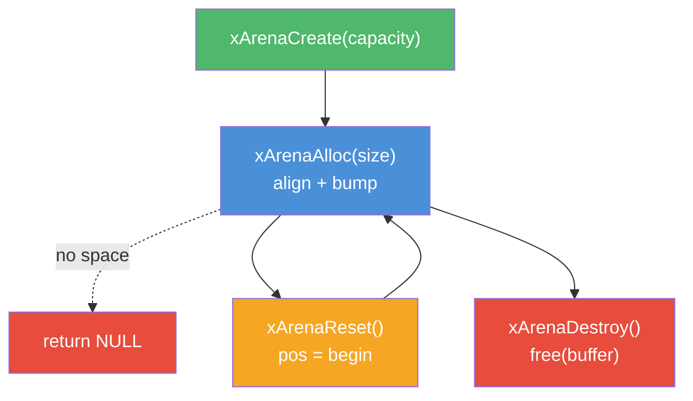
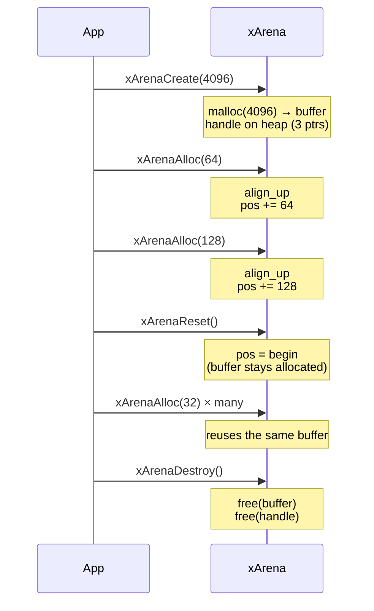

# arena.h — Fixed-Capacity Bump Allocator

## Introduction

`arena.h` provides a simple bump allocator: allocate a block of memory up front and hand out variable-sized slices by bumping a pointer forward. Memory is never individually freed — it is reclaimed only by destroying the arena or calling `xArenaReset()`. This makes it ideal for phase-scoped allocations where every object shares the same lifetime.

Typical use cases include:

- **Parse trees** — Allocate every node, string, and metadata from a single arena. One `xArenaDestroy()` cleans up the entire tree.
- **Request-scoped data** — In an HTTP server, allocate per-request state (headers, body buffers, parsed JSON) from a per-request arena. Reset between requests.
- **Temporary scratch buffers** — Allocate composite structures during a computation and discard them all at once when the computation finishes.

The arena never grows beyond its initial capacity. `xArenaAlloc()` returns NULL when full, forcing the caller to either use a larger arena or fall back to the general-purpose allocator — a deliberate design choice that keeps the fast path a single pointer bump with no churn.

## Design Philosophy

1. **Bump, Don't Bookkeep** — Allocation is a single aligned pointer bump. No freelists, no size-class lookups, no per-slot headers. The trade-off: individual frees are impossible; all memory must be reclaimed at once.

2. **Fixed Capacity, Explicit Failure** — The arena never grows. `xArenaAlloc()` returns NULL when the remaining space (after alignment) is insufficient. Callers must handle this case explicitly, which prevents silent performance degradation from unbounded growth.

3. **No Destructor Tracking** — The arena does not know what objects were allocated from it. Callers are responsible for calling destructors / cleanup functions before `xArenaDestroy()` or `xArenaReset()`. This keeps the arena minimal and avoids the overhead of a destructor list.

4. **O(1) Ownership Test** — `xArenaOwns()` answers "was this pointer allocated from this arena?" in a single pointer-range comparison. Useful for assertions, debugging, and cases where the caller needs to verify arena membership before writing to a shared buffer.

5. **Uninitialised Memory** — `xArenaAlloc()` returns uninitialised memory (like `malloc`). Callers that need zeroed memory must call `memset` explicitly. This avoids wasted writes when the caller intends to overwrite every byte immediately.

6. **Single Buffer, No Chunk Chaining** — Unlike `xSlab` (which grows by acquiring additional OS-backed chunks), xArena is backed by a single contiguous `malloc`-ed buffer. The trade-off is a hard capacity ceiling, but the benefit is simpler code and predictable memory layout.

## Architecture



## API Reference

### Constants

| Macro | Value | Description |
| --- | --- | --- |
| `XARENA_DEFAULT_ALIGN` | `16` | Default alignment when `align == 0` is passed to `xArenaAllocAligned` |

### Types

| Type | Description |
| --- | --- |
| `xArena` | Opaque handle to a fixed-capacity bump allocator |

### Functions

| Function | Signature | Description |
| --- | --- | --- |
| `xArenaCreate` | `xArena *xArenaCreate(size_t capacity)` | Create an arena with `capacity` bytes pre-allocated. Returns NULL on OOM. |
| `xArenaDestroy` | `void xArenaDestroy(xArena *a)` | Release the backing buffer and the arena handle. NULL is a no-op. All pointers become invalid. |
| `xArenaAlloc` | `void *xArenaAlloc(xArena *a, size_t size)` | Bump-allocate `size` bytes with default (16-byte) alignment. Returns NULL if full. |
| `xArenaAllocAligned` | `void *xArenaAllocAligned(xArena *a, size_t size, size_t align)` | Bump-allocate `size` bytes with explicit alignment. `align` must be a power of two. `0` selects default. |
| `xArenaCapacity` | `size_t xArenaCapacity(const xArena *a)` | Total capacity in bytes. |
| `xArenaUsed` | `size_t xArenaUsed(const xArena *a)` | Bytes consumed so far (includes alignment padding). |
| `xArenaRemaining` | `size_t xArenaRemaining(const xArena *a)` | Bytes still available (before accounting for future alignment padding). |
| `xArenaOwns` | `int xArenaOwns(const xArena *a, const void *p)` | Returns non-zero if `p` points within the arena's backing buffer. O(1). |
| `xArenaReset` | `void xArenaReset(xArena *a)` | Reset bump pointer to start. Buffer stays allocated. All old pointers become dangling. |

## Usage Examples

### Basic: phase-scoped allocations

```c
#include <stdio.h>
#include <stdlib.h>
#include <string.h>
#include <x/base/arena.h>

typedef struct Node {
    char         *name;
    struct Node **children;
    int           child_count;
} Node;

Node *parse_tree(const char *input, xArena *arena) {
    Node *n = xArenaAlloc(arena, sizeof(Node));
    memset(n, 0, sizeof(*n));

    n->name = xArenaAlloc(arena, 32);
    strcpy(n->name, "root");

    n->children    = xArenaAlloc(arena, 4 * sizeof(Node *));
    n->child_count = 1;
    n->children[0] = parse_tree("child", arena);

    return n;
}

int main(void) {
    xArena *arena = xArenaCreate(4096);
    if (!arena) return 1;

    Node *root = parse_tree("input", arena);
    printf("root: %s, children: %d\n", root->name, root->child_count);

    // Everything — nodes, strings, arrays — freed with one call.
    xArenaDestroy(arena);
    return 0;
}
```

### Request-scoped: reset between requests

```c
void handle_requests(void) {
    xArena *arena = xArenaCreate(64 * 1024);  // 64 KiB per request

    for (;;) {
        // Wait for a request, parse headers, process body...
        char *header_buf = xArenaAlloc(arena, 8192);
        char *body_buf   = xArenaAlloc(arena, 16384);

        if (!header_buf || !body_buf) {
            // Request too large — reject and reset.
            xArenaReset(arena);
            continue;
        }

        // ... handle request ...

        // Reuse the same buffer for the next request.
        xArenaReset(arena);
    }

    xArenaDestroy(arena);
}
```

### Ownership check

```c
void validate_buffer(xArena *arena, void *data) {
    if (!xArenaOwns(arena, data)) {
        // data was allocated elsewhere — don't write through it.
        return;
    }
    memset(data, 0, 64);  // safe: data is within our arena.
}
```

## Use Cases

1. **JSON / Config Parsing** — Parse a JSON or TOML file into a DOM tree. Every node, string value, and key is allocated from the arena. One `xArenaDestroy()` frees the entire tree — no recursive `free()` loops.

2. **HTTP Request Handling** — Allocate per-request state (parsed headers, URL path, body buffer, response builder) from a per-request arena. `xArenaReset()` between requests avoids malloc/free churn under load.

3. **Compiler / Interpreter Front-Ends** — Allocate the AST, symbol table, and type information from a single arena. When compilation finishes, the arena is destroyed — no need to walk the AST freeing each node.

4. **Temporary Data Structures** — Build a graph, a union-find structure, or a multi-level lookup table for a single computation, then discard it. The arena avoids the overhead of tracking and freeing each intermediate allocation.

5. **Embedded / No-Allocator Environments** — With a statically allocated buffer (e.g., `static char buf[4096]`), an arena can be wrapped to provide allocation without touching the system allocator. (Future enhancement: stack-based arena with inline storage.)

## Best Practices

- **Estimate capacity generously.** The arena never grows. If you underestimate, you get NULL at runtime. Round up to the nearest power of two for alignment-friendliness. For parsing, `capacity = input_size * 2` is a reasonable heuristic for a DOM tree.
- **Check for NULL.** Every call to `xArenaAlloc()` should be checked. A NULL return means the arena is full — either reset and retry, fall back to `malloc`, or abort with an error.
- **Zero explicitly.** Arena-allocated memory is uninitialised. Use `memset(p, 0, size)` if you need zero-initialisation.
- **Destroy in reverse order.** If you have multiple arenas, destroy the one that was created last first. `xArenaDestroy()` invalidates all pointers from that arena, so any cross-arena references must be cleaned up first.
- **Don't mix with `free()`.** Arena-allocated pointers are slices of a single `malloc` buffer — they cannot be individually freed. Attempting `free()` on an arena pointer is undefined behaviour.
- **Reset is a footgun.** `xArenaReset()` does not run destructors. Only reset when you are certain no objects allocated from the arena are still in use, or when they are trivially discardable (plain data with no external resource ownership).

## Comparison with xpp::Arena

The libxpp `Arena<N>` (C++) and xArena (C) share the same core concept — a bump allocator — but differ in implementation details due to language constraints:

| Feature | xpp::Arena\<N\> (C++) | xArena (C) |
| --- | --- | --- |
| **Storage** | Inline for N ≤ 256, heap for N > 256 (compile-time) | Always heap-allocated (runtime) |
| **Allocation** | `a.allocate(size, align)` | `xArenaAlloc(a, size)` / `xArenaAllocAligned(a, size, align)` |
| **Ownership** | `a.owns(p)` — O(1) | `xArenaOwns(a, p)` — O(1) |
| **Reset** | `a.reset()` | `xArenaReset(a)` |
| **Capacity query** | `a.total_capacity()` / `a.remaining()` / `a.used()` | `xArenaCapacity(a)` / `xArenaRemaining(a)` / `xArenaUsed(a)` |
| **Type-safe construction** | `a.make<T>(args...)` — placement new | N/A — C has no constructors |
| **Move semantics** | Supported (move ctor / move assignment) | N/A — opaque handle, passed by pointer |
| **Lifetime** | RAII (destructor frees buffer) | Manual (xArenaDestroy) |
| **Template / Macro** | Compile-time `N` parameter | Runtime `capacity` parameter |

The key difference: `xpp::Arena<N>` exploits C++ templates to provide zero-heap-allocation inline storage for small arenas (≤ 256 bytes), making it suitable for stack-allocated temporary scratch arenas. xArena always heap-allocates its backing buffer via `malloc`, trading the zero-heap optimisation for a simpler, uniform API that does not require preprocessor tricks. A future `XDEF_STACK_ARENA(name, capacity)` macro could add inline-storage support to xArena without changing the existing API surface.

## Implementation Details

### Memory Layout

The arena is backed by a single contiguous buffer. The handle stores three pointers:

```
arena handle              backing buffer (capacity bytes)
┌──────────┐              ┌────────────────────────────────────────┐
│ begin ───┼─────────────►│ ← pos (after creation / reset)         │
│ pos   ───┘              │                                        │
│ end   ───┐              │ ← end                                  │
└──────────┘              └────────────────────────────────────────┘
```

After two allocations (`xArenaAlloc(a, 16)` and `xArenaAlloc(a, 32)`):

```
┌────────────────────────────────────────────────┐
│ allocation 1 (16B) │ allocation 2 (32B) │ FREE  │
│ ← pos now here ────┘                    │       │
└──────────────────────────────────────────┘
```

The arena header itself is a separate heap allocation (3 pointers ≈ 24 bytes), keeping the backing buffer purely data — no metadata interleaved with user data.

### Fast-Path Operations

```c
// xArenaAllocAligned — O(1), one conditional branch
p = align_up(a->pos, align);
if (p + size > a->end) return NULL;
a->pos = p + size;
return p;
```

```
// xArenaOwns — O(1), two comparisons
return p >= a->begin && p < a->end;
```

```
// xArenaReset — O(1), one assignment
a->pos = a->begin;
```

There is no per-allocation metadata. The only state is `pos` — a single pointer update per allocation. This is the fastest possible allocator for phase-scoped memory.

### Lifecycle



### Thread Safety

xArena is **not thread-safe**. It is designed to be owned by a single thread (typically the event-loop thread or a single parsing thread). If multiple threads need to allocate from the same arena, the caller must provide external synchronisation.

This is consistent with xArena's design goal: phase-scoped allocation is inherently single-threaded (a parse phase, a request handler, a single computation). The cost of atomics or locks is not worth paying for a use case that never crosses threads.
