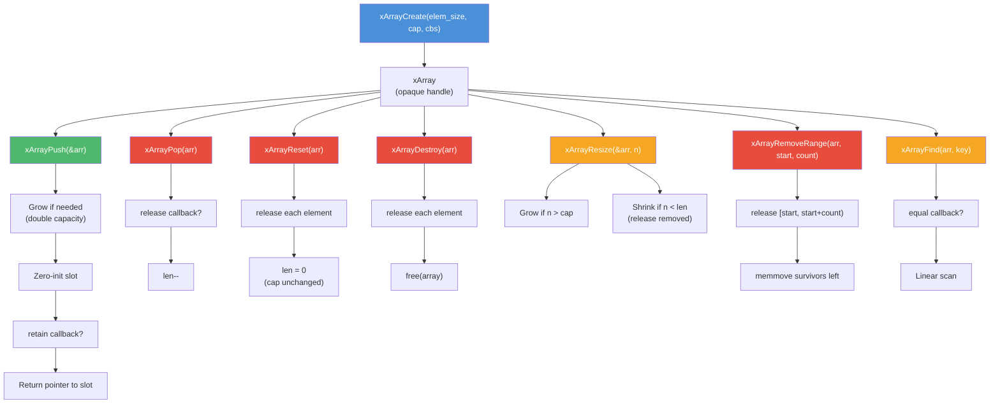

# array.h — Generic Auto-Growing Array

## Introduction

`array.h` provides a type-erased dynamic array that stores fixed-size elements in contiguous memory. Unlike the intrusive `list.h`, xArray owns its element storage and manages capacity automatically by doubling when more space is needed.

The array stores elements by value (`memcpy`'d), so each slot is independently addressable. New slots pushed via `xArrayPush()` are zero-initialized. Lifecycle callbacks (`xArrayCallbacks`) let the array automatically manage per-element resources: retain on insertion, release on removal, and equality comparison for lookups.

Typical usage:

```c
xArrayCallbacks cbs = { my_retain, my_release, my_equal };
xArray arr = xArrayCreate(sizeof(MyStruct), 0, &cbs);
MyStruct *slot = (MyStruct *)xArrayPush(&arr);
slot->field = value;
...
size_t idx = xArrayFind(arr, &key);
...
xArrayDestroy(arr);
```

## Design Philosophy

1. **Type-Erased Container** — The array stores elements as raw bytes of a caller-specified size. Cast to the concrete type on access. This avoids macros, templates, or `void **` double-indirection while remaining fully generic.

2. **Callback-Driven Lifecycle** — Optional `retain`, `release`, and `equal` callbacks let the array own per-element heap resources (strings, sub-allocations) without the caller tracking them manually. If no callbacks are provided, the array behaves like a plain `realloc`-based buffer.

3. **Opaque Handle** — `xArray` is an opaque pointer (`XDEF_HANDLE`). The internal struct (`xArray_`) is defined only in `array.c`, so callers cannot depend on layout details. Growth may relocate the entire object (header + data), which is why `xArrayPush` and `xArrayResize` take `xArray *arrp` and update the handle in place.

4. **Doubling Growth** — When capacity is exhausted, the array doubles its capacity (starting from a default of 8). This yields amortised O(1) `Push` and avoids the O(n) per-insert reallocation of naive strategies.

5. **Zero-Initialised Slots** — Every new element is `memset` to zero before the retain callback fires. This means callers can safely check `slot->ptr != NULL` inside a release callback without special handling.

## Architecture



## API Reference

### Types

| Type | Description |
| --- | --- |
| `xArray` | Opaque handle to a dynamic array (`XDEF_HANDLE`). |
| `xArrayCallbacks` | Struct with optional `retain`, `release`, and `equal` callbacks. |
| `xArrayRetainFunc` | Callback type: `void (*)(void *elem)`. Called when an element is added. |
| `xArrayReleaseFunc` | Callback type: `void (*)(void *elem)`. Called when an element is removed. |
| `xArrayEqualFunc` | Callback type: `int (*)(const void *elem, const void *key)`. Called by `xArrayFind`. |

### Lifecycle Functions

| Function | Signature | Description | Thread Safety |
| --- | --- | --- | --- |
| `xArrayCreate` | `xArray xArrayCreate(size_t elem_size, size_t initial_cap, const xArrayCallbacks *cbs)` | Create a new array. `elem_size` must be > 0. `initial_cap` of 0 uses default (8). `cbs` may be NULL. | Not thread-safe |
| `xArrayDestroy` | `void xArrayDestroy(xArray arr)` | Release all elements and free the array. NULL is a no-op. | Not thread-safe |
| `xArrayReset` | `void xArrayReset(xArray arr)` | Release all elements but keep the allocated storage for reuse. | Not thread-safe |

### Mutator Functions

| Function | Signature | Description | Thread Safety |
| --- | --- | --- | --- |
| `xArrayPush` | `void *xArrayPush(xArray *arrp)` | Append a zero-initialised element. May realloc (updates `*arrp`). Returns pointer to new slot, or NULL on failure. | Not thread-safe |
| `xArrayPop` | `xErrno xArrayPop(xArray arr)` | Remove the last element (calls release). Returns `xErrno_InvalidState` if empty. | Not thread-safe |
| `xArrayResize` | `xErrno xArrayResize(xArray *arrp, size_t new_len)` | Set exact length. Growing zero-inits + retain new slots; shrinking releases removed slots. | Not thread-safe |
| `xArrayRemoveRange` | `xErrno xArrayRemoveRange(xArray arr, size_t start, size_t count)` | Remove elements in `[start, start+count)`. Releases each, then shifts survivors left. | Not thread-safe |

### Accessor Functions

| Function | Signature | Description | Thread Safety |
| --- | --- | --- | --- |
| `xArrayAt` | `void *xArrayAt(xArray arr, size_t idx)` | Pointer to element at `idx`. Returns NULL if out of range. | Not thread-safe |
| `xArrayLen` | `size_t xArrayLen(xArray arr)` | Number of stored elements. | Not thread-safe |
| `xArrayCap` | `size_t xArrayCap(xArray arr)` | Current capacity (elements before realloc needed). | Not thread-safe |
| `xArrayData` | `void *xArrayData(xArray arr)` | Raw pointer to element storage. Valid until next mutation. NULL if empty. | Not thread-safe |
| `xArrayFind` | `size_t xArrayFind(xArray arr, const void *key)` | Index of first element matching `key` via equal callback. Returns `(size_t)-1` if not found or no equal callback. | Not thread-safe |

## Usage Examples

### Basic Push / Pop

```c
#include <stdio.h>
#include <x/base/array.h>

int main(void) {
  xArray arr = xArrayCreate(sizeof(int), 0, NULL);

  /* Push some integers. */
  for (int i = 0; i < 5; i++) {
    int *slot = (int *)xArrayPush(&arr);
    *slot = i * 10;
  }
  /* arr = [0, 10, 20, 30, 40], len = 5 */

  /* Pop the last. */
  xArrayPop(arr);
  /* arr = [0, 10, 20, 30], len = 4 */

  /* Read by index. */
  for (size_t i = 0; i < xArrayLen(arr); i++) {
    printf("arr[%zu] = %d\n", i, *(int *)xArrayAt(arr, i));
  }

  xArrayDestroy(arr);
  return 0;
}
```

### Owning Heap Strings (Release Callback)

```c
#include <stdio.h>
#include <stdlib.h>
#include <string.h>
#include <x/base/array.h>

struct Entry {
  char *name;
  int   value;
};

static void entry_release(void *elem) {
  struct Entry *e = (struct Entry *)elem;
  free(e->name);
  e->name = NULL;
}

int main(void) {
  xArrayCallbacks cbs = { NULL, entry_release, NULL };
  xArray arr = xArrayCreate(sizeof(struct Entry), 4, &cbs);

  /* Push entries that own heap-allocated strings. */
  const char *names[] = { "alice", "bob", "carol" };
  for (int i = 0; i < 3; i++) {
    struct Entry *slot = (struct Entry *)xArrayPush(&arr);
    slot->name  = strdup(names[i]);
    slot->value = i;
  }

  /* Pop one — entry_release frees the string automatically. */
  xArrayPop(arr);

  /* Reset — releases remaining entries, keeps capacity. */
  xArrayReset(arr);

  xArrayDestroy(arr);
  return 0;
}
```

### Remove a Range

```c
#include <stdio.h>
#include <x/base/array.h>

int main(void) {
  xArray arr = xArrayCreate(sizeof(int), 0, NULL);

  for (int i = 0; i < 6; i++) {
    int *slot = (int *)xArrayPush(&arr);
    *slot = i;
  }
  /* arr = [0, 1, 2, 3, 4, 5] */

  /* Remove elements at indices 2, 3 (range [2, 4)) */
  xArrayRemoveRange(arr, 2, 2);
  /* arr = [0, 1, 4, 5] */

  for (size_t i = 0; i < xArrayLen(arr); i++) {
    printf("%d\n", *(int *)xArrayAt(arr, i));
  }
  /* Output: 0 1 4 5 */

  xArrayDestroy(arr);
  return 0;
}
```

### Finding Elements (Equal Callback)

```c
#include <stdio.h>
#include <string.h>
#include <x/base/array.h>

struct Item {
  int  id;
  char label[32];
};

static int item_equal(const void *elem, const void *key) {
  const struct Item *item = (const struct Item *)elem;
  const int         *id   = (const int *)key;
  return item->id == *id;
}

int main(void) {
  xArrayCallbacks cbs = { NULL, NULL, item_equal };
  xArray arr = xArrayCreate(sizeof(struct Item), 0, &cbs);

  struct Item *a = (struct Item *)xArrayPush(&arr);
  a->id = 10; strcpy(a->label, "alpha");

  struct Item *b = (struct Item *)xArrayPush(&arr);
  b->id = 20; strcpy(b->label, "beta");

  int key = 20;
  size_t idx = xArrayFind(arr, &key);
  if (idx != (size_t)-1) {
    struct Item *found = (struct Item *)xArrayAt(arr, idx);
    printf("Found: id=%d label=%s\n", found->id, found->label);
  }

  xArrayDestroy(arr);
  return 0;
}
```

### Bulk Access with xArrayData

```c
#include <stdio.h>
#include <x/base/array.h>

int main(void) {
  xArray arr = xArrayCreate(sizeof(int), 0, NULL);

  for (int i = 0; i < 100; i++) {
    int *slot = (int *)xArrayPush(&arr);
    *slot = i;
  }

  /* Access the raw buffer for fast iteration. */
  int  *data = (int *)xArrayData(arr);
  size_t len  = xArrayLen(arr);
  long long sum = 0;
  for (size_t i = 0; i < len; i++) {
    sum += data[i];
  }
  printf("Sum of 0..99 = %lld\n", sum);

  xArrayDestroy(arr);
  return 0;
}
```

## Use Cases

1. **Session History** — The xagent module stores AI session conversation history in an `xArray` of `struct xAgentSessionMsg_`. The release callback frees each message's heap-owned strings (text, tool-use arguments, tool-result output), and `xArrayRemoveRange` handles history trimming.

2. **Query Turn Buffers** — The xagent module's `xAgentQuery_` uses separate `xArray` instances for inputs, produced output, and pending tool calls. The release callbacks clean up per-element resources when the query is destroyed or reset.

3. **Timer Entry Queue** — A timer subsystem can store active timer entries in an `xArray`, using `xArrayRemoveRange` to cancel a batch of timers and the release callback to free timer-specific resources.

4. **General Dynamic Buffer** — Any module that needs a grow-only list of fixed-size records (e.g. accumulated log entries, pending DNS queries) can use `xArray` with no callbacks for plain value storage.

## Best Practices

- **Always pass `xArray *arrp` to `xArrayPush` and `xArrayResize`.** These functions may reallocate the entire array object, invalidating the old handle. Never store the result of `xArrayAt` / `xArrayData` across a Push or Resize call.
- **Use the release callback instead of manual cleanup.** If your elements own heap memory, set a release callback that frees those sub-resources. This makes `xArrayPop`, `xArrayReset`, and `xArrayDestroy` safe without caller-side loops.
- **Don't call `xArrayPop` on an empty array.** It returns `xErrno_InvalidState`. Check `xArrayLen(arr) > 0` first if the array might be empty.
- **Avoid retaining pointers across mutations.** `xArrayAt` and `xArrayData` return pointers into the internal buffer. Any Push, Resize, or RemoveRange may move memory. Copy the data out if you need it to survive.
- **Prefer `xArrayReset` over Destroy+Create.** If you need to empty an array but expect to refill it soon, `xArrayReset` preserves the allocated capacity, avoiding a fresh allocation cycle.
- **Use `xArrayRemoveRange` for front/trailing trims.** To remove the first N elements: `xArrayRemoveRange(arr, 0, N)`. To trim from the middle: `xArrayRemoveRange(arr, start, count)`. The function handles release callbacks and memmove internally.

## Comparison with Other Libraries

| Feature | xbase array.h | C++ `std::vector` | GLib `GArray` | apr_array_header_t (APR) |
| --- | --- | --- | --- | --- |
| **Style** | Opaque handle | Template class | Opaque struct | Struct + macros |
| **Language** | C99 | C++ | C | C |
| **Growth Strategy** | Double | Implementation-defined (usually double) | Double | Manual (`apr_array_push`) |
| **Element Size** | Caller-specified | Template parameter | Caller-specified | Caller-specified |
| **Lifecycle Callbacks** | Yes (retain/release/equal) | No (RAII per element) | No (clear func) | No |
| **Range Removal** | `xArrayRemoveRange` | `erase(first, last)` | No built-in | No built-in |
| **Find** | `xArrayFind` (callback) | `std::find` (algorithm) | No built-in | No built-in |
| **Opaque Handle** | Yes | No (header-only template) | Yes | No |
| **Thread Safety** | Not thread-safe | Not thread-safe | Not thread-safe | Not thread-safe |

**Key Differentiator:** xbase's array combines the low-level control of a C dynamic array with optional lifecycle callbacks that automate per-element resource management — something `GArray` and APR arrays lack. The opaque handle design hides layout details and allows growth to relocate the entire object safely via the `arrp` indirection pattern.

## Implementation Details

### Internal Structure

```c
struct xArray_ {
  size_t          elem_size;  /* bytes per element */
  size_t          len;        /* current element count */
  size_t          cap;        /* allocated capacity (elements) */
  xArrayCallbacks cbs;        /* optional lifecycle callbacks */
  char            data[];     /* flexible array member */
};
```

The `xArray_` struct is allocated as a single block: `malloc(sizeof(xArray_) + cap * elem_size)`. The `data` flexible array member stores elements contiguously starting right after the header.

### Growth Strategy

When `xArrayPush` needs more space than the current capacity allows:

1. Compute the next power-of-two capacity that satisfies the demand (starting from `ARRAY_DEFAULT_CAP = 8`).
2. `realloc` the entire block (header + data).
3. Update the caller's `xArray` handle via the `arrp` pointer.

This means any pointer obtained from `xArrayAt` / `xArrayData` is invalidated by a subsequent `xArrayPush` or `xArrayResize` that triggers growth.

### Callback Semantics

| Callback | When Called | Element State |
| --- | --- | --- |
| `retain` | After `xArrayPush` or `xArrayResize` (growing) | Zero-initialised, before caller fills fields |
| `release` | `xArrayPop`, `xArrayReset`, `xArrayDestroy`, `xArrayResize` (shrinking), `xArrayRemoveRange` | Still in its original memory location |
| `equal` | `xArrayFind` | Read-only comparison |

**Important**: The `release` callback is invoked *before* the element's memory is overwritten or freed. This allows the callback to extract and free any heap-owned sub-resources the element holds.

### Operations and Complexity

| Operation | Function | Time Complexity | Description |
| --- | --- | --- | --- |
| Create | `xArrayCreate` | O(1) | Allocate header + initial data buffer |
| Destroy | `xArrayDestroy` | O(n) | Release each element + free block |
| Reset | `xArrayReset` | O(n) | Release each element, keep capacity |
| Push | `xArrayPush` | Amortised O(1) | Append + grow if needed |
| Pop | `xArrayPop` | O(1) | Release last + decrement length |
| Resize | `xArrayResize` | O(n) | Grow or shrink to exact length |
| Remove range | `xArrayRemoveRange` | O(n) | Release range + memmove survivors |
| Element access | `xArrayAt` | O(1) | Pointer arithmetic into data |
| Length | `xArrayLen` | O(1) | Read `len` field |
| Capacity | `xArrayCap` | O(1) | Read `cap` field |
| Raw data | `xArrayData` | O(1) | Return pointer to first element |
| Find | `xArrayFind` | O(n) | Linear scan with equal callback |
