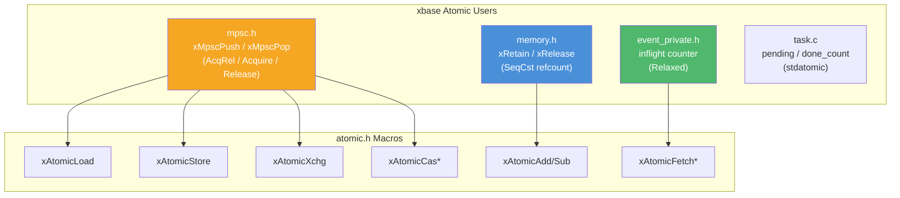

# atomic.h — Atomic Operations

## Introduction

`atomic.h` provides a set of macro wrappers over GCC/Clang `__atomic` builtins, offering portable atomic operations with explicit memory ordering. These macros are used throughout xbase for reference counting ([`memory.h`](memory.md)), lock-free queues ([`mpsc.h`](mpsc.md)), and event loop internals ([`event.h`](event.md)).

## Design Philosophy

1. **Thin Macro Wrappers** — Each macro maps directly to a compiler builtin with zero overhead. No abstraction layers, no runtime dispatch.

2. **Explicit Memory Ordering** — Every atomic operation requires an explicit memory order parameter (`xAtomicAcquire`, `xAtomicRelease`, etc.), forcing the programmer to think about ordering requirements rather than defaulting to the expensive `SeqCst`.

3. **GCC/Clang Builtins** — The `__atomic` builtins are supported by GCC ≥ 4.7 and all versions of Clang. They generate optimal instructions for each target architecture (x86: `lock` prefix, ARM: `ldrex`/`strex` or LSE atomics).

## Architecture



## API Reference

See the [Operation Macros](#operation-macros) section above for the complete list. All macros are defined in `<x/base/atomic.h>` and require no function calls — they expand directly to compiler builtins.

## Usage Examples

### Atomic Counter

```c
#include <stdio.h>
#include <pthread.h>
#include <x/base/atomic.h>

static int g_counter = 0;

static void *increment(void *arg) {
    (void)arg;
    for (int i = 0; i < 100000; i++) {
        xAtomicAdd(&g_counter, 1, xAtomicRelaxed);
    }
    return NULL;
}

int main(void) {
    pthread_t threads[4];
    for (int i = 0; i < 4; i++)
        pthread_create(&threads[i], NULL, increment, NULL);
    for (int i = 0; i < 4; i++)
        pthread_join(threads[i], NULL);

    printf("Counter: %d\n", xAtomicLoad(&g_counter, xAtomicRelaxed));
    // Output: Counter: 400000
    return 0;
}
```

### Spinlock (Educational)

```c
#include <x/base/atomic.h>

typedef struct { int locked; } Spinlock;

static inline void spin_lock(Spinlock *s) {
    while (xAtomicXchg(&s->locked, 1, xAtomicAcquire) != 0) {
        // Spin
    }
}

static inline void spin_unlock(Spinlock *s) {
    xAtomicStore(&s->locked, 0, xAtomicRelease);
}
```

## Use Cases

1. **Reference Counting** — [`memory.h`](memory.md) uses `xAtomicAdd`/`xAtomicSub` with `SeqCst` ordering for thread-safe reference count management.

2. **Lock-Free Data Structures** — [`mpsc.h`](mpsc.md) uses `xAtomicXchg` for wait-free push and `xAtomicCasStrong` for the single-element pop edge case.

3. **Event Loop Internals** — The event loop uses `xAtomicFetchAdd`/`xAtomicFetchSub` with `Relaxed` ordering to track in-flight offload workers.

## Best Practices

- **Use the weakest sufficient ordering.** `Relaxed` for simple counters, `Acquire`/`Release` for producer-consumer patterns, `SeqCst` only when you need a total order visible to all threads.
- **Prefer `xAtomicCasStrong` over `xAtomicCasWeak`** unless you're in a retry loop where spurious failures are acceptable (e.g., lock-free stack push).
- **Note the CAS failure ordering.** Both CAS macros hardcode `xAtomicRelaxed` as the failure ordering. If you need stronger failure ordering, use the raw `xAtomicCas` macro directly.
- **Don't mix with C11 `<stdatomic.h>`.** While both use the same underlying compiler builtins, mixing the two styles in the same translation unit can be confusing. xbase uses `<stdatomic.h>` in `task.c` for `atomic_size_t` but `atomic.h` macros everywhere else.

## Comparison with Other Libraries

| Feature | xbase atomic.h | C11 `<stdatomic.h>` | C++ `<atomic>` | Linux kernel atomics |
| --- | --- | --- | --- | --- |
| **Style** | Macros over `__atomic` builtins | Language-level types | Template class | Inline functions + asm |
| **Memory Order** | Explicit parameter | Explicit parameter | Explicit parameter | Implicit (varies) |
| **Types** | Any scalar (via pointer) | `_Atomic` qualified types | `std::atomic<T>` | `atomic_t`, `atomic64_t` |
| **CAS** | `xAtomicCasWeak`/`Strong` | `atomic_compare_exchange_*` | `compare_exchange_*` | `cmpxchg` |
| **Compiler** | GCC ≥ 4.7, Clang | C11 | C++11 | GCC (kernel) |
| **Portability** | GCC/Clang only | Standard C11 | Standard C++11 | Linux kernel only |

**Key Differentiator:** xbase's atomic macros are the thinnest possible wrapper — they add naming consistency (`xAtomic*` prefix) and explicit ordering parameters without any abstraction overhead. They work with any scalar type via pointer, unlike C11's `_Atomic` qualifier which requires type annotations.

## Implementation Details

### Memory Order Constants

| Macro | Value | Meaning |
| --- | --- | --- |
| `xAtomicRelaxed` | `__ATOMIC_RELAXED` | No ordering constraints. Only guarantees atomicity. |
| `xAtomicConsume` | `__ATOMIC_CONSUME` | Data-dependent ordering (rarely used in practice). |
| `xAtomicAcquire` | `__ATOMIC_ACQUIRE` | Prevents reads/writes from being reordered before this operation. |
| `xAtomicRelease` | `__ATOMIC_RELEASE` | Prevents reads/writes from being reordered after this operation. |
| `xAtomicAcqRel` | `__ATOMIC_ACQ_REL` | Combines Acquire and Release. |
| `xAtomicSeqCst` | `__ATOMIC_SEQ_CST` | Full sequential consistency. Most expensive. |

### Operation Macros

#### Load / Store

| Macro | Expansion | Description |
| --- | --- | --- |
| `xAtomicLoad(p, o)` | `__atomic_load_n(p, o)` | Atomically read `*p` |
| `xAtomicStore(p, v, o)` | `__atomic_store_n(p, v, o)` | Atomically write `v` to `*p` |

#### Exchange / CAS

| Macro | Expansion | Description |
| --- | --- | --- |
| `xAtomicXchg(p, v, o)` | `__atomic_exchange_n(p, v, o)` | Atomically swap `*p` with `v`, return old value |
| `xAtomicCasWeak(p, e, d, o)` | `__atomic_compare_exchange_n(p, e, d, true, o, Relaxed)` | Weak CAS (may spuriously fail) |
| `xAtomicCasStrong(p, e, d, o)` | `__atomic_compare_exchange_n(p, e, d, false, o, Relaxed)` | Strong CAS (no spurious failure) |

> **Note:** Both CAS macros use `xAtomicRelaxed` as the failure ordering. The success ordering is specified by the `o` parameter.

#### Arithmetic

| Macro | Expansion | Returns |
| --- | --- | --- |
| `xAtomicAdd(p, v, o)` | `__atomic_add_fetch(p, v, o)` | New value (`*p + v`) |
| `xAtomicSub(p, v, o)` | `__atomic_sub_fetch(p, v, o)` | New value (`*p - v`) |
| `xAtomicFetchAdd(p, v, o)` | `__atomic_fetch_add(p, v, o)` | Old value (before add) |
| `xAtomicFetchSub(p, v, o)` | `__atomic_fetch_sub(p, v, o)` | Old value (before sub) |

#### Bitwise

| Macro | Expansion | Returns |
| --- | --- | --- |
| `xAtomicAnd(p, v, o)` | `__atomic_and_fetch(p, v, o)` | New value |
| `xAtomicOr(p, v, o)` | `__atomic_or_fetch(p, v, o)` | New value |
| `xAtomicXor(p, v, o)` | `__atomic_xor_fetch(p, v, o)` | New value |
| `xAtomicNand(p, v, o)` | `__atomic_nand_fetch(p, v, o)` | New value |
| `xAtomicFetchAnd(p, v, o)` | `__atomic_fetch_and(p, v, o)` | Old value |
| `xAtomicFetchOr(p, v, o)` | `__atomic_fetch_or(p, v, o)` | Old value |
| `xAtomicFetchXor(p, v, o)` | `__atomic_fetch_xor(p, v, o)` | Old value |
