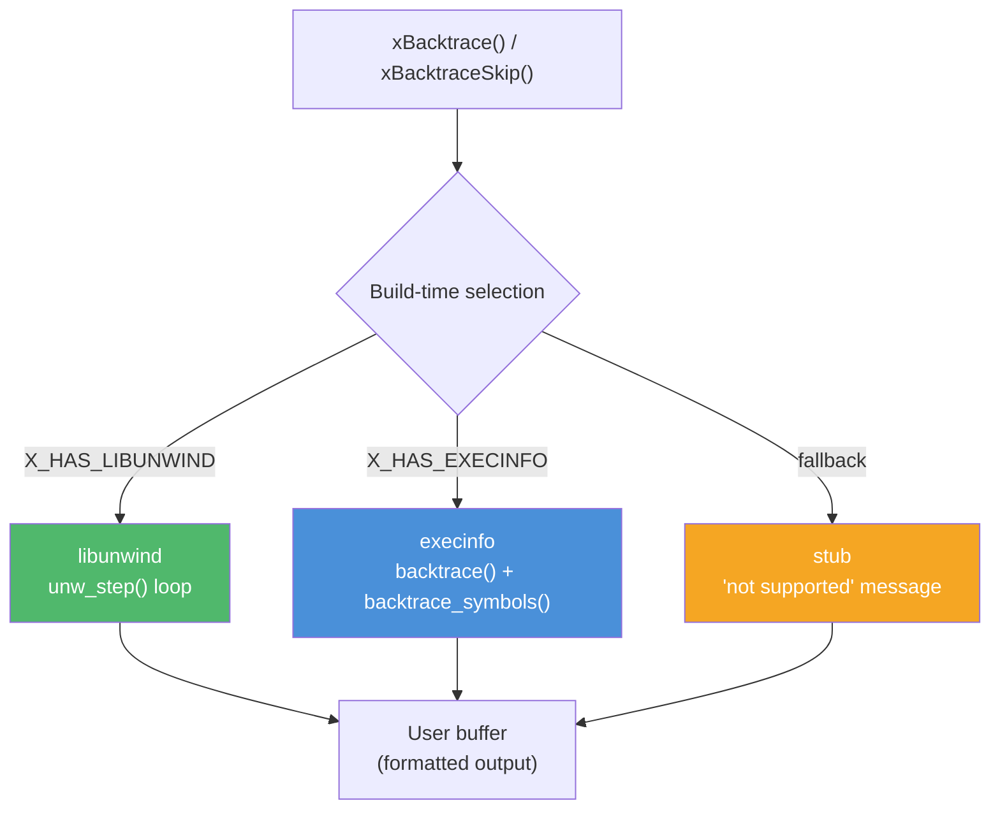

# backtrace.h — Platform-Adaptive Stack Backtrace

## Introduction

`backtrace.h` captures the current call stack and formats it into a human-readable multi-line string. The unwinding backend is selected at build time with the following priority: **libunwind** > **execinfo** (macOS/glibc) > **stub** (unsupported platforms). It is used internally by [`xLog()`](log.md) to provide stack traces on fatal errors.

## Design Philosophy

1. **Build-Time Backend Selection** — The backend is chosen via CMake-detected macros (`X_HAS_LIBUNWIND`, `X_HAS_EXECINFO`). This avoids runtime overhead and ensures the best available unwinder is used on each platform.

2. **Graceful Degradation** — On platforms without libunwind or execinfo, a stub backend returns a "not supported" message rather than crashing. This ensures `xBacktrace()` is always safe to call.

3. **Automatic Frame Skipping** — Internal frames (`xBacktrace` → `xBacktraceSkip` → `bt_capture`) are automatically skipped so the output starts from the caller's perspective. The `skip` parameter allows additional frames to be skipped (useful when called through wrapper functions like `xLog`).

4. **Buffer-Based Output** — The caller provides a buffer; no heap allocation occurs. This makes it safe to call from signal handlers, fatal error paths, and low-memory situations.

## Architecture



## API Reference

### Functions

| Function | Signature | Description | Thread Safety |
| --- | --- | --- | --- |
| `xBacktrace` | `int xBacktrace(char *buf, size_t size)` | Capture the call stack into `buf`. Equivalent to `xBacktraceSkip(0, buf, size)`. | **Thread-safe** (uses only local/stack state) |
| `xBacktraceSkip` | `int xBacktraceSkip(int skip, char *buf, size_t size)` | Capture the call stack, skipping `skip` additional frames beyond internal frames. | **Thread-safe** |

### Parameters

| Parameter | Description |
| --- | --- |
| `skip` | Number of additional frames to skip (0 = no extra skipping) |
| `buf` | Destination buffer. May be NULL (returns 0). |
| `size` | Size of `buf` in bytes. |

### Return Value

Number of bytes written (excluding trailing `\0`), or 0 if `buf` is NULL or `size` is 0.

## Usage Examples

### Capture and Print Stack Trace

```c
#include <stdio.h>
#include <x/base/backtrace.h>

void foo(void) {
    char buf[4096];
    int n = xBacktrace(buf, sizeof(buf));
    if (n > 0) {
        printf("Stack trace:\n%s", buf);
    }
}

void bar(void) { foo(); }

int main(void) {
    bar();
    return 0;
}
```

Output (with execinfo on macOS):

```text
Stack trace:
#0 0x100003f20 foo+0x20
#1 0x100003f80 bar+0x10
#2 0x100003fa0 main+0x10
```

### Skip Wrapper Frames

```c
#include <x/base/backtrace.h>

// Custom error reporter that skips its own frame
void report_error(const char *msg) {
    char bt[2048];
    xBacktraceSkip(1, bt, sizeof(bt)); // Skip report_error itself
    fprintf(stderr, "Error: %s\nBacktrace:\n%s", msg, bt);
}
```

## Use Cases

1. **Fatal Error Diagnostics** — [`xLog()`](log.md) captures a backtrace on fatal errors, providing immediate context for debugging crashes.

2. **Debug Assertions** — Custom assertion macros can include `xBacktrace()` to show where the assertion failed.

3. **Memory Leak Detection** — Record allocation backtraces to identify where leaked objects were created.

## Best Practices

- **Provide a large enough buffer.** 4096 bytes is usually sufficient for 20-30 frames. The output is truncated (not corrupted) if the buffer is too small.
- **Link with `-rdynamic` on Linux.** Without it, the execinfo backend shows only addresses, not symbol names.
- **Install libunwind for best results on Linux.** It provides more accurate unwinding than execinfo, especially through optimized code and signal handlers.
- **Don't call from signal handlers with execinfo.** `backtrace_symbols()` calls `malloc()`, which is not async-signal-safe. libunwind is safer in this context.

## Comparison with Other Libraries

| Feature | xbase backtrace.h | glibc `backtrace()` | libunwind | Boost.Stacktrace | Windows `CaptureStackBackTrace` |
| --- | --- | --- | --- | --- | --- |
| **Platform** | macOS + Linux + stub | Linux (glibc) | Linux + macOS | Cross-platform | Windows |
| **Accuracy** | Backend-dependent | Good (glibc) | Excellent | Backend-dependent | Good |
| **Symbol Resolution** | Built-in | `backtrace_symbols()` | `unw_get_proc_name()` | Backend-dependent | `SymFromAddr()` |
| **Allocation** | None (user buffer) | `malloc()` for symbols | None | Heap | None |
| **Signal Safety** | libunwind: yes, execinfo: no | No (`malloc`) | Yes | No | Yes |
| **Frame Skipping** | Built-in (`skip` param) | Manual | Manual | Manual | `FramesToSkip` param |

**Key Differentiator:** xbase's backtrace provides a simple, buffer-based API with automatic frame skipping and graceful degradation across platforms. It's designed for integration into error reporting paths where heap allocation is undesirable.

## Implementation Details

### Backend Selection

| Backend | Macro | Platform | Quality |
| --- | --- | --- | --- |
| libunwind | `X_HAS_LIBUNWIND` | Linux (with libunwind installed) | Best — accurate unwinding, symbol + offset |
| execinfo | `X_HAS_EXECINFO` | macOS, Linux (glibc) | Good — requires `-rdynamic` on Linux for symbols |
| stub | (fallback) | Any | Minimal — returns "not supported" message |

### Output Format

Each frame is formatted as:

```text
#0 0x7fff8a1b2c3d symbol_name+0x1a
#1 0x7fff8a1b2c3d another_function+0x42
#2 0x7fff8a1b2c3d <unknown>
```

- `#N` — Frame number (0 = most recent)
- `0xADDR` — Instruction pointer address
- `symbol+offset` — Function name and offset (if available)
- `<unknown>` — When symbol resolution fails

### Frame Skipping

```text
Call stack:
  bt_capture()         ← INTERNAL_SKIP (2 frames)
  xBacktraceSkip()     ← INTERNAL_SKIP
  xLog()               ← user skip = 2 (from xLog)
  user_function()      ← first visible frame
  main()
```

`xBacktrace()` calls `xBacktraceSkip(0, ...)`, which adds `INTERNAL_SKIP = 2` to skip its own frames. `xLog()` calls `xBacktraceSkip(2, ...)` to also skip `xLog` and `xLogSetCallback` frames.

### libunwind Backend

Uses `unw_getcontext()` → `unw_init_local()` → `unw_step()` loop. For each frame:

- `unw_get_reg(UNW_REG_IP)` — Get instruction pointer
- `unw_get_proc_name()` — Get symbol name and offset

### execinfo Backend

Uses `backtrace()` to capture frame addresses, then `backtrace_symbols()` to resolve names. On Linux, link with `-rdynamic` to export symbols for resolution.
