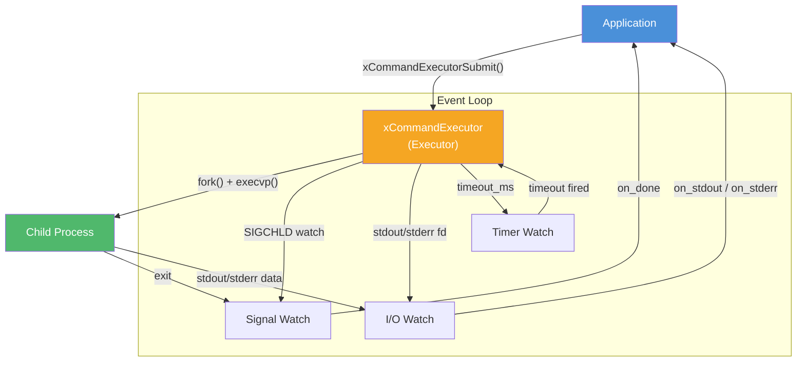
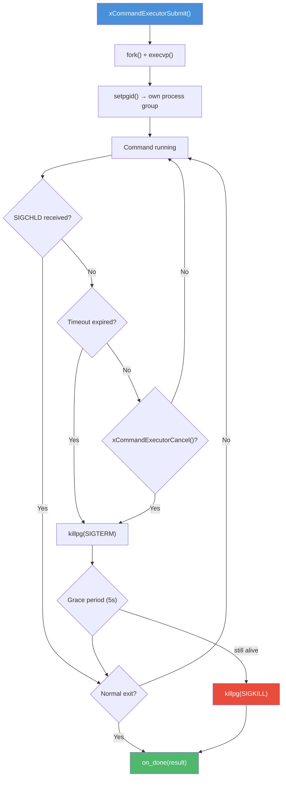

# command.h — Async Command Executor

## Introduction

`command.h` provides an asynchronous command executor that spawns child processes over `xEventLoop` with stdout/stderr capture, streaming, or discard modes. It uses `fork()` + `execvp()` with independent process groups for clean timeout/cancellation via `killpg()`. Child exit detection is done through `SIGCHLD` delivered via `xEventLoopSignalWatch()`.

## Design Philosophy

1. **Event-Loop Integrated** — Commands are spawned asynchronously and their lifecycle (I/O readiness, timeout, exit) is managed entirely through the event loop. No blocking `waitpid()` polling is needed.

2. **Independent Process Groups** — Each child is placed in its own process group via `setpgid()`. This ensures that `killpg()` on timeout/cancellation kills the entire process tree (including any grandchildren), avoiding orphaned processes.

3. **Flexible Output Handling** — Three output modes (Capture, Stream, Discard) cover the full spectrum from "I need the full output" to "I just want a live feed" to "I don't care about output at all." Each of stdout and stderr can be configured independently.

4. **PTY Support** — An optional pseudo-terminal mode (`xCommandInput_Pty`) allocates a PTY for the child, merging stdout and stderr into a single stream. This is essential for programs that behave differently when connected to a terminal (e.g., colored output, interactive prompts).

5. **Graceful Cancellation** — `xCommandExecutorCancel()` sends `SIGTERM` first, then escalates to `SIGKILL` after a grace period. This gives well-behaved processes a chance to clean up.

## Architecture



## API Reference

### Types

| Type | Description |
| --- | --- |
| `xCommandOutputMode` | Enum: `xCommandOutput_Capture`, `xCommandOutput_Stream`, `xCommandOutput_Discard` |
| `xCommandInputMode` | Enum: `xCommandInput_Pipe` (default), `xCommandInput_Pty` |
| `xCommandConf` | Configuration struct for a command invocation |
| `xCommandResult` | Result struct populated on command completion |
| `xCommandExecutor` | Opaque handle to a command executor |
| `xCommandExecutorOutputFunc` | `void (*)(xCommandExecutor, const char *data, size_t len, void *ud)` — streaming output callback |
| `xCommandExecutorDoneFunc` | `void (*)(xCommandExecutor, const xCommandResult *result, void *ud)` — completion callback |

### xCommandConf Fields

| Field | Type | Description |
| --- | --- | --- |
| `cmd` | `const char *` | Program path (required, searched in `$PATH`) |
| `argv` | `const char **` | Argument vector (NULL-terminated, may be NULL) |
| `envp` | `const char **` | Environment (NULL = inherit parent) |
| `cwd` | `const char *` | Working directory (NULL = inherit) |
| `timeout_ms` | `uint64_t` | Timeout in milliseconds (0 = no timeout) |
| `stdout_cap` | `size_t` | Max stdout bytes to capture (0 = unlimited) |
| `stderr_cap` | `size_t` | Max stderr bytes to capture (0 = unlimited, ignored in PTY mode) |
| `stdout_mode` | `xCommandOutputMode` | How to handle stdout |
| `stderr_mode` | `xCommandOutputMode` | How to handle stderr (ignored in PTY mode) |
| `input_mode` | `xCommandInputMode` | `xCommandInput_Pipe` (default) or `xCommandInput_Pty` |

### xCommandResult Fields

| Field | Type | Description |
| --- | --- | --- |
| `exit_code` | `int` | Exit status (valid if `signaled == 0`) |
| `signaled` | `int` | Non-zero if killed by signal; holds signal number |
| `timed_out` | `int` | Non-zero if killed due to timeout |
| `stdout_buf` | `const char *` | Captured stdout (NULL in Stream/Discard mode) |
| `stdout_len` | `size_t` | Length of captured stdout |
| `stderr_buf` | `const char *` | Captured stderr (NULL in Stream/Discard/PTY mode) |
| `stderr_len` | `size_t` | Length of captured stderr |
| `elapsed_ms` | `uint64_t` | Wall-clock duration from spawn to exit |
| `pty_fd` | `int` | PTY master fd (valid while running, -1 otherwise) |

### Functions

| Function | Signature | Description | Thread Safety |
| --- | --- | --- | --- |
| `xCommandExecutorCreate` | `xCommandExecutor xCommandExecutorCreate(xEventLoop loop)` | Create a command executor bound to the given event loop. Registers a SIGCHLD watch. | Not thread-safe |
| `xCommandExecutorDestroy` | `void xCommandExecutorDestroy(xCommandExecutor exec)` | Destroy an executor. If running, kills the child process group (SIGKILL) and waits. NULL-safe. | Not thread-safe |
| `xCommandExecutorSubmit` | `xErrno xCommandExecutorSubmit(xCommandExecutor exec, const xCommandConf *conf, xCommandExecutorOutputFunc on_stdout, xCommandExecutorOutputFunc on_stderr, xCommandExecutorDoneFunc on_done, void *ud)` | Submit a command for asynchronous execution. Returns `xErrno_Busy` if already running. | Not thread-safe (call from event loop thread) |
| `xCommandExecutorCancel` | `xErrno xCommandExecutorCancel(xCommandExecutor exec)` | Cancel a running command (SIGTERM → SIGKILL after 5s). Returns `xErrno_InvalidState` if not running. | Not thread-safe |
| `xCommandExecutorPid` | `int xCommandExecutorPid(xCommandExecutor exec)` | Return the PID of the running child, or -1 if idle. NULL-safe. | Thread-safe (atomic) |
| `xCommandExecutorIsRunning` | `int xCommandExecutorIsRunning(xCommandExecutor exec)` | Return non-zero if a command is currently running. NULL-safe. | Thread-safe (atomic) |
| `xCommandExecutorPtyFd` | `int xCommandExecutorPtyFd(xCommandExecutor exec)` | Return the PTY master fd, or -1 if not in PTY mode or not running. NULL-safe. | Thread-safe |

## Usage Examples

### Capture stdout

```c
#include <stdio.h>
#include <x/base/command.h>
#include <x/base/event.h>

static void on_done(xCommandExecutor exec, const xCommandResult *result, void *ud) {
    xEventLoop loop = (xEventLoop)ud;
    if (result->exit_code == 0) {
        printf("Output: %.*s\n", (int)result->stdout_len, result->stdout_buf);
    }
    xEventLoopStop(loop);
}

int main(void) {
    xEventLoop loop = xEventLoopCreate();
    xCommandExecutor exec = xCommandExecutorCreate(loop);

    const char *argv[] = {"hello", "world", NULL};
    xCommandConf conf = {};
    conf.cmd          = "/bin/echo";
    conf.argv         = argv;
    conf.stdout_mode  = xCommandOutput_Capture;
    conf.stderr_mode  = xCommandOutput_Discard;

    xCommandExecutorSubmit(exec, &conf, NULL, NULL, on_done, loop);
    xEventLoopRun(loop);

    xCommandExecutorDestroy(exec);
    xEventLoopDestroy(loop);
    return 0;
}
```

### Stream stdout in real time

```c
#include <stdio.h>
#include <x/base/command.h>
#include <x/base/event.h>

static void on_stdout(xCommandExecutor exec, const char *data, size_t len, void *ud) {
    fwrite(data, 1, len, stdout);
}

static void on_done(xCommandExecutor exec, const xCommandResult *result, void *ud) {
    xEventLoop loop = (xEventLoop)ud;
    xEventLoopStop(loop);
}

int main(void) {
    xEventLoop loop = xEventLoopCreate();
    xCommandExecutor exec = xCommandExecutorCreate(loop);

    const char *argv[] = {"-c", "for i in 1 2 3; do echo line $i; done", NULL};
    xCommandConf conf = {};
    conf.cmd          = "/bin/sh";
    conf.argv         = argv;
    conf.stdout_mode  = xCommandOutput_Stream;
    conf.stderr_mode  = xCommandOutput_Discard;

    xCommandExecutorSubmit(exec, &conf, on_stdout, NULL, on_done, loop);
    xEventLoopRun(loop);

    xCommandExecutorDestroy(exec);
    xEventLoopDestroy(loop);
    return 0;
}
```

### Timeout and cancellation

```c
#include <stdio.h>
#include <x/base/command.h>
#include <x/base/event.h>

static void on_done(xCommandExecutor exec, const xCommandResult *result, void *ud) {
    xEventLoop loop = (xEventLoop)ud;
    if (result->timed_out) {
        printf("Command timed out after %llu ms\n",
               (unsigned long long)result->elapsed_ms);
    }
    xEventLoopStop(loop);
}

int main(void) {
    xEventLoop loop = xEventLoopCreate();
    xCommandExecutor exec = xCommandExecutorCreate(loop);

    const char *argv[] = {"60", NULL};
    xCommandConf conf = {};
    conf.cmd          = "/bin/sleep";
    conf.argv         = argv;
    conf.timeout_ms   = 3000;  /* 3-second timeout */
    conf.stdout_mode  = xCommandOutput_Discard;
    conf.stderr_mode  = xCommandOutput_Discard;

    xCommandExecutorSubmit(exec, &conf, NULL, NULL, on_done, loop);
    xEventLoopRun(loop);

    xCommandExecutorDestroy(exec);
    xEventLoopDestroy(loop);
    return 0;
}
```

### PTY mode with stdin

```c
#include <stdio.h>
#include <string.h>
#include <unistd.h>
#include <x/base/command.h>
#include <x/base/event.h>

static void on_done(xCommandExecutor exec, const xCommandResult *result, void *ud) {
    xEventLoop loop = (xEventLoop)ud;
    if (result->stdout_buf) {
        printf("Output: %.*s\n", (int)result->stdout_len, result->stdout_buf);
    }
    xEventLoopStop(loop);
}

static void on_stdout(xCommandExecutor exec, const char *data, size_t len, void *ud) {
    fwrite(data, 1, len, stdout);
    fflush(stdout);
}

int main(void) {
    xEventLoop loop = xEventLoopCreate();
    xCommandExecutor exec = xCommandExecutorCreate(loop);

    const char *argv[] = {NULL};
    xCommandConf conf = {};
    conf.cmd          = "/bin/cat";  /* cat echoes stdin to stdout */
    conf.argv         = argv;
    conf.stdout_mode  = xCommandOutput_Stream;
    conf.stderr_mode  = xCommandOutput_Discard;
    conf.input_mode   = xCommandInput_Pty;

    xCommandExecutorSubmit(exec, &conf, on_stdout, NULL, on_done, loop);

    /* Write to the child's stdin via the PTY master fd */
    int pty_fd = xCommandExecutorPtyFd(exec);
    if (pty_fd >= 0) {
        write(pty_fd, "hello\n", 6);
    }

    xEventLoopRun(loop);

    xCommandExecutorDestroy(exec);
    xEventLoopDestroy(loop);
    return 0;
}
```

### Custom working directory and environment

```c
#include <stdio.h>
#include <x/base/command.h>
#include <x/base/event.h>

static void on_done(xCommandExecutor exec, const xCommandResult *result, void *ud) {
    xEventLoop loop = (xEventLoop)ud;
    printf("Exit code: %d\n", result->exit_code);
    if (result->stdout_buf) {
        printf("pwd: %.*s\n", (int)result->stdout_len, result->stdout_buf);
    }
    xEventLoopStop(loop);
}

int main(void) {
    xEventLoop loop = xEventLoopCreate();
    xCommandExecutor exec = xCommandExecutorCreate(loop);

    const char *envp[] = {"MY_VAR=42", NULL};
    xCommandConf conf = {};
    conf.cmd          = "/bin/pwd";
    conf.cwd          = "/tmp";
    conf.envp         = envp;
    conf.stdout_mode  = xCommandOutput_Capture;
    conf.stderr_mode  = xCommandOutput_Discard;

    xCommandExecutorSubmit(exec, &conf, NULL, NULL, on_done, loop);
    xEventLoopRun(loop);

    xCommandExecutorDestroy(exec);
    xEventLoopDestroy(loop);
    return 0;
}
```

## Use Cases

1. **Shell Command Execution** — Run system commands (e.g., `git`, `docker`, build tools) asynchronously and capture their output without blocking the event loop.

2. **Process Pipeline Integration** — Use streaming mode to feed a child process's output into another system in real time (e.g., log aggregation, progress monitoring).

3. **Interactive Programs** — PTY mode enables interaction with programs that require a terminal (e.g., SSH sessions, REPLs, text editors with colored output).

4. **Build/Deploy Automation** — Run build scripts with timeout enforcement. If a build hangs, it is automatically killed after the configured timeout.

5. **Health Checks** — Periodically execute diagnostic commands and parse their output to determine system health.

## Best Practices

- **Always set `on_done`.** The completion callback is the only way to know when a command finishes. It fires even on timeout or cancellation, so you can always clean up in one place.

- **Reuse executors for sequential commands.** After `on_done` fires, the same `xCommandExecutor` can be used for the next command. There is no need to destroy and recreate it.

- **Use `stdout_cap` / `stderr_cap` to limit memory.** Unbounded capture can exhaust memory if a command produces large output. Set a cap to prevent this.

- **Use Discard mode when output is not needed.** This avoids the overhead of reading and buffering output entirely.

- **Be aware of PTY line editing.** In PTY mode, the child's terminal driver may echo input and insert `\r` before `\n`. Strip `\r` if you need clean output.

- **Don't call `xCommandExecutorSubmit()` from the `on_done` callback.** Although the executor is idle at that point, calling `xCommandExecutorSubmit()` inside `on_done` will start a new command immediately while the event loop is still processing I/O events from the previous one. Instead, use `xEventLoopPost()` to defer the next run.

## Comparison with Other Libraries

| Feature | xbase command.h | `popen()` / `pclose()` | `posix_spawn()` | libuv `uv_spawn` |
| --- | --- | --- | --- | --- |
| **Async / Event-Loop** | Yes (xEventLoop) | No (blocking) | No (blocking wait) | Yes (uv_loop) |
| **stdout + stderr** | Separate capture/stream | stdout only | Manual pipe setup | Separate pipes |
| **Streaming** | Yes (callbacks) | Line-by-line only | Manual | Yes (callbacks) |
| **PTY Support** | Yes (`xCommandInput_Pty`) | No | No | No (external) |
| **Timeout** | Built-in (`timeout_ms`) | Manual | Manual | Manual (`uv_timer`) |
| **Cancellation** | `xCommandExecutorCancel()` (SIGTERM→SIGKILL) | `kill()` + `pclose()` | `kill()` + `waitpid()` | `uv_process_kill()` |
| **Process Groups** | Yes (independent via `setpgid`) | No | No | No (manual) |
| **Platform** | macOS + Linux | POSIX | POSIX | Cross-platform |

**Key Differentiator:** xbase's command executor is deeply integrated with the event loop, providing built-in timeout, cancellation with graceful escalation, independent process groups, and PTY support — features that require significant boilerplate with lower-level APIs.

## Implementation Details

### Output Modes

| Mode | stdout/stderr behavior | `xCommandResult` fields |
| --- | --- | --- |
| `xCommandOutput_Capture` | Accumulate into internal buffers | `stdout_buf` / `stderr_buf` + `stdout_len` / `stderr_len` populated |
| `xCommandOutput_Stream` | Deliver chunks via callbacks | `stdout_buf` / `stderr_buf` are NULL; use `on_stdout` / `on_stderr` callbacks |
| `xCommandOutput_Discard` | Redirect to `/dev/null` | `stdout_buf` / `stderr_buf` are NULL |

### Input Modes

| Mode | Description |
| --- | --- |
| `xCommandInput_Pipe` | Default: stdin is inherited from the parent process (no PTY). stdout and stderr are captured/streamed separately via pipes. |
| `xCommandInput_Pty` | Allocate a pseudo-terminal for the child. The child's stdin, stdout, and stderr are all connected to the PTY slave side. The parent reads from the PTY master fd. |

**PTY mode implications:**

- stdout and stderr are merged into a single stream (the PTY master).
- `stderr_mode` is effectively ignored — there is no separate stderr stream.
- In Capture mode, all output goes to `result.stdout_buf` only; `result.stderr_buf` is always NULL.
- The `on_stderr` callback is never invoked.
- `result.pty_fd` is set to the master fd while the command is running, allowing the caller to write to the child's stdin. It is set to `-1` after the command completes.

### Process Lifecycle



### Sequential Execution

An `xCommandExecutor` can only run one command at a time. Calling `xCommandExecutorSubmit()` while a command is running returns `xErrno_Busy`. After `on_done` fires, the executor can be reused for a new command — there is no need to destroy and recreate it.
