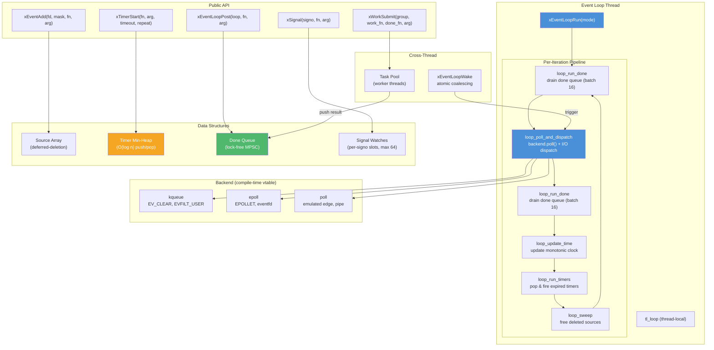
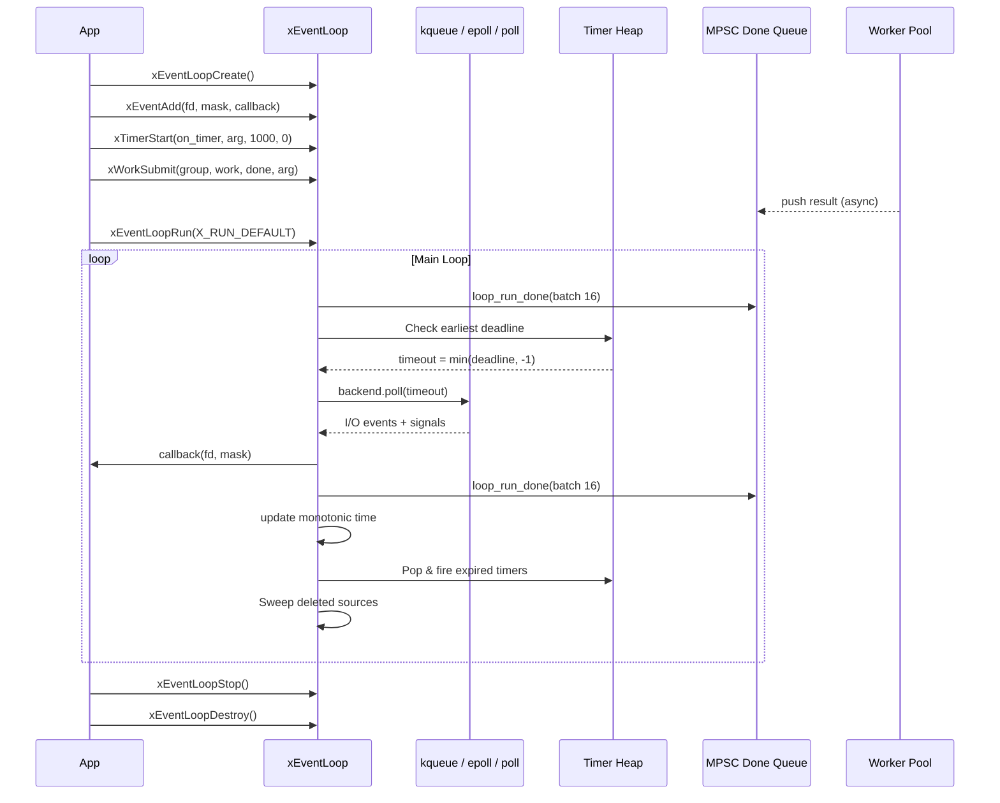

# event.h — Cross-Platform Event Loop

## Introduction

`event.h` provides a cross-platform, edge-triggered event loop abstraction for I/O multiplexing. It unifies three OS-specific backends — **kqueue** (macOS/BSD), **epoll** (Linux), and **poll** (POSIX fallback) — behind a single API. The event loop is the central coordination point in xbase: it monitors file descriptors for readiness, dispatches timer callbacks, offloads CPU-bound work to thread pools, and watches for POSIX signals — all from a single thread.

## Design Philosophy

1. **Edge-Triggered Everywhere** — All three backends operate in edge-triggered mode. kqueue uses `EV_CLEAR`, epoll uses `EPOLLET`, and poll emulates edge-triggered behavior by clearing the event mask after each notification (requiring the caller to re-arm via `xEventMod()`). This design encourages callers to drain fds completely, reducing spurious wakeups.

2. **Backend Selection at Compile Time** — The backend is chosen via preprocessor macros (`X_HAS_KQUEUE`, `X_HAS_EPOLL`), with poll as the universal fallback. This means zero runtime dispatch overhead.

3. **Integrated Timer Heap** — Rather than requiring a separate timer facility, the event loop embeds a min-heap of timer entries. `xEventLoopRun()` automatically adjusts its timeout to fire the earliest timer, providing sub-millisecond timer resolution without a dedicated timer thread.

4. **Thread-Pool Offload** — `xWorkSubmit()` bridges the event loop and the task system: CPU-bound work runs on a worker thread, and the completion callback is dispatched on the event loop thread via a lock-free MPSC queue + cross-thread wake, ensuring single-threaded callback semantics. Offloaded work can be cancelled via `xWorkCancel()` if it hasn't started yet.

5. **Direct Cross-Thread Posting** — `xEventLoopPost()` allows any thread to queue a callback for execution on the event loop thread without involving a thread pool. This is the lightest cross-thread communication primitive — ideal for notifying the loop of external events (e.g., ICE/TURN callbacks, inter-module signals) with zero thread-pool overhead.

6. **Self-Pipe Trick for Signals** — On epoll and poll backends, signal delivery uses the self-pipe trick (a `sigaction` handler writes to a pipe) rather than `signalfd`, avoiding the fragile requirement of blocking signals in every thread. On kqueue, `EVFILT_SIGNAL` is used natively.

7. **Named Loop → Named Thread** — `xEventLoopEnter()` sets the calling thread's OS name (via `pthread_setname_np`) to the loop's configured name, making loops visible in `ps`, `htop`, and debuggers. The name is restored from the previous loop on `xEventLoopLeave()`. The default is `"xEventLoop"` — override via `xEventLoopConf.name`.

## Architecture



### Event Loop Lifecycle



## API Reference

### Types

| Type | Description |
| --- | --- |
| `xEventMask` | Bitmask enum: `xEvent_Read` (1), `xEvent_Write` (2), `xEvent_Timeout` (4) |
| `xEventFunc` | `void (*)(int fd, xEventMask mask, void *arg)` — I/O callback |
| `xTimerFunc` | `void (*)(void *arg)` — Timer callback |
| `xSignalFunc` | `void (*)(int signo, void *arg)` — Signal callback |
| `xWorkDoneFunc` | `void (*)(void *arg, void *result)` — Offload completion callback |
| `xEventLoopPostFunc` | `void (*)(void *arg)` — Posted callback (via `xEventLoopPost`) |
| `xEventLoop` | Opaque handle to an event loop |
| `xEventSource` | Opaque handle to a registered event source |
| `xTimer` | Opaque handle to a builtin timer |
| `xWork` | Opaque handle to a submitted offload work item |

### Functions

#### Lifecycle

| Function | Signature | Thread Safety |
| --- | --- | --- |
| `xEventLoopCreate` | `xEventLoop xEventLoopCreate(void)` | Not thread-safe |
| `xEventLoopCreateWithConf` | `xEventLoop xEventLoopCreateWithConf(const xEventLoopConf *conf)` | Not thread-safe |
| `xEventLoopCreateWithGroup` | `xEventLoop xEventLoopCreateWithGroup(xTaskGroup group)` | Not thread-safe |
| `xEventLoopDestroy` | `void xEventLoopDestroy(xEventLoop loop)` | Not thread-safe |
| `xEventLoopRun` | `int xEventLoopRun(xEventLoop loop, int mode)` | Not thread-safe (call from one thread) |
| `xEventLoopStop` | `void xEventLoopStop(xEventLoop loop)` | **Thread-safe** |
| `xEventLoopEnter` | `void xEventLoopEnter(xEventLoop loop)` | Not thread-safe |
| `xEventLoopLeave` | `void xEventLoopLeave(void)` | Not thread-safe |
| `xEventLoopCurrent` | `xEventLoop xEventLoopCurrent(void)` | **Thread-safe** |
| `xEventLoopGlobal` | `xEventLoop xEventLoopGlobal(void)` | Not thread-safe |
| `xEventLoopFd` | `int xEventLoopFd(xEventLoop loop)` | Not thread-safe |
| `xEventLoopNextTimeout` | `int xEventLoopNextTimeout(xEventLoop loop)` | Not thread-safe |

#### I/O Sources

| Function | Signature | Thread Safety |
| --- | --- | --- |
| `xEventAdd` | `xEventSource xEventAdd(int fd, xEventMask mask, xEventFunc fn, void *arg)` | Not thread-safe |
| `xEventMod` | `xErrno xEventMod(xEventSource src, xEventMask mask)` | Not thread-safe |
| `xEventDel` | `xErrno xEventDel(xEventSource src)` | Not thread-safe |

#### Timers

| Function | Signature | Thread Safety |
| --- | --- | --- |
| `xTimerStart` | `xTimer xTimerStart(xTimerFunc fn, void *arg, uint64_t timeout_ms, uint64_t repeat_ms)` | Not thread-safe |
| `xTimerStop` | `xErrno xTimerStop(xTimer timer)` | **Thread-safe** |

#### Cross-Thread

| Function | Signature | Thread Safety |
| --- | --- | --- |
| `xEventLoopWake` | `xErrno xEventLoopWake(xEventLoop loop)` | **Thread-safe** (signal-handler-safe) |
| `xEventLoopPost` | `xErrno xEventLoopPost(xEventLoop loop, xEventLoopPostFunc fn, void *arg)` | **Thread-safe** |
| `xWorkSubmit` | `xWork xWorkSubmit(xTaskGroup group, xTaskFunc work_fn, xWorkDoneFunc done_fn, void *arg)` | **Thread-safe** |
| `xWorkCancel` | `xErrno xWorkCancel(xWork work)` | **Thread-safe** |

#### Signal

| Function | Signature | Thread Safety |
| --- | --- | --- |
| `xSignal` | `xErrno xSignal(int signo, xSignalFunc fn, void *arg)` | Not thread-safe |

#### Run Modes

| Constant | Value | Description |
| --- | --- | --- |
| `X_RUN_DEFAULT` | -1 | Block until `xEventLoopStop()` or no active handles |
| `X_RUN_ONCE` | -2 | Single iteration, block until at least one event |
| `X_RUN_NOWAIT` | -3 | Single iteration, non-blocking poll |

## Usage Examples

### Basic Event Loop with Timer

```c
#include <stdio.h>
#include <x/base/event.h>

static void on_timer(void *arg) {
    printf("Timer fired!\n");
    xEventLoopStop((xEventLoop)arg);
}

int main(void) {
    xEventLoop loop = xEventLoopCreate();
    if (!loop) return 1;

    // Fire after 500ms, one-shot (repeat_ms = 0)
    xTimerStart(on_timer, loop, 500, 0);

    xEventLoopRun(loop, X_RUN_DEFAULT);
    xEventLoopDestroy(loop);
    return 0;
}
```

### Monitoring a File Descriptor

```c
#include <stdio.h>
#include <unistd.h>
#include <x/base/event.h>

static void on_readable(int fd, xEventMask mask, void *arg) {
    char buf[1024];
    ssize_t n;
    // Edge-triggered: must drain completely
    while ((n = read(fd, buf, sizeof(buf))) > 0) {
        fwrite(buf, 1, (size_t)n, stdout);
    }
    (void)mask;
    (void)arg;
}

int main(void) {
    xEventLoop loop = xEventLoopCreate();

    // Monitor stdin for readability (loop obtained from thread-local context)
    xEventAdd(STDIN_FILENO, xEvent_Read, on_readable, NULL);

    // Run for up to 10 seconds, then stop
    xTimerStart((xTimerFunc)xEventLoopStop, loop, 10000, 0);
    xEventLoopRun(loop, X_RUN_DEFAULT);

    xEventLoopDestroy(loop);
    return 0;
}
```

### Bounded Wait with Timeout

```c
#include <stdio.h>
#include <x/base/event.h>

static void on_timer(void *arg) {
    printf("Work complete!\n");
    xEventLoopStop((xEventLoop)arg);
}

int main(void) {
    xEventLoop loop = xEventLoopCreate();

    xTimerStart(on_timer, loop, 500, 0);

    // Run loop with timer-driven stop after 500ms
    xEventLoopRun(loop, X_RUN_DEFAULT);

    xEventLoopDestroy(loop);
    return 0;
}
```

### Posting a Callback to the Loop Thread

```c
#include <stdio.h>
#include <pthread.h>
#include <x/base/event.h>

static void on_notify(void *arg) {
    // Runs on the event loop thread — safe to access loop state
    printf("Notified from another thread!\n");
    xEventLoopStop((xEventLoop)arg);
}

static void *background_thread(void *arg) {
    xEventLoop loop = (xEventLoop)arg;
    // Do some work...
    xEventLoopPost(loop, on_notify, loop);
    return NULL;
}

int main(void) {
    xEventLoop loop = xEventLoopCreate();

    pthread_t th;
    pthread_create(&th, NULL, background_thread, loop);

    xEventLoopRun(loop, X_RUN_DEFAULT);

    pthread_join(th, NULL);
    xEventLoopDestroy(loop);
    return 0;
}
```

### Offloading Work to a Thread Pool

```c
#include <stdio.h>
#include <x/base/event.h>

static void *heavy_work(void *arg) {
    // Runs on a worker thread
    int *val = (int *)arg;
    *val *= 2;
    return val;
}

static void on_done(void *arg, void *result) {
    // Runs on the event loop thread
    int *val = (int *)result;
    printf("Result: %d\n", *val);
    (void)arg;
}

int main(void) {
    xEventLoop loop = xEventLoopCreate();
    int value = 21;

    xWorkSubmit(NULL, heavy_work, on_done, &value);

    // Run briefly to process the completion
    xTimerStart((xTimerFunc)xEventLoopStop, loop, 1000, 0);
    xEventLoopRun(loop, X_RUN_DEFAULT);

    xEventLoopDestroy(loop);
    return 0;
}
```

### Cancelling Offloaded Work

```c
#include <stdio.h>
#include <x/base/event.h>

static void *slow_work(void *arg) {
    // Simulate long-running work
    sleep(5);
    return NULL;
}

static void on_done(void *arg, void *result) {
    (void)result;
    printf("Work completed (should not print if cancelled)\n");
}

int main(void) {
    xEventLoop loop = xEventLoopCreate();
    xEventLoopEnter(loop);

    xWork work = xWorkSubmit(NULL, slow_work, on_done, NULL);
    if (!work) return 1;

    // Cancel before work starts — done_fn won't be called
    xErrno rc = xWorkCancel(work);
    if (rc == xErrno_Ok) {
        printf("Cancelled successfully\n");
    }

    xEventLoopLeave();
    xEventLoopDestroy(loop);
    return 0;
}
```

### Watching POSIX Signals

```c
#include <stdio.h>
#include <signal.h>
#include <x/base/event.h>

static void on_signal(int signo, void *arg) {
    printf("Received signal %d\n", signo);
    xEventLoopStop((xEventLoop)arg);
}

int main(void) {
    xEventLoop loop = xEventLoopCreate();

    // Watch SIGUSR1 — callback runs on the event loop thread
    xSignal(SIGUSR1, on_signal, loop);

    // Cancel the watch (restore SIG_DFL)
    // xSignal(SIGUSR1, NULL, NULL);

    xEventLoopRun(loop, X_RUN_DEFAULT);
    xEventLoopDestroy(loop);
    return 0;
}
```

### Repeating Timer

```c
#include <stdio.h>
#include <x/base/event.h>

static int count = 0;

static void on_tick(void *arg) {
    xEventLoop loop = (xEventLoop)arg;
    printf("Tick %d\n", ++count);
    if (count >= 5) {
        xEventLoopStop(loop);
    }
}

int main(void) {
    xEventLoop loop = xEventLoopCreate();

    // Fire every 200ms (repeat_ms > 0 for repeating)
    xTimerStart(on_tick, loop, 200, 200);

    xEventLoopRun(loop, X_RUN_DEFAULT);
    xEventLoopDestroy(loop);
    return 0;
}
```

### Pumping the Loop in Tests

```c
#include <assert.h>
#include <x/base/event.h>

static int callback_count = 0;

static void on_timer(void *arg) {
    callback_count++;
    xEventLoopStop((xEventLoop)arg);
}

int main(void) {
    xEventLoop loop = xEventLoopCreate();

    xTimerStart(on_timer, loop, 100, 0);

    // Pump one iteration at a time (blocks until event or timer fires)
    for (int elapsed = 0; elapsed < 500 && callback_count == 0; elapsed += 10) {
        xEventLoopRun(loop, X_RUN_ONCE);
    }

    assert(callback_count == 1);
    xEventLoopDestroy(loop);
    return 0;
}
```

### Embedding in an External Run Loop

```c
#include <stdio.h>
#include <x/base/event.h>

int main(void) {
    xEventLoop loop = xEventLoopCreate();
    if (!loop) return 1;

    // Register a repeating timer
    xTimerStart((xTimerFunc)(void (*)(void *))puts, "tick", 0, 500);

    // Get the backend fd for embedding (kqueue fd, epoll fd, etc.)
    int fd = xEventLoopFd(loop);

    // Manual pump loop — useful for integrating into CFRunLoop,
    // Android Looper, or any external event system
    for (int i = 0; i < 5; i++) {
        int timeout = xEventLoopNextTimeout(loop);
        printf("Next timer in %d ms (fd=%d)\n", timeout, fd);

        // In a real integration, you'd add fd to the external loop
        // with the computed timeout, then call:
        xEventLoopRun(loop, X_RUN_ONCE);
    }

    xEventLoopDestroy(loop);
    return 0;
}
```

## Use Cases

1. **Network Servers** — Register listening sockets and accepted connections with the event loop. Use edge-triggered callbacks to read/write data without blocking. Combine with `xSocket` for idle-timeout support.

2. **Timer-Driven State Machines** — Use `xTimerStart()` to schedule state transitions, retries, or heartbeat checks. The timer is integrated into the event loop, so no separate timer thread is needed.

3. **Hybrid I/O + CPU Workloads** — Use `xWorkSubmit()` to offload CPU-intensive parsing or compression to a thread pool, then process results on the event loop thread where I/O state is safely accessible. Use `xWorkCancel()` to cancel pending work when the associated resource is being released.

4. **Cross-Thread Notifications** — Use `xEventLoopPost()` to notify the event loop from external callbacks (e.g., ICE/TURN completions, OS notifications) without the overhead of a thread pool round-trip. The callback runs on the loop thread, so no additional synchronisation is needed.

## Best Practices

- **Always drain fds in edge-triggered mode.** Read/write until `EAGAIN` in every callback. Missing data means you won't be notified again until new data arrives.
- **Never block in callbacks.** The event loop is single-threaded; a blocking call stalls all I/O and timer processing. Offload heavy work via `xWorkSubmit()`.
- **Prefer `xEventLoopPost()` over `xWorkSubmit()` when no worker thread is needed.** If you just need to run a callback on the loop thread from another thread, `xEventLoopPost()` avoids the thread-pool overhead entirely.
- **Use `xEventLoopRun()` for the main loop.** Pass `X_RUN_DEFAULT` for indefinite blocking, `X_RUN_ONCE` for a single blocking iteration, or `X_RUN_NOWAIT` for non-blocking poll. For tests, pump the loop manually with `X_RUN_ONCE` in a loop with a timeout counter.
- **Cancel offloaded work when releasing resources.** If you submit work via `xWorkSubmit()` and the associated resource (passed as `arg`) is about to be freed, use `xWorkCancel()` to prevent use-after-free. If cancel succeeds (`xErrno_Ok`), the arg is safe to free immediately. If it fails (`xErrno_InvalidState`), the work is already running — let `done_fn` handle cleanup.
- **Cancel timers you no longer need.** Uncancelled timers hold memory until they fire. Use `xTimerStop()` to free them early.
- **Be aware of the poll backend's edge emulation.** On systems without kqueue or epoll, the poll backend clears the event mask after dispatch. You must call `xEventMod()` to re-arm.

## Comparison with Other Libraries

| Feature | xbase event.h | libevent | libev | libuv |
| --- | --- | --- | --- | --- |
| **Trigger Mode** | Edge-triggered only | Level (default), edge optional | Level + edge | Level-triggered |
| **Backends** | kqueue, epoll, poll | kqueue, epoll, poll, select, devpoll, IOCP | kqueue, epoll, poll, select, port | kqueue, epoll, poll, IOCP |
| **Timer Integration** | Built-in min-heap | Separate timer API | Built-in | Built-in |
| **Thread Pool** | Built-in (`xEventLoopSubmit`) | None (external) | None (external) | Built-in (`uv_queue_work`) |
| **Signal Handling** | Self-pipe / EVFILT_SIGNAL | evsignal | ev_signal | uv_signal |
| **API Style** | Opaque handles, C99 | Struct-based, C89 | Struct-based, C89 | Handle-based, C99 |
| **Binary Size** | ~15 KB | ~200 KB | ~50 KB | ~500 KB |
| **Dependencies** | None | None | None | None |
| **Windows Support** | Not yet | Yes (IOCP) | Yes (select) | Yes (IOCP) |
| **Design Goal** | Minimal building block | Full-featured framework | Minimal + performant | Cross-platform framework |

**Key Differentiator:** xbase's event loop is intentionally minimal — it provides the essential primitives (I/O, timers, signals, thread-pool offload) without buffered I/O, DNS resolution, or HTTP parsing. This makes it ideal as a foundation layer for higher-level libraries (like xhttp) rather than a standalone application framework.

## Benchmark

> Environment: Apple M3 Pro, 36 GB RAM, macOS 26.4, Release build (`-O2`), kqueue backend.
> Source: [`xbase/event_bench.cpp`](https://github.com/mivinci/libx/blob/main/libx/x/base/event_bench.cpp)

### Core Operations

| Benchmark | Time (ns) | CPU (ns) | Iterations |
| --- | ---: | ---: | ---: |
| `BM_EventLoop_CreateDestroy` | 700 | 700 | 974,157 |
| `BM_EventLoop_WakeLatency` | 413 | 413 | 1,717,088 |
| `BM_EventLoop_PipeAddDel` | 1,144 | 1,144 | 612,118 |

- **Create/Destroy** takes ~700ns — reduced from ~2.8µs after eliminating the wake pipe (no more `pipe()` + two extra fds).
- **Wake latency** is ~413ns per wake+wait cycle via `EVFILT_USER`, down from ~879ns with the old pipe mechanism — a **2.1× improvement**.

### libuv Baseline Comparison

| Dimension | libx | libuv | Ratio |
| --- | ---: | ---: | ---: |
| **Wake Latency** | 413 ns | 417 ns | **Tied** (libx 1.01× faster) |
| **Timer (single)** | 461 ns | 1,517 ns | **libx 3.3× faster** |
| **Timer (×1000)** | 43,545 ns | 68,659 ns | **libx 1.6× faster** |
| **Offload (single)** | 3,785 ns | 3,449 ns | libuv 1.1× faster (tied) |
| **Offload (×1000)** | 456,426 ns | 218,513 ns | libuv 2.1× faster |

**Key Observations:**

- **Wake latency** — Now effectively tied with libuv (413ns vs 417ns) after switching to `EVFILT_USER` (kqueue) / `eventfd` (epoll) + atomic wake coalescing. Previously 2.1× slower.
- **Timer** — libx now **wins across all batch sizes** thanks to batch-pop with single lock acquisition and timer struct freelist pooling. Previously libuv was 4–5× faster at batch sizes.
- **Offload round-trip** — libuv remains ~2× faster at scale. The gap has narrowed at small batch sizes thanks to wake coalescing and work item pooling.

## Implementation Details

### Backend Architecture

Each backend is implemented in a separate `.c` file that provides the full public API:

| File | Backend | Trigger Mode | Selection |
| --- | --- | --- | --- |
| `event_kqueue.c` | kqueue | `EV_CLEAR` (native edge) | `#ifdef X_HAS_KQUEUE` |
| `event_epoll.c` | epoll | `EPOLLET` (native edge) | `#ifdef X_HAS_EPOLL` |
| `event_poll.c` | poll(2) | Emulated edge (mask cleared after dispatch) | Fallback |

All backends share a common base structure (`struct xEventLoop_`) defined in `event_private.h`, which contains:

- A dynamic source array with deferred deletion (sweep after dispatch)
- A cross-thread wake mechanism (`EVFILT_USER` on kqueue, `eventfd` on epoll, pipe on poll) with atomic coalescing
- A min-heap for builtin timers (protected by `timer_mu` mutex)
- A lock-free MPSC done-queue for offload completion and posted callbacks
- Signal watch slots (up to `X_SIGNAL_MAX = 64`)

### Deferred Source Deletion

When `xEventDel()` is called during a callback dispatch, the source is marked `deleted = 1` rather than freed immediately. After the dispatch batch completes, `source_array_sweep()` frees all deleted sources. This prevents use-after-free when multiple events reference the same source in a single dispatch cycle.

### Cross-Thread Wake

Each backend uses the lightest available mechanism for cross-thread wakeup:

| Backend | Mechanism | Fds Used |
| --- | --- | --- |
| kqueue | `EVFILT_USER` with `NOTE_TRIGGER` | 0 (kernel event, no fd) |
| epoll | `eventfd` (`EFD_NONBLOCK \| EFD_CLOEXEC`) | 1 (`wake_rfd`) |
| poll | Non-blocking pipe (`wake_rfd` / `wake_wfd`) | 2 (POSIX fallback) |

`xEventLoopWake()` triggers the backend-specific notification; the event loop drains it and processes the done-queue. Multiple wakes before the next `xEventLoopRun()` iteration are coalesced via an atomic `wake_pending` flag — only the first caller after the loop clears the flag performs the actual syscall, subsequent callers skip it entirely. This reduces wake overhead from O(N) syscalls to O(1) in batch completion scenarios.

### Timer Integration

Builtin timers are stored in a min-heap inside the event loop. Before each polling call, the effective timeout is clamped to the earliest timer deadline. After I/O dispatch, expired timers are popped and fired. Timer operations (`xTimerStart`, `xTimerStop`) are thread-safe, protected by `timer_mu`.

`xTimerStart(fn, arg, timeout_ms, repeat_ms)` combines the old `xEventLoopTimerAfter` (one-shot) and `xEventLoopTimerAt` (absolute time) into a single function. Pass `repeat_ms = 0` for one-shot behavior, or a positive value for repeating timers.

### Signal Handling

| Backend | Mechanism |
| --- | --- |
| kqueue | `EVFILT_SIGNAL` with `EV_CLEAR` — native kernel support |
| epoll | Self-pipe trick: `sigaction` handler writes to a per-signal pipe |
| poll | Self-pipe trick: same as epoll |

The self-pipe approach avoids `signalfd`'s requirement to block signals in all threads, which is fragile in the presence of third-party libraries and test frameworks.
