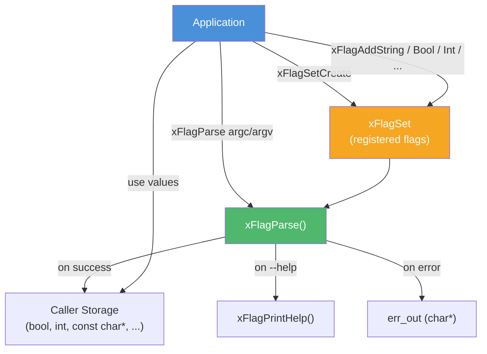

# flag.h — Command-Line Flag Parser

## Introduction

`flag.h` is a self-contained POSIX/GNU-style command-line parser. It replaces ad-hoc `getopt(3)` usage across examples and applications, producing structured values in caller-owned storage and auto-generating a usage screen. It is deliberately scoped to a single, flat flag set — subcommand trees, environment fallback, shell-completion, and long-name prefix matching are left to a future higher-level `xcli` module layered on top.

## Design Philosophy

1. **Zero-Copy, Caller-Owned Storage** — Each `xFlagAdd*` call takes a typed pointer (`bool *`, `int *`, `const char **`, …). `xFlagParse()` writes directly into that storage. String values point into `argv` memory, matching `getopt`'s `optarg` convention — no hidden allocations on the hot path.

2. **Never Calls `exit()`** — The parser returns a structured `xErrno`; the caller decides what to do. `--help` / `--version` are surfaced as `xErrno_Again` after the text is printed on stdout, so applications stay in full control of their exit path.

3. **POSIX/GNU Syntax, Strict Matching** — Short bundling (`-abc`), glued values (`-fvalue`), `--long=value`, `--` end-of-options, and the bare `-` stdin idiom are all supported. Long-name prefix matching (`--fi` for `--file`) is deliberately omitted: exact match only, to keep scripts forward-compatible when new flags are added.

4. **Auto-Generated Help** — Every flag carries a one-line description, an optional argument placeholder, and an optional default. `xFlagPrintHelp()` formats a standard usage block (`USAGE:` line → `Arguments:` → `Options:` → epilog) with two-column alignment. Hidden flags (`xFlagAttr_Hidden`) are omitted.

5. **Built-in Validation** — Integer flags accept decimal, `0x` hex, `0b` binary, and `0`-prefixed octal, with overflow detection. Choice flags enforce a fixed whitelist and report valid values on mismatch. Required flags fail parse if absent.

## Architecture



## API Reference

### Types

| Type | Description |
| --- | --- |
| `xFlagSet` | Opaque handle representing a set of registered flags |
| `xFlagAttr` | Per-flag attribute bitmask (see [Flag Attributes](#flag-attributes)) |

### Lifecycle

| Function | Signature | Description |
| --- | --- | --- |
| `xFlagSetCreate` | `xFlagSet xFlagSetCreate(const char *prog, const char *summary)` | Create a flag set. `prog` is shown in usage (typically `argv[0]` or a fixed string); `summary` is an optional one-line description |
| `xFlagSetDestroy` | `void xFlagSetDestroy(xFlagSet set)` | Destroy a flag set and release owned memory. NULL-safe. Does not touch caller-owned storage |
| `xFlagSetEpilog` | `void xFlagSetEpilog(xFlagSet set, const char *text)` | Append an epilog section printed after the options block (e.g. `"Examples:"` or `"Notes:"`). Pass NULL to clear |
| `xFlagSetVersion` | `void xFlagSetVersion(xFlagSet set, const char *version)` | Register a version string; enables `--version` / `-V` handling. Pass NULL to disable |

### Scalar Flag Registration

All `xFlagAdd*` functions return `xErrno_Ok`, `xErrno_InvalidArg` (bad arguments), `xErrno_AlreadyExists` (duplicate name/shortc), or `xErrno_NoMemory`.

| Function | Signature | Description |
| --- | --- | --- |
| `xFlagAddString` | `xErrno xFlagAddString(xFlagSet set, const char *name, char shortc, const char *meta, const char *help, const char **storage, const char *def, int attrs)` | String flag (`--url ws://...` / `-u ws://...`) |
| `xFlagAddBool` | `xErrno xFlagAddBool(xFlagSet set, const char *name, char shortc, const char *help, bool *storage, int attrs)` | Boolean switch; presence → true; takes no argument |
| `xFlagAddInt` | `xErrno xFlagAddInt(xFlagSet set, const char *name, char shortc, const char *meta, const char *help, int *storage, int def, int attrs)` | Signed 32-bit integer |
| `xFlagAddI64` | `xErrno xFlagAddI64(xFlagSet set, const char *name, char shortc, const char *meta, const char *help, int64_t *storage, int64_t def, int attrs)` | Signed 64-bit integer |
| `xFlagAddU64` | `xErrno xFlagAddU64(xFlagSet set, const char *name, char shortc, const char *meta, const char *help, uint64_t *storage, uint64_t def, int attrs)` | Unsigned 64-bit integer |
| `xFlagAddDouble` | `xErrno xFlagAddDouble(xFlagSet set, const char *name, char shortc, const char *meta, const char *help, double *storage, double def, int attrs)` | Double-precision float |
| `xFlagAddChoice` | `xErrno xFlagAddChoice(xFlagSet set, const char *name, char shortc, const char *meta, const char *help, const char *const *choices, const char **storage, const char *def, int attrs)` | String flag restricted to a fixed whitelist. `choices` is a NULL-terminated array that must outlive `set` |
| `xFlagAddCounter` | `xErrno xFlagAddCounter(xFlagSet set, const char *name, char shortc, const char *help, int *storage, int attrs)` | Counter; each occurrence increments storage by 1 (e.g. `-vvv` → 3). Takes no argument |

Shared parameter conventions:

| Parameter | Meaning |
| --- | --- |
| `name` | Long name without dashes (e.g. `"file"`). May be NULL for short-only flags. Must be unique |
| `shortc` | Single-character short name (e.g. `'f'`). Pass `0` for long-only flags. Must be unique |
| `meta` | Placeholder shown in usage (e.g. `"FILE"`). NULL → the flag takes no argument in usage formatting. Ignored by `xFlagAddBool` / `xFlagAddCounter` |
| `help` | One-line description (NULL → empty) |
| `storage` | Pointer to caller-owned variable filled on successful parse. Must outlive `xFlagParse()` |
| `def` | Default value written to `*storage` before parsing; also shown as `[default: ...]` in usage |
| `attrs` | Bitmask of `xFlagAttr` values |

### Positional Registration

| Function | Signature | Description |
| --- | --- | --- |
| `xFlagAddPositional` | `xErrno xFlagAddPositional(xFlagSet set, const char *name, const char *help, const char **storage, int attrs)` | Register a single positional argument. Positionals are matched in registration order. Use `xFlagAttr_Required` to mark mandatory ones |
| `xFlagAddPositionalTail` | `xErrno xFlagAddPositionalTail(xFlagSet set, const char *name, const char *help, const char ***storage, size_t *count, int attrs)` | Register a tail positional that captures all remaining argv after previously-registered positionals. Only one tail is allowed, and it must be registered last. The resulting NUL-terminated array is owned by the set |

### Parse & Output

| Function | Signature | Description |
| --- | --- | --- |
| `xFlagParse` | `xErrno xFlagParse(xFlagSet set, int argc, char *const argv[], char **err_out)` | Parse argv and populate every registered storage pointer. Returns `xErrno_Ok` on success, `xErrno_Again` if `--help` or `--version` was handled (text already printed to stdout), `xErrno_InvalidArg` on bad input (`*err_out` filled with a one-line message the caller must `free()`), or `xErrno_NoMemory`. Never calls `exit()` |
| `xFlagPrintUsage` | `void xFlagPrintUsage(xFlagSet set, void *fp)` | Print the `USAGE: ...` summary line to `fp` (typically `stdout` or `stderr`; typed as `void *` to keep `<stdio.h>` out of the header) |
| `xFlagPrintHelp` | `void xFlagPrintHelp(xFlagSet set, void *fp)` | Print the full help screen (usage + arguments + options + epilog) to `fp` |

## Usage Examples

### Minimal boolean + string flag

```c
#include <stdio.h>
#include <stdlib.h>
#include <x/base/flag.h>

int main(int argc, char *argv[]) {
    xFlagSet set = xFlagSetCreate("demo", "a tiny example");

    bool        ipv6 = false;
    const char *url  = NULL;

    xFlagAddBool  (set, "ipv6", '6', "enable IPv6", &ipv6, xFlagAttr_None);
    xFlagAddString(set, "url",  'u', "URL", "signal server",
                   &url, "ws://127.0.0.1:8080/ws", xFlagAttr_None);

    char  *err = NULL;
    xErrno rc  = xFlagParse(set, argc, argv, &err);
    if (rc == xErrno_Again) { xFlagSetDestroy(set); return 0; }
    if (rc != xErrno_Ok) {
        fprintf(stderr, "%s\n", err ? err : "parse error");
        free(err);
        xFlagSetDestroy(set);
        return 1;
    }

    printf("ipv6 = %s, url = %s\n", ipv6 ? "true" : "false", url);
    xFlagSetDestroy(set);
    return 0;
}
```

### Integer, counter and choice

```c
#include <stdio.h>
#include <stdlib.h>
#include <x/base/flag.h>

int main(int argc, char *argv[]) {
    xFlagSet set = xFlagSetCreate("srv", "demo server");

    int         port    = 0;
    int         verbose = 0;         /* -vvv → 3 */
    const char *level   = NULL;      /* one of debug/info/warn/error */

    static const char *const levels[] = {
        "debug", "info", "warn", "error", NULL,
    };

    xFlagAddInt    (set, "port",    'p', "PORT", "listen port",
                    &port, 8080, xFlagAttr_None);
    xFlagAddCounter(set, "verbose", 'v', "increase verbosity",
                    &verbose, xFlagAttr_None);
    xFlagAddChoice (set, "level",   'l', "LEVEL", "log level",
                    levels, &level, "info", xFlagAttr_None);

    char  *err = NULL;
    xErrno rc  = xFlagParse(set, argc, argv, &err);
    if (rc == xErrno_Again) { xFlagSetDestroy(set); return 0; }
    if (rc != xErrno_Ok) {
        fprintf(stderr, "%s\n", err ? err : "parse error");
        free(err);
        xFlagSetDestroy(set);
        return 1;
    }

    printf("port=%d verbose=%d level=%s\n", port, verbose, level);
    xFlagSetDestroy(set);
    return 0;
}
```

Invocation examples that all succeed:

```sh
srv --port 9000 -vvv --level=debug
srv -p 0x1f90 -v -v -v -l debug
srv                                  # uses defaults: port=8080 verbose=0 level=info
```

### Positional arguments and a tail

```c
#include <stddef.h>
#include <stdio.h>
#include <stdlib.h>
#include <x/base/flag.h>

int main(int argc, char *argv[]) {
    xFlagSet set = xFlagSetCreate("tar", "mini tar(1)");

    const char  *archive = NULL;
    const char **members = NULL;
    size_t       n       = 0;

    /* Positionals are matched in registration order.
     * Layout on the command line: tar ARCHIVE MEMBERS...
     * So register ARCHIVE first, then the MEMBERS tail. */
    xFlagAddPositional    (set, "ARCHIVE", "archive path", &archive,
                           xFlagAttr_Required);
    xFlagAddPositionalTail(set, "MEMBERS", "files to add",  &members, &n,
                           xFlagAttr_None);

    char  *err = NULL;
    xErrno rc  = xFlagParse(set, argc, argv, &err);
    if (rc == xErrno_Again) { xFlagSetDestroy(set); return 0; }
    if (rc != xErrno_Ok) {
        fprintf(stderr, "%s\n", err ? err : "parse error");
        free(err);
        xFlagSetDestroy(set);
        return 1;
    }

    printf("archive = %s\n", archive);
    for (size_t i = 0; i < n; ++i) printf("  + %s\n", members[i]);
    xFlagSetDestroy(set);
    return 0;
}
```

> **Note:** positionals are matched in the order they are registered, and a tail positional must be registered *last*. A trailing required positional after a tail (e.g. `cp SRC... DST`) is not supported in v1 — you would need to consume the last element manually after parsing, or skip the tail and iterate `argv` yourself.

### Handling `--` and stdin shorthand

```c
#include <stddef.h>
#include <stdio.h>
#include <stdlib.h>
#include <x/base/flag.h>

int main(int argc, char *argv[]) {
    xFlagSet set = xFlagSetCreate("grep", "tiny grep");

    bool         invert  = false;
    const char  *pattern = NULL;
    const char **files   = NULL;
    size_t       nfiles  = 0;

    xFlagAddBool         (set, "invert",  'v', "invert match", &invert,
                          xFlagAttr_None);
    xFlagAddPositional   (set, "PATTERN", "regex", &pattern,
                          xFlagAttr_Required);
    xFlagAddPositionalTail(set, "FILE", "input files (use - for stdin)",
                           &files, &nfiles, xFlagAttr_None);

    char  *err = NULL;
    xErrno rc  = xFlagParse(set, argc, argv, &err);
    if (rc == xErrno_Again) { xFlagSetDestroy(set); return 0; }
    if (rc != xErrno_Ok) {
        fprintf(stderr, "%s\n", err ? err : "parse error");
        free(err);
        xFlagSetDestroy(set);
        return 1;
    }

    /* `grep -- -v foo.txt` treats "-v" as the PATTERN (positional),
     * because "--" ends option parsing.
     * `grep foo -` leaves files = {"-"} so the caller reads from stdin. */
    xFlagSetDestroy(set);
    return 0;
}
```

### Generated help screen

With the flags from the "Integer, counter and choice" example plus `xFlagSetVersion(set, "1.2.3")`, running `srv --help` prints something like:

```bash
srv - demo server

USAGE: srv [OPTIONS]

Options:
  -p, --port PORT    listen port [default: 8080]
  -v, --verbose      increase verbosity
  -l, --level LEVEL  log level (one of: debug, info, warn, error) [default: info]
  -V, --version      show version
  -h, --help         show this help
```

## Use Cases

1. **Example / Demo Programs** — Replace `getopt_long()` boilerplate in `examples/` with a few `xFlagAdd*` calls and get a formatted help screen for free.

2. **CLI Tools** — Small libx-based utilities (benchmarks, migration scripts, diagnostic tools) that want conventional POSIX/GNU syntax without pulling in `argp` or a heavyweight parser.

3. **Application Front-Ends** — Projects under `cli/` that wrap libx modules into standalone binaries can use `flag.h` for their startup configuration, and later upgrade to `xcli` once subcommand trees are needed.

4. **Configuration Overrides** — Parse command-line overrides before loading a config file; `xFlagAttr_Required` marks mandatory knobs and `[default: ...]` documents the rest in `--help`.

## Best Practices

- **Always handle `xErrno_Again`.** This signals that `--help` / `--version` was processed. The parser has already written to stdout; the caller should exit `0` cleanly.

- **`free()` the error string.** On failure, `*err_out` is heap-allocated. Forgetting to free leaks one string per failed invocation — minor, but tools like leak sanitisers will flag it.

- **`strdup()` strings you need to outlive `main`.** Parsed string values point into `argv`. If you stash them into a long-lived config struct, copy them.

- **Register positionals last, tail last of all.** Long flags and short flags can be registered in any order, but positionals are matched in registration order, and a tail positional must come at the end.

- **Prefer `xFlagAddChoice` over free-form strings.** The parser does the enum validation for you and shows the allowed values in `--help`, saving you a `strcmp` ladder and giving users a self-documenting interface.

- **Don't depend on prefix matching.** `--fil` will not match `--file`. This is deliberate — scripts that relied on a prefix would silently break when a new flag with the same prefix is added.

- **Use `xFlagAttr_Hidden` sparingly.** Reserve it for internal / debug / deprecated flags. A hidden flag that users need to discover is a support-channel footgun.

## Comparison with Other Parsers

| Feature | xbase `flag.h` | `getopt(3)` | `getopt_long(3)` | `argp` (glibc) |
| --- | --- | --- | --- | --- |
| **POSIX short / GNU long** | Both | Short only | Both | Both |
| **Auto-generated `--help`** | Yes | No | No | Yes |
| **Typed storage (`bool`, `int`, …)** | Yes | No (string only) | No (string only) | Partial (via parser fn) |
| **Choice validation** | Yes | No | No | Manual |
| **Counter flags (`-vvv`)** | Built-in | Manual | Manual | Manual |
| **Default values in help** | Yes | No | No | No |
| **Positional + tail support** | Yes | Manual | Manual | Via parser fn |
| **Never calls `exit()`** | Yes | Yes | Yes | No (default handlers) |
| **Subcommand trees** | No (future `xcli`) | No | No | Yes |
| **Environment / config fallback** | No | No | No | No |
| **Platform** | macOS + Linux | POSIX | GNU | glibc |

**Key Differentiator:** `flag.h` gives you `argp`-class ergonomics (typed storage, auto-help, validation) in a header-plus-`.c` pair that is portable across macOS and Linux, without `exit()`-by-default behaviour or glibc dependencies.

## Implementation Details

### Supported Syntax

| Form | Meaning |
| --- | --- |
| `-f value` | Short flag with a separate argument |
| `-fvalue` | Short flag with a glued argument |
| `-abc` | Bundled no-arg shorts; the last one may take an argument |
| `--file value` | Long flag with a separate argument |
| `--file=value` | Long flag with an `=`-form argument |
| `--flag` | Long boolean or counter |
| `--` | End-of-options; everything after is positional |
| `-` | Treated as a positional argument (stdin idiom) |

### Not Supported (by design, in v1)

- Subcommand trees (deferred to a future `xcli` module)
- Environment / config-file fallback
- Shell-completion generation
- Long-name prefix matching (`--fi` for `--file`): exact match required
- i18n
- Dynamic registration after `xFlagParse()` has started

### Flag Attributes

`xFlagAttr` is a bitmask passed as the final argument to every `xFlagAdd*` call.

| Attribute | Meaning |
| --- | --- |
| `xFlagAttr_None` | Default (no attribute) |
| `xFlagAttr_Required` | Parse fails with `xErrno_InvalidArg` if the flag is absent |
| `xFlagAttr_Hidden` | Omit from `--help` output (useful for internal/debug flags) |
| `xFlagAttr_Multi` | Allow repetition; each occurrence is collected into an internal array. Only meaningful for string flags |

### Help / Version Handling

- `--help` / `-h` are always recognised (unless the caller has already registered `h`).
- `--version` / `-V` are recognised only after `xFlagSetVersion()` has been called (and only if those names are free).
- Both cause `xFlagParse()` to print to stdout and return `xErrno_Again`. No flag storage is written.

### Integer Parsing

`xFlagAddInt` / `xFlagAddI64` / `xFlagAddU64` accept:

| Prefix | Base |
| --- | --- |
| `0x` / `0X` | Hexadecimal (e.g. `-n 0xff`) |
| `0b` / `0B` | Binary (e.g. `-n 0b1010`) |
| `0` + digit | Octal (e.g. `-n 0755`) |
| (anything else) | Decimal |

Overflow or trailing garbage produces `xErrno_InvalidArg` with a descriptive `err_out`.

### Memory Ownership

| Owned by `xFlagSet` (freed on `xFlagSetDestroy`) | Owned by caller |
| --- | --- |
| Copies of every `name`, `help`, `meta`, `def`, `summary`, `prog`, `epilog` string | Storage pointers (`bool *`, `const char **`, …) |
| Arrays collected for `xFlagAttr_Multi` | `choices` array for `xFlagAddChoice` (must outlive the set) |
| Tail positional array allocated by `xFlagAddPositionalTail` | `argv` itself (used zero-copy for string values) |
| Error string written to `*err_out` | (the caller must `free()` `*err_out`) |

Parsed string values point into `argv`. If you need them to outlive `main`'s `argv`, `strdup()` them.
