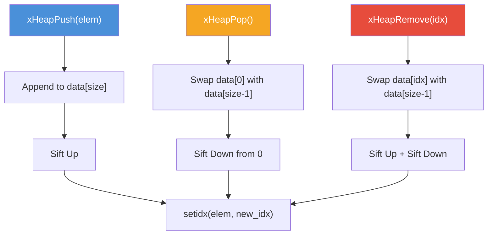

# heap.h — Min-Heap

## Introduction

`heap.h` provides a generic binary min-heap that stores opaque pointers and orders them via a user-supplied comparison function. Each element carries its heap index (maintained via a callback), enabling O(log n) removal and priority updates by index. It is the core data structure behind xbase's timer subsystem.

## Design Philosophy

1. **Generic via Function Pointers** — The heap stores `void *` elements and uses a `xHeapCmpFunc` for ordering. This makes it reusable for any element type without code generation or macros.

2. **Index Tracking** — A `xHeapSetIdxFunc` callback notifies elements of their current position in the heap array. This enables O(1) lookup for `xHeapRemove()` and `xHeapUpdate()`, which would otherwise require O(n) search.

3. **Dynamic Array Backend** — The heap uses a dynamically-growing array (2x expansion) starting from a default capacity of 16. This provides cache-friendly access patterns and amortized O(1) growth.

4. **No Element Ownership** — The heap does not own the elements it stores. `xHeapDestroy()` frees the heap structure but NOT the elements. This gives the caller full control over element lifecycle.

## Architecture



## API Reference

### Types

| Type | Description |
| --- | --- |
| `xHeapCmpFunc` | `int (*)(const void *a, const void *b)` — Returns negative if a < b, 0 if equal, positive if a > b |
| `xHeapSetIdxFunc` | `void (*)(void *elem, size_t idx)` — Called when an element's index changes |
| `xHeap` | Opaque handle to a min-heap |

### Functions

| Function | Signature | Description | Thread Safety |
| --- | --- | --- | --- |
| `xHeapCreate` | `xHeap xHeapCreate(xHeapCmpFunc cmp, xHeapSetIdxFunc setidx, size_t cap)` | Create a heap. `cap = 0` uses default (16). | Not thread-safe |
| `xHeapDestroy` | `void xHeapDestroy(xHeap h)` | Free the heap. Does NOT free elements. | Not thread-safe |
| `xHeapPush` | `xErrno xHeapPush(xHeap h, void *elem)` | Insert an element. O(log n). | Not thread-safe |
| `xHeapPeek` | `void *xHeapPeek(xHeap h)` | Return the minimum element without removing. O(1). | Not thread-safe |
| `xHeapPop` | `void *xHeapPop(xHeap h)` | Remove and return the minimum element. O(log n). | Not thread-safe |
| `xHeapRemove` | `void *xHeapRemove(xHeap h, size_t idx)` | Remove element at index. O(log n). | Not thread-safe |
| `xHeapUpdate` | `xErrno xHeapUpdate(xHeap h, size_t idx)` | Re-heapify after priority change. O(log n). | Not thread-safe |
| `xHeapSize` | `size_t xHeapSize(xHeap h)` | Return element count. O(1). | Not thread-safe |

## Usage Examples

### Timer-Style Priority Queue

```c
#include <stdio.h>
#include <stdlib.h>
#include <x/base/heap.h>

typedef struct {
    uint64_t deadline;
    size_t   heap_idx;
    char     name[32];
} TimerEntry;

static int cmp_entry(const void *a, const void *b) {
    const TimerEntry *ea = (const TimerEntry *)a;
    const TimerEntry *eb = (const TimerEntry *)b;
    if (ea->deadline < eb->deadline) return -1;
    if (ea->deadline > eb->deadline) return  1;
    return 0;
}

static void set_idx(void *elem, size_t idx) {
    ((TimerEntry *)elem)->heap_idx = idx;
}

int main(void) {
    xHeap heap = xHeapCreate(cmp_entry, set_idx, 0);

    TimerEntry entries[] = {
        { .deadline = 300, .name = "C" },
        { .deadline = 100, .name = "A" },
        { .deadline = 200, .name = "B" },
    };

    for (int i = 0; i < 3; i++)
        xHeapPush(heap, &entries[i]);

    // Pop in order: A (100), B (200), C (300)
    while (xHeapSize(heap) > 0) {
        TimerEntry *e = (TimerEntry *)xHeapPop(heap);
        printf("%s (deadline=%llu)\n", e->name, e->deadline);
    }

    xHeapDestroy(heap);
    return 0;
}
```

## Use Cases

1. **Timer Subsystem** — [`timer.h`](timer.md) uses the min-heap to order timer entries by deadline. The timer thread peeks at the minimum to determine how long to sleep, then pops expired entries.

2. **Event Loop Timers** — The event loop's builtin timer heap ([`event.h`](event.md)) uses the same pattern to integrate timer dispatch with I/O polling.

3. **Custom Priority Queues** — Any scenario requiring efficient insert/extract-min with O(log n) removal by index.

## Best Practices

- **Always implement `xHeapSetIdxFunc`.** Without index tracking, `xHeapRemove()` and `xHeapUpdate()` cannot locate elements efficiently.
- **Store the index in your element struct.** The `setidx` callback should write the index into a field of your element (e.g., `elem->heap_idx = idx`).
- **Don't free elements while they're in the heap.** Remove them first with `xHeapRemove()` or `xHeapPop()`.
- **Use `xHeapUpdate()` after changing an element's priority.** The heap doesn't detect priority changes automatically.

## Comparison with Other Libraries

| Feature | xbase heap.h | C++ `std::priority_queue` | Linux kernel `prio_heap` | Go `container/heap` |
| --- | --- | --- | --- | --- |
| **Element Type** | `void *` (generic) | Template | Fixed struct | `interface{}` |
| **Index Tracking** | Built-in (`setidx` callback) | Not available | Not available | Manual (`Fix` method) |
| **Remove by Index** | O(log n) | Not supported | Not supported | O(log n) via `Remove` |
| **Update Priority** | O(log n) via `xHeapUpdate` | Not supported | Not supported | O(log n) via `Fix` |
| **Ownership** | No (caller owns elements) | Yes (copies/moves) | No | No |
| **Thread Safety** | Not thread-safe | Not thread-safe | Not thread-safe | Not thread-safe |

**Key Differentiator:** xbase's heap provides built-in index tracking via the `setidx` callback, enabling O(log n) removal and priority updates — features that `std::priority_queue` lacks entirely. This makes it ideal for timer implementations where cancellation is a common operation.

## Benchmark

> Environment: Apple M3 Pro, 36 GB RAM, macOS 26.4, Release build (`-O2`).
> Source: [`xbase/heap_bench.cpp`](https://github.com/mivinci/libx/blob/main/xbase/heap_bench.cpp)

| Benchmark | N | Time (ns) | CPU (ns) | Throughput |
| --- | ---: | ---: | ---: | --- |
| `BM_Heap_Push` | 8 | 983 | 987 | 8.1 M items/s |
| `BM_Heap_Push` | 64 | 1,694 | 1,699 | 37.7 M items/s |
| `BM_Heap_Push` | 512 | 8,722 | 8,725 | 58.7 M items/s |
| `BM_Heap_Push` | 4,096 | 56,854 | 56,853 | 72.0 M items/s |
| `BM_Heap_Pop` | 8 | 1,020 | 1,024 | 7.8 M items/s |
| `BM_Heap_Pop` | 64 | 2,807 | 2,809 | 22.8 M items/s |
| `BM_Heap_Pop` | 512 | 26,334 | 26,337 | 19.4 M items/s |
| `BM_Heap_Pop` | 4,096 | 297,382 | 297,325 | 13.8 M items/s |
| `BM_Heap_Remove` | 8 | 1,015 | 1,020 | 7.8 M items/s |
| `BM_Heap_Remove` | 64 | 1,808 | 1,811 | 35.3 M items/s |
| `BM_Heap_Remove` | 512 | 8,914 | 8,903 | 57.5 M items/s |
| `BM_Heap_Remove` | 4,096 | 68,017 | 68,016 | 60.2 M items/s |

**Key Observations:**

- **Push** throughput scales well with heap size — amortized cost per element decreases as batch size grows, reaching 72M items/s at N=4096.
- **Pop** is more expensive than push at large N due to the sift-down operation traversing more levels. At N=4096, pop throughput drops to ~14M items/s.
- **Remove** (random index removal) performs comparably to push, thanks to the O(log n) index-tracked removal. This validates the `setidx` callback design for timer cancellation workloads.

## Implementation Details

### Data Structure

```c
struct xHeap_ {
    void          **data;    // Dynamic array of element pointers
    size_t          size;    // Current number of elements
    size_t          cap;     // Allocated capacity
    xHeapCmpFunc    cmp;     // Comparison function
    xHeapSetIdxFunc setidx;  // Index notification callback
};
```

### Array Layout

```text
Index:  0     1     2     3     4     5     6
       [min] [  ] [  ] [  ] [  ] [  ] [  ]
        │     │    │
        │     ├────┤
        │     children of 0
        ├─────┤
        parent of 1,2

Parent of i:     (i - 1) / 2
Left child of i:  2 * i + 1
Right child of i: 2 * i + 2
```

### Operations and Complexity

| Operation | Function | Time Complexity | Description |
| --- | --- | --- | --- |
| Insert | `xHeapPush` | O(log n) | Append to end, sift up |
| Peek min | `xHeapPeek` | O(1) | Return `data[0]` |
| Extract min | `xHeapPop` | O(log n) | Swap with last, sift down |
| Remove by index | `xHeapRemove` | O(log n) | Swap with last, sift up + down |
| Update priority | `xHeapUpdate` | O(log n) | Sift up + down at index |
| Size | `xHeapSize` | O(1) | Return `size` field |
| Grow | `ensure_cap` | Amortized O(1) | 2x realloc |

### Sift Operations

- **Sift Up** — Compare element with parent; swap if smaller. Repeat until heap property is restored or root is reached.
- **Sift Down** — Compare element with children; swap with the smallest child if it's smaller. Repeat until heap property is restored or a leaf is reached.

### Remove by Index

`xHeapRemove(h, idx)` replaces the element at `idx` with the last element, then applies both sift-up and sift-down. This handles both cases: the replacement may be smaller (needs to go up) or larger (needs to go down) than its new neighbors.
