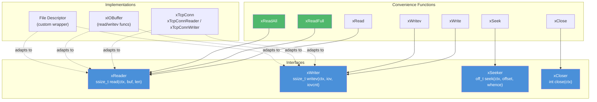

# io.h — Abstract I/O Interfaces

## Introduction

`io.h` defines four lightweight I/O interfaces — `xReader`, `xWriter`, `xSeeker`, `xCloser` — inspired by Go's `io.Reader` / `io.Writer` / `io.Seeker` / `io.Closer`. Each interface is a small struct containing a function pointer and an opaque `void *ctx`, making it trivial to adapt any object that provides the matching function signature.

On top of these interfaces, `io.h` provides a set of convenience functions (`xRead`, `xReadFull`, `xReadAll`, `xWrite`, `xWritev`, `xSeek`, `xClose`) that operate generically on any implementation, enabling code reuse across TCP connections, TLS streams, file descriptors, in-memory buffers, and more.

## Design Philosophy

1. **Value-Type Interfaces** — Each interface is a plain struct (function pointer + context), not a heap-allocated object. They are cheap to copy, pass by value, and require no memory management.

2. **POSIX Semantics** — Function signatures mirror their POSIX counterparts: `read(2)`, `writev(2)`, `lseek(2)`, `close(2)`. This makes the learning curve near-zero for C developers.

3. **Composable Helpers** — Higher-level functions like `xReadFull` and `xReadAll` are built on top of `xReader`, so any object that provides a reader automatically gains these capabilities.

4. **Zero-Initialized = Invalid** — A zero-initialized struct (all NULL) is treated as "not set". Convenience functions can detect this and return an error instead of crashing.

## Architecture



## API Reference

### Types

| Type | Description |
| --- | --- |
| `xReader` | Abstract reader — `{ ssize_t (*read)(void*, void*, size_t), void *ctx }` |
| `xWriter` | Abstract writer — `{ ssize_t (*writev)(void*, const struct iovec*, int), void *ctx }` |
| `xSeeker` | Abstract seeker — `{ off_t (*seek)(void*, off_t, int), void *ctx }` |
| `xCloser` | Abstract closer — `{ int (*close)(void*), void *ctx }` |

### Functions

| Function | Signature | Description |
| --- | --- | --- |
| `xRead` | `ssize_t xRead(xReader r, void *buf, size_t len)` | Single read; returns bytes read, 0 on EOF, -1 on error |
| `xWrite` | `ssize_t xWrite(xWriter w, const void *buf, size_t len)` | Write a contiguous buffer (wraps into single iovec) |
| `xWritev` | `ssize_t xWritev(xWriter w, const struct iovec *iov, int iovcnt)` | Scatter-gather write |
| `xSeek` | `off_t xSeek(xSeeker s, off_t offset, int whence)` | Reposition offset (SEEK_SET / SEEK_CUR / SEEK_END) |
| `xClose` | `int xClose(xCloser c)` | Close the underlying resource |
| `xReadFull` | `ssize_t xReadFull(xReader r, void *buf, size_t len)` | Read exactly `len` bytes, retrying on partial reads and EAGAIN/EINTR |
| `xReadAll` | `int xReadAll(xReader r, void **out, size_t *out_len)` | Read until EOF into a malloc'd buffer; caller must `free(*out)` |

## Usage Examples

### Creating a Custom Reader

```c
#include <x/base/io.h>
#include <unistd.h>

// Adapt a file descriptor into an xReader
static ssize_t fd_read(void *ctx, void *buf, size_t len) {
    int fd = (int)(intptr_t)ctx;
    return read(fd, buf, len);
}

xReader make_fd_reader(int fd) {
    xReader r;
    r.read = fd_read;
    r.ctx  = (void *)(intptr_t)fd;
    return r;
}
```

### Reading Exactly N Bytes

```c
#include <x/base/io.h>

void read_header(xReader r) {
    char header[64];
    ssize_t n = xReadFull(r, header, sizeof(header));
    if (n < 0) {
        // error
    } else if ((size_t)n < sizeof(header)) {
        // EOF before full header
    } else {
        // got all 64 bytes
    }
}
```

### Reading All Data Until EOF

```c
#include <x/base/io.h>
#include <stdlib.h>

void read_body(xReader r) {
    void  *data;
    size_t data_len;

    if (xReadAll(r, &data, &data_len) == 0) {
        // process data (data_len bytes at data)
        free(data);
    } else {
        // error
    }
}
```

### Using with xTcpConn

`xTcpConn` (from `<x/net/tcp.h>`) provides adapter functions that return `xReader` and `xWriter` bound to the connection's transport layer. This allows TCP connections to be used with all generic I/O helpers:

```c
#include <x/base/io.h>
#include <x/net/tcp.h>

void handle_connection(xTcpConn conn) {
    // Get I/O adapters from the TCP connection
    xReader r = xTcpConnReader(conn);
    xWriter w = xTcpConnWriter(conn);

    // Read a fixed-size header
    char header[16];
    ssize_t n = xReadFull(r, header, sizeof(header));
    if (n < (ssize_t)sizeof(header)) return;

    // Read the entire body until the peer closes
    void  *body;
    size_t body_len;
    if (xReadAll(r, &body, &body_len) != 0) return;

    // Echo back through the generic writer
    xWrite(w, body, body_len);
    free(body);
}
```

### Scatter-Gather Write

```c
#include <x/base/io.h>

void send_http_response(xWriter w) {
    const char *header = "HTTP/1.1 200 OK\r\nContent-Length: 5\r\n\r\n";
    const char *body   = "Hello";

    struct iovec iov[2] = {
        { .iov_base = (void *)header, .iov_len = strlen(header) },
        { .iov_base = (void *)body,   .iov_len = 5 },
    };

    xWritev(w, iov, 2);
}
```

## Integration with xTcpConn

`xTcpConn` provides two adapter functions that bridge the TCP connection to the generic I/O interfaces:

| Function | Returns | Description |
| --- | --- | --- |
| `xTcpConnReader(conn)` | `xReader` | Reader bound to `transport.read` — equivalent to `xTcpConnRecv` |
| `xTcpConnWriter(conn)` | `xWriter` | Writer bound to `transport.writev` — equivalent to `xTcpConnSendIov` |

These adapters are **zero-allocation**: they copy the function pointer and context from the connection's internal `xTransport` into a stack-allocated struct. The returned interfaces are valid as long as the connection (and its transport) remains alive.

**Why no xCloser adapter?** `xTcpConnClose()` requires an `xEventLoop` parameter to properly unregister the socket from the event loop, which does not fit the `int (*close)(void *ctx)` signature.

## Best Practices

- **Prefer `xReadFull` over manual loops** when you need an exact number of bytes. It handles `EAGAIN`, `EINTR`, and partial reads correctly.
- **Always `free()` the buffer from `xReadAll`** on success. On error, the function cleans up internally.
- **Use `xWrite` for simple writes, `xWritev` for multi-buffer writes.** `xWrite` is a thin wrapper that constructs a single iovec — no performance penalty.
- **Check for zero-initialized interfaces** before passing them to helpers. If `xTcpConnReader(NULL)` returns a zero struct, calling `xRead` on it will dereference a NULL function pointer.
- **Obtain adapters once, use many times.** Since `xTcpConnReader` / `xTcpConnWriter` are value types, you can call them once at the start of a handler and reuse the result throughout.

## Comparison with Other Libraries

| Feature | xbase io.h | Go io.Reader/Writer | POSIX read/write | C++ std::iostream |
| --- | --- | --- | --- | --- |
| **Abstraction** | Struct (fn ptr + ctx) | Interface (vtable) | Raw syscall | Class hierarchy |
| **Allocation** | Zero (stack value) | Heap (interface value) | N/A | Heap (stream object) |
| **Composability** | Via helper functions | Via io.Copy, io.ReadAll, etc. | Manual loops | Via stream operators |
| **Scatter-Gather** | Built-in (xWritev) | No (use io.MultiWriter) | writev(2) | No |
| **Read-Until-EOF** | xReadAll (malloc'd buffer) | io.ReadAll ([]byte) | Manual loop | std::istreambuf_iterator |
| **Error Model** | Return value (-1 + errno) | (n, error) tuple | Return value (-1 + errno) | Stream state flags |

## Implementation Details

### Interface Structs

Each interface is a two-field struct:

| Interface | Function Pointer | Semantics |
| --- | --- | --- |
| `xReader` | `ssize_t (*read)(void *ctx, void *buf, size_t len)` | Returns bytes read, 0 on EOF, -1 on error |
| `xWriter` | `ssize_t (*writev)(void *ctx, const struct iovec *iov, int iovcnt)` | Returns bytes written, -1 on error |
| `xSeeker` | `off_t (*seek)(void *ctx, off_t offset, int whence)` | Returns resulting offset, -1 on error |
| `xCloser` | `int (*close)(void *ctx)` | Returns 0 on success, -1 on failure |

### xReadFull — Retry Logic

`xReadFull` loops calling `r.read` until exactly `len` bytes are read or EOF is reached. It automatically retries on `EAGAIN` and `EINTR`, making it suitable for both blocking and non-blocking file descriptors:

```text
while (total < len):
    n = r.read(ctx, buf + total, len - total)
    if n > 0:  total += n
    if n == 0: break          // EOF
    if n == -1:
        if EAGAIN or EINTR: continue
        else: return -1       // real error
return total
```

### xReadAll — Dynamic Buffer Growth

`xReadAll` reads until EOF into a dynamically allocated buffer. It starts with a 4096-byte allocation and doubles the capacity each time the buffer fills up:

```text
cap = 4096, buf = malloc(cap)
loop:
    if total == cap: realloc(buf, cap * 2)
    n = r.read(ctx, buf + total, cap - total)
    if n > 0:  total += n
    if n == 0: *out = buf, *out_len = total, return 0
    if n == -1:
        if EAGAIN or EINTR: continue
        else: free(buf), return -1
```

The caller is responsible for freeing the returned buffer with `free()`.

### xWrite — Single Buffer Convenience

`xWrite` wraps a contiguous buffer into a single `struct iovec` and delegates to `w.writev`, avoiding the need for callers to construct iovec arrays for simple writes:

```c
ssize_t xWrite(xWriter w, const void *buf, size_t len) {
    struct iovec iov = { .iov_base = (void *)buf, .iov_len = len };
    return w.writev(w.ctx, &iov, 1);
}
```
