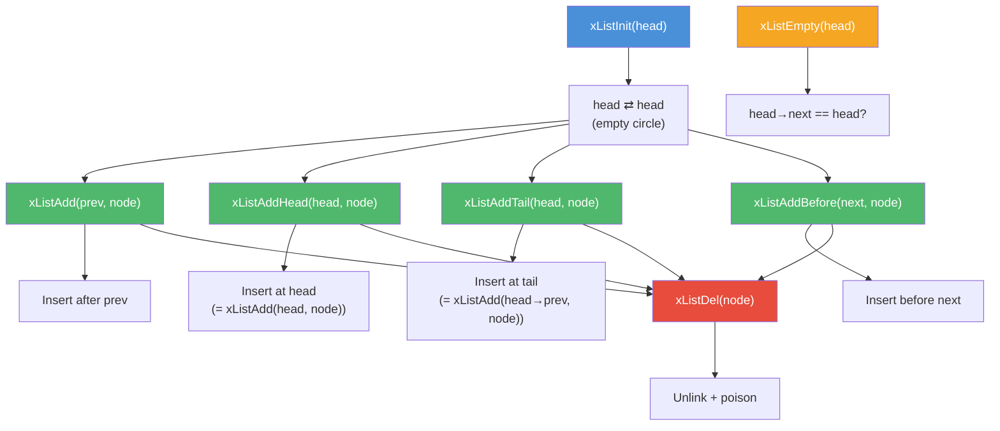

# list.h — Doubly-Linked Circular List

## Introduction

`list.h` provides an intrusive doubly-linked circular list, derived from the Linux kernel's `include/linux/list.h`. Instead of storing payloads inside list nodes, the caller embeds an `xList` node inside their own struct and uses `xContainerOf` to recover the enclosing struct. This design avoids dynamic allocation for the list itself and works with any element type without generic macros or function pointers.

## Design Philosophy

1. **Intrusive Design** — The list node (`xList`) is embedded inside the user's struct rather than wrapping it. This eliminates per-element heap allocation and makes the list usable for any type without templates or `void *` casts.

2. **Circular Sentinel** — The list head is itself an `xList` node whose `next` and `prev` point back to itself when empty. This eliminates special-case branching for head/tail operations — every insertion and deletion follows the same pointer manipulation.

3. **Inline Implementation** — All functions are declared `XCAPI_INLINE`, so the entire list implementation lives in the header with no separate `.c` file. This gives the compiler full visibility for inlining and constant propagation, yielding zero-overhead list operations.

4. **Poison Pointers** — After removal, a node's `next` and `prev` are overwritten with sentinel values (`0xDEAD` / `0xBEEF`). Accessing a removed node's links will trigger an obvious crash, catching use-after-remove bugs early.

5. **Safe Iteration Macros** — `xListForEachSafe` and `xListForEachEntrySafe` stash the next pointer before the current node is visited, allowing deletion during iteration without invalidating the loop.

## Architecture



## API Reference

### Types

| Type | Description |
| --- | --- |
| `xList` | Doubly-linked list node. Embed in your struct as a member. |

### Functions

| Function | Signature | Description | Thread Safety |
| --- | --- | --- | --- |
| `xListInit` | `void xListInit(xList *head)` | Initialize a list head as an empty circular list | Not thread-safe |
| `xListAdd` | `void xListAdd(xList *prev, xList *node)` | Insert `node` after `prev` | Not thread-safe |
| `xListAddHead` | `void xListAddHead(xList *head, xList *node)` | Insert `node` at the head of the list (equivalent to `xListAdd(head, node)`) | Not thread-safe |
| `xListAddTail` | `void xListAddTail(xList *head, xList *node)` | Insert `node` at the tail of the list (equivalent to `xListAdd(head->prev, node)`) | Not thread-safe |
| `xListAddBefore` | `void xListAddBefore(xList *next, xList *node)` | Insert `node` before `next` | Not thread-safe |
| `xListDel` | `void xListDel(xList *node)` | Remove `node` from its list and poison its pointers | Not thread-safe |
| `xListEmpty` | `bool xListEmpty(xList *head)` | Return true if the list is empty | Not thread-safe |

### Macros

| Macro | Parameters | Description |
| --- | --- | --- |
| `xListForEach(pos, head)` | `pos`: iterator (`xList *`), `head`: list head | Iterate over raw list nodes |
| `xListForEachSafe(pos, tmp, head)` | `pos`: iterator, `tmp`: temp, `head`: list head | Iterate with safe deletion support |
| `xListForEachEntry(pos, head, member)` | `pos`: struct pointer iterator, `head`: list head, `member`: name of `xList` field | Iterate over struct entries via `xContainerOf` |
| `xListForEachEntrySafe(pos, tmp, head, member)` | `pos`: struct pointer iterator, `tmp`: temp struct pointer, `head`: list head, `member`: name of `xList` field | Iterate over struct entries with safe deletion support |

## Usage Examples

### Basic List Operations

```c
#include <stdio.h>
#include <x/base/list.h>

struct Task {
  xList list;
  int   id;
};

int main(void) {
  xList head;
  xListInit(&head);

  struct Task t1 = { .id = 1 };
  struct Task t2 = { .id = 2 };
  struct Task t3 = { .id = 3 };

  /* Append to the end */
  xListAddTail(&head, &t1.list);
  xListAddTail(&head, &t2.list);
  xListAddTail(&head, &t3.list);

  /* Iterate: 1, 2, 3 */
  struct Task *pos;
  xListForEachEntry(pos, &head, list) {
    printf("task id = %d\n", pos->id);
  }

  /* Remove t2 */
  xListDel(&t2.list);

  /* Iterate: 1, 3 */
  xListForEachEntry(pos, &head, list) {
    printf("task id = %d\n", pos->id);
  }

  return 0;
}
```

### Safe Deletion During Iteration

```c
#include <x/base/list.h>

struct Node {
  xList list;
  int   value;
};

void remove_all(xList *head) {
  struct Node *pos, *tmp;
  xListForEachEntrySafe(pos, tmp, head, list) {
    xListDel(&pos->list);
    /* pos is now unlinked; safe to free if dynamically allocated */
  }
}
```

### Stack (LIFO) with xListAddHead

```c
#include <x/base/list.h>

struct Item {
  xList list;
  int   data;
};

void stack_push(xList *stack, struct Item *item) {
  xListAddHead(stack, &item->list);  /* insert at head = top of stack */
}

struct Item *stack_pop(xList *stack) {
  if (xListEmpty(stack)) return NULL;
  xList *first = stack->next;
  xListDel(first);
  return xContainerOf(first, struct Item, list);
}
```

### Queue (FIFO) with xListAddTail

```c
#include <x/base/list.h>

struct Entry {
  xList list;
  int   data;
};

void queue_push(xList *queue, struct Entry *entry) {
  xListAddTail(queue, &entry->list);  /* insert at tail */
}

struct Entry *queue_pop(xList *queue) {
  if (xListEmpty(queue)) return NULL;
  xList *first = queue->next;
  xListDel(first);
  return xContainerOf(first, struct Entry, list);
}
```

## Use Cases

1. **Timer Entry Queue** — [`timer.h`](timer.md) links timer entries via an embedded `xList` node for O(1) insertion and removal of timer callbacks.

2. **Connection List** — Async socket implementations can chain active connections in a list, enabling O(1) connect/disconnect without external allocation.

3. **Task Scheduling** — A thread pool can maintain per-worker task lists using `xListAddHead`/`xListAddTail`/`xListDel`, with `xListForEachEntrySafe` for graceful shutdown that drains and cancels pending tasks.

4. **Event Callback Chains** — Multiple listeners on the same event can be linked in a list, each embedding an `xList` node in their handler struct.

## Best Practices

- **Always use the safe variants when deleting during iteration.** `xListForEach` / `xListForEachEntry` will crash if the current node is deleted mid-loop. Use `xListForEachSafe` / `xListForEachEntrySafe` instead.
- **Initialize before use.** An uninitialized `xList` has indeterminate pointers. Always call `xListInit()` before any other operation.
- **Don't re-add a node without removing it first.** Adding a node that is already in a list will corrupt both the old and new lists. Call `xListDel()` before re-inserting.
- **Use `xListAddTail(head, ...)` for tail insertion.** In a circular list, `xListAddTail` inserts before the head sentinel, appending to the tail in O(1). Similarly, use `xListAddHead(head, ...)` for head insertion.
- **Check poison after removal for debugging.** After `xListDel()`, `node->next == 0xDEAD` signals a use-after-remove bug if you accidentally access the node's links.

## Comparison with Other Libraries

| Feature | xbase list.h | Linux kernel `list.h` | C++ `std::list` | GLib `GList` | utlist |
| --- | --- | --- | --- | --- | --- |
| **Style** | Intrusive | Intrusive | Non-intrusive | Non-intrusive | Intrusive (macros) |
| **Allocation** | None (embedded) | None (embedded) | Per-node heap | Per-node heap | None (embedded) |
| **Circular** | Yes | Yes | No (sentinel node) | No (NULL-terminated) | Optional |
| **Head/Tail Helpers** | Yes (`xListAddHead`, `xListAddTail`) | Yes (`list_add`, `list_add_tail`) | Yes (`push_front`, `push_back`) | Yes (`g_list_append`, `g_list_prepend`) | No |
| **Poison Pointers** | Yes | Yes | No | No | No |
| **Safe Iteration** | Yes (macro) | Yes (macro) | Yes (iterator) | Yes (manual) | No |
| **Thread Safety** | Not thread-safe | Not thread-safe | Not thread-safe | Not thread-safe | Not thread-safe |
| **Inline Implementation** | Yes (header-only) | Yes (header-only) | No (template instantiation) | No (separate .c) | Yes (macros) |

**Key Differentiator:** xbase's list follows the same proven intrusive design as the Linux kernel's `list.h`, adapted for user-space C99 with `xContainerOf` (equivalent to kernel's `container_of`). The inline implementation and poison pointers provide zero-overhead operations and early detection of use-after-remove bugs.

## Implementation Details

### Data Structure

```c
typedef struct xList {
  struct xList *next;
  struct xList *prev;
} xList;
```

### Circular Layout

```text
Empty list:

        ┌──────────────┐
        │    head       │
        │ next ──┐      │
        │ prev ──┼──┐   │
        │        │  │   │
        └────────┼──┼───┘
                 ▼  ▼
               (self)

List with three nodes:

  head ⇄ A ⇄ B ⇄ C ⇄ head
       ┌─►──────────────────┐
       │                    ▼
  head ──► A ──► B ──► C ──┘
    ▲      ◄──   ◄──   ◄── │
    └──────────────────────┘
```

### Operations and Complexity

| Operation | Function / Macro | Time Complexity | Description |
| --- | --- | --- | --- |
| Initialize | `xListInit` | O(1) | Set `next = prev = head` (circular empty) |
| Insert after | `xListAdd` | O(1) | Link node after a given node |
| Insert at head | `xListAddHead` | O(1) | Insert node right after the list head |
| Insert at tail | `xListAddTail` | O(1) | Insert node right before the list head (tail) |
| Insert before | `xListAddBefore` | O(1) | Link node before a given node |
| Remove | `xListDel` | O(1) | Unlink node + poison pointers |
| Is empty | `xListEmpty` | O(1) | Check `head->next == head` |
| Iterate | `xListForEach` | O(n) | Forward traversal (raw `xList *`) |
| Iterate safe | `xListForEachSafe` | O(n) | Forward traversal with deletion support |
| Iterate entries | `xListForEachEntry` | O(n) | Forward traversal (struct pointers via `xContainerOf`) |
| Iterate entries safe | `xListForEachEntrySafe` | O(n) | Forward traversal with deletion support (struct pointers) |

### Pointer Manipulation

Inserting `node` after `prev`:

```text
Before:  prev ⇄ next
After:   prev ⇄ node ⇄ next

  next->prev = node;
  node->next = next;
  node->prev = prev;
  prev->next = node;
```

Removing `node`:

```text
Before:  prev ⇄ node ⇄ next
After:   prev ⇄ next   (node: 0xDEAD / 0xBEEF)

  next->prev = prev;
  prev->next = next;
  node->next = 0xDEAD;
  node->prev = 0xBEEF;
```
