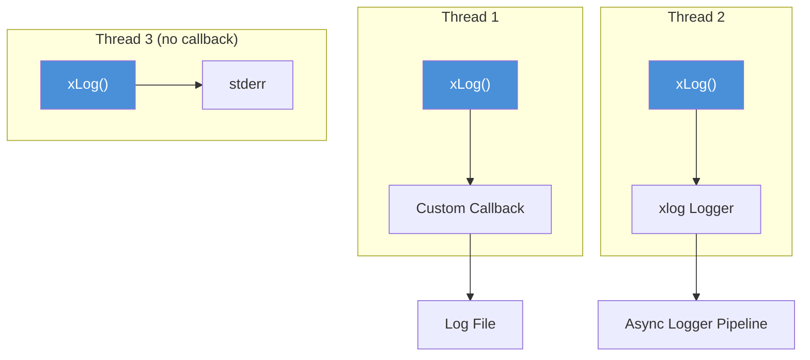
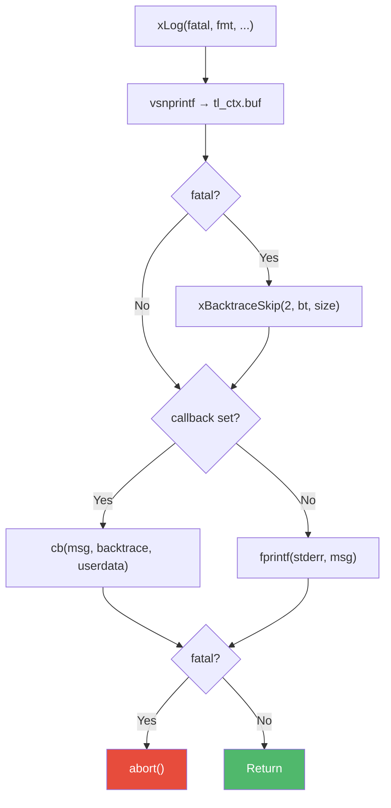

# log.h — Thread-Local Log Callback

## Introduction

`log.h` provides a per-thread, callback-based logging mechanism for moo's internal error reporting. Each thread can register its own log callback via `xLogSetCallback()`; when `xLog()` is called, the formatted message is dispatched to that callback. If no callback is registered, messages fall back to `stderr`. On fatal errors, a stack backtrace is captured and `abort()` is called.

## Design Philosophy

1. **Thread-Local Callbacks** — Each thread has its own log callback and userdata, stored in `__thread` (thread-local storage). This avoids global locks and allows different threads to route log messages to different destinations (e.g., the xlog async logger, a test harness, or a custom handler).

2. **Minimal and Non-Allocating** — `xLog()` formats into a fixed-size thread-local buffer (`XLOG_BUF_SIZE`, default 512 bytes). No heap allocation occurs during logging, making it safe to call from low-level code paths.

3. **Fatal with Backtrace** — When `fatal = true`, `xLog()` captures a stack trace via [`xBacktrace()`](backtrace.md) before calling `abort()`. This provides immediate diagnostic information for unrecoverable errors.

4. **Bridge to xlog** — The callback mechanism is designed to integrate with the higher-level [`xlog`](../log/index.html) module. The xlog logger registers itself as the thread's log callback, so internal moo errors are automatically routed through the async logging pipeline.

## Architecture



## API Reference

### Macros

| Macro | Default | Description |
| --- | --- | --- |
| `XLOG_BUF_SIZE` | 512 | Format buffer size in bytes. Override before including the header. |

### Types

| Type | Description |
| --- | --- |
| `xLogCallback` | `void (*)(const char *msg, const char *backtrace, void *userdata)` — Log callback. `backtrace` is non-NULL only on fatal. |

### Functions

| Function | Signature | Description | Thread Safety |
| --- | --- | --- | --- |
| `xLogSetCallback` | `void xLogSetCallback(xLogCallback cb, void *userdata)` | Register (or clear with NULL) the current thread's log callback. | Thread-local (each thread sets its own) |
| `xLog` | `void xLog(bool fatal, const char *fmt, ...)` | Format and dispatch a log message. If `fatal`, captures backtrace and calls `abort()`. | Thread-local (uses calling thread's callback) |

## Usage Examples

### Basic Logging with Custom Callback

```c
#include <stdio.h>
#include <x/base/log.h>

static void my_log_handler(const char *msg, const char *backtrace,
                            void *userdata) {
    FILE *f = (FILE *)userdata;
    fprintf(f, "[MyApp] %s\n", msg);
    if (backtrace) {
        fprintf(f, "Stack trace:\n%s", backtrace);
    }
}

int main(void) {
    // Route this thread's logs to a file
    FILE *logfile = fopen("app.log", "w");
    xLogSetCallback(my_log_handler, logfile);

    xLog(false, "Application started, version %d.%d", 1, 0);
    xLog(false, "Processing %d items", 42);

    // Clear callback (revert to stderr)
    xLogSetCallback(NULL, NULL);
    xLog(false, "This goes to stderr");

    fclose(logfile);
    return 0;
}
```

### Fatal Error with Backtrace

```c
#include <x/base/log.h>

void dangerous_operation(void) {
    // This will print the message, capture a backtrace, and abort()
    xLog(true, "Unrecoverable error: corrupted state detected");
    // Never reaches here
}
```

## Use Cases

1. **moo Internal Error Reporting** — All moo modules use `xLog()` to report internal errors (e.g., allocation failures, invalid states). By registering a callback, applications can capture these messages in their logging pipeline.

2. **xlog Integration** — The [`xlog`](../log/index.html) module registers its logger as the thread's callback via `xLogSetCallback()`, routing all internal moo messages through the async logging system.

3. **Test Frameworks** — Test harnesses can register a callback that captures log messages for assertion, rather than letting them go to stderr.

## Best Practices

- **Register callbacks early.** Set up `xLogSetCallback()` before calling any moo functions to ensure all messages are captured.
- **Don't block in callbacks.** The callback runs synchronously on the calling thread. Blocking delays the caller. For async logging, use the xlog module.
- **Handle NULL backtrace.** The `backtrace` parameter is NULL for non-fatal messages. Always check before using it.
- **Be aware of buffer truncation.** Messages longer than `XLOG_BUF_SIZE` are truncated. Increase the size at compile time if needed.

## Comparison with Other Libraries

| Feature | xbase log.h | syslog | fprintf(stderr) | GLib g_log |
| --- | --- | --- | --- | --- |
| **Callback** | Per-thread | Global handler | N/A | Global handler |
| **Thread Safety** | Thread-local (no locks) | Thread-safe (kernel) | Thread-safe (stdio lock) | Thread-safe (global lock) |
| **Backtrace** | Built-in on fatal | No | No | Optional (G_DEBUG) |
| **Allocation** | None (stack buffer) | None (kernel) | None (stdio buffer) | Heap (GString) |
| **Fatal Handling** | `abort()` with backtrace | N/A | N/A | `abort()` (G_LOG_FLAG_FATAL) |
| **Customization** | Per-thread callback | openlog() | Redirect fd | g_log_set_handler() |

**Key Differentiator:** xbase's log is designed as a lightweight internal error channel, not a full logging framework. Its per-thread callback design avoids global locks and integrates naturally with the xlog async logger for production use.

## Implementation Details

### Thread-Local State

```c
XDEF_STRUCT(xLogCtx) {
    xLogCallback cb;        // User callback (NULL = stderr fallback)
    void        *userdata;  // Forwarded to callback
    char         buf[XLOG_BUF_SIZE];   // Format buffer (512 bytes)
    char         bt[XLOG_BT_SIZE];     // Backtrace buffer (2048 bytes)
};

static __thread xLogCtx tl_ctx;
```

Each thread gets ~2.5 KB of thread-local storage for logging. The buffers are reused across calls, so there's no allocation overhead.

### xLog() Flow



### Buffer Size Configuration

The format buffer size can be overridden at compile time:

```c
#define XLOG_BUF_SIZE 1024  // Must be defined before #include <x/base/log.h>
#include <x/base/log.h>
```
