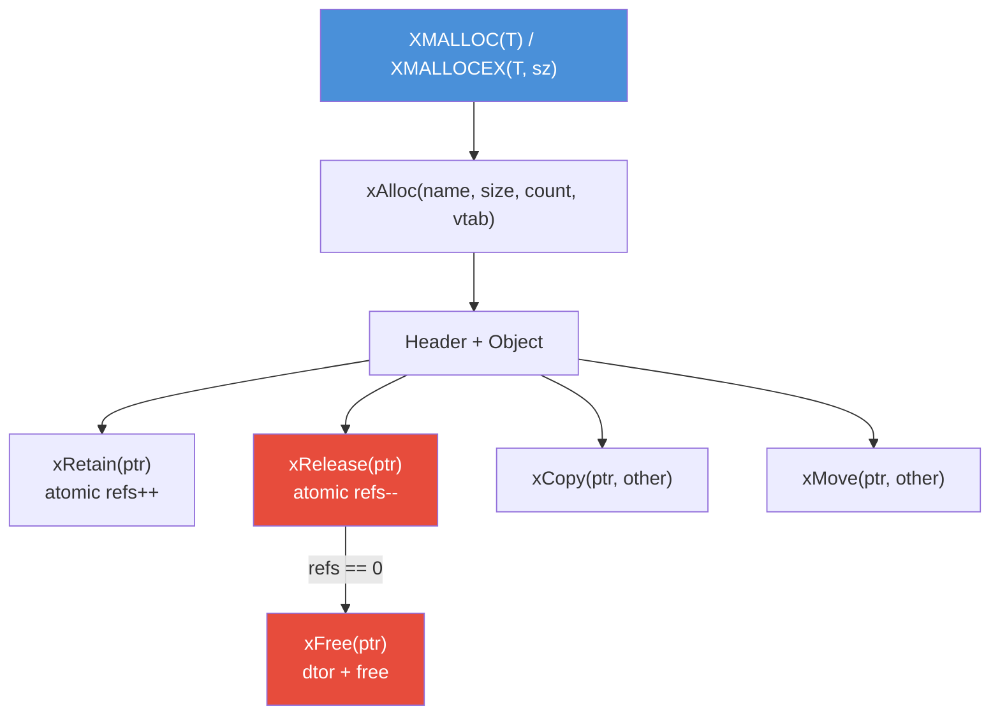
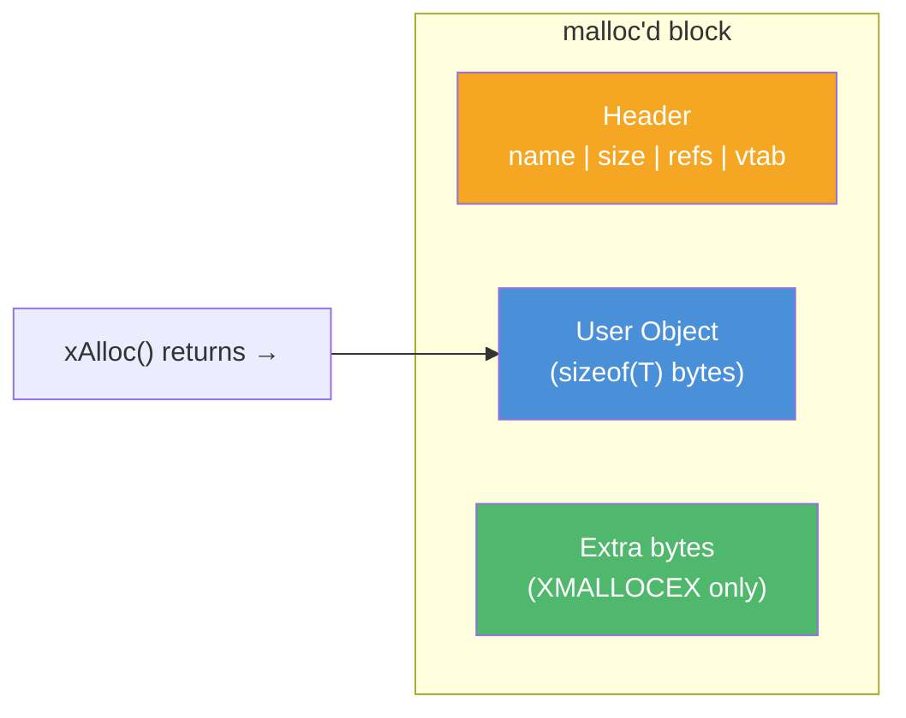
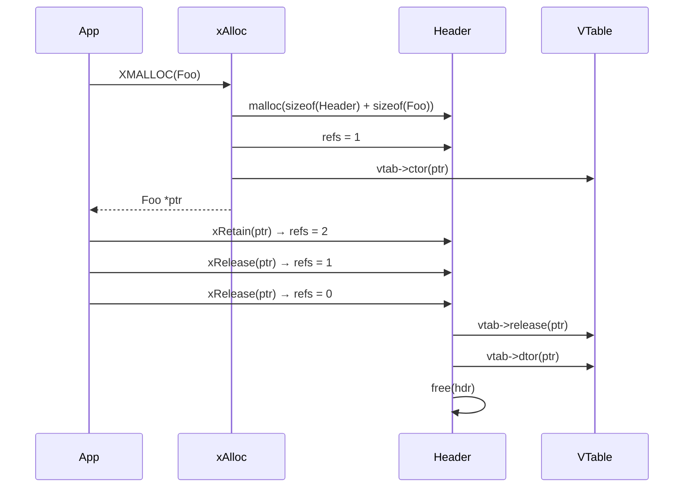

# memory.h — Reference-Counted Memory Management

## Introduction

`memory.h` provides a vtable-driven, reference-counted memory management system for C. It enables object lifecycle management (construction, destruction, retain, release, copy, move) through a virtual table pattern, bringing RAII-like semantics to pure C. The `XMALLOC(T)` macro allocates an object with an embedded header that tracks the reference count and vtable pointer.

## Design Philosophy

1. **vtable-Driven Lifecycle** — Each object type defines a static `xVTable` with optional function pointers for `ctor`, `dtor`, `retain`, `release`, `copy`, and `move`. This decouples lifecycle logic from the allocation mechanism, similar to C++ virtual destructors or Objective-C's class methods.

2. **Hidden Header Pattern** — A `Header` struct is prepended to every allocation, storing the type name (for debugging), size, reference count, and vtable pointer. The user receives a pointer past the header, so the header is invisible to normal usage.

3. **Atomic Reference Counting** — `xRetain()` and `xRelease()` use atomic operations (`__ATOMIC_SEQ_CST`) to safely manage reference counts across threads. When the count reaches zero, the destructor is called and memory is freed.

4. **Macro Convenience** — `XMALLOC(T)` and `XMALLOCEX(T, sz)` macros generate the correct `xAlloc()` call with the type name string, size, and vtable pointer, reducing boilerplate.

## Architecture



## API Reference

### Macros

| Macro | Expansion | Description |
| --- | --- | --- |
| `XDEF_VTABLE(T)` | `static xVTable TVTable =` | Define a static vtable for type T |
| `XDEF_CTOR(T)` | `static void TCtor(T *self)` | Define a constructor for type T |
| `XDEF_DTOR(T)` | `static void TDtor(T *self)` | Define a destructor for type T |
| `XMALLOC(T)` | `(T *)xAlloc("T", sizeof(T), 1, &TVTable)` | Allocate one T with vtable |
| `XMALLOCEX(T, sz)` | `(T *)xAlloc("T", sizeof(T) + sz, 1, &TVTable)` | Allocate T + extra bytes |

### Types

| Type | Description |
| --- | --- |
| `xVTable` | Struct with function pointers: `ctor`, `dtor`, `retain`, `release`, `copy`, `move` |

### Functions

| Function | Signature | Description | Thread Safety |
| --- | --- | --- | --- |
| `xAlloc` | `void *xAlloc(const char *name, size_t size, size_t count, xVTable *vtab)` | Allocate object(s) with header and call ctor. | Not thread-safe |
| `xFree` | `void xFree(void *ptr)` | Call dtor and free. Ignores NULL. | Not thread-safe |
| `xRetain` | `void xRetain(void *ptr)` | Increment reference count atomically. Calls vtab->retain if set. | **Thread-safe** |
| `xRelease` | `void xRelease(void *ptr)` | Decrement reference count atomically. Calls vtab->release then xFree when refs reach 0. | **Thread-safe** |
| `xCopy` | `void xCopy(void *ptr, void *other)` | Call vtab->copy if set. | Not thread-safe |
| `xMove` | `void xMove(void *ptr, void *other)` | Call vtab->move if set. | Not thread-safe |

## Usage Examples

### Basic Object with Constructor/Destructor

```c
#include <stdio.h>
#include <string.h>
#include <x/base/memory.h>

typedef struct Connection Connection;
struct Connection {
    int fd;
    char host[256];
};

XDEF_CTOR(Connection) {
    self->fd = -1;
    memset(self->host, 0, sizeof(self->host));
    printf("Connection created\n");
}

XDEF_DTOR(Connection) {
    if (self->fd >= 0) {
        // close(self->fd);
        printf("Connection closed (fd=%d)\n", self->fd);
    }
}

XDEF_VTABLE(Connection) {
    .ctor = ConnectionCtor,
    .dtor = ConnectionDtor,
};

int main(void) {
    Connection *conn = XMALLOC(Connection);
    conn->fd = 42;
    strcpy(conn->host, "example.com");

    xRetain(conn);   // refs = 2
    xRelease(conn);  // refs = 1
    xRelease(conn);  // refs = 0 → dtor called → freed

    return 0;
}
```

### Flexible Array Member with XMALLOCEX

```c
#include <stdio.h>
#include <string.h>
#include <x/base/memory.h>

typedef struct Buffer Buffer;
struct Buffer {
    size_t len;
    char   data[];  // flexible array member
};

XDEF_CTOR(Buffer) { self->len = 0; }
XDEF_DTOR(Buffer) { /* nothing to clean up */ }
XDEF_VTABLE(Buffer) { .ctor = BufferCtor, .dtor = BufferDtor };

int main(void) {
    // Allocate Buffer + 1024 extra bytes for data[]
    Buffer *buf = XMALLOCEX(Buffer, 1024);

    memcpy(buf->data, "Hello, moo!", 12);
    buf->len = 12;

    printf("Buffer: %.*s\n", (int)buf->len, buf->data);

    xRelease(buf); // refs 1 → 0 → freed
    return 0;
}
```

## Use Cases

1. **Shared Ownership** — Multiple components hold references to the same object (e.g., a connection shared between a reader and a writer). `xRetain`/`xRelease` ensures the object is freed only when the last reference is dropped.

2. **Plugin/Extension Objects** — Define vtables for different object types that share a common interface. The vtable pattern enables polymorphic behavior in C.

3. **Debug-Friendly Allocation** — The `name` field in the header enables allocation tracking and leak detection by type name.

## Best Practices

- **Always pair `xRetain` with `xRelease`.** Every retain must have a corresponding release, or you'll leak memory.
- **Use `XMALLOC` instead of raw `xAlloc`.** The macro handles type name, size, and vtable automatically.
- **Set unused vtable fields to NULL.** The implementation checks for NULL before calling each vtable function.
- **Don't mix with `free()`.** Objects allocated with `xAlloc` have a hidden header. Calling `free()` directly on the user pointer corrupts the heap.
- **Use `XMALLOCEX` for flexible array members.** It adds extra bytes after the struct for variable-length data.

## Comparison with Other Libraries

| Feature | xbase memory.h | C++ RAII | Objective-C ARC | GLib GObject |
| --- | --- | --- | --- | --- |
| **Mechanism** | vtable + atomic refcount | Destructor + smart pointers | Compiler-inserted retain/release | GType + refcount |
| **Automation** | Manual retain/release | Automatic (scope-based) | Automatic (compiler) | Manual ref/unref |
| **Thread Safety** | Atomic refcount | `shared_ptr` is atomic | Atomic | Atomic |
| **Polymorphism** | vtable function pointers | Virtual functions | Method dispatch | Signal/slot + vtable |
| **Overhead** | 1 header per object (~32 bytes) | 0 (stack) or control block | 1 isa pointer + refcount | Large (GTypeInstance) |
| **Flexible Arrays** | `XMALLOCEX(T, sz)` | `std::vector` | `NSMutableData` | `GArray` |
| **Debug Info** | Type name in header | RTTI | Class name | GType name |
| **Language** | C99 | C++ | Objective-C | C (with macros) |

**Key Differentiator:** xbase's memory system brings reference-counted lifecycle management to C with minimal overhead — just a 32-byte header per object. The vtable pattern provides extensibility (custom ctor/dtor/copy/move) without requiring a complex type system like GObject.

## Benchmark

> Environment: Apple M3 Pro, 36 GB RAM, macOS 26.4, Release build (`-O2`).
> Source: [`xbase/memory_bench.cpp`](https://github.com/mivinci/libx/blob/main/xbase/memory_bench.cpp)

| Benchmark | Size (bytes) | Time (ns) | CPU (ns) | Iterations |
| --- | ---: | ---: | ---: | ---: |
| `BM_Memory_XAlloc` | 16 | 23.3 | 23.3 | 29,809,940 |
| `BM_Memory_XAlloc` | 64 | 21.1 | 21.1 | 32,551,024 |
| `BM_Memory_XAlloc` | 256 | 22.4 | 22.4 | 31,207,508 |
| `BM_Memory_XAlloc` | 1,024 | 20.1 | 20.1 | 34,024,352 |
| `BM_Memory_XAlloc` | 4,096 | 24.2 | 24.2 | 29,002,681 |
| `BM_Memory_Malloc` | 16 | 17.5 | 17.5 | 39,883,995 |
| `BM_Memory_Malloc` | 64 | 18.7 | 18.7 | 37,576,831 |
| `BM_Memory_Malloc` | 256 | 19.0 | 19.0 | 34,505,536 |
| `BM_Memory_Malloc` | 1,024 | 23.0 | 23.0 | 30,557,144 |
| `BM_Memory_Malloc` | 4,096 | 17.7 | 17.7 | 39,849,483 |
| `BM_Memory_RetainRelease` | — | 3.90 | 3.90 | 183,068,277 |

**Key Observations:**

- **xAlloc vs malloc** overhead is only ~3–5ns across all sizes. The extra cost covers header initialization, vtable setup, and constructor invocation — negligible for most workloads.
- **Retain/Release** cycle takes ~3.9ns, dominated by the atomic increment/decrement. This is fast enough for hot-path reference counting.
- Allocation time is nearly constant across sizes (16B–4KB), confirming that the overhead is in the header management, not the underlying `malloc`.

## Implementation Details

### Memory Layout



The actual memory layout:

```plain
┌──────────────────────────────────────────────────────┐
│ Header (hidden)                                      │
│   const char *name   — type name string (e.g. "Foo") │
│   size_t      size   — sizeof(T)                     │
│   size_t      refs   — reference count (starts at 1) │
│   xVTable    *vtab   — pointer to static vtable      │
├──────────────────────────────────────────────────────┤
│ User Object (returned pointer)                       │
│   T fields...                                        │
│   [optional extra bytes from XMALLOCEX]              │
└──────────────────────────────────────────────────────┘
```

### XMALLOC / XMALLOCEX Macro Expansion

```c
// Given:
typedef struct Foo Foo;
struct Foo { int x; char buf[]; };

XDEF_VTABLE(Foo) { .ctor = FooCtor, .dtor = FooDtor };
XDEF_CTOR(Foo) { self->x = 0; }
XDEF_DTOR(Foo) { /* cleanup */ }

// XMALLOC(Foo) expands to:
(Foo *)xAlloc("Foo", sizeof(Foo), 1, &FooVTable)

// XMALLOCEX(Foo, 128) expands to:
(Foo *)xAlloc("Foo", sizeof(Foo) + 128, 1, &FooVTable)
```

### Reference Count Lifecycle



### Thread Safety

- `xRetain()` and `xRelease()` are **thread-safe** — they use `xAtomicAdd` / `xAtomicSub` with sequential consistency ordering.
- `xAlloc()`, `xFree()`, `xCopy()`, and `xMove()` are **not thread-safe** — they should be called from a single owner or with external synchronization.
