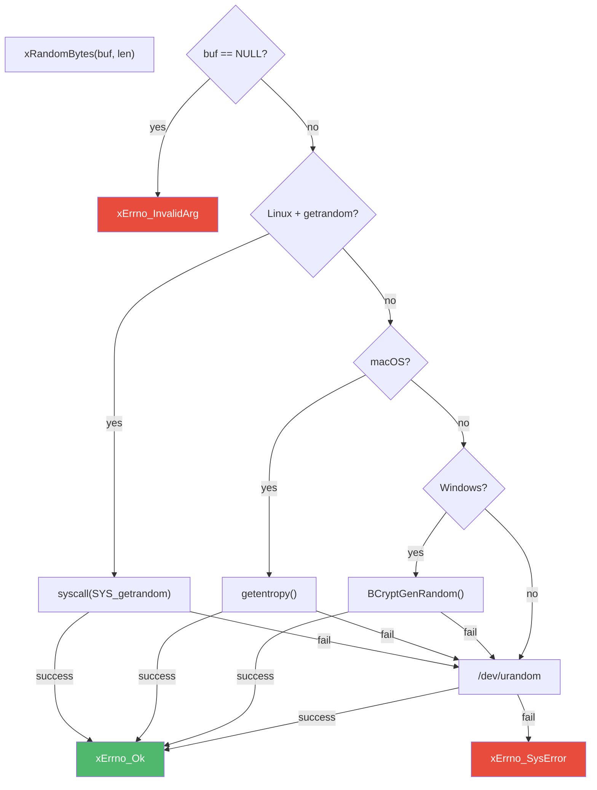

# random.h — Cross-Platform Secure Random

## Introduction

`random.h` provides `xRandomBytes()`, a cross-platform function for generating cryptographically secure random bytes. It uses platform-native APIs where available (`getrandom()` on Linux, `getentropy()` on macOS, `BCryptGenRandom()` on Windows), falling back to `/dev/urandom`. This is the randomness source used by the UUID module (`uuid.h`) for v4 (random) and v7 (time-ordered) generation.

## Design Philosophy

1. **Platform-Native First** — Prefers kernel-level CSPRNG APIs before falling back to file-based sources. This avoids file descriptor exhaustion in high-throughput scenarios.

2. **Strict Validation** — Returns `xErrno_InvalidArg` if `buf` is NULL. No silent failures.

3. **Loop for Success** — All backends loop on `EINTR` and partial reads. The function does not return until the buffer is fully populated or a fatal error occurs.

4. **No External Dependencies** — Pure POSIX / Win32 API. No OpenSSL, no mbedTLS, no threading.

## Architecture



## API Reference

### Functions

| Function | Signature | Description |
| --- | --- | --- |
| `xRandomBytes` | `xErrno xRandomBytes(void *buf, size_t len)` | Fill `buf` with `len` cryptographically secure random bytes. |

### Parameters

| Parameter | Description |
| --- | --- |
| `buf` | Destination buffer. Must not be NULL. |
| `len` | Number of random bytes to generate. 0 is valid (no-op). |

### Return Values

| Return | Description |
| --- | --- |
| `xErrno_Ok` | Success — `buf` filled with `len` random bytes. |
| `xErrno_InvalidArg` | `buf` is NULL. |
| `xErrno_SysError` | Platform call failed (e.g., `/dev/urandom` unreadable). |

## Usage Examples

### Generate a buffer of random bytes

```c
#include <x/base/random.h>

uint8_t buf[32];
xErrno err = xRandomBytes(buf, sizeof(buf));
if (err != xErrno_Ok) {
    // Handle platform failure
}
```

### Generate a random 64-bit integer

```c
uint64_t val;
xRandomBytes(&val, sizeof(val));
printf("%" PRIu64 "\n", val);
```

### Generate a random session token

```c
uint8_t token[16];
xRandomBytes(token, sizeof(token));

// Encode as hex
char hex[33];
for (int i = 0; i < 16; i++) {
    snprintf(hex + i * 2, 3, "%02x", token[i]);
}
```

## Best Practices

- **Check the return value** — `xErrno_Ok` guarantees the buffer is fully populated.
- **Zero is valid** — `xRandomBytes(buf, 0)` is a no-op and always succeeds.
- **No CSRF tokens from `xRandomBytes` alone** — Cryptographically secure bytes are a foundation; combine with application-level token management.
- **Use for seeds and secrets only** — This is a cryptographic-quality source. For non-security randomness, use C's `rand()` or a faster PRNG.

## Relationship with Other Modules

- **xcrypto** — [`uuid.h`](../crypto/uuid.md) depends on `xRandomBytes` to generate the random portions of UUID v4 and v7.
- **xbase** — Lives in xbase (no module dependencies). Uses only the error code system (`xErrno`).
