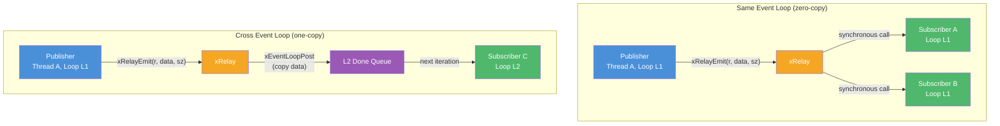

# relay.h — Event-Loop-Aware Pub/Sub Relay

## Introduction

`relay.h` provides a lightweight 1:N fan-out pub/sub primitive that lets modules communicate without direct coupling. A publisher calls `xRelayEmit()`; every subscriber that called `xRelayOn()` on the same relay handle receives the message.

What makes it different from a simple observer pattern is **event-loop-aware dispatch**:

- **Same event loop** — the subscriber callback fires synchronously, inline on the publisher's stack frame. Zero-copy, zero-allocation.
- **Different event loop** — the relay uses `xEventLoopPost()` to enqueue the callback onto the subscriber's loop. The payload is heap-copied once, and the subscriber receives it on the next iteration of its loop.

Named topics are implemented outside the relay — just keep relay handles as global or module-scoped variables. This keeps the relay itself minimal (no hash table, no string lookups).

## Design Philosophy

1. **Minimal Core** — The relay is just a subscriber list + a mutex. It doesn't own any queues, doesn't know about topics, and doesn't allocate in the hot same-loop path.

2. **Snapshot-and-Dispatch** — On emit, subscribers are snapshotted under the mutex into a stack array (for the common ≤16 case) or a heap array. Callback execution runs entirely outside the critical section, preventing deadlocks and keeping the lock contention window to ~100ns.

3. **Same-Loop Zero-Cost** — When publisher and subscriber share an event loop, data lives on the publisher's stack and callbacks fire synchronously. No allocation, no queue, no post.

4. **Cross-Loop One-Copy** — For subscribers on a different event loop, the relay allocates and copies the payload once. The copy is freed after the subscriber callback returns. This trades one heap allocation per cross-loop subscriber for memory safety across thread boundaries.

5. **Global Handles for Topic Namespacing** — Rather than embedding a topic string hash table inside the relay (which adds a lock and O(text) overhead to every emit), relay handles are kept as module-scoped variables. The module author declares `extern xRelay *g_temperature_relay;` and the `main()` function creates them — a pattern familiar from Qt's signal/slot and Unix domain sockets.

## Architecture



## API Reference

### Types

| Type | Description |
| --- | --- |
| `xRelay` | Opaque relay handle. Created by `xRelayCreate()`, destroyed by `xRelayDestroy()`. |
| `xRelayFunc` | `void (*)(void *data, void *arg)` — subscriber callback signature. |

### Functions

| Function | Signature | Description | Thread Safety |
| --- | --- | --- | --- |
| `xRelayCreate` | `xRelay *xRelayCreate(void)` | Create a new relay with zero subscribers. Returns heap-allocated handle. | **Thread-safe** (single-threaded creation) |
| `xRelayOn` | `void xRelayOn(xRelay *r, xRelayFunc fn, void *arg)` | Subscribe `fn` with `arg`. The current event loop is recorded. | **Thread-safe** |
| `xRelayOff` | `void xRelayOff(xRelay *r, xRelayFunc fn, void *arg)` | Remove the first subscriber matching `{fn, arg}`. No-op if not found. | **Thread-safe** |
| `xRelayEmit` | `void xRelayEmit(xRelay *r, const void *data, size_t size)` | Emit data to all subscribers. Same-loop callbacks fire synchronously; cross-loop callbacks are posted. | **Thread-safe** |
| `xRelayDestroy` | `void xRelayDestroy(xRelay *r)` | Free all subscribers and internal resources. Pending cross-loop dispatches are still delivered. | **Thread-safe** (single call) |

## Usage Examples

### Basic Same-Loop Pub/Sub

```c
#include <stdio.h>
#include <x/base/relay.h>
#include <x/base/event.h>

/* Global relay handle — created at startup. */
xRelay *g_sensor_relay;

/* Subscriber callback. */
static void on_reading(void *data, void *arg) {
    float *temp = (float *)data;
    const char *name = (const char *)arg;
    printf("[%s] Temperature: %.1f°C\n", name, temp);
}

/* Publisher. */
static void sensor_publish(void) {
    float reading = 23.5f;
    xRelayEmit(g_sensor_relay, &reading, sizeof(reading));
}

int main(void) {
    xEventLoop loop = xEventLoopCreate();
    xEventLoopEnter(loop);

    /* Create the relay. */
    g_sensor_relay = xRelayCreate();

    /* Modules subscribe — all on the same event loop. */
    xRelayOn(g_sensor_relay, on_reading, "Display");
    xRelayOn(g_sensor_relay, on_reading, "Logger");

    /* Publish — both callbacks fire synchronously here. */
    sensor_publish();

    xRelayDestroy(g_sensor_relay);
    xEventLoopLeave();
    xEventLoopDestroy(loop);
    return 0;
}
```

### Cross-Event-Loop Dispatch

```c
#include <stdio.h>
#include <pthread.h>
#include <x/base/relay.h>
#include <x/base/event.h>

xRelay *g_alarm_relay;

static void on_alarm(void *data, void *arg) {
    const char *msg = (const char *)data;
    printf("ALARM: %s\n", msg);
}

static void *bg_thread(void *arg) {
    /* Background thread has its own event loop. */
    xEventLoop bg_loop = xEventLoopCreate();
    xEventLoopEnter(bg_loop);

    /* Emit from the background loop — subscriber is on the main loop,
     * so the relay will copy the string and post it. */
    const char *msg = "Pressure too high!";
    xRelayEmit(g_alarm_relay, msg, strlen(msg) + 1);

    xEventLoopLeave();
    xEventLoopDestroy(bg_loop);
    return NULL;
}

int main(void) {
    xEventLoop main_loop = xEventLoopCreate();
    xEventLoopEnter(main_loop);

    g_alarm_relay = xRelayCreate();
    xRelayOn(g_alarm_relay, on_alarm, NULL);

    pthread_t thread;
    pthread_create(&thread, NULL, bg_thread, NULL);
    pthread_join(thread, NULL);

    /* The callback was posted to the main loop's done queue.
     * Run one iteration to drain it. */
    xEventLoopRun(main_loop, X_RUN_ONCE);

    xRelayDestroy(g_alarm_relay);
    xEventLoopLeave();
    xEventLoopDestroy(main_loop);
    return 0;
}
```

### Unsubscribing

```c
/* Register a subscriber that unsubscribes itself on the first emit. */
static xRelayFunc g_self_unsub;

static void on_first_only(void *data, void *arg) {
    xRelay *r = (xRelay *)arg;
    printf("First and only emit received.\n");
    /* Remove self — subsequent emits will not call this. */
    xRelayOff(r, g_self_unsub, r);
}

int main(void) {
    /* ... setup ... */
    xRelay *r = xRelayCreate();
    g_self_unsub = on_first_only;
    xRelayOn(r, g_self_unsub, r);

    int v = 0;
    xRelayEmit(r, &v, sizeof(v));  /* prints */
    xRelayEmit(r, &v, sizeof(v));  /* no-op: subscriber removed itself */

    xRelayDestroy(r);
    return 0;
}
```

## Best Practices

- **Create relays at startup, destroy at shutdown.** Relays are designed to live for the duration of the program. Avoid creating and destroying them in hot paths.

- **Subscribe during initialisation.** `xRelayOn()` is cheap but not free (one `calloc` + one mutex lock). Register all subscribers before entering the main loop.

- **Same-loop for latency-sensitive subscribers.** If a subscriber needs to react within microseconds of a publish, co-locate it on the same event loop to avoid the `xEventLoopPost` overhead.

- **Keep payloads small.** Cross-loop copies are `memcpy`-based. If your payload is multi-kilobyte or contains heap-allocated fields, wrap it in a heap-allocated struct and pass the pointer (the subscriber becomes responsible for freeing it).

- **`xRelayOff` before destroying a subscriber's loop.** If a subscriber's event loop is being torn down, unsubscribe first. Otherwise, a concurrent emit may `xEventLoopPost` to a destroyed loop.

- **Don't modify the subscriber list from within a callback on the same loop.** Subscribe/unsubscribe operations take a mutex and will block if the emit is holding it for the snapshot. This is safe (the mutex prevents deadlocks) but adds latency to the callback.

## Thread Safety

| Operation | Safety |
| --- | --- |
| `xRelayCreate` | Call once, single-threaded. |
| `xRelayOn` | Thread-safe. Can be called concurrently with `xRelayEmit` and other `xRelayOn` calls. |
| `xRelayOff` | Thread-safe. Can be called concurrently with `xRelayEmit` and other mutations. |
| `xRelayEmit` | Thread-safe. Can be called concurrently from multiple threads. |
| `xRelayDestroy` | Call once, after all other operations have ceased. |

## Implementation Details

### Data Structures

```c
/* Subscriber node — embedded in the relay's linked list. */
typedef struct xRelaySub_ {
    xList      node;   /* intrusive list node */
    xEventLoop loop;   /* snapshot from xRelayOn() */
    xRelayFunc fn;     /* subscriber callback */
    void      *arg;    /* opaque user pointer */
} xRelaySub_;

/* Cross-loop dispatch payload. Allocated once per cross-loop subscriber. */
typedef struct xRelayDispatch_ {
    xRelayFunc fn;     /* subscriber callback (copied) */
    void      *arg;    /* opaque user pointer (copied) */
    void      *data;   /* heap-copied payload */
} xRelayDispatch_;

/* The relay itself — two members. */
struct xRelay_ {
    xList  subs;       /* subscriber list head */
    xMutex lock;       /* serialises On/Off mutations */
};
```

### Emit Algorithm

1. **Count subscribers** under the mutex.
2. **Allocate snapshot array** — stack array for ≤16 subscribers, heap otherwise.
3. **Fill snapshot** under the mutex — pointer copies only, no data movement.
4. **Release the mutex** — the critical section is over (~100ns).
5. **Dispatch** — for each subscriber in the snapshot:
   - Same loop or NULL loop → call `sub->fn(data, sub->arg)` synchronously.
   - Different loop → `calloc` a `xRelayDispatch_`, copy data with `memcpy`, `xEventLoopPost`.

### Why Not an MPSC Queue?

The subscriber list is read-heavy (emit) and write-rarely (on/off). An MPSC queue would not help — subscribers need to be iterated, not consumed. The linked list + mutex combo is the right data structure for "persistent list, frequent full scans, occasional mutations."

### Why 16 Subscribers for the Stack Fast Path?

Most real-world relays have single-digit subscriber counts (display + logger + analytics). The 16-element stack array covers the common case without heap allocation, while the heap fallback handles the rare case of many subscribers without capping the total.

## Comparison with Related Primitives

| Feature | xRelay | xMpsc | xNote |
| --- | --- | --- | --- |
| **Pattern** | 1:N fan-out pub/sub | MPMC queue (single consumer) | 1:1 one-shot signal |
| **Buffering** | None (synchronous or posted) | Unbounded FIFO | None (single flag) |
| **Delivery** | Per-subscriber loop-aware | Single consumer pops | Waiter polls |
| **Allocation per emit** | 0 (same-loop), 1 per cross-loop sub | 0 (intrusive) | 0 |
| **Use case** | Cross-module events | Work queues, timer dispatch | Completion notification |
