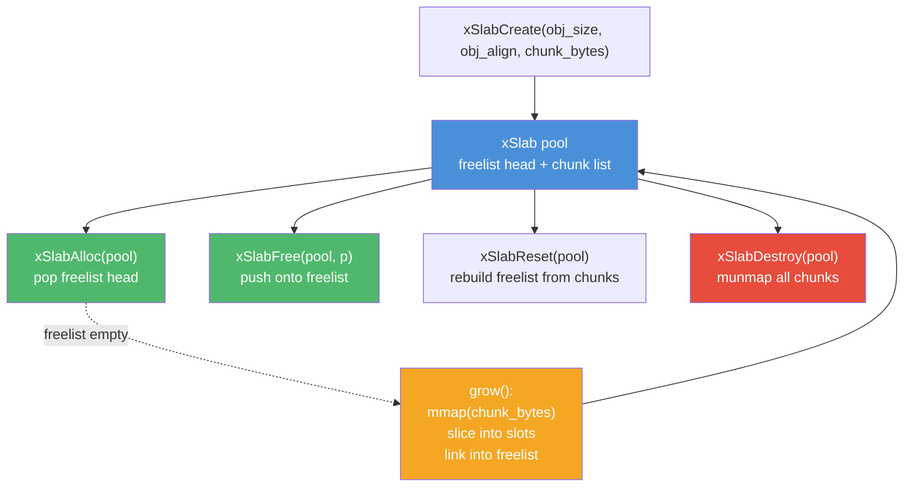
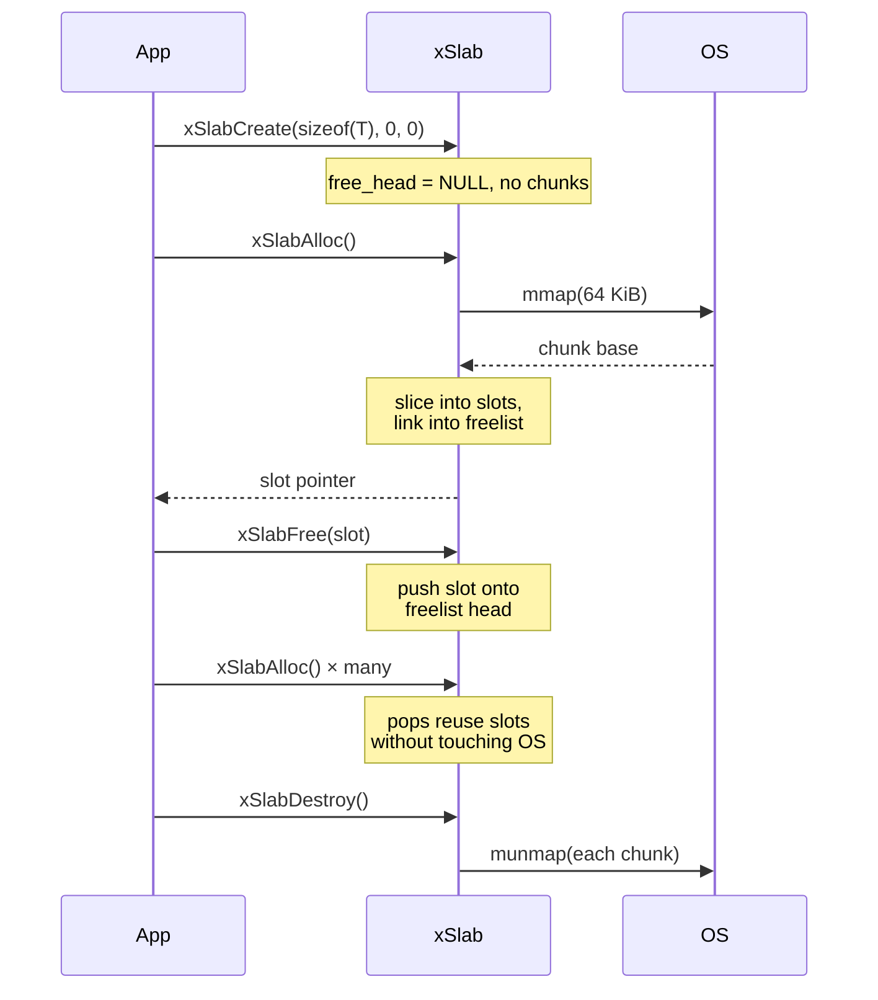

# slab.h — Fixed-Size Object Pool (Slab Allocator)

## Introduction

`slab.h` provides a fixed-size object pool that carves large OS-backed chunks into equally-sized slots and hands them out via an intrusive freelist. It is designed to replace the many small `calloc(1, sizeof(T))` / `free()` call sites scattered throughout xbase where objects are allocated and freed at very high frequency — event sources, timer entries, tree nodes, hash entries, task structs, and so on.

Two variants are provided behind a uniform API shape:

- `xSlab` — single-threaded, zero synchronisation overhead. Use this when the pool is owned by a single thread (e.g. a map backend or an event loop's internal bookkeeping).
- `xSlabMt` — multi-threaded. A plain LIFO freelist guarded by a short-held internal spinlock. Use this when allocations and frees may come from different threads (e.g. cross-thread task submission).

Both variants never return individual slots to the OS. Memory is released only when the pool itself is destroyed (or, for `xSlab`, explicitly reclaimed in bulk via `xSlabReset`).

## Design Philosophy

1. **Fixed Slot Size** — A pool is parameterised by `(obj_size, obj_align)` at create time. Every slot has identical layout, which lets allocation collapse to "pop the head of an intrusive freelist" and deallocation to "push onto that freelist" — both O(1) with zero metadata search.

2. **Chunk-Backed Growth** — When the freelist is empty the pool asks the OS for a contiguous chunk (default 64 KiB, configurable), slices it into slots, and links them into the freelist. Chunks are acquired through the platform's native anonymous mapping facility (`mmap` on POSIX, `VirtualAlloc` on Windows) and fall back to `malloc` where neither is available.

3. **Uninitialised Memory** — Slots are returned uninitialised; callers that previously relied on `calloc`'s zeroing must call `memset` explicitly. This removes a per-alloc cost that is often wasted when the caller overwrites the fields immediately.

4. **Configurable Alignment** — The default alignment is 16 bytes, which satisfies the requirements of SIMD and common atomic instructions. Callers with stricter requirements (e.g. cache-line alignment for false-sharing mitigation) can pass a larger power-of-two.

5. **Spinlock-Guarded Multi-Thread Path** — `xSlabMt` protects its freelist with a single short-held spinlock. An earlier lock-free Treiber-stack implementation had an ABA use-after-free hazard: user writes into the handed-out slot could overlap with a preempted popper's stale `next` snapshot, so the CAS could publish a garbage pointer as the new head. Replacing the Treiber stack with a spinlock eliminates the hazard at the cost of mild contention above four threads — a trade-off that is invisible to xbase's actual consumers (timer/task submission) and documented honestly in the benchmark section.

6. **No Header Per Slot** — Unlike general-purpose allocators, the pool stores no per-slot metadata (no size, no cookie). The only per-slot state is the intrusive freelist pointer, which occupies the slot itself while it is free.

## Architecture



## API Reference

### Constants

| Macro | Value | Description |
| --- | --- | --- |
| `XSLAB_DEFAULT_ALIGN` | `16` | Default slot alignment when `obj_align == 0` |
| `XSLAB_DEFAULT_CHUNK_BYTES` | `64 * 1024` | Default chunk size when `chunk_bytes == 0` |

### Types

| Type | Description |
| --- | --- |
| `xSlab` | Opaque handle to a single-threaded pool |
| `xSlabMt` | Opaque handle to a multi-threaded pool |

### Functions — xSlab (single-threaded)

| Function | Signature | Description |
| --- | --- | --- |
| `xSlabCreate` | `xSlab *xSlabCreate(size_t obj_size, size_t obj_align, size_t chunk_bytes)` | Create a pool. `0` selects defaults for align/chunk. Returns NULL on invalid args or OOM. |
| `xSlabDestroy` | `void xSlabDestroy(xSlab *s)` | Release all chunks. All outstanding slots become invalid. NULL is a no-op. |
| `xSlabAlloc` | `void *xSlabAlloc(xSlab *s)` | Return one uninitialised slot of `obj_size` bytes at `obj_align`. NULL on OOM. |
| `xSlabFree` | `void xSlabFree(xSlab *s, void *p)` | Return a slot to the pool. NULL is a no-op. The slot must not be touched afterward. |
| `xSlabReset` | `void xSlabReset(xSlab *s)` | Bulk-reclaim every slot without freeing chunks. Caller must guarantee no slot is live. |
| `xSlabInUse` | `size_t xSlabInUse(const xSlab *s)` | Number of slots currently handed out. |
| `xSlabSlotSize` | `size_t xSlabSlotSize(const xSlab *s)` | Configured slot size (after alignment rounding). |

### Functions — xSlabMt (multi-threaded)

| Function | Signature | Description |
| --- | --- | --- |
| `xSlabMtCreate` | `xSlabMt *xSlabMtCreate(size_t obj_size, size_t obj_align, size_t chunk_bytes)` | Create a thread-safe pool. Same parameter semantics as `xSlabCreate`. |
| `xSlabMtDestroy` | `void xSlabMtDestroy(xSlabMt *s)` | Release all chunks. Caller must externally quiesce all users first. |
| `xSlabMtAlloc` | `void *xSlabMtAlloc(xSlabMt *s)` | Thread-safe alloc. Lock-free fast path (CAS on freelist head). |
| `xSlabMtFree` | `void xSlabMtFree(xSlabMt *s, void *p)` | Thread-safe free. Lock-free fast path. |
| `xSlabMtSlotSize` | `size_t xSlabMtSlotSize(const xSlabMt *s)` | Configured slot size. |

## Usage Examples

### Single-threaded: tree node pool

```c
#include <stdlib.h>
#include <string.h>
#include <x/base/slab.h>

typedef struct Node Node;
struct Node {
    Node  *left, *right;
    int    key;
    void  *value;
};

int main(void) {
    // One slot per Node, default 16-byte alignment, default 64 KiB chunks.
    xSlab *pool = xSlabCreate(sizeof(Node), 0, 0);

    Node *root = xSlabAlloc(pool);
    memset(root, 0, sizeof(*root));  // slab does not zero
    root->key = 42;

    // ... manipulate tree, allocate more nodes, free when removing ...

    xSlabFree(pool, root);
    xSlabDestroy(pool);  // releases every chunk at once
    return 0;
}
```

### Multi-threaded: cross-thread task structs

```c
#include <x/base/slab.h>

static xSlabMt *g_task_pool;

void task_pool_init(void) {
    g_task_pool = xSlabMtCreate(sizeof(struct Task), 0, 0);
}

struct Task *task_alloc(void) {
    struct Task *t = xSlabMtAlloc(g_task_pool);
    memset(t, 0, sizeof(*t));
    return t;
}

void task_free(struct Task *t) {
    xSlabMtFree(g_task_pool, t);  // safe from any thread
}

void task_pool_shutdown(void) {
    xSlabMtDestroy(g_task_pool);  // caller must have quiesced all workers
}
```

### Bulk reclaim with xSlabReset

```c
// Event loop shuts down — every event source is about to be destroyed.
// Rather than freeing sources one by one, reset the pool in O(chunks):
xSlabReset(loop->source_pool);
// Pool keeps its chunks, ready to be reused when the loop restarts.
```

## Use Cases

1. **High-Frequency Small Allocations** — Timer entries, event sources, map nodes, task structs. Anything that used to be a `calloc(1, sizeof(T))` in a hot path is a candidate.

2. **Uniform-Size Containers** — A hash/tree map with fixed-size nodes is a perfect fit: every node has the same layout, and deletions recycle through the freelist immediately.

3. **Phase-Scoped Arenas via `xSlabReset`** — When an entire subsystem is torn down, `xSlabReset` returns every slot at once without any per-slot bookkeeping. Combined with non-destructive teardown, it enables arena-style lifetimes in C.

4. **Cross-Thread Object Recycling** — `xSlabMt` is the right tool when producers on one thread allocate objects that consumers on another thread eventually free. The short-held spinlock avoids the general-purpose allocator's size-class lookup and the bookkeeping overhead of per-thread caches.

## Best Practices

- **Pick the right variant.** If a pool is touched by only one thread, use `xSlab` — its fast path is a plain load/store with no synchronisation. Reach for `xSlabMt` only when you actually cross threads.
- **Zero explicitly if you need zeroing.** Slots come back uninitialised. Do `memset(p, 0, xSlabSlotSize(pool))` if your code previously depended on `calloc`.
- **Match each slot size to one type.** Don't mix differently-sized objects in the same pool; create separate pools per type. Slot size is fixed at create time.
- **Don't mix with `free()`.** Slots are carved from a chunk; they are not independently freeable. Always use `xSlabFree` / `xSlabMtFree`.
- **Destroy invalidates everything.** After `xSlabDestroy`, every slot the pool ever handed out is dangling. Make sure lifetime containment is obvious at the call site.
- **Reset is a footgun.** `xSlabReset` does not run any destructor — only call it when you are certain every slot is either already cleaned up or safely discardable.

## Comparison with Other Approaches

| Feature | xSlab / xSlabMt | `malloc` / `free` | Thread-local freelist | C++ `std::pmr::pool_resource` |
| --- | --- | --- | --- | --- |
| **Slot size** | Fixed per pool | Arbitrary | Fixed per freelist | Fixed per pool |
| **Alloc fast path** | Load + store (ST) / spinlock + load-store (MT) | Size-class lookup + lock | Load + store, but only same thread | Size-class lookup |
| **Cross-thread free** | `xSlabMt` supports it | Yes (slow path) | No (must return to origin) | Depends on upstream |
| **Per-slot header** | None | Typically 8–16 bytes | None | Implementation-defined |
| **OS syscall rate** | One `mmap` per chunk (64 KiB) | Many `mmap`/`sbrk` depending on impl | None (built on `malloc`) | Depends on upstream |
| **Bulk reclaim** | `xSlabReset` (O(chunks)) | No | No | `release()` |
| **Returns memory to OS** | Only on `Destroy` | Depends on impl | No | On `release()` |

**Key Differentiator:** xSlab trades generality (fixed slot size, no per-slot size/type info) for a predictable, extremely cheap fast path and a single `munmap` per chunk at shutdown. For containers whose nodes are uniform, that trade is almost always worth it.

## Benchmark

> Environment: Apple Mac15,7 (12 cores), 36 GB RAM, macOS 26.x, Release build (`-O2`). Each result is the median of 3 repetitions (`--benchmark_min_time=1.0s --benchmark_repetitions=3 --benchmark_report_aggregates_only=true`).
> Source: [`xbase/slab_bench.cpp`](https://github.com/mivinci/libx/blob/main/x/base/slab_bench.cpp)

### Single-Threaded Alloc + Free

| Benchmark | Time (ns) | Notes |
| --- | ---: | --- |
| `BM_Slab_AllocFree` | **2.58** | `xSlabAlloc` + `xSlabFree`, 32-byte slots |
| `BM_Malloc_AllocFree` | 18.9 | `malloc` + `free`, 32 bytes |
| `BM_Calloc_AllocFree` | 16.9 | `calloc` + `free`, 32 bytes |

Single-threaded allocation is **~7.3× faster** than `malloc` and **~6.5× faster** than `calloc`. The slab fast path is a single load + store on the freelist head; `malloc` must traverse its size-class table and take at least one internal lock even on macOS.

### Batched Alloc + Free (Single-Threaded)

| Benchmark | Batch | Time (ns) | Slab vs malloc |
| --- | ---: | ---: | --- |
| `BM_Slab_Batch` | 16 | 37.9 | |
| `BM_Malloc_Batch` | 16 | 287 | slab **7.6× faster** |
| `BM_Slab_Batch` | 256 | 590 | |
| `BM_Malloc_Batch` | 256 | 4,409 | slab **7.5× faster** |
| `BM_Slab_Batch` | 4,096 | 15,236 | |
| `BM_Malloc_Batch` | 4,096 | 73,612 | slab **4.8× faster** |

The gap narrows somewhat at 4K slots because the first chunk (64 KiB / 32 B = 2,048 slots) fills up and a second chunk must be carved — a one-shot `mmap` cost amortised across the remaining slots. Steady-state performance still matches the single-op numbers above.

### Multi-Threaded Alloc + Free

| Threads | `xSlabMt` (ns) | `malloc` (ns) | Winner |
| ---: | ---: | ---: | --- |
| 1 | **9.79** | 18.8 | slab **1.9× faster** |
| 2 | ~80 | 91.3 | roughly tied |
| 4 | 540 | **476** | malloc **1.1× faster** |
| 8 | ~1,100 | **46.4** | macOS malloc much faster |

The crossover above four threads is real and worth understanding:

- `xSlabMt` serialises allocations through a single spinlock. With many threads doing nothing but alloc/free in a tight loop the critical section becomes a contention hotspot.
- macOS's `malloc` (libmalloc's nano zone) maintains **per-thread caches** that are essentially uncontended up to the small-allocation size class, so 8 threads rarely touch any shared state.

The earlier PR shipped a lock-free Treiber-stack variant that benched a bit faster at four threads but had an ABA hazard around the user-writable first word of a popped slot. The hazard is fundamental to a word-width CAS without a tag, and the spinlock is a clean, portable fix. In practice xSlabMt's usage inside xbase (task/timer/event bookkeeping) allocates at a rate where the lock is rarely contended — timer/task benchmarks elsewhere in these docs still show ~2× gains over the previous `malloc`/TLS-freelist implementations. If you have a workload with eight or more threads each churning small allocations back-to-back with no other work, put a per-thread cache in front of `xSlabMt`.

**Key Observations:**

- **Single-threaded allocation is 7× faster than `malloc`.** This is the primary win; it applies to every map backend, timer heap node, and event-loop bookkeeping struct.
- **Multi-threaded allocation is faster than `malloc` up to ~2 threads** and within the same order of magnitude at four. This matches the concurrency envelope of xTask/xTimer under typical xbase workloads, where the downstream wins (SubmitCancel ~2× faster, FanOut throughput ~2× higher) are driven by eliminating `calloc` in the submission path rather than by the raw allocator being the fastest at high thread counts.
- **Zero-init is not free.** `BM_Calloc_AllocFree` is ~10% faster than `malloc` on macOS because libmalloc short-circuits zeroing for freshly-`mmap`ed pages. For pre-used memory callers should still `memset`.
- **Bulk `xSlabReset` is O(chunks)** and can reclaim 64 KiB worth of slots per chunk in a single loop pass — far cheaper than individual frees when tearing a subsystem down.

## Integration Status

Within xbase, the following modules have been migrated from `calloc` to the slab allocator:

| Module | Variant | Slot | Rationale |
| --- | --- | --- | --- |
| `map.c` (hash + tree backends) | `xSlab` | hash entry / tree node | map operations are single-threaded; nodes are uniform-size. |
| `timer.c` | `xSlabMt` | `xTimerTask_` | timer submission is cross-thread; push-mode hands the entry to the task pool. |
| `task.c` | `xSlabMt` | `xTask_` | task structs are freed on worker threads after execution. |

See the respective module documents for benchmarks of the integrated paths.

## Implementation Details

### Memory Layout

Each chunk is a single OS-backed mapping of at least `chunk_bytes` rounded up to hold an integral number of slots. Slots are laid out back-to-back at the configured alignment; the chunk header itself is embedded at the start of the mapping and linked into the pool's chunk list for later release.

```plain
chunk (64 KiB default)
┌──────────────────────────────────────────────────────────────┐
│ chunk header (next pointer, size)                            │
├───────┬───────┬───────┬───────┬───────┬───────┬─────┬────────┤
│ slot0 │ slot1 │ slot2 │ slot3 │ slot4 │  ...  │ ... │ slotN  │
└───┬───┴───┬───┴───┬───┴───┬───┴───┬───┴───────┴─────┴────────┘
    │       │       │       │       │
    └───────┴───────┴───────┴───────┘  (free slots chained via
                                        first word of each slot)

        pool.free_head ─► slotK ─► slotJ ─► ... ─► NULL
```

A free slot's first word is the pointer to the next free slot (intrusive list). Once handed out, that same word becomes part of the caller's object and can be used freely; on `xSlabFree` the pool overwrites it again to stitch the slot back into the freelist.

### Fast-Path Operations

```c
// xSlabAlloc — single-threaded
if (pool->free_head == NULL) grow(pool);
slot = pool->free_head;
pool->free_head = *(void **)slot;
return slot;

// xSlabFree — single-threaded
*(void **)slot = pool->free_head;
pool->free_head = slot;
```

`xSlabMt` performs the same two-instruction sequence inside a spinlock:

```c
// xSlabMt — multi-threaded
spin_lock(&pool->lock);
if (pool->free_head == NULL) grow(pool);       // under the same lock
slot = pool->free_head;
pool->free_head = *(void **)slot;
spin_unlock(&pool->lock);
return slot;
```

The lock also covers `grow()` (OS mapping + freelist seeding) so only one thread can call into the OS at a time. The spinlock uses `xAtomicCasWeak` to acquire and `xAtomicStore(release)` to release.

### Lifecycle



### Thread Safety

| Function | `xSlab` | `xSlabMt` |
| --- | --- | --- |
| `Create` / `Destroy` | Not thread-safe | Not thread-safe (caller must quiesce) |
| `Alloc` / `Free` | Not thread-safe | **Thread-safe** (spinlock-guarded) |
| `Reset` | Not thread-safe | N/A — `xSlabMt` has no bulk reclaim |
| `InUse` / `SlotSize` | Not thread-safe read | `SlotSize` is a constant read, safe after create |
