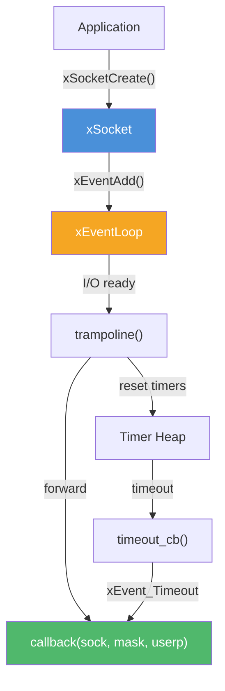
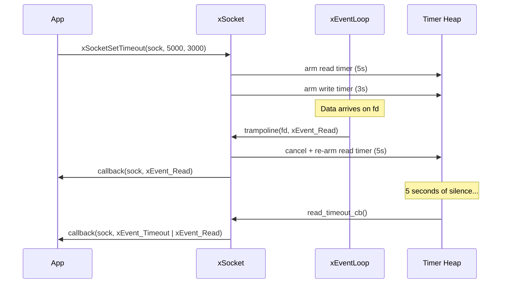

# socket.h — Async Socket

## Introduction

`socket.h` provides an async socket abstraction built on top of [`event.h`](event.md). It wraps the POSIX socket API with automatic non-blocking setup, event loop registration, and idle-timeout support. When a socket becomes readable, writable, or times out, a single unified callback is invoked with the appropriate event mask. The event loop is obtained implicitly from the current thread context via `xEventLoopCurrent()`.

## Design Philosophy

1. **Thin Wrapper, Not a Framework** — `xSocket` adds just enough abstraction to eliminate boilerplate (non-blocking setup, `FD_CLOEXEC`, event registration) without hiding the underlying fd. You can always retrieve the raw fd via `xSocketFd()` for direct system calls.

2. **Idle-Timeout Semantics** — Read and write timeouts are reset on every corresponding I/O event, implementing idle-timeout behavior. This is ideal for detecting dead connections: if no data arrives within the timeout period, the callback fires with `xEvent_Timeout`.

3. **Unified Callback** — A single `xSocketFunc` callback handles all events (read, write, timeout). The `mask` parameter tells you what happened, and the `xEvent_Timeout` flag is OR'd with `xEvent_Read` or `xEvent_Write` to indicate which direction timed out.

4. **Implicit Event Loop** — All functions obtain the event loop from thread-local storage via `xEventLoopCurrent()`. The caller must call `xEventLoopEnter(loop)` before using any socket API.

## Architecture



## API Reference

### Types

| Type | Description |
| --- | --- |
| `xSocket` | Opaque handle to an async socket |
| `xSocketFunc` | `void (*)(xSocket sock, xEventMask mask, void *arg)` — Socket event callback |

### Functions

| Function | Signature | Description | Thread Safety |
| --- | --- | --- | --- |
| `xSocketCreate` | `xSocket xSocketCreate(int family, int type, int protocol, xEventMask mask, xSocketFunc callback, void *userp)` | Create a non-blocking socket and register with the event loop. | Not thread-safe |
| `xSocketCreateFromFd` | `xSocket xSocketCreateFromFd(int fd, xEventMask mask, xSocketFunc callback, void *userp)` | Wrap an existing fd into an xSocket. | Not thread-safe |
| `xSocketDestroy` | `void xSocketDestroy(xSocket sock)` | Cancel timers, remove from event loop, close fd, free handle. Safe with NULL. | Not thread-safe |
| `xSocketSetMask` | `xErrno xSocketSetMask(xSocket sock, xEventMask mask)` | Change the watched event mask. | Not thread-safe |
| `xSocketSetTimeout` | `xErrno xSocketSetTimeout(xSocket sock, int read_timeout_ms, int write_timeout_ms)` | Set idle timeouts. Pass 0 to cancel. Replaces previous settings. | Not thread-safe |
| `xSocketSetCallback` | `xErrno xSocketSetCallback(xSocket sock, xSocketFunc callback, void *userp)` | Replace the callback and user data. | Not thread-safe |
| `xSocketFd` | `int xSocketFd(xSocket sock)` | Return the underlying fd, or -1 if NULL. | Thread-safe (read-only) |
| `xSocketMask` | `xEventMask xSocketMask(xSocket sock)` | Return the current event mask, or 0 if NULL. | Thread-safe (read-only) |

### Callback Mask Values

| Mask | Meaning |
| --- | --- |
| `xEvent_Read` | Socket is readable |
| `xEvent_Write` | Socket is writable |
| `xEvent_Timeout \| xEvent_Read` | Read idle timeout fired |
| `xEvent_Timeout \| xEvent_Write` | Write idle timeout fired |

## Usage Examples

### TCP Echo Client with Timeout

```c
#include <stdio.h>
#include <string.h>
#include <unistd.h>
#include <arpa/inet.h>
#include <x/base/socket.h>

static void on_socket(xSocket sock, xEventMask mask, void *arg) {
    xEventLoop loop = (xEventLoop)arg;

    if (mask & xEvent_Timeout) {
        printf("Timeout on %s\n",
               (mask & xEvent_Read) ? "read" : "write");
        xSocketDestroy(sock);
        xEventLoopStop(loop);
        return;
    }

    if (mask & xEvent_Read) {
        char buf[1024];
        ssize_t n;
        while ((n = read(xSocketFd(sock), buf, sizeof(buf))) > 0) {
            printf("Received: %.*s\n", (int)n, buf);
        }
    }

    if (mask & xEvent_Write) {
        const char *msg = "Hello, server!";
        write(xSocketFd(sock), msg, strlen(msg));
        // Switch to read-only after sending
        xSocketSetMask(sock, xEvent_Read);
    }
}

int main(void) {
    xEventLoop loop = xEventLoopCreate();
    xEventLoopEnter(loop);

    xSocket sock = xSocketCreate(AF_INET, SOCK_STREAM, 0,
                                  xEvent_Write, on_socket, loop);
    if (!sock) return 1;

    // Set 5-second read idle timeout
    xSocketSetTimeout(sock, 5000, 0);

    // Connect (non-blocking)
    struct sockaddr_in addr = {
        .sin_family = AF_INET,
        .sin_port   = htons(8080),
    };
    inet_pton(AF_INET, "127.0.0.1", &addr.sin_addr);
    connect(xSocketFd(sock), (struct sockaddr *)&addr, sizeof(addr));

    xEventLoopRun(loop, X_RUN_DEFAULT);
    xEventLoopLeave();
    xEventLoopDestroy(loop);
    return 0;
}
```

### UDP Receiver with Idle Timeout

```c
#include <stdio.h>
#include <unistd.h>
#include <arpa/inet.h>
#include <x/base/socket.h>

static void on_udp(xSocket sock, xEventMask mask, void *arg) {
    xEventLoop loop = (xEventLoop)arg;

    if (mask & xEvent_Timeout) {
        printf("No data for 10 seconds, shutting down.\n");
        xSocketDestroy(sock);
        xEventLoopStop(loop);
        return;
    }

    if (mask & xEvent_Read) {
        char buf[65536];
        ssize_t n;
        while ((n = read(xSocketFd(sock), buf, sizeof(buf))) > 0) {
            printf("UDP: %.*s\n", (int)n, buf);
        }
    }
}

int main(void) {
    xEventLoop loop = xEventLoopCreate();
    xEventLoopEnter(loop);

    xSocket sock = xSocketCreate(AF_INET, SOCK_DGRAM, 0,
                                  xEvent_Read, on_udp, loop);

    struct sockaddr_in addr = {
        .sin_family = AF_INET,
        .sin_port   = htons(9999),
        .sin_addr.s_addr = INADDR_ANY,
    };
    bind(xSocketFd(sock), (struct sockaddr *)&addr, sizeof(addr));

    // 10-second read idle timeout
    xSocketSetTimeout(sock, 10000, 0);

    xEventLoopRun(loop, X_RUN_DEFAULT);
    xEventLoopLeave();
    xEventLoopDestroy(loop);
    return 0;
}
```

## Use Cases

1. **Network Servers** — Create listening sockets, accept connections, and manage each client with its own `xSocket` + idle timeout. Dead connections are automatically detected.

2. **Protocol Clients** — Build async clients (HTTP, Redis, etc.) that connect, send requests, and wait for responses with timeout protection.

3. **Real-Time Data Feeds** — Monitor UDP multicast sockets with idle timeouts to detect feed outages.

## Best Practices

- **Always drain in edge-triggered mode.** Since the underlying event loop is edge-triggered, read/write until `EAGAIN` in every callback.
- **Use idle timeouts for connection health.** Set `read_timeout_ms` to detect dead peers. The timeout resets automatically on each read event.
- **Call `xEventLoopEnter(loop)` before using socket API.** All socket functions use `xEventLoopCurrent()` internally to obtain the event loop.
- **Check the timeout direction.** When `xEvent_Timeout` fires, check `mask & xEvent_Read` vs. `mask & xEvent_Write` to know which direction timed out.
- **Don't close the fd manually.** `xSocketDestroy()` closes it for you. Closing it separately leads to double-close bugs.

## Comparison with Other Libraries

| Feature | xbase socket.h | POSIX socket API | libuv `uv_tcp_t` | Boost.Asio |
| --- | --- | --- | --- | --- |
| **Non-blocking Setup** | Automatic (`SOCK_NONBLOCK` + `FD_CLOEXEC`) | Manual (`fcntl`) | Automatic | Automatic |
| **Event Registration** | Automatic (via `xEventLoop`) | Manual (`epoll_ctl` / `kevent`) | Automatic | Automatic |
| **Idle Timeout** | Built-in (`xSocketSetTimeout`) | Manual (timer + bookkeeping) | Manual (`uv_timer`) | Manual (`deadline_timer`) |
| **Callback Style** | Single unified callback with mask | N/A (blocking or manual poll) | Separate read/write callbacks | Separate handlers |
| **Raw fd Access** | `xSocketFd()` | Direct | `uv_fileno()` | `native_handle()` |
| **Buffered I/O** | No (raw fd) | No | Yes (`uv_read_start`) | Yes (async_read) |
| **Platform** | macOS + Linux | POSIX | Cross-platform | Cross-platform |

**Key Differentiator:** xbase's socket abstraction is intentionally thin — it handles the boilerplate (non-blocking, event registration, idle timeout) but leaves data reading/writing to the caller via the raw fd. This gives maximum flexibility without imposing a buffering strategy.

## Implementation Details

### Internal Structure

```c
struct xSocket_ {
    int              fd;               // Underlying file descriptor
    xEventSource     source;           // Registered event source
    xEventMask       mask;             // Current event mask
    xSocketFunc      callback;         // User callback
    void            *userp;            // User data
    xTimer           read_timer;       // Read idle timeout timer
    xTimer           write_timer;      // Write idle timeout timer
    int              read_timeout_ms;  // Read timeout setting (0 = disabled)
    int              write_timeout_ms; // Write timeout setting (0 = disabled)
};
```

### Trampoline Pattern

The socket registers an internal `trampoline()` function as the event callback with the event loop. This trampoline:

1. **Resets idle timers** — On `xEvent_Read`, cancels and re-arms the read timer. On `xEvent_Write`, cancels and re-arms the write timer.
2. **Forwards to user callback** — Calls `callback(sock, mask, userp)` with the original event mask.

This ensures idle timers are always reset transparently, without requiring the user to manage them manually.

### Socket Creation

`xSocketCreate()` performs these steps atomically:

1. `socket(family, type, protocol)` — On Linux/BSD with `SOCK_CLOEXEC | SOCK_NONBLOCK`, both flags are set in one syscall. On other platforms, `fcntl()` is used as a fallback.
2. `xEventAdd(fd, mask, trampoline, socket)` — Registers with the event loop (obtained via `xEventLoopCurrent()`).
3. Returns the opaque `xSocket` handle.

### Timeout Mechanism


