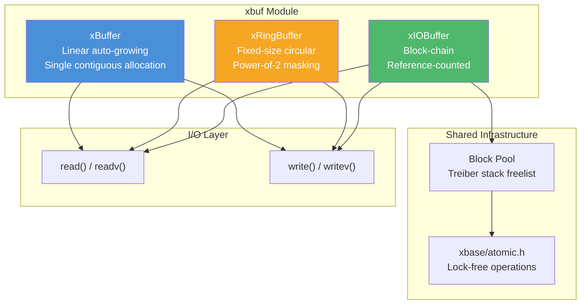

# xbuf — Buffer Toolkit

## Introduction

**xbuf** is moo's buffer module, providing three distinct buffer types optimized for different use cases: a linear auto-growing buffer, a fixed-size ring buffer, and a reference-counted block-chain I/O buffer. Together they cover the full spectrum of buffering needs — from simple byte accumulation to zero-copy network I/O.

## Design Philosophy

1. **One Buffer Does Not Fit All** — Rather than a single "universal" buffer, xbuf offers three specialized types. Each makes different trade-offs between simplicity, performance, and memory efficiency.

2. **Flexible Array Member Layout** — Both `xBuffer` and `xRingBuffer` allocate header + data in a single `malloc()` call using C99 flexible array members. This eliminates pointer indirection and improves cache locality.

3. **Reference-Counted Block Sharing** — `xIOBuffer` uses reference-counted blocks that can be shared across multiple buffers. This enables zero-copy split and append operations critical for high-performance network protocols.

4. **I/O Integration** — All three types provide `ReadFd`/`WriteFd` helpers that handle `EINTR` retries and scatter-gather I/O (`readv`/`writev`), making them ready for event-driven network programming.

## Architecture



## Sub-Module Overview

| Header | Type | Description | Doc |
| --- | --- | --- | --- |
| `buf.h` | `xBuffer` | Linear auto-growing byte buffer with flexible array member layout | [buf.md](buf.md) |
| `ring.h` | `xRingBuffer` | Fixed-size circular buffer with power-of-2 bitmask indexing | [ring.md](ring.md) |
| `io.h` | `xIOBuffer` | Reference-counted block-chain I/O buffer with zero-copy operations | [io.md](io.md) |

## How to Choose

| Criterion | xBuffer | xRingBuffer | xIOBuffer |
| --- | --- | --- | --- |
| **Memory layout** | Contiguous | Contiguous (circular) | Non-contiguous (block chain) |
| **Growth** | Auto-growing (2x realloc) | Fixed size (never grows) | Auto-growing (new blocks) |
| **Best for** | Accumulating variable-length data | Fixed-capacity producer-consumer | High-throughput network I/O |
| **Zero-copy split** | No | No | Yes |
| **Zero-copy append** | No | No | Yes (between xIOBuffers) |
| **Scatter-gather I/O** | No (single buffer) | Yes (up to 2 iovecs) | Yes (N iovecs) |
| **Memory overhead** | Minimal (1 allocation) | Minimal (1 allocation) | Per-block overhead + ref array |
| **Thread safety** | Not thread-safe | Not thread-safe | Block pool is thread-safe |

### Decision Guide

```text
Need to accumulate data of unknown size?
  → xBuffer (simple, auto-growing)

Need a fixed-capacity FIFO between producer and consumer?
  → xRingBuffer (no allocation after creation)

Need zero-copy operations or scatter-gather I/O for networking?
  → xIOBuffer (block-chain with reference counting)
```

## Quick Start

```c
#include <stdio.h>
#include <x/buf/buf.h>
#include <x/buf/ring.h>
#include <x/buf/io.h>

int main(void) {
    // 1. Linear buffer: accumulate data
    xBuffer buf = xBufferCreate(256);
    xBufferAppend(&buf, "Hello, ", 7);
    xBufferAppend(&buf, "xbuf!", 5);
    printf("buf: %.*s\n", (int)xBufferLen(buf), (const char *)xBufferData(buf));
    xBufferDestroy(buf);

    // 2. Ring buffer: fixed-capacity FIFO
    xRingBuffer ring = xRingBufferCreate(1024);
    xRingBufferWrite(ring, "circular", 8);
    char out[16];
    size_t n = xRingBufferRead(ring, out, sizeof(out));
    printf("ring: %.*s\n", (int)n, out);
    xRingBufferDestroy(ring);

    // 3. IO buffer: block-chain with zero-copy
    xIOBuffer io;
    xIOBufferInit(&io);
    xIOBufferAppend(&io, "block-chain I/O", 15);
    char linear[64];
    xIOBufferCopyTo(&io, linear);
    printf("io: %.*s\n", (int)xIOBufferLen(&io), linear);
    xIOBufferDeinit(&io);

    return 0;
}
```

## Relationship with Other Modules

- **xbase** — `xIOBuffer` uses [`atomic.h`](../base/atomic.md) for lock-free block pool management and reference counting.
- **xhttp** — The HTTP client ([`client.h`](../http/client.md)) uses `xIOBuffer` for response body accumulation and SSE stream parsing.
- **xlog** — The async logger ([`logger.h`](../log/logger.md)) may use `xBuffer` for log message formatting.
