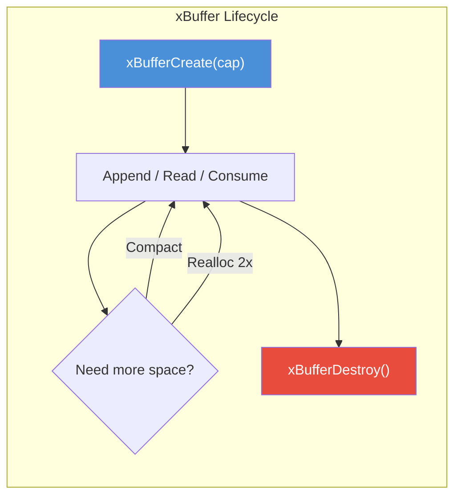
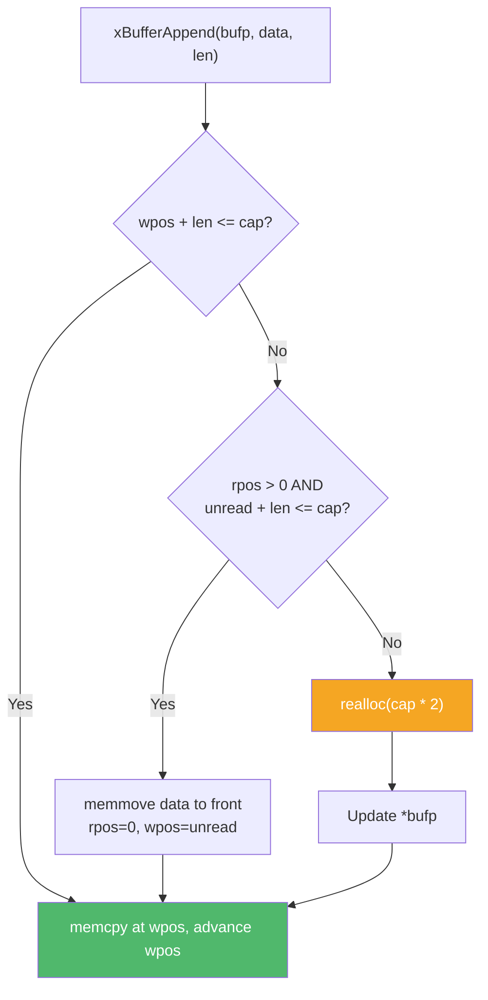

# buf.h — Linear Auto-Growing Buffer

## Introduction

`buf.h` provides `xBuffer`, a simple contiguous byte buffer that automatically grows when more space is needed. It maintains separate read and write positions, supporting efficient append-and-consume patterns. The buffer header and data area are allocated in a single `malloc()` call using a C99 flexible array member, avoiding an extra pointer indirection.

## Design Philosophy

1. **Single Allocation** — Header and data live in one contiguous block (`struct + flexible array member`). This means one `malloc()`, one `free()`, and excellent cache locality.

2. **Handle Indirection** — Because `realloc()` may relocate the entire object, write APIs take `xBuffer *bufp` (pointer to handle) so the caller's handle stays valid after growth.

3. **Compact Before Grow** — When the buffer needs more space, it first tries to compact (slide unread data to the front) before resorting to `realloc()`. This reclaims consumed space without allocation.

4. **2x Growth** — When reallocation is necessary, capacity doubles each time, providing amortized O(1) append.

## Architecture



## API Reference

### Lifecycle

| Function | Signature | Description | Thread Safety |
| --- | --- | --- | --- |
| `xBufferCreate` | `xBuffer xBufferCreate(size_t initial_cap)` | Create a buffer. Min capacity is 64. | Not thread-safe |
| `xBufferDestroy` | `void xBufferDestroy(xBuffer buf)` | Free the buffer. NULL is a no-op. | Not thread-safe |
| `xBufferReset` | `void xBufferReset(xBuffer buf)` | Discard all data, keep memory. | Not thread-safe |

### Write

| Function | Signature | Description | Thread Safety |
| --- | --- | --- | --- |
| `xBufferAppend` | `xErrno xBufferAppend(xBuffer *bufp, const void *data, size_t len)` | Append bytes, growing if needed. | Not thread-safe |
| `xBufferAppendStr` | `xErrno xBufferAppendStr(xBuffer *bufp, const char *str)` | Append a C string (excluding NUL). | Not thread-safe |
| `xBufferReserve` | `xErrno xBufferReserve(xBuffer *bufp, size_t additional)` | Ensure at least `additional` writable bytes. | Not thread-safe |

### Read

| Function | Signature | Description | Thread Safety |
| --- | --- | --- | --- |
| `xBufferData` | `const void *xBufferData(xBuffer buf)` | Pointer to readable data. Valid until next mutation. | Not thread-safe |
| `xBufferLen` | `size_t xBufferLen(xBuffer buf)` | Number of readable bytes. | Not thread-safe |
| `xBufferCap` | `size_t xBufferCap(xBuffer buf)` | Total allocated capacity. | Not thread-safe |
| `xBufferWritable` | `size_t xBufferWritable(xBuffer buf)` | Writable bytes (`cap - wpos`). | Not thread-safe |
| `xBufferConsume` | `void xBufferConsume(xBuffer buf, size_t n)` | Advance read position by `n` bytes. | Not thread-safe |
| `xBufferCompact` | `void xBufferCompact(xBuffer buf)` | Move unread data to front, maximize writable space. | Not thread-safe |

### I/O Helpers

| Function | Signature | Description | Thread Safety |
| --- | --- | --- | --- |
| `xBufferReadFd` | `ssize_t xBufferReadFd(xBuffer *bufp, int fd)` | Read from fd into buffer (ensures 4KB space). | Not thread-safe |
| `xBufferWriteFd` | `ssize_t xBufferWriteFd(xBuffer buf, int fd)` | Write readable data to fd, consume written bytes. | Not thread-safe |

## Usage Examples

### Basic Append and Read

```c
#include <stdio.h>
#include <x/buf/buf.h>

int main(void) {
    xBuffer buf = xBufferCreate(256);

    // Append data
    xBufferAppend(&buf, "Hello, ", 7);
    xBufferAppendStr(&buf, "World!");

    // Read data
    printf("Content: %.*s\n", (int)xBufferLen(buf),
           (const char *)xBufferData(buf));
    // Output: Content: Hello, World!

    // Consume partial data
    xBufferConsume(buf, 7);
    printf("After consume: %.*s\n", (int)xBufferLen(buf),
           (const char *)xBufferData(buf));
    // Output: After consume: World!

    // Compact to reclaim consumed space
    xBufferCompact(buf);

    xBufferDestroy(buf);
    return 0;
}
```

### Network I/O

```c
#include <x/buf/buf.h>
#include <unistd.h>

void handle_connection(int sockfd) {
    xBuffer buf = xBufferCreate(4096);

    // Read from socket
    ssize_t n = xBufferReadFd(&buf, sockfd);
    if (n > 0) {
        // Process data...
        // Write response back
        xBufferAppendStr(&buf, "HTTP/1.1 200 OK\r\n\r\n");
        xBufferWriteFd(buf, sockfd);
    }

    xBufferDestroy(buf);
}
```

## Use Cases

1. **HTTP Response Accumulation** — Accumulate response body chunks of unknown total size. The auto-growing behavior handles variable-length responses.

2. **Protocol Parsing** — Append incoming data, parse complete messages from the front, consume parsed bytes. The compact operation reclaims space without reallocation.

3. **Log Message Formatting** — Build log messages incrementally with multiple append calls before flushing.

## Best Practices

- **Always pass `&buf` to write APIs.** Functions that may grow the buffer take `xBuffer *bufp` because `realloc()` may relocate the object.
- **Call `xBufferCompact()` periodically** if you consume data incrementally. This avoids unnecessary reallocation by reclaiming consumed space.
- **Check return values.** `xBufferAppend()` and `xBufferReserve()` return `xErrno_NoMemory` on allocation failure.
- **Don't cache `xBufferData()` pointers** across mutating calls. Any append/reserve/compact may invalidate the pointer.

## Comparison with Other Libraries

| Feature | xbuf buf.h | Go `bytes.Buffer` | Rust `Vec<u8>` | C++ `std::vector<char>` |
| --- | --- | --- | --- | --- |
| **Layout** | Header + data in one allocation (FAM) | Separate header + slice | Heap-allocated array | Heap-allocated array |
| **Growth** | 2x realloc + compact | 2x (with copy) | 2x (with copy) | Implementation-defined |
| **Read/Write cursors** | Yes (rpos/wpos) | Yes (read offset) | No (manual tracking) | No (manual tracking) |
| **Compact** | Built-in (`xBufferCompact`) | Built-in (implicit) | Manual | Manual |
| **I/O helpers** | `ReadFd`/`WriteFd` | `ReadFrom`/`WriteTo` | Via `Read`/`Write` traits | No |
| **Handle invalidation** | Caller updates via `*bufp` | GC handles | Borrow checker | Iterator invalidation |

**Key Differentiator:** xBuffer's single-allocation layout (flexible array member) eliminates one level of pointer indirection compared to typical buffer implementations. The compact-before-grow strategy minimizes reallocation frequency for append-consume workloads.

## Benchmark

> Environment: Apple M3 Pro, 36 GB RAM, macOS 26.4, Release build (`-O2`).
> Source: [`xbuf/buf_bench.cpp`](https://github.com/mivinci/libx/blob/main/xbuf/buf_bench.cpp)

| Benchmark | Chunk Size | Time (ns) | CPU (ns) | Throughput |
| --- | ---: | ---: | ---: | --- |
| `BM_Buffer_Append` | 16 | 4,776 | 4,776 | 3.1 GiB/s |
| `BM_Buffer_Append` | 64 | 4,400 | 4,400 | 13.5 GiB/s |
| `BM_Buffer_Append` | 256 | 7,892 | 7,892 | 30.2 GiB/s |
| `BM_Buffer_Append` | 1,024 | 21,834 | 21,811 | 43.7 GiB/s |
| `BM_Buffer_Append` | 4,096 | 91,029 | 90,958 | 41.9 GiB/s |
| `BM_Buffer_AppendConsume` | 64 | 4,999 | 4,999 | 11.9 GiB/s |
| `BM_Buffer_AppendConsume` | 256 | 8,241 | 8,240 | 28.9 GiB/s |
| `BM_Buffer_AppendConsume` | 1,024 | 22,859 | 22,859 | 41.7 GiB/s |

**Key Observations:**

- **Append throughput** peaks at ~44 GiB/s for 1KB chunks, limited by `memcpy` bandwidth and reallocation overhead.
- **AppendConsume** (interleaved append + consume) achieves comparable throughput to pure append, validating the compact-before-grow strategy — consumed space is reclaimed without reallocation.
- Small chunks (16B) show lower throughput due to per-call overhead dominating the `memcpy` cost.

## Implementation Details

### Memory Layout

```text
Single malloc() allocation:
┌──────────────────┬──────────────────────────────────────────┐
│  xBuffer_ header │  data[cap]  (flexible array member)      │
│  rpos, wpos, cap │                                          │
└──────────────────┴──────────────────────────────────────────┘
                    ↑          ↑                    ↑
                    data+rpos  data+wpos            data+cap
                    │←readable→│←────writable──────→│
```

### Internal Structure

```c
XDEF_STRUCT(xBuffer_) {
    size_t rpos;   // Read position (start of unread data)
    size_t wpos;   // Write position (end of unread data)
    size_t cap;    // Total data capacity
    char   data[]; // Flexible array member
};
```

### Growth Strategy



### Operations and Complexity

| Operation | Time Complexity | Notes |
| --- | --- | --- |
| `xBufferAppend` | Amortized O(1) per byte | May trigger compact or realloc |
| `xBufferConsume` | O(1) | Advances read position |
| `xBufferCompact` | O(n) | `memmove` of unread data |
| `xBufferData` | O(1) | Returns `data + rpos` |
| `xBufferLen` | O(1) | Returns `wpos - rpos` |
| `xBufferReadFd` | O(1) | Single `read()` syscall |
| `xBufferWriteFd` | O(1) | Single `write()` syscall |
