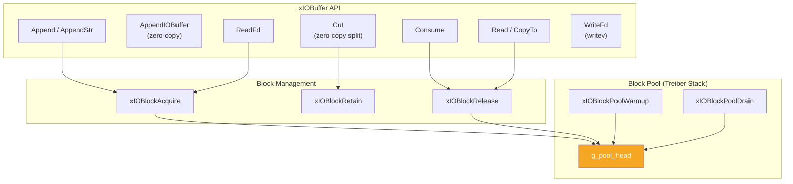
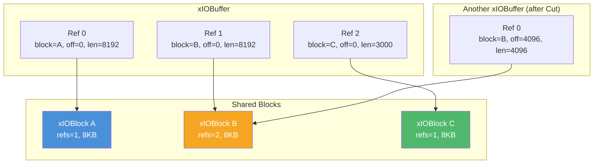
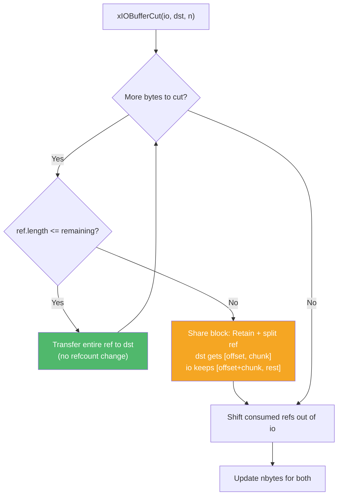

# io.h — Reference-Counted Block-Chain I/O Buffer

## Introduction

`io.h` provides `xIOBuffer`, a non-contiguous byte buffer composed of a chain of reference-counted memory blocks. It supports zero-copy split, append, and scatter-gather I/O (`readv`/`writev`). Inspired by brpc's `IOBuf`, it is designed for high-throughput network I/O where avoiding memory copies is critical.

## Design Philosophy

1. **Block-Chain Architecture** — Data is stored across multiple fixed-size blocks (default 8KB each), linked through a reference array. This avoids large contiguous allocations and enables zero-copy operations.

2. **Reference Counting** — Each `xIOBlock` is reference-counted. Multiple `xIOBuffer` instances can share the same block (e.g., after a `Cut` operation). Blocks are freed (returned to pool) when the last reference is released.

3. **Zero-Copy Operations** — `xIOBufferAppendIOBuffer()` transfers block references without copying data. `xIOBufferCut()` splits a buffer by adjusting offsets and sharing blocks at the boundary.

4. **Lock-Free Block Pool** — Released blocks are returned to a global Treiber stack (lock-free) for reuse, avoiding `malloc`/`free` overhead in steady state.

5. **Inline Ref Array** — Small buffers (≤ 8 refs) use an inline array, avoiding heap allocation for the ref array itself. Larger buffers transition to a heap-allocated array.

## Architecture



## API Reference

### Configuration

| Macro | Default | Description |
| --- | --- | --- |
| `XIOBUFFER_BLOCK_SIZE` | 8192 | Block data size in bytes |
| `XIOBUFFER_INLINE_REFS` | 8 | Inline ref array capacity |

### Block API

| Function | Signature | Description | Thread Safety |
| --- | --- | --- | --- |
| `xIOBlockAcquire` | `xIOBlock *xIOBlockAcquire(void)` | Get a block from pool (or malloc). refs=1. | **Thread-safe** (lock-free pool) |
| `xIOBlockRetain` | `void xIOBlockRetain(xIOBlock *blk)` | Increment refcount. | **Thread-safe** (atomic) |
| `xIOBlockRelease` | `void xIOBlockRelease(xIOBlock *blk)` | Decrement refcount; return to pool at 0. | **Thread-safe** (atomic + lock-free pool) |
| `xIOBlockPoolWarmup` | `xErrno xIOBlockPoolWarmup(size_t n)` | Pre-allocate `n` blocks into pool. | **Thread-safe** |
| `xIOBlockPoolDrain` | `void xIOBlockPoolDrain(void)` | Free all pooled blocks. Call at shutdown. | **Not thread-safe** (no concurrent use) |

### IOBuffer Lifecycle

| Function | Signature | Description | Thread Safety |
| --- | --- | --- | --- |
| `xIOBufferInit` | `void xIOBufferInit(xIOBuffer *io)` | Initialize an empty IOBuffer. | Not thread-safe |
| `xIOBufferDeinit` | `void xIOBufferDeinit(xIOBuffer *io)` | Release all refs and free ref array. | Not thread-safe |
| `xIOBufferReset` | `void xIOBufferReset(xIOBuffer *io)` | Release all refs, keep ref array. | Not thread-safe |

### IOBuffer Query

| Function | Signature | Description | Thread Safety |
| --- | --- | --- | --- |
| `xIOBufferLen` | `size_t xIOBufferLen(const xIOBuffer *io)` | Total readable bytes. | Not thread-safe |
| `xIOBufferEmpty` | `bool xIOBufferEmpty(const xIOBuffer *io)` | True if no data. | Not thread-safe |
| `xIOBufferRefCount` | `size_t xIOBufferRefCount(const xIOBuffer *io)` | Number of block refs. | Not thread-safe |

### IOBuffer Write

| Function | Signature | Description | Thread Safety |
| --- | --- | --- | --- |
| `xIOBufferAppend` | `xErrno xIOBufferAppend(xIOBuffer *io, const void *data, size_t len)` | Append bytes (allocates blocks as needed). | Not thread-safe |
| `xIOBufferAppendStr` | `xErrno xIOBufferAppendStr(xIOBuffer *io, const char *str)` | Append C string. | Not thread-safe |
| `xIOBufferAppendIOBuffer` | `xErrno xIOBufferAppendIOBuffer(xIOBuffer *io, xIOBuffer *other)` | Zero-copy: move all refs from `other`. | Not thread-safe |

### IOBuffer Read

| Function | Signature | Description | Thread Safety |
| --- | --- | --- | --- |
| `xIOBufferRead` | `size_t xIOBufferRead(xIOBuffer *io, void *out, size_t len)` | Copy and consume bytes. | Not thread-safe |
| `xIOBufferCut` | `size_t xIOBufferCut(xIOBuffer *io, xIOBuffer *dst, size_t n)` | Zero-copy split: move first `n` bytes to `dst`. | Not thread-safe |
| `xIOBufferConsume` | `size_t xIOBufferConsume(xIOBuffer *io, size_t n)` | Discard first `n` bytes. | Not thread-safe |
| `xIOBufferCopyTo` | `size_t xIOBufferCopyTo(const xIOBuffer *io, void *out)` | Linearize: copy all data to contiguous buffer. | Not thread-safe |

### IOBuffer I/O

| Function | Signature | Description | Thread Safety |
| --- | --- | --- | --- |
| `xIOBufferReadIov` | `int xIOBufferReadIov(const xIOBuffer *io, struct iovec *iov, int max_iov)` | Fill iovecs for `writev()`. | Not thread-safe |
| `xIOBufferReadFd` | `ssize_t xIOBufferReadFd(xIOBuffer *io, int fd)` | Read from fd into IOBuffer. | Not thread-safe |
| `xIOBufferWriteFd` | `ssize_t xIOBufferWriteFd(xIOBuffer *io, int fd)` | Write to fd using `writev()`. | Not thread-safe |

## Usage Examples

### Basic Usage

```c
#include <stdio.h>
#include <x/buf/io.h>

int main(void) {
    xIOBuffer io;
    xIOBufferInit(&io);

    // Append data (may span multiple blocks)
    xIOBufferAppend(&io, "Hello, ", 7);
    xIOBufferAppend(&io, "IOBuffer!", 9);

    printf("Length: %zu, Refs: %zu\n",
           xIOBufferLen(&io), xIOBufferRefCount(&io));

    // Linearize for processing
    char buf[64];
    xIOBufferCopyTo(&io, buf);
    printf("Content: %.*s\n", (int)xIOBufferLen(&io), buf);

    xIOBufferDeinit(&io);
    return 0;
}
```

### Zero-Copy Split (Protocol Parsing)

```c
#include <x/buf/io.h>

void parse_protocol(xIOBuffer *io) {
    // Cut the 4-byte header from the front
    xIOBuffer header;
    xIOBufferInit(&header);

    size_t cut = xIOBufferCut(io, &header, 4);
    if (cut == 4) {
        char hdr[4];
        xIOBufferRead(&header, hdr, 4);
        // Parse header...
        // io now contains only the body (zero-copy!)
    }

    xIOBufferDeinit(&header);
}
```

### High-Throughput Network I/O

```c
#include <x/buf/io.h>

void handle_data(int sockfd) {
    // Pre-warm the block pool at startup
    xIOBlockPoolWarmup(64);

    xIOBuffer io;
    xIOBufferInit(&io);

    // Read from socket (allocates blocks from pool)
    ssize_t n = xIOBufferReadFd(&io, sockfd);
    if (n > 0) {
        // Write back using scatter-gather I/O
        xIOBufferWriteFd(&io, sockfd);
    }

    xIOBufferDeinit(&io);

    // At shutdown
    xIOBlockPoolDrain();
}
```

## Use Cases

1. **HTTP Response Body** — The [`xhttp`](../http/index.html) module uses `xIOBuffer` to accumulate response chunks from libcurl without copying between buffers.

2. **Protocol Framing** — Use `xIOBufferCut()` to split headers from body in a zero-copy fashion, then process each part independently.

3. **Data Pipeline** — Chain multiple processing stages that each append to or cut from `xIOBuffer` instances, sharing blocks to minimize copies.

## Best Practices

- **Call `xIOBlockPoolWarmup()` at startup** to pre-allocate blocks and avoid allocation spikes during initial traffic.
- **Call `xIOBlockPoolDrain()` at shutdown** for clean valgrind reports.
- **Use `xIOBufferAppendIOBuffer()` instead of copying** when combining buffers. It transfers ownership without data copies.
- **Use `xIOBufferCut()` for protocol parsing.** It's more efficient than `xIOBufferRead()` when you need to pass the cut data to another component.
- **Monitor `xIOBufferRefCount()`** to understand memory fragmentation. Many small refs may indicate suboptimal block utilization.

## Comparison with Other Libraries

| Feature | xbuf io.h | brpc `IOBuf` | Netty `ByteBuf` | Go `bytes.Buffer` |
| --- | --- | --- | --- | --- |
| **Architecture** | Block-chain (ref array) | Block-chain (linked list) | Composite buffer | Contiguous slice |
| **Block Size** | 8KB (configurable) | 8KB | Configurable | N/A |
| **Reference Counting** | Atomic (per block) | Atomic (per block) | Atomic (per buffer) | GC |
| **Zero-Copy Split** | `xIOBufferCut` | `cutn` | `slice` | No |
| **Zero-Copy Append** | `xIOBufferAppendIOBuffer` | `append(IOBuf)` | `addComponent` | No |
| **Block Pool** | Treiber stack (lock-free) | Thread-local + global | Arena allocator | N/A |
| **Scatter-Gather I/O** | `writev` via `ReadIov` | `writev` via `pappend` | `nioBuffers` | No |
| **Inline Optimization** | 8 inline refs | No | No | N/A |
| **Language** | C99 | C++ | Java | Go |

**Key Differentiator:** xbuf's `xIOBuffer` combines brpc-style block-chain architecture with a lock-free Treiber stack block pool and inline ref optimization. The zero-copy `Cut` and `AppendIOBuffer` operations make it ideal for protocol parsing and data pipeline scenarios in C.

## Benchmark

> Environment: Apple M3 Pro, 36 GB RAM, macOS 26.4, Release build (`-O2`).
> Source: [`xbuf/io_bench.cpp`](https://github.com/mivinci/libx/blob/main/xbuf/io_bench.cpp)

| Benchmark | Size | Time (ns) | CPU (ns) | Throughput |
| --- | ---: | ---: | ---: | --- |
| `BM_IOBuffer_Append` | 64 | 3,720 | 3,720 | 16.0 GiB/s |
| `BM_IOBuffer_Append` | 256 | 7,569 | 7,568 | 31.5 GiB/s |
| `BM_IOBuffer_Append` | 1,024 | 22,341 | 22,340 | 42.7 GiB/s |
| `BM_IOBuffer_Append` | 4,096 | 79,796 | 79,794 | 47.8 GiB/s |
| `BM_IOBuffer_Append` | 8,192 | 187,167 | 187,165 | 40.8 GiB/s |
| `BM_IOBuffer_AppendConsume` | 64 | 5,230 | 5,230 | 11.4 GiB/s |
| `BM_IOBuffer_AppendConsume` | 256 | 8,232 | 8,232 | 29.0 GiB/s |
| `BM_IOBuffer_AppendConsume` | 1,024 | 23,040 | 23,040 | 41.4 GiB/s |
| `BM_IOBuffer_Cut` | 8,192 | 167 | 167 | 45.6 GiB/s |
| `BM_IOBuffer_Cut` | 65,536 | 1,651 | 1,651 | 37.0 GiB/s |
| `BM_IOBuffer_Cut` | 262,144 | 8,122 | 8,122 | 30.1 GiB/s |
| `BM_IOBuffer_AppendIOBuffer` | 1,024 | 3,196 | 3,196 | 29.8 GiB/s |
| `BM_IOBuffer_AppendIOBuffer` | 4,096 | 9,307 | 9,307 | 41.0 GiB/s |
| `BM_IOBuffer_AppendIOBuffer` | 8,192 | 17,604 | 17,602 | 43.3 GiB/s |
| `BM_IOBuffer_BlockPool` | — | 8.91 | 8.89 | — |

**Key Observations:**

- **Append** peaks at ~48 GiB/s for 4KB chunks. The slight drop at 8KB reflects block boundary crossing overhead.
- **Cut** (zero-copy split) is extremely fast — 167ns for 8KB — because it only manipulates reference metadata, not data. This validates the block-chain architecture for protocol parsing.
- **AppendIOBuffer** (zero-copy concatenation) achieves ~43 GiB/s, confirming that block ownership transfer avoids data copies.
- **BlockPool** acquire/release cycle takes ~9ns, showing the lock-free Treiber stack's efficiency for block recycling.

## Implementation Details

### Block Structure

```c
XDEF_STRUCT(xIOBlock) {
    size_t refs;                       // Reference count (atomic)
    size_t size;                       // Usable data size
    char   data[XIOBUFFER_BLOCK_SIZE]; // 8KB inline data
};
```

### Reference Structure

```c
XDEF_STRUCT(xIOBufferRef) {
    xIOBlock *block;   // Pointer to the underlying block
    size_t    offset;  // Start offset within block->data
    size_t    length;  // Number of valid bytes from offset
};
```

### IOBuffer Structure

```c
XDEF_STRUCT(xIOBuffer) {
    xIOBufferRef  inlined[XIOBUFFER_INLINE_REFS]; // Inline ref storage (8)
    xIOBufferRef *refs;    // Pointer to ref array (inlined or heap)
    size_t        nrefs;   // Number of active refs
    size_t        cap;     // Capacity of refs array
    size_t        nbytes;  // Total logical byte count (cached)
};
```

### Block-Chain Architecture



### Treiber Stack Block Pool

The global block pool uses a lock-free Treiber stack:

```c
// Pool node overlays xIOBlock memory
XDEF_STRUCT(PoolNode_) {
    PoolNode_ *next;
};

static PoolNode_ *volatile g_pool_head = NULL;
```

**Push (return to pool):**

```text
do {
    head = atomic_load(g_pool_head)
    node->next = head
} while (!CAS(g_pool_head, head, node))
```

**Pop (acquire from pool):**

```text
do {
    head = atomic_load(g_pool_head)
    if (!head) return malloc(new block)
    next = head->next
} while (!CAS(g_pool_head, head, next))
return head
```

### Zero-Copy Cut

`xIOBufferCut(io, dst, n)` moves the first `n` bytes from `io` to `dst`:

1. **Fully consumed refs** — Ownership transfers directly (no refcount change).
2. **Boundary ref** — The block is shared: `xIOBlockRetain()` increments the refcount, and both buffers hold a ref with different offset/length.



### Append Strategy

`xIOBufferAppend(io, data, len)`:

1. First tries to fill the tail block's remaining space (avoids allocating a new block for small appends).
2. Allocates new blocks for remaining data, each up to `XIOBUFFER_BLOCK_SIZE` bytes.
