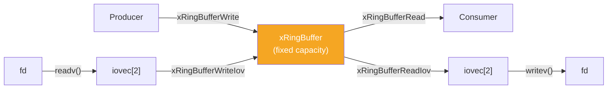
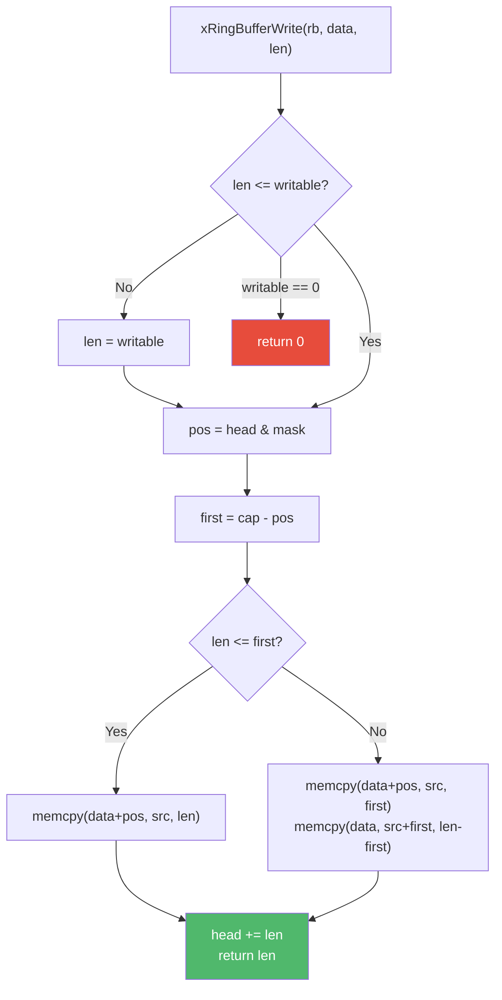

# ring.h — Fixed-Size Ring Buffer

## Introduction

`ring.h` provides `xRingBuffer`, a fixed-capacity circular buffer that never reallocates. It is ideal for bounded producer-consumer scenarios where a fixed memory budget is required. The capacity is rounded up to the next power of two internally, enabling bitmask indexing instead of expensive modulo operations.

## Design Philosophy

1. **Fixed Capacity, Zero Reallocation** — Once created, the ring buffer never grows. Writes that exceed capacity are truncated to the available space (partial write). This makes memory usage predictable and avoids allocation latency spikes.

2. **Power-of-Two Masking** — The internal capacity is always a power of two. Index computation uses `head & mask` instead of `head % cap`, which is significantly faster on most architectures.

3. **Monotonic Cursors** — `head` (write) and `tail` (read) grow monotonically and never wrap. The actual array index is computed via bitmask. This simplifies the full/empty distinction: `head - tail` gives the exact readable byte count.

4. **Single Allocation** — Like `xBuffer`, the header and data area are allocated together using a flexible array member.

5. **Scatter-Gather I/O** — The ring buffer provides `ReadIov`/`WriteIov` helpers that fill `iovec` arrays for efficient `readv()`/`writev()` syscalls, handling the wrap-around transparently.

## Architecture



## API Reference

### Lifecycle

| Function | Signature | Description | Thread Safety |
| --- | --- | --- | --- |
| `xRingBufferCreate` | `xRingBuffer xRingBufferCreate(size_t min_cap)` | Create a ring buffer. Capacity rounded up to power of 2. | Not thread-safe |
| `xRingBufferDestroy` | `void xRingBufferDestroy(xRingBuffer rb)` | Free the ring buffer. NULL is a no-op. | Not thread-safe |
| `xRingBufferReset` | `void xRingBufferReset(xRingBuffer rb)` | Discard all data, keep memory. | Not thread-safe |

### Query

| Function | Signature | Description | Thread Safety |
| --- | --- | --- | --- |
| `xRingBufferLen` | `size_t xRingBufferLen(xRingBuffer rb)` | Readable bytes. | Not thread-safe |
| `xRingBufferCap` | `size_t xRingBufferCap(xRingBuffer rb)` | Total capacity. | Not thread-safe |
| `xRingBufferWritable` | `size_t xRingBufferWritable(xRingBuffer rb)` | Writable bytes. | Not thread-safe |
| `xRingBufferEmpty` | `bool xRingBufferEmpty(xRingBuffer rb)` | True if no readable data. | Not thread-safe |
| `xRingBufferFull` | `bool xRingBufferFull(xRingBuffer rb)` | True if no writable space. | Not thread-safe |

### Write

| Function | Signature | Description | Thread Safety |
| --- | --- | --- | --- |
| `xRingBufferWrite` | `size_t xRingBufferWrite(xRingBuffer rb, const void *data, size_t len)` | Write bytes. Returns number of bytes actually written (partial write if full). | Not thread-safe |

### Read

| Function | Signature | Description | Thread Safety |
| --- | --- | --- | --- |
| `xRingBufferRead` | `size_t xRingBufferRead(xRingBuffer rb, void *out, size_t len)` | Read and consume bytes. Returns actual count. | Not thread-safe |
| `xRingBufferPeek` | `size_t xRingBufferPeek(xRingBuffer rb, void *out, size_t len)` | Read without consuming. | Not thread-safe |
| `xRingBufferDiscard` | `size_t xRingBufferDiscard(xRingBuffer rb, size_t n)` | Discard bytes without copying. | Not thread-safe |

### I/O Helpers

| Function | Signature | Description | Thread Safety |
| --- | --- | --- | --- |
| `xRingBufferReadIov` | `int xRingBufferReadIov(xRingBuffer rb, struct iovec iov[2])` | Fill iovecs with readable regions (for `writev`). | Not thread-safe |
| `xRingBufferWriteIov` | `int xRingBufferWriteIov(xRingBuffer rb, struct iovec iov[2])` | Fill iovecs with writable regions (for `readv`). | Not thread-safe |
| `xRingBufferReadFd` | `ssize_t xRingBufferReadFd(xRingBuffer rb, int fd)` | Read from fd using `readv()`. | Not thread-safe |
| `xRingBufferWriteFd` | `ssize_t xRingBufferWriteFd(xRingBuffer rb, int fd)` | Write to fd using `writev()`. | Not thread-safe |

## Usage Examples

### Basic FIFO

```c
#include <stdio.h>
#include <x/buf/ring.h>

int main(void) {
    // Request 1000 bytes; actual capacity will be 1024 (next power of 2)
    xRingBuffer rb = xRingBufferCreate(1000);
    printf("Capacity: %zu\n", xRingBufferCap(rb)); // 1024

    // Write data
    const char *msg = "Hello, Ring!";
    xRingBufferWrite(rb, msg, 12);

    // Read data
    char out[32];
    size_t n = xRingBufferRead(rb, out, sizeof(out));
    printf("Read %zu bytes: %.*s\n", n, (int)n, out);

    xRingBufferDestroy(rb);
    return 0;
}
```

### Network Socket Buffer

```c
#include <x/buf/ring.h>

void event_loop_handler(int sockfd) {
    xRingBuffer rb = xRingBufferCreate(65536); // 64KB ring

    // Read from socket into ring buffer
    ssize_t n = xRingBufferReadFd(rb, sockfd);
    if (n > 0) {
        // Process data...
        // Write processed data back
        xRingBufferWriteFd(rb, sockfd);
    }

    xRingBufferDestroy(rb);
}
```

## Use Cases

1. **Fixed-Budget Network Buffers** — When you need predictable memory usage per connection (e.g., 64KB per socket), the ring buffer provides a hard capacity limit.

2. **Logging Ring Buffer** — Capture the last N bytes of log output, automatically discarding old data when the buffer wraps.

3. **Inter-Thread Communication** — With external synchronization, a ring buffer can serve as a bounded channel between producer and consumer threads.

## Best Practices

- **Choose capacity carefully.** The ring buffer never grows. If you write more than the available space, only a partial write is performed. Size it for your worst-case scenario.
- **Use scatter-gather I/O.** `xRingBufferReadFd`/`WriteFd` use `readv()`/`writev()` to handle wrap-around in a single syscall, avoiding the need to linearize data.
- **Be aware of power-of-two rounding.** Requesting 1000 bytes gives you 1024. Requesting 1025 gives you 2048. Plan accordingly.
- **Check the return value of `xRingBufferWrite()`** to detect partial writes and handle back-pressure.

## Comparison with Other Libraries

| Feature | xbuf ring.h | Linux `kfifo` | Boost `circular_buffer` | DPDK `rte_ring` |
| --- | --- | --- | --- | --- |
| **Capacity** | Fixed, power-of-2 | Fixed, power-of-2 | Fixed, any size | Fixed, power-of-2 |
| **Indexing** | Bitmask | Bitmask | Modulo | Bitmask |
| **Layout** | FAM (single alloc) | Separate alloc | Heap array | Huge pages |
| **Thread Safety** | Not thread-safe | Single-producer/single-consumer | Not thread-safe | Multi-producer/multi-consumer |
| **I/O Helpers** | `readv`/`writev` | `kfifo_to_user`/`kfifo_from_user` | No | No (packet-oriented) |
| **Language** | C99 | C (kernel) | C++ | C |

**Key Differentiator:** xbuf's ring buffer combines the power-of-two bitmask optimization (like `kfifo`) with scatter-gather I/O helpers (`readv`/`writev`) in a single-allocation design. It's purpose-built for event-driven network programming where fixed memory budgets and efficient syscalls are essential.

## Benchmark

> Environment: Apple M3 Pro, 36 GB RAM, macOS 26.4, Release build (`-O2`).
> Source: [`xbuf/ring_bench.cpp`](https://github.com/mivinci/libx/blob/main/xbuf/ring_bench.cpp)

| Benchmark | Size | Time (ns) | CPU (ns) | Throughput |
| --- | ---: | ---: | ---: | --- |
| `BM_Ring_WriteRead` | 64 | 6.05 | 6.05 | 19.7 GiB/s |
| `BM_Ring_WriteRead` | 256 | 16.8 | 16.8 | 28.4 GiB/s |
| `BM_Ring_WriteRead` | 1,024 | 27.4 | 27.4 | 69.6 GiB/s |
| `BM_Ring_WriteRead` | 4,096 | 99.2 | 99.2 | 76.9 GiB/s |
| `BM_Ring_Throughput` | 4,096 | 225 | 225 | 17.0 GiB/s |
| `BM_Ring_Throughput` | 16,384 | 806 | 806 | 18.9 GiB/s |
| `BM_Ring_Throughput` | 65,536 | 3,198 | 3,198 | 19.1 GiB/s |

**Key Observations:**

- **WriteRead** (single write + read cycle) achieves up to ~77 GiB/s at 4KB chunks, demonstrating the efficiency of the bitmask-based wrap-around and `memcpy` for larger transfers.
- **Throughput** (sustained writes until full) stabilizes at ~19 GiB/s regardless of capacity, showing consistent performance as the ring scales.
- The ring buffer's zero-overhead indexing (bitmask instead of modulo) keeps per-operation cost extremely low — just 6ns for a 64-byte write+read cycle.

## Implementation Details

### Memory Layout

```text
Single malloc() allocation:
┌───────────────────────┬──────────────────────────────────────┐
│  xRingBuffer_ header  │  data[cap]  (flexible array member)  │
│  cap, mask, head, tail│                                      │
└───────────────────────┴──────────────────────────────────────┘

Circular data layout (cap=8, mask=7):
         tail & mask          head & mask
              ↓                    ↓
  ┌───┬───┬───┬───┬───┬───┬───┬───┐
  │   │   │ R │ R │ R │ W │   │   │
  └───┴───┴───┴───┴───┴───┴───┴───┘
  0   1   2   3   4   5   6   7

  R = readable data (tail..head)
  W = next write position
```

### Internal Structure

```c
XDEF_STRUCT(xRingBuffer_) {
    size_t cap;   // Capacity (power of two)
    size_t mask;  // cap - 1 (for bitmask indexing)
    size_t head;  // Write cursor (monotonic)
    size_t tail;  // Read cursor (monotonic)
    char   data[];// Flexible array member
};
```

### Power-of-Two Rounding

```c
static size_t next_pow2(size_t v) {
    if (v < 16) v = 16;
    v--;
    v |= v >> 1;
    v |= v >> 2;
    v |= v >> 4;
    v |= v >> 8;
    v |= v >> 16;
    // v |= v >> 32;  (on 64-bit)
    return v + 1;
}
```

This ensures `cap` is always a power of two, so `mask = cap - 1` produces a valid bitmask. For example, `cap = 8` → `mask = 0b111`.

### Bitmask Indexing

Instead of:

```c
size_t idx = head % cap;  // Expensive division
```

The ring buffer uses:

```c
size_t idx = head & mask;  // Single AND instruction
```

This works because `cap` is a power of two: `x % (2^n) == x & (2^n - 1)`.

### Wrap-Around Write



### Operations and Complexity

| Operation | Time Complexity | Notes |
| --- | --- | --- |
| `xRingBufferWrite` | O(n) | Up to 2 `memcpy` calls |
| `xRingBufferRead` | O(n) | Up to 2 `memcpy` calls |
| `xRingBufferPeek` | O(n) | Like Read but doesn't advance tail |
| `xRingBufferDiscard` | O(1) | Just advances tail |
| `xRingBufferLen` | O(1) | `head - tail` |
| `xRingBufferReadFd` | O(1) | Single `readv()` syscall |
| `xRingBufferWriteFd` | O(1) | Single `writev()` syscall |
