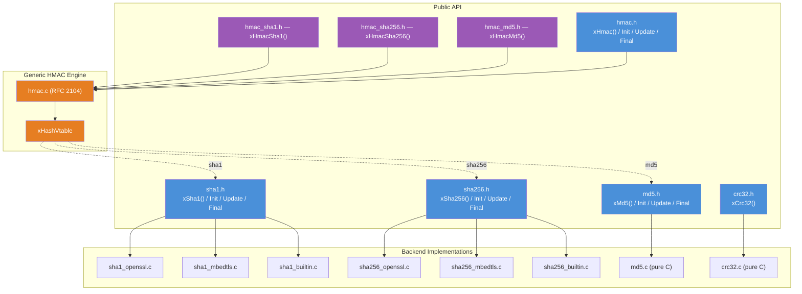
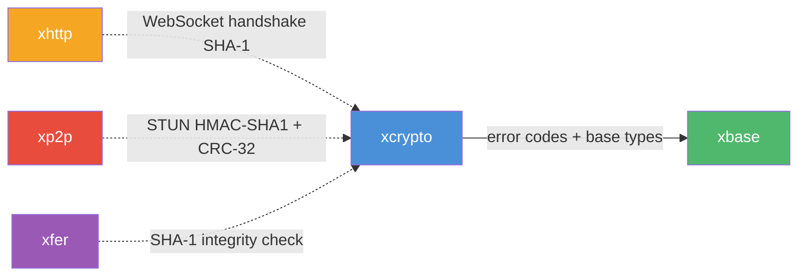

# xcrypto — Cryptographic Primitives

## Introduction

**xcrypto** is moo's cryptographic module, providing common hash functions, checksums, and HMAC primitives for use by higher-level modules. It currently offers:

- **Hash functions**: SHA-1, SHA-256, MD5
- **Checksum**: CRC-32
- **HMAC**: Generic HMAC (RFC 2104) with streaming API, plus convenience wrappers for HMAC-SHA1, HMAC-SHA256, and HMAC-MD5

SHA-1 and SHA-256 support three backends selected at build time via `X_TLS_BACKEND`: **OpenSSL**, **mbedTLS**, and a **pure-C builtin fallback**. MD5 and CRC-32 are always pure-C with no external dependencies.

## Design Philosophy

1. **Backend Abstraction** — Hash headers (`sha1.h`, `sha256.h`) expose a unified API regardless of the underlying crypto library. The backend is selected at build time via `X_TLS_BACKEND`, keeping runtime overhead at zero and the public interface stable.

2. **Zero Heap Allocation** — All context structures (`xSha1Ctx`, `xSha256Ctx`, `xMd5Ctx`, `xHmacCtx`) use fixed-size opaque buffers large enough to hold any backend's internal state. No dynamic allocation is needed.

3. **Dual API Surface** — Every hash algorithm provides both a one-shot function (e.g. `xSha256()`) for simple use cases and a streaming API (`Init` / `Update` / `Final`) for incremental hashing of large or chunked data. The generic HMAC also supports both modes.

4. **Compile-Time Static Assertions** — Each backend implementation uses `_Static_assert` to verify at compile time that the opaque buffer is large enough for its internal state, catching size mismatches before they become runtime bugs.

5. **Consistent Error Handling** — All functions return `xErrno` codes and validate arguments defensively, following the same error convention used throughout moo.

6. **Generic HMAC via Vtable** — The HMAC implementation is hash-agnostic, driven by an `xHashVtable` that describes any hash algorithm's init/update/final/sizes. Adding HMAC for a new hash requires only a one-line vtable definition.

## Architecture



## Backend Selection

SHA-1 and SHA-256 backends are chosen via the `X_TLS_BACKEND` CMake variable. MD5 and CRC-32 are always pure-C.

| `X_TLS_BACKEND` | SHA-1 / SHA-256 Backend | External Dependency |
| --- | --- | --- |
| `openssl` | OpenSSL EVP API | `libssl`, `libcrypto` |
| `mbedtls` | mbedTLS | `libmbedtls` |
| `auto` | Auto-detect: OpenSSL → mbedTLS → builtin | Best available |
| *(anything else)* | Pure-C builtin | None |

When set to `auto`, CMake probes for OpenSSL first, then mbedTLS, and falls back to the builtin implementation if neither is found.

## Sub-Module Overview

| Header | Description |
| --- | --- |
| `sha1.h` | SHA-1 hash — one-shot and streaming API with pluggable backend |
| `sha256.h` | SHA-256 hash — one-shot and streaming API with pluggable backend |
| `md5.h` | MD5 hash — one-shot and streaming API (pure C, RFC 1321) |
| `crc32.h` | CRC-32 checksum — one-shot API (pure C, ISO 3309) |
| `hmac.h` | Generic HMAC — one-shot and streaming API (RFC 2104), works with any `xHashVtable` |
| `hmac_sha1.h` | HMAC-SHA1 convenience wrapper |
| `hmac_sha256.h` | HMAC-SHA256 convenience wrapper |
| `hmac_md5.h` | HMAC-MD5 convenience wrapper |

## API Reference

### Hash Constants

| Constant | Value | Description |
| --- | --- | --- |
| `XCRYPTO_SHA1_DIGEST_SIZE` | 20 | SHA-1 digest length in bytes |
| `XCRYPTO_SHA1_BLOCK_SIZE` | 64 | SHA-1 internal block size in bytes |
| `XCRYPTO_SHA256_DIGEST_SIZE` | 32 | SHA-256 digest length in bytes |
| `XCRYPTO_SHA256_BLOCK_SIZE` | 64 | SHA-256 internal block size in bytes |
| `XCRYPTO_MD5_DIGEST_SIZE` | 16 | MD5 digest length in bytes |
| `XCRYPTO_MD5_BLOCK_SIZE` | 64 | MD5 internal block size in bytes |

### Hash Functions

| Function | Description |
| --- | --- |
| `xSha1(data, len, digest)` | One-shot SHA-1 |
| `xSha1Init(ctx)` / `xSha1Update(ctx, data, len)` / `xSha1Final(ctx, digest)` | Streaming SHA-1 |
| `xSha256(data, len, digest)` | One-shot SHA-256 |
| `xSha256Init(ctx)` / `xSha256Update(ctx, data, len)` / `xSha256Final(ctx, digest)` | Streaming SHA-256 |
| `xMd5(data, len, digest)` | One-shot MD5 |
| `xMd5Init(ctx)` / `xMd5Update(ctx, data, len)` / `xMd5Final(ctx, digest)` | Streaming MD5 |
| `xCrc32(data, len)` | One-shot CRC-32 (returns `uint32_t`) |

### HMAC Functions

| Function | Description |
| --- | --- |
| `xHmac(hash, key, key_len, data, data_len, digest)` | Generic one-shot HMAC with any `xHashVtable` |
| `xHmacInit(ctx, hash, key, key_len)` / `xHmacUpdate(ctx, data, len)` / `xHmacFinal(ctx, digest)` | Generic streaming HMAC |
| `xHmacSha1(key, key_len, data, data_len, digest)` | One-shot HMAC-SHA1 convenience wrapper |
| `xHmacSha256(key, key_len, data, data_len, digest)` | One-shot HMAC-SHA256 convenience wrapper |
| `xHmacMd5(key, key_len, data, data_len, digest)` | One-shot HMAC-MD5 convenience wrapper |

All functions return `xErrno_Ok` on success (except `xCrc32` which returns the checksum directly). After calling a `Final` function, the context must be re-initialized before reuse.

## Quick Start

### One-Shot SHA-256

```c
#include <stdio.h>
#include <string.h>
#include <x/crypto/sha256.h>

int main(void) {
    const char *msg = "Hello, World!";
    uint8_t digest[XCRYPTO_SHA256_DIGEST_SIZE];

    xErrno err = xSha256((const uint8_t *)msg, strlen(msg), digest);
    if (err != xErrno_Ok) return 1;

    printf("SHA-256: ");
    for (int i = 0; i < XCRYPTO_SHA256_DIGEST_SIZE; i++) {
        printf("%02x", digest[i]);
    }
    printf("\n");
    return 0;
}
```

### HMAC-SHA256

```c
#include <stdio.h>
#include <string.h>
#include <x/crypto/hmac_sha256.h>

int main(void) {
    const char *key = "secret";
    const char *msg = "Hello, World!";
    uint8_t digest[32];

    xErrno err = xHmacSha256(
        (const uint8_t *)key, strlen(key),
        (const uint8_t *)msg, strlen(msg),
        digest);
    if (err != xErrno_Ok) return 1;

    printf("HMAC-SHA256: ");
    for (int i = 0; i < 32; i++) {
        printf("%02x", digest[i]);
    }
    printf("\n");
    return 0;
}
```

### Streaming HMAC (Generic)

```c
#include <x/crypto/hmac.h>
#include <x/crypto/hmac_sha1.h>  /* for xHashVtableSha1 */

int main(void) {
    xHmacCtx ctx;
    uint8_t digest[20];

    xHmacInit(&ctx, &xHashVtableSha1,
              (const uint8_t *)"key", 3);
    xHmacUpdate(&ctx, (const uint8_t *)"Hello, ", 7);
    xHmacUpdate(&ctx, (const uint8_t *)"World!", 6);
    xHmacFinal(&ctx, digest);
    return 0;
}
```

Compile with:

```bash
gcc -o example example.c -I/path/to/moo -lxcrypto -lxbase
```

## Relationship with Other Modules



- **xbase** — xcrypto depends on xbase for `xErrno` error codes, `XDEF_STRUCT`, and `XCAPI` macros.
- **xhttp** — The WebSocket handshake (RFC 6455) requires SHA-1 to compute the `Sec-WebSocket-Accept` header.
- **xp2p** — STUN message integrity (RFC 5389) uses HMAC-SHA1 and CRC-32 fingerprint. xp2p uses xcrypto directly.
- **xfer** — File transfer integrity verification uses SHA-1 checksums from xcrypto.
