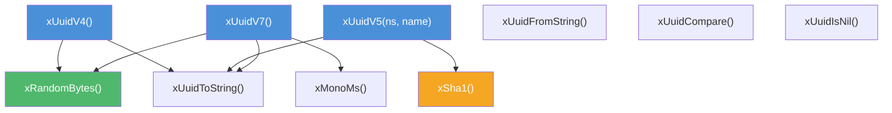

# uuid.h — UUID Generation

## Introduction

`uuid.h` provides UUID generation, formatting, parsing, and comparison per RFC 4122 / RFC 9562. Three versions are supported:

- **v4** — Random UUID. Uses `xRandomBytes` for cryptographically secure randomness.
- **v7** — Time-ordered UUID. 48-bit Unix timestamp (ms) in the high bits + 74 random bits. Sortable, database-friendly.
- **v5** — Namespace + name SHA-1 UUID. Deterministic — same namespace + name always produces the same UUID. Uses `xSha1` from [`xcrypto`](../crypto/README.md).

UUIDs are 16-byte value types (`xUuid`). They are stack-allocatable with no lifetime management. All generation functions return by value.

## Design Philosophy

1. **Value Type** — `xUuid` is a struct of 16 bytes. No heap allocation, no opaque handle, no destroy function. Safe to copy, assign, and pass by value.

2. **Cryptographic Randomness** — v4 and v7 use `xRandomBytes` (kernel CSPRNG or `/dev/urandom`), not `rand()` or a PRNG. Suitable for security-sensitive identifiers.

3. **Time-Ordered by Default** — v7 is recommended for database primary keys. The 48-bit millisecond timestamp sorts chronologically, reducing index fragmentation.

4. **No UUID v1** — MAC address + timestamp UUIDs (v1) leak hardware identity and clock sequence. Not implemented.

5. **Consistent String Format** — `xUuidToString` always produces lowercase with hyphens (`xxxxxxxx-xxxx-xxxx-xxxx-xxxxxxxxxxxx`). `xUuidFromString` is case-insensitive and accepts any hyphenation.

## Architecture



## API Reference

### Generation

| Function | Signature | Description |
| --- | --- | --- |
| `xUuidV4` | `xUuid xUuidV4(void)` | Generate a random UUID (v4). Version bits: `4` in octet 6, `10xx` in octet 8. |
| `xUuidV7` | `xUuid xUuidV7(void)` | Generate a time-ordered UUID (v7). 48-bit Unix ms timestamp, 74 random bits. |
| `xUuidV5` | `xUuid xUuidV5(xUuid ns, const char *name)` | Generate a namespace + name SHA-1 UUID (v5). Deterministic. |

### Formatting

| Function | Signature | Description |
| --- | --- | --- |
| `xUuidToString` | `void xUuidToString(xUuid uuid, char buf[37])` | Format as lowercase hyphenated string. `buf` must be at least 37 bytes. |
| `xUuidFromString` | `xErrno xUuidFromString(const char *str, xUuid *out)` | Parse a UUID string. Case-insensitive, any hyphenation accepted. Returns `xErrno_Ok` or `xErrno_Invalid`. |

### Comparison

| Function | Signature | Description |
| --- | --- | --- |
| `xUuidCompare` | `int xUuidCompare(xUuid a, xUuid b)` | Lexicographic byte comparison. Returns <0, 0, or >0. |
| `xUuidIsNil` | `bool xUuidIsNil(xUuid uuid)` | Returns true if all 16 bytes are zero. |

### Namespace UUIDs

| Function | Returns |
| --- | --- |
| `xUuidNamespaceDns()` | `const xUuid *` — `6ba7b810-9dad-11d1-80b4-00c04fd430c8` |
| `xUuidNamespaceUrl()` | `const xUuid *` — `6ba7b811-9dad-11d1-80b4-00c04fd430c8` |

### Types

| Type | Description |
| --- | --- |
| `xUuid` | `XDEF_STRUCT(xUuid) { uint8_t bytes[16]; }` — 16-byte value type. |

## Usage Examples

### Basic v4

```c
#include <stdio.h>
#include <x/crypto/uuid.h>

int main(void) {
    xUuid id = xUuidV4();
    char buf[37];
    xUuidToString(id, buf);
    printf("v4: %s\n", buf);
    // Output: v4: 550e8400-e29b-41d4-a716-446655440000
    return 0;
}
```

### v7 for database primary keys

```c
xUuid pk = xUuidV7();
char buf[37];
xUuidToString(pk, buf);
// e.g. "018f3a2b-7000-7a1b-9c2d-3e4f5a6b7c8d"
// The first 12 hex digits encode the creation timestamp (ms since Unix epoch).
// These sort chronologically, reducing B-tree fragmentation.
```

### v5 for deterministic IDs

```c
xUuid ns = *xUuidNamespaceDns();
xUuid id  = xUuidV5(ns, "example.com");

// Same input → same output, across all platforms and runs:
// cfba97cc-8a5a-5e8f-9e4f-9b1c2d3e4f5a
```

### Parse and compare

```c
xUuid a = xUuidV4();
xUuid b = xUuidV4();

if (xUuidCompare(a, b) == 0) {
    printf("equal (astronomically unlikely for v4)\n");
}

// Parse from string
xUuid parsed;
xUuidFromString("550e8400-e29b-41d4-a716-446655440000", &parsed);

// Check for nil
xUuid nil = {0};
assert(xUuidIsNil(nil));
assert(!xUuidIsNil(a));
```

## Best Practices

- **Prefer v7 for database keys** — Time-ordered UUIDs reduce index fragmentation compared to v4.
- **Use v5 for content-addressed IDs** — e.g. `xUuidV5(*xUuidNamespaceUrl(), url)` produces a stable identifier.
- **Don't rely on v4 uniqueness for security** — v4 is 122 random bits; collision probability is negligible, but don't use it as a cryptographic nonce.
- **Always check `xUuidFromString` return value** — Malformed strings produce `xErrno_Invalid`.
- **Allocate 37 bytes for `xUuidToString` output** — 32 hex digits + 4 hyphens + NUL.

## Relationship with Other Modules

- **xbase** — Uses [`xRandomBytes`](../base/random.md) for v4 and v7 random bits, and `xMonoMs()` for v7 timestamps.
- **xcrypto** — Uses `xSha1()` from [`sha1.h`](../crypto/../crypto/README.md) for v5 name hashing. UUID lives in xcrypto (not xbase) because v5's SHA-1 dependency would create a circular dependency.
