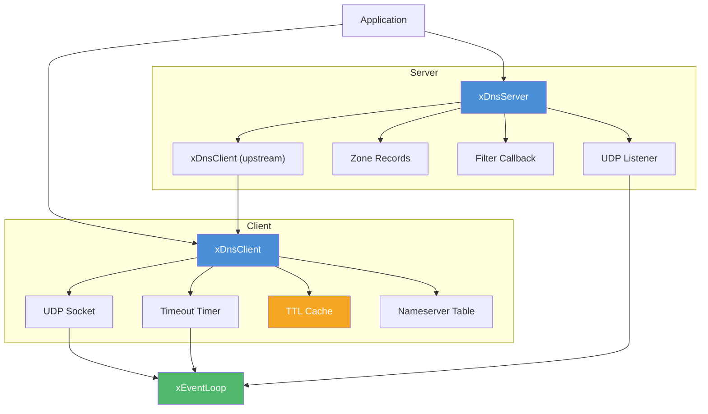

# dns.h — Async DNS Client + Server

## Introduction

`dns.h` is libx's DNS module, providing both a **client** (resolver) and **server** (authoritative/forwarding) built directly on the DNS protocol (RFC 1035, RFC 6891) over UDP. Unlike `libx/x/net/dns.c` which offloads `getaddrinfo()` to a thread pool, `dns.h` implements the protocol directly — truly async, no thread pool, no blocking calls. All I/O is driven by xbase's event loop.

Key features:

- **Truly async** — DNS queries over UDP, no `getaddrinfo`, no thread pool
- **Bitmask queries** — `xDnsType_A | xDnsType_AAAA` sends parallel queries, merges results
- **TTL caching** — Automatic cache with record-level TTL enforcement
- **Server with zones** — Authoritative records, upstream forwarding, and query filtering
- **RFC compliant** — RFC 1034, RFC 1035, RFC 3596, RFC 6891 (EDNS0)

## Design Philosophy

1. **Protocol-Native** — xdns builds and parses DNS wire-format packets directly. No `getaddrinfo()`, no `/etc/hosts`, no external resolver libraries. Full control over every byte on the wire.

2. **Truly Async** — A single UDP socket per client, registered with xbase's event loop. Queries are multiplexed by 16-bit transaction ID. No threads, no blocking calls, no polling.

3. **Double-Packed** — Multi-type queries (`A | AAAA`) are packed into a single `xDnsClientDo()` call. The client sends one UDP packet per type and merges results, invoking the callback once.

4. **Composable** — The server can be purely authoritative, purely forwarding, or a hybrid. Filter callbacks allow ad-blocking and custom DNS logic without modifying the core.

5. **Minimal Dependencies** — Depends only on `xbase` (event loop, socket, timer, map). No external DNS libraries.

## Architecture



## API Reference

### Client

| Function | Description |
| --- | --- |
| `xDnsClientCreate(conf)` | Create a client bound to the current event loop. `conf` may be NULL. |
| `xDnsClientDestroy(client)` | Destroy client, cancel in-flight queries. Safe with NULL. |
| `xDnsClientDo(client, name, type, cb, arg)` | Resolve a hostname. `type` is a bitmask of `xDnsType` values. |

### Server

| Function | Description |
| --- | --- |
| `xDnsServerCreate(conf)` | Create server (authoritative, forwarding, or hybrid). `conf` may be NULL. |
| `xDnsServerDestroy(server)` | Destroy server. Zones are NOT freed. Safe with NULL. |
| `xDnsServerListen(server, host, port)` | Start listening on a UDP port. |
| `xDnsServerPort(server)` | Return the actual bound port. |
| `xDnsServerAddZone(server, zone)` | Attach a zone. Checked in registration order. |

### Zone

| Function | Description |
| --- | --- |
| `xDnsZoneCreate()` | Create an empty zone. |
| `xDnsZoneDestroy(zone)` | Destroy a zone and free all records. Safe with NULL. |
| `xDnsZoneAdd(zone, name, type, rdata, rdlen, ttl)` | Add a record. `name` and `rdata` are copied. |

### Types

| Type | Description |
| --- | --- |
| `xDnsType` | Bitmask enum: `xDnsType_A` (1<<0), `xDnsType_AAAA` (1<<1), `xDnsType_CNAME` (1<<2) |
| `xDnsRecord` | Singly-linked list node: `qtype`, `ttl`, `name`, `rdata`, `rdlength`, `next` |
| `xDnsClientConf` | Client config: `nameservers[8]`, `timeout_ms`, `retries`, `enable_cache` |
| `xDnsServerConf` | Server config: `forwarder`, `filter`, `filter_arg`, `cache_enabled` |
| `xDnsCallback` | `void (*)(xErrno err, const xDnsRecord *records, void *arg)` |
| `xDnsFilterFunc` | `int (*)(const char *name, uint16_t type, void *arg)` — 0=allow, non-zero=block |

## Usage Examples

### Basic A + AAAA query

```c
#include <x/base/event.h>
#include <x/dns/dns.h>

static void on_resolved(xErrno err, const xDnsRecord *records, void *arg) {
    if (err != xErrno_Ok) return;
    for (const xDnsRecord *r = records; r; r = r->next) {
        char ip[INET6_ADDRSTRLEN];
        int af = (r->qtype == 28) ? AF_INET6 : AF_INET;
        inet_ntop(af, r->rdata, ip, sizeof(ip));
        printf("[%u] %s\n", r->qtype, ip);
    }
}

int main(void) {
    xEventLoop loop = xEventLoopCreate();
    xEventLoopEnter(loop);

    xDnsClientConf conf = {0};
    conf.nameservers[0] = "8.8.8.8";
    conf.timeout_ms = 5000;

    xDnsClient client = xDnsClientCreate(&conf);
    xDnsClientDo(client, "example.com", xDnsType_A | xDnsType_AAAA,
                 on_resolved, NULL);

    xEventLoopRun(loop);
    xDnsClientDestroy(client);
    xEventLoopDestroy(loop);
    return 0;
}
```

## Best Practices

- **One client per event loop** — A single `xDnsClient` multiplexes all queries over one UDP socket.
- **Copy data in callbacks** — `xDnsRecord` pointers are valid only during the callback.
- **Create forwarder before server** — The `xDnsClient` passed via `xDnsServerConf.forwarder` must outlive the server.
- **Free zones separately** — `xDnsServerDestroy()` does not free zones.
- **Handle partial success** — `A | AAAA` may succeed for A and time out for AAAA.

## Implementation Details

### Query Flow

```text
xDnsClientDo("example.com", A | AAAA)
    │
    ├─ Cache check? ─── hit → invoke callback immediately
    │
    ├─ Send A query → UDP socket → first nameserver
    ├─ Send AAAA query → UDP socket → first nameserver
    │
    ├─ Wait: event loop drives readable UDP socket
    │   ├─ DNS response → parse → store in query table
    │   └─ Timeout → retry with next nameserver
    │
    └─ All queries done (or timed out) → invoke callback once
```

### Packet Format

xdns builds DNS query packets with:

- 12-byte header (ID, flags, QDCOUNT=1, ANCOUNT=0, NSCOUNT=0, ARCOUNT=1)
- Question section (QNAME, QTYPE, QCLASS=IN)
- EDNS0 OPT record (RFC 6891) advertising UDP payload size 4096

Response parsing handles DNS name compression pointers (RFC 1035 §4.1.4).

### Server Processing

```text
UDP query received
    ├─ Parse query packet
    ├─ Filter callback (if set) → block? → NXDOMAIN
    ├─ Check zones (registration order) → hit? → authoritative response
    └─ Forwarder? → xDnsClientDo → build response from upstream result
```

## Relationship with Other Modules

- **xbase** — Depends on `xEventLoop` for async I/O, `xSocket`/`xSocketSendTo`/`xSocketRecvFrom` for UDP, `xTimer` for query timeouts, and `xMap` for the query table and TTL cache.

## Sub-pages

- [Client API](client.md) — Resolver with caching and bitmask queries
- [Server API](server.md) — Authoritative zones, forwarding, and filtering
