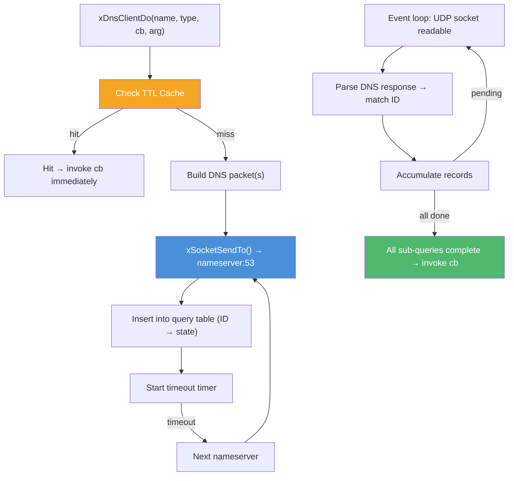

# dns.h — DNS Client

## Introduction

`xDnsClient` is a truly asynchronous DNS resolver. It implements the DNS protocol (RFC 1035) directly over UDP — no `getaddrinfo()`, no thread pool, no blocking calls. A single non-blocking UDP socket is registered with xbase's event loop, and concurrent queries are multiplexed by 16-bit transaction ID.

The client supports A, AAAA, and CNAME record types, EDNS0 OPT records (RFC 6891) advertising a 4096-byte UDP payload size, and DNS name compression (RFC 1035 §4.1.4) in the response parser.

## Design Philosophy

1. **One Socket, Many Queries** — A single UDP socket per client, not one per query. The 16-bit transaction ID in the DNS header multiplexes outstanding queries.

2. **Fire-and-Forget** — `xDnsClientDo()` queues the query and returns immediately. The callback fires on the event loop thread when results arrive (or the query times out).

3. **Cache-First** — When caching is enabled, a cache hit invokes the callback immediately via a zero-timer, avoiding network I/O entirely.

4. **Retry with Rotation** — On timeout, the next nameserver in the configured list is tried. Each nameserver gets up to `retries` attempts before moving on.

5. **Merge, Don't Serialize** — `xDnsType_A | xDnsType_AAAA` sends parallel queries. The callback fires once with all results merged into a single linked list.

## Architecture



## API Reference

### Lifecycle

| Function | Signature | Description |
| --- | --- | --- |
| `xDnsClientCreate` | `xDnsClient xDnsClientCreate(const xDnsClientConf *conf)` | Create a client bound to the current event loop. `conf` may be NULL for defaults. |
| `xDnsClientDestroy` | `void xDnsClientDestroy(xDnsClient client)` | Destroy client. In-flight queries are cancelled; callbacks NOT invoked. Safe with NULL. |
| `xDnsClientDo` | `xErrno xDnsClientDo(xDnsClient client, const char *name, xDnsType type, xDnsCallback cb, void *arg)` | Resolve a hostname asynchronously. |

### Types

#### xDnsClientConf

```c
XDEF_STRUCT(xDnsClientConf) {
  const char *nameservers[8];  // Up to 8 nameservers (NULL-terminated). NULL[0] = auto-detect.
  int          timeout_ms;     // Per-query timeout. Default 5000 ms.
  int          retries;        // Retries with next nameserver. Default 2.
  int          enable_cache;   // 1 = enable TTL cache. Default 1.
};
```

Nameserver strings support optional port: `"8.8.8.8"`, `"8.8.8.8:53"`, `"127.0.0.1:5353"`. Auto-detection reads `/etc/resolv.conf` on POSIX or uses `GetNetworkParams()` on Windows, falling back to `8.8.8.8`.

#### xDnsCallback

```c
typedef void (*xDnsCallback)(xErrno err, const xDnsRecord *records, void *arg);
```

- `err` — `xErrno_Ok` on success (including partial results). `xErrno_Timeout` on total timeout. `xErrno_DnsNotFound` on NXDOMAIN.
- `records` — Linked list of `xDnsRecord`, or NULL on error. Valid only during the callback.
- `arg` — User argument from `xDnsClientDo()`.

#### xDnsRecord

```c
XDEF_STRUCT(xDnsRecord) {
  uint16_t    qtype;      // DNS QTYPE: 1=A, 28=AAAA, 5=CNAME
  uint32_t    ttl;        // TTL in seconds
  const char *name;       // Owner name (NUL-terminated, lowercase)
  const void *rdata;      // Raw RDATA (A: 4 bytes, AAAA: 16 bytes, CNAME: NUL-terminated domain)
  size_t      rdlength;   // Length of rdata in bytes
  xDnsRecord *next;       // Next record in the list, or NULL
};
```

## Usage Examples

### Basic A record resolution

```c
void on_resolve(xErrno err, const xDnsRecord *records, void *arg) {
    if (err != xErrno_Ok) return;
    for (const xDnsRecord *r = records; r; r = r->next) {
        if (r->qtype == 1) {
            char ip[INET_ADDRSTRLEN];
            inet_ntop(AF_INET, r->rdata, ip, sizeof(ip));
            printf("A: %s (TTL=%u)\n", ip, r->ttl);
        }
    }
}

xDnsClientConf conf = {0};
conf.nameservers[0] = "8.8.8.8";
xDnsClient client = xDnsClientCreate(&conf);
xDnsClientDo(client, "example.com", xDnsType_A, on_resolve, NULL);
```

### Parallel A + AAAA

```c
xDnsClientDo(client, "google.com", xDnsType_A | xDnsType_AAAA, on_resolve, NULL);
// Callback receives both A and AAAA records merged into one list.
```

### Auto-discover nameservers

```c
xDnsClientConf conf = {0};  // nameservers[0] is NULL → auto-detect
xDnsClient client = xDnsClientCreate(&conf);
// Reads /etc/resolv.conf on Linux/macOS, GetNetworkParams() on Windows.
```

### TTL caching

```c
xDnsClientConf conf = {0};
conf.nameservers[0] = "8.8.8.8";
conf.enable_cache = 1;

xDnsClient client = xDnsClientCreate(&conf);
xDnsClientDo(client, "example.com", xDnsType_A, on_first, NULL);
// ... later ...
xDnsClientDo(client, "example.com", xDnsType_A, on_second, NULL);
// on_second fires immediately with cached result (within TTL).
```

## Best Practices

- **One client per event loop** — A single client multiplexes all queries over one UDP socket.
- **Copy records in callbacks** — `xDnsRecord` pointers are library-owned and freed after the callback returns.
- **Check error codes** — `xErrno_Ok` means success (possibly with 0 records for NODATA). `xErrno_Timeout` means all nameservers were tried and none responded.
- **Handle partial success** — `A | AAAA` may partially succeed. Check each record's `qtype` individually.
- **Initiate queries before running the loop** — `xDnsClientDo()` must be called from the event loop thread before `xEventLoopRun()`.

## Comparison with Other Libraries

| Feature | xdns client | getaddrinfo + thread pool | c-ares |
| --- | --- | --- | --- |
| **Async Model** | Event-loop native | Thread-pool wrapper | Event-loop native |
| **No Threads** | Yes | No | Yes |
| **Protocol-Native** | Yes (builds DNS packets) | No (OS resolver) | Yes |
| **Bitmask Queries** | Yes (`A \| AAAA`) | No | No (separate calls) |
| **TTL Cache** | Built-in | Varies by OS | Via ares_library_init |
| **EDNS0** | RFC 6891 (4096-byte UDP) | OS-dependent | Yes |
| **Dependencies** | xbase only | POSIX threads | libcares |
| **Language** | C99 | C | C |

## Implementation Details

### Query Lifecycle

```text
xDnsClientDo("example.com", A | AAAA)
    │
    ├─ Cache hit (both types)? → enqueue callback via zero-timer → return
    │
    ├─ For each type bit (A, AAAA):
    │   ├─ Build query packet (header + question + EDNS0 OPT)
    │   ├─ xSocketSendTo(nameserver, 53, packet)
    │   ├─ Insert entry into query table (maps ID → state)
    │   └─ Start timeout timer (timeout_ms)
    │
    └─ Event loop dispatches:
        ├─ UDP socket readable → dns_parse() → match ID → store result
        │   └─ All sub-queries done → merge → invoke callback
        └─ Timer fires → retry next nameserver (or fail all sub-queries)
```

### Packet Structure

```text
Query packet:
┌─────────── 12 bytes ───────────┬──── variable ────┬─── 11 bytes ───┐
│ Header (ID, flags, QDCOUNT=1…) │ Question section │ EDNS0 OPT RR    │
└────────────────────────────────┴──────────────────┴─────────────────┘
```

The EDNS0 OPT record (RFC 6891):

- UDP payload size: 4096 bytes
- Extended RCODE: 0
- Version: 0
- DO bit: not set

### Name Compression

Response parsing handles DNS name compression (RFC 1035 §4.1.4): two high bits of a length octet set to `11` indicate a 14-bit pointer to another location in the message. The parser follows these pointers to reconstruct the full domain name.

### ID Multiplexing

The client uses a hash map keyed by 16-bit transaction ID. Each entry stores:

- Query name (for matching)
- Callback + arg
- Pending sub-query count (for multi-type queries)
- Accumulated record list
- Timeout timer reference

### Nameserver Rotation

On timeout, the client advances to the next nameserver in the configured list. If the last nameserver is reached, it wraps back to the first and increment the retry counter. When retries are exhausted, the query fails with `xErrno_Timeout`.
