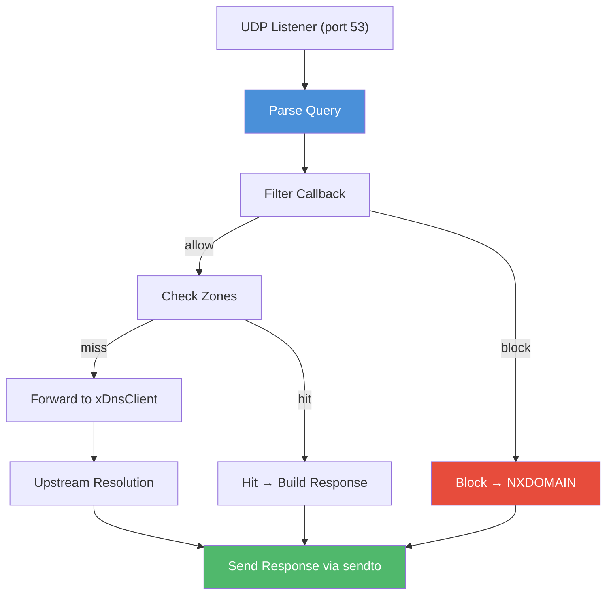

# dns.h — DNS Server

## Introduction

`xDnsServer` is a DNS server that listens on a UDP port and responds to queries using the DNS wire protocol. It supports three modes that can coexist:

- **Authoritative** — Serve records from local zones (`xDnsZone`)
- **Forwarding** — Forward unresolved queries to an upstream `xDnsClient`
- **Filtered** — Intercept, block, or rewrite queries via a filter callback before processing

The server processes queries on the event loop thread. Zone lookups are case-insensitive and checked in registration order (first match wins). When both a zone match and a forwarder are present, the zone takes priority.

## Design Philosophy

1. **Authoritative-First** — Zone records are checked before forwarding. A zone match for the query name + type returns an authoritative response immediately, bypassing the upstream resolver.

2. **Composable Filtering** — The filter callback runs before zone lookup and forwarding, allowing ad-blocking, access control, or custom DNS logic without modifying the core.

3. **Stateless Responses** — Each query is self-contained. The server does not maintain connection state — it parses, processes, and responds in a single callback.

4. **Cache Sharing** — When `cache_enabled` is set, the server's forwarder caches upstream results. Subsequent identical queries are resolved from cache without additional upstream I/O.

## Architecture



## API Reference

### Lifecycle

| Function | Signature | Description |
| --- | --- | --- |
| `xDnsServerCreate` | `xDnsServer xDnsServerCreate(const xDnsServerConf *conf)` | Create server. `conf` may be NULL for authoritative-only with no filter. |
| `xDnsServerDestroy` | `void xDnsServerDestroy(xDnsServer server)` | Destroy server and close listener. Zones are NOT freed. Safe with NULL. |
| `xDnsServerListen` | `xErrno xDnsServerListen(xDnsServer server, const char *host, uint16_t port)` | Start listening on a UDP port. `host` may be NULL for `0.0.0.0`. |
| `xDnsServerPort` | `uint16_t xDnsServerPort(xDnsServer server)` | Return the actual bound port (useful when port was 0). |
| `xDnsServerAddZone` | `xErrno xDnsServerAddZone(xDnsServer server, xDnsZone zone)` | Attach a zone. Zones checked in registration order. |

### Zone

| Function | Signature | Description |
| --- | --- | --- |
| `xDnsZoneCreate` | `xDnsZone xDnsZoneCreate(void)` | Create an empty zone. |
| `xDnsZoneDestroy` | `void xDnsZoneDestroy(xDnsZone zone)` | Destroy zone and free all records. Safe with NULL. |
| `xDnsZoneAdd` | `xErrno xDnsZoneAdd(xDnsZone zone, const char *name, xDnsType type, const void *rdata, size_t rdlen, uint32_t ttl)` | Add a record. `name` and `rdata` are copied. `type` must be exactly one bit. |

### Types

#### xDnsServerConf

```c
XDEF_STRUCT(xDnsServerConf) {
  xDnsClient     forwarder;      // Upstream resolver. NULL = authoritative-only.
  xDnsFilterFunc filter;         // Query filter callback. NULL = no filter.
  void          *filter_arg;     // Argument forwarded to filter.
  int            cache_enabled;  // 1 = share cache with forwarder. Default 0.
};
```

#### xDnsFilterFunc

```c
typedef int (*xDnsFilterFunc)(const char *name, uint16_t type, void *arg);
// Return 0 = allow normal processing. Non-zero = block (responds NXDOMAIN).
```

`name` is NUL-terminated and lowercased. `type` is the DNS QTYPE (1=A, 28=AAAA, etc.).

## Usage Examples

### Authoritative server

```c
xDnsZone zone = xDnsZoneCreate();

uint8_t ip[4] = {192, 168, 1, 100};
xDnsZoneAdd(zone, "myapp.local", xDnsType_A, ip, 4, 3600);

xDnsServerConf conf = {0};
xDnsServer server = xDnsServerCreate(&conf);
xDnsServerAddZone(server, zone);
xDnsServerListen(server, "0.0.0.0", 5353);
// "myapp.local" → 192.168.1.100. Anything else → NXDOMAIN.
```

### Forwarding server (local DNS relay)

```c
xDnsClientConf cconf = {0};
cconf.nameservers[0] = "8.8.8.8";
xDnsClient upstream = xDnsClientCreate(&cconf);

xDnsServerConf sconf = {0};
sconf.forwarder = upstream;
sconf.cache_enabled = 1;

xDnsServer server = xDnsServerCreate(&sconf);
xDnsServerListen(server, "0.0.0.0", 53);
// All queries forwarded to 8.8.8.8, cached, returned.
```

### Authoritative + forwarding (hybrid)

```c
xDnsZone zone = xDnsZoneCreate();
uint8_t local_ip[4] = {10, 0, 0, 1};
xDnsZoneAdd(zone, "internal.corp", xDnsType_A, local_ip, 4, 3600);

xDnsClient upstream = xDnsClientCreate(&(xDnsClientConf){
    .nameservers = {"8.8.8.8"} });

xDnsServerConf conf = {0};
conf.forwarder = upstream;
xDnsServer server = xDnsServerCreate(&conf);
xDnsServerAddZone(server, zone);
xDnsServerListen(server, "0.0.0.0", 53);
// "internal.corp" → 10.0.0.1 (zone). "google.com" → forwarded.
```

### DNS filter

```c
int ad_filter(const char *name, uint16_t type, void *arg) {
    if (strstr(name, "ads.") || strstr(name, "tracker.")) return 1;
    return 0;
}

xDnsClient upstream = xDnsClientCreate(&(xDnsClientConf){
    .nameservers = {"8.8.8.8"} });

xDnsServerConf conf = {0};
conf.forwarder = upstream;
conf.filter = ad_filter;

xDnsServer server = xDnsServerCreate(&conf);
xDnsServerListen(server, "0.0.0.0", 53);
// "ads.tracker.com" → NXDOMAIN. "example.com" → forwarded.
```

### Round-robin zones

```c
uint8_t ip1[4] = {10, 0, 0, 1};
uint8_t ip2[4] = {10, 0, 0, 2};
xDnsZoneAdd(zone, "api.local", xDnsType_A, ip1, 4, 300);
xDnsZoneAdd(zone, "api.local", xDnsType_A, ip2, 4, 300);
// Query for "api.local" → both IPs in answer section.
```

## Best Practices

- **Create forwarder before server** — The `xDnsClient` passed via `xDnsServerConf.forwarder` must outlive the server.
- **Free zones separately** — `xDnsServerDestroy()` does not free zones. Call `xDnsZoneDestroy()` manually.
- **Zone order matters** — Zones are checked in registration order. First match wins.
- **Case-insensitive matching** — `"MyApp.local"` and `"myapp.local"` match the same zone entry.
- **Filter returns 0 to allow** — Non-zero return drops the query with NXDOMAIN.

## Implementation Details

### Query Processing

```text
UDP query received (event loop callback)
    │
    ├─ dns_parse(packet, len) → extract name, type, class, ID
    │
    ├─ filter callback (if set)
    │   └─ returns non-zero → build NXDOMAIN response → send → done
    │
    ├─ zone lookup (case-insensitive, registration order)
    │   └─ found → build authoritative response with zone records → send → done
    │
    ├─ forwarder configured?
    │   ├─ Yes → xDnsClientDo(forwarder, name, type, forward_cb, response_ctx)
    │   │        forward_cb builds response from upstream records → send
    │   └─ No → build NXDOMAIN response → send
    │
    └─ xSocketSendTo(client_addr, response_packet, len)
```

### Response Building

For zone hits, the server constructs a DNS response packet with:

- Header: same ID as query, QR=1 (response), AA=1 (authoritative)
- Question section: echoed from query
- Answer section: matching zone records (formatted as DNS RRs)
- EDNS0 OPT record (if query had one)

For forwarding, the upstream `xDnsClient` resolves the query, and the server builds a response from the returned `xDnsRecord` list, preserving the original query ID.

### Memory Ownership

- **Query packets** — Owned by the caller (stack or heap). The server does not copy or retain them.
- **Response packets** — Built into a stack-allocated buffer (max 4096 bytes for UDP DNS).
- **Zone records** — `xDnsZoneAdd()` copies both `name` and `rdata`. The caller retains ownership of the original data.
