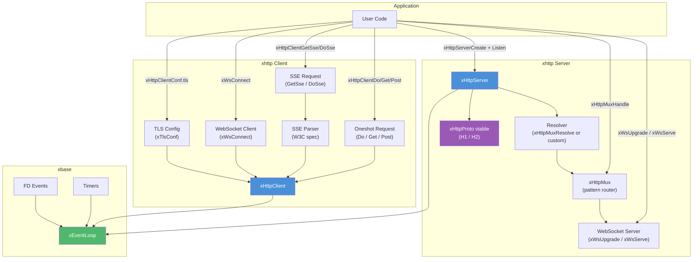

# xhttp — Asynchronous HTTP

## Introduction

**xhttp** is libx's HTTP module: a fully asynchronous HTTP **client** and **server**, plus **WebSocket** and **SSE** support — all powered by xbase's event loop.

- The **client** uses libcurl's multi-socket API for non-blocking HTTP, SSE streaming, and WebSocket connections. TLS is configured at client creation time via `xTlsConf` (custom CA, mTLS, verification control).
- The **server** uses an `xHttpProto` vtable for protocol-abstracted parsing, supporting both HTTP/1.1 (llhttp) and HTTP/2 (nghttp2, h2c Prior Knowledge) on the same port. Routing is decoupled into an `xHttpMux` and resolved per-request via a pluggable resolver callback. TLS listeners via `xHttpServerListenTls`.
- **WebSocket** support is symmetric: `xWsConnect()` for clients, `xWsUpgrade()` (inside an HTTP handler) or `xWsServe()` (one-liner) for servers. Frame codec, ping/pong, fragment reassembly, and close negotiation are handled automatically.

## Unified Type Model

The refactor collapses the previous request, response, and response-writer types into a single context type and four callback types shared by both client and server.

### The `xHttpCtx` struct

```c
XDEF_STRUCT(xHttpCtx) {
  const char *method;       /* Request method (server: from request line; client: NULL) */
  const char *url;          /* Request URL    (server: from request line; client: NULL) */
  long        status_code;  /* HTTP status code (e.g. 200), 0 on failure                 */
  int         curl_code;    /* CURLcode (client only; 0 = CURLE_OK)                      */
  const char *curl_error;   /* Human-readable curl error, or NULL (client only)          */
  const char *headers;      /* Raw headers (NUL-terminated)                              */
  size_t      headers_len;  /* Length of headers in bytes                               */
  void       *internal_;    /* Internal use (server-side response state)                 */
};
```

There is **no `body`/`body_len` field**. Body data is delivered as streaming chunks via `on_data` (download) or pulled via `on_read` (upload). This keeps memory usage flat regardless of transfer size.

### Four symmetric callback types

| Type | Signature | Client | Server |
| --- | --- | --- | --- |
| `xHttpInitFunc` | `int (xHttpCtx *, void *)` | `on_response` — fired once after response headers | `on_request` — fired once after request headers |
| `xHttpDataFunc` | `int (const char *, size_t, void *)` | `on_data` — response body chunks | `on_data` — request body chunks |
| `xHttpReadFunc` | `size_t (char *, size_t, void *)` | `on_read` — pull request body for upload | *(not used)* |
| `xHttpDoneFunc` | `void (xHttpCtx *, void *)` | `on_done` — transfer complete | `on_done` — request fully received |

Both sides use the same `xHttpInitFunc` and `xHttpDoneFunc` types — the only difference is what fields of `xHttpCtx` are populated. On the client, `status_code`/`curl_code`/`curl_error`/`headers` are set. On the server, `method`/`url`/`headers` are set, and response state is written through `internal_` via the `xHttpCtx*` helper functions.

### Symmetric callback model

```
 ┌─────────────── Client (libcurl) ───────────────┐     ┌─────────────── Server (llhttp / nghttp2) ───────────────┐
 │                                                 │     │                                                          │
 │  xHttpClientDo(client, &conf, arg)              │     │  resolver(router, ctx) → xHttpRouteInfo                  │
 │         │                                       │     │         │                                                │
 │         ▼                                       │     │         ▼                                                │
 │  headers received ──► on_response(ctx, arg)     │     │  headers received ──► on_request(ctx, arg)               │
 │         │                  (xHttpInitFunc)      │     │         │                  (xHttpInitFunc)                │
 │         ▼                                       │     │         ▼                                                │
 │  each body chunk ──► on_data(data, len, arg)    │     │  each body chunk ──► on_data(data, len, arg)            │
 │         │                  (xHttpDataFunc)      │     │         │                  (xHttpDataFunc)                │
 │         ▼                                       │     │         ▼                                                │
 │  upload pulled ◄── on_read(buf, n, arg)         │     │  (no on_read on server)                                  │
 │         │                  (xHttpReadFunc)      │     │                                                          │
 │         ▼                                       │     │         ▼                                                │
 │  transfer done ───► on_done(ctx, arg)           │     │  request complete ──► on_done(ctx, arg)                 │
 │                          (xHttpDoneFunc)        │     │  then write response via xHttpCtxSend / xHttpCtxWrite   │
 │                                                 │     │                                                          │
 └─────────────────────────────────────────────────┘     └──────────────────────────────────────────────────────────┘
```

## Design Philosophy

1. **Event Loop Integration** — xhttp registers libcurl's sockets (client) and the listening + connection sockets (server) with [`xEventLoop`](../base/event.md). All callbacks run on the event loop thread — no locks.

2. **Streaming First** — Bodies flow through callbacks as chunks, never buffered in full by the library. Uploads are pulled via `on_read`, downloads pushed via `on_data`. Collect-into-buffer helpers are a few lines of user code (see [client.md](client.md#body-collection-pattern)).

3. **Decoupled Routing (server)** — `xHttpServerCreate(conf)` takes a resolver callback. The built-in `xHttpMux` + `xHttpMuxResolve` covers the common case; custom resolvers can dispatch on any criterion (method, host, header).

4. **Symmetric Callback Types** — Client and server share `xHttpInitFunc`, `xHttpDataFunc`, `xHttpDoneFunc`. Only `xHttpReadFunc` is client-only (upload side).

5. **Automatic Resource Management** — Request contexts, curl easy handles, and buffers are cleaned up after `on_done` returns. In-flight requests are cancelled with error callbacks when the client is destroyed.

## Architecture



## Sub-Module Overview

| File | Description | Doc |
| --- | --- | --- |
| `client.h` | Async HTTP client (xHttpCtx, xHttpRequestConf, GET/POST/Do, SSE) | [client.md](client.md) |
| `server.h` | Async HTTP/1.1 & HTTP/2 server (resolver, xHttpMux, xHttpCtx write API) | [server.md](server.md) |
| `sse.c` | SSE stream parser and request handler | [sse.md](sse.md) |
| `ws.h` (server) | WebSocket server API (xWsUpgrade, xWsServe, send, close) | [ws_server.md](ws_server.md) |
| `ws.h` (client) | WebSocket client API (xWsConnect, send, close) | [ws_client.md](ws_client.md) |
| *(guide)* | TLS deployment guide (cert generation, one-way TLS, mTLS) | [tls.md](tls.md) |

## Quick Start

### Client (GET request)

```c
#include <stdio.h>
#include <string.h>
#include <x/base/event.h>
#include <x/http/client.h>

/* A tiny accumulator — body chunks arrive via on_data. */
struct Resp { long status; char *buf; size_t len; };

static int on_data(const char *data, size_t len, void *arg) {
    struct Resp *r = arg;
    r->buf = realloc(r->buf, r->len + len + 1);
    memcpy(r->buf + r->len, data, len);
    r->len += len;
    r->buf[r->len] = '\0';
    return 0;
}

static void on_done(xHttpCtx *ctx, void *arg) {
    struct Resp *r = arg;
    r->status = ctx->status_code;
    if (ctx->curl_code != 0)
        printf("Error: %s\n", ctx->curl_error ? ctx->curl_error : "?");
    else
        printf("HTTP %ld: %s\n", r->status, r->buf ? r->buf : "(empty)");
}

int main(void) {
    xEventLoop loop = xEventLoopCreate();
    xEventLoopEnter(loop);

    xHttpClient client = xHttpClientCreate(NULL);

    xHttpRequestConf conf = {0};
    conf.url     = "https://httpbin.org/get";
    conf.on_data = on_data;
    conf.on_done = on_done;

    struct Resp r = {0};
    xHttpClientGet(client, &conf, &r);

    xEventLoopRun(loop);

    free(r.buf);
    xHttpClientDestroy(client);
    xEventLoopDestroy(loop);
    return 0;
}
```

### Server (router + handler)

```c
#include <stdio.h>
#include <x/base/event.h>
#include <x/http/server.h>

static void on_hello(xHttpCtx *ctx, void *arg) {
    (void)arg;
    xHttpCtxSetHeader(ctx, "Content-Type", "text/plain");
    xHttpCtxSend(ctx, "Hello, World!\n", 14);
}

int main(void) {
    xEventLoop loop = xEventLoopCreate();
    xEventLoopEnter(loop);

    xHttpMux mux = xHttpMuxCreate();
    xHttpRouteConf route = {
        .pattern    = "GET /hello",
        .on_request = on_hello,
    };
    xHttpMuxHandle(mux, &route);

    xHttpServerConf sconf = {0};
    sconf.resolve = xHttpMuxResolve;
    sconf.router  = mux;

    xHttpServer server = xHttpServerCreate(&sconf);
    xHttpServerListen(server, "0.0.0.0", 8080);

    printf("Listening on :8080\n");
    xEventLoopRun(loop);

    xHttpServerDestroy(server);
    xHttpMuxDestroy(mux);
    xEventLoopDestroy(loop);
    return 0;
}
```

## Relationship with Other Modules

- **xbase** — Uses [`xEventLoop`](../base/event.md) for I/O multiplexing and [`xEventLoopTimerAfter`](../base/timer.md) for curl timeout management and idle-connection timeouts.
- **xbuf** — Uses [`xBuffer`](../buf/buf.md) for header accumulation and [`xIOBuffer`](../buf/io.md) for connection read/write buffering.
- **xnet** — Provides `xTlsConf`, `xTlsCtx`, and DNS resolution used by client, server, and WebSocket code.
- **libcurl** — External dependency (client). Multi-socket API (`curl_multi_socket_action`) for non-blocking HTTP and SSE.
- **llhttp** — External dependency (server). Incremental HTTP/1.1 parsing, isolated behind the `xHttpProto` vtable in `proto_h1.c`.
- **nghttp2** — External dependency (server). HTTP/2 frame processing and HPACK, isolated behind the `xHttpProto` vtable in `proto_h2.c`.
