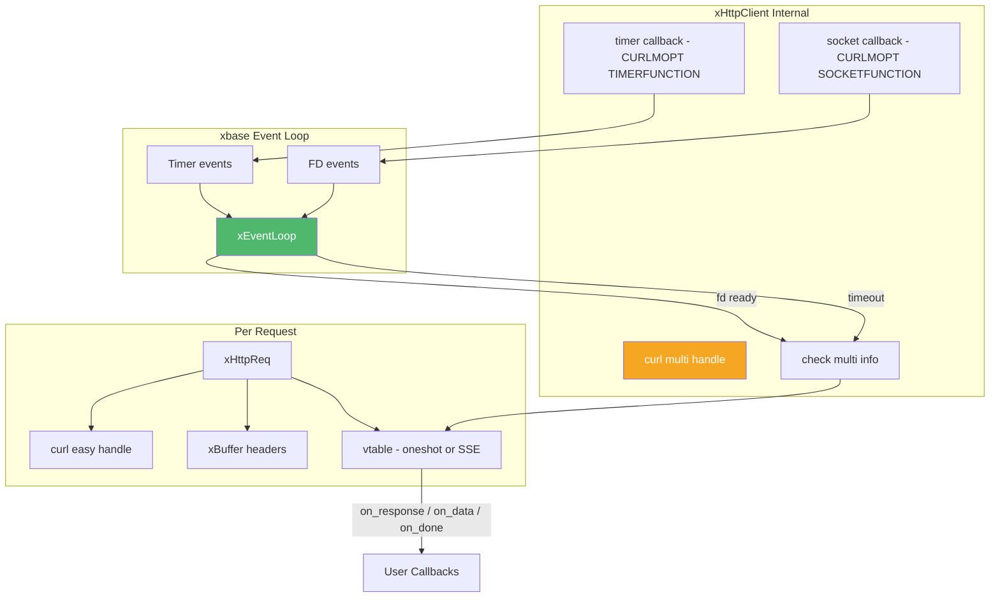
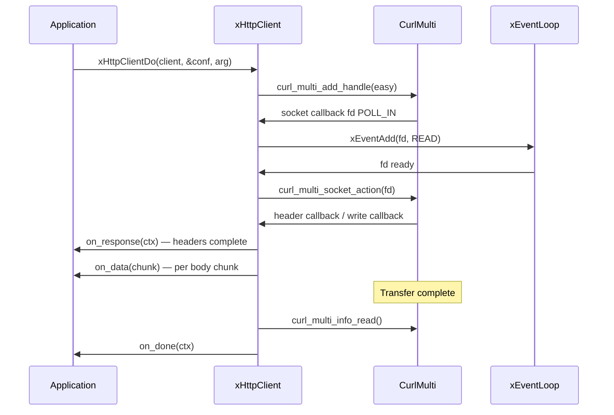
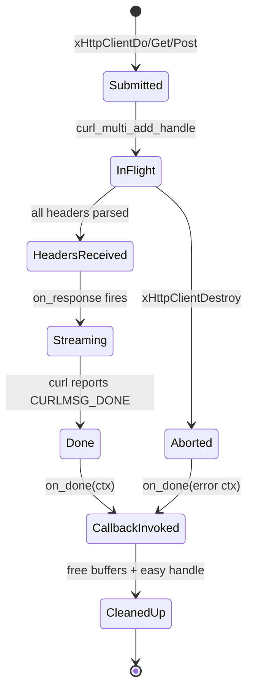

# client.h — Asynchronous HTTP Client

## Introduction

`client.h` provides `xHttpClient`, an asynchronous HTTP client that integrates libcurl's multi-socket API with xbase's event loop. All network I/O is non-blocking and driven by the event loop; completion callbacks are dispatched on the event loop thread. The client supports GET, POST, PUT, DELETE, PATCH, HEAD methods, streaming upload/download, and Server-Sent Events (SSE).

## Design Philosophy

1. **libcurl Multi-Socket Integration** — xhttp uses `CURLMOPT_SOCKETFUNCTION` + `CURLMOPT_TIMERFUNCTION` so libcurl delegates socket monitoring to `xEventLoop`. No dedicated threads, no polling.

2. **Single-Threaded Callback Model** — All callbacks (`on_response`, `on_data`, `on_read`, `on_done`) run on the event loop thread. No locks needed in callback code.

3. **Streaming Bodies** — There is no `body`/`body_len` field on `xHttpCtx`. Response body chunks arrive via `on_data`; request body bytes are pulled via `on_read`. Memory use is flat regardless of transfer size.

4. **One Config Struct, Four Optional Callbacks** — `xHttpRequestConf` carries the URL, method, headers, and the four callbacks. Any callback left `NULL` is skipped — set `on_done` only for fire-and-forget with completion notification, or set all four for full streaming.

5. **Vtable-Based Polymorphism** — Internally, each request carries a vtable (`xHttpReqVtable`) with `on_done` and `on_cleanup` function pointers. Oneshot, SSE, and WebSocket requests share the same curl multi handle and event-loop infrastructure.

## Architecture



## API Reference

### Types

| Type | Description |
| --- | --- |
| `xHttpClient` | Opaque handle to an HTTP client bound to an event loop |
| `xHttpCtx` | Per-request context (status, headers, curl error) — no body field |
| `xHttpInitFunc` | `int (*)(xHttpCtx *ctx, void *arg)` — `on_response`, fired once after headers |
| `xHttpDataFunc` | `int (*)(const char *data, size_t len, void *arg)` — `on_data`, per body chunk |
| `xHttpReadFunc` | `size_t (*)(char *buf, size_t bufsize, void *arg)` — `on_read`, upload pull |
| `xHttpDoneFunc` | `void (*)(xHttpCtx *ctx, void *arg)` — `on_done`, completion |
| `xHttpMethod` | Enum: `GET`, `POST`, `PUT`, `DELETE`, `PATCH`, `HEAD` |
| `xHttpVersion` | Enum: `Default`, `H1`, `H2`, `H2TLS`, `H2C` |
| `xHttpRequestConf` | Per-request configuration (URL, method, headers, callbacks) |
| `xHttpClientConf` | Client creation config (TLS, default HTTP version) |
| `xSseEvent` | SSE event delivered to `xSseEventFunc` |
| `xSseEventFunc` | `int (*)(const xSseEvent *ev, void *arg)` — return 0 to continue, non-zero to close |
| `xSseDoneFunc` | `void (*)(int curl_code, void *arg)` — SSE stream end |
| `xTlsConf` | TLS configuration (CA, client cert/key, skip verify) |

### xHttpCtx

```c
XDEF_STRUCT(xHttpCtx) {
    const char *method;       /* Client: NULL             */
    const char *url;          /* Client: NULL             */
    long        status_code;  /* HTTP status, 0 on failure*/
    int         curl_code;    /* CURLcode, 0 = success    */
    const char *curl_error;   /* Human-readable, or NULL  */
    const char *headers;      /* Raw response headers     */
    size_t      headers_len;
    void       *internal_;    /* Internal (client: NULL)  */
};
```

All pointers are valid only for the duration of the callback. The library manages their lifetime. There is no `body` field — body data is delivered via `on_data` (or discarded if `on_data` is NULL).

### xHttpRequestConf

```c
XDEF_STRUCT(xHttpRequestConf) {
    const char  *url;            /* Required                       */
    xHttpMethod  method;         /* Default GET                    */
    size_t       content_length; /* Body size for on_read (0=chunked) */
    const char **headers;        /* NULL-terminated "Key: Value"   */
    long         timeout_ms;     /* 0 = no limit                   */
    xHttpVersion http_version;   /* 0 = client default             */

    xHttpInitFunc on_response;   /* Once after response headers    */
    xHttpDataFunc on_data;       /* Per body chunk (NULL = discard)*/
    xHttpReadFunc on_read;       /* Upload provider (NULL = no body) */
    xHttpDoneFunc on_done;       /* Completion (NULL = fire-and-forget) */
};
```

Zero-initialize for defaults: GET, no headers, no body, no callbacks, no timeout.

| Field | Notes |
| --- | --- |
| `content_length` | When `on_read` is set: known body size for `Content-Length`, or `0` for `Transfer-Encoding: chunked`. |
| `timeout_ms` | For regular HTTP: total transfer timeout. For SSE: connection-phase timeout only; stalled streams are detected via libcurl's low-speed-time. |
| `on_response` | Returns non-zero to abort before any body data is delivered. |
| `on_data` | Returns non-zero to abort the transfer. |
| `on_read` | Returns bytes written into `buf`; `0` signals EOF. |

### xHttpClientConf

```c
XDEF_STRUCT(xHttpClientConf) {
    const xTlsConf *tls;          /* NULL = no TLS config    */
    xHttpVersion    http_version; /* 0 = H1 (default)        */
};
```

Pass `NULL` to `xHttpClientCreate()` for the same defaults.

### Lifecycle

| Function | Signature | Description |
| --- | --- | --- |
| `xHttpClientCreate` | `xHttpClient xHttpClientCreate(const xHttpClientConf *conf)` | Create a client. `conf` may be NULL for defaults. |
| `xHttpClientDestroy` | `void xHttpClientDestroy(xHttpClient client)` | Destroy client. In-flight requests are cancelled; their `on_done` is invoked with an error status. |

### Request Submission

All three take `(client, conf, arg)` — there is no separate `on_response` parameter. `Get`/`Post` force the method and delegate to `Do`.

| Function | Signature | Description |
| --- | --- | --- |
| `xHttpClientGet` | `xErrno xHttpClientGet(xHttpClient client, const xHttpRequestConf *conf, void *arg)` | Force `conf->method = GET`, delegate to `Do`. |
| `xHttpClientPost` | `xErrno xHttpClientPost(xHttpClient client, const xHttpRequestConf *conf, void *arg)` | Force `conf->method = POST`, delegate to `Do`. Body via `conf->on_read`. |
| `xHttpClientDo` | `xErrno xHttpClientDo(xHttpClient client, const xHttpRequestConf *conf, void *arg)` | Fully-configured async request. All callbacks come from `conf`. |

`arg` is forwarded unchanged to every callback (`on_response`, `on_data`, `on_read`, `on_done`).

### SSE Requests

| Function | Signature | Description |
| --- | --- | --- |
| `xHttpClientGetSse` | `xErrno xHttpClientGetSse(xHttpClient client, const char *url, xSseEventFunc on_event, xSseDoneFunc on_done, void *arg)` | Simple GET SSE subscription. |
| `xHttpClientDoSse` | `xErrno xHttpClientDoSse(xHttpClient client, const xHttpRequestConf *config, xSseEventFunc on_event, xSseDoneFunc on_done, void *arg)` | Fully-configured SSE request — POST + JSON body for LLM APIs. `Accept: text/event-stream` is added automatically. |

See [sse.md](sse.md) for SSE details.

### HTTP Version Configuration

The `xHttpClientConf.http_version` field sets the default for all requests; `xHttpRequestConf.http_version` overrides per-request (0 = use client default).

| Value | Description |
| --- | --- |
| `xHttpVersion_Default` | Use client default (initially HTTP/1.1) |
| `xHttpVersion_H1` | Force HTTP/1.1 |
| `xHttpVersion_H2` | HTTP/2 with TLS (ALPN), fallback to H1 |
| `xHttpVersion_H2TLS` | HTTP/2 over TLS only, no fallback |
| `xHttpVersion_H2C` | HTTP/2 cleartext (Prior Knowledge) |

### TLS Configuration

TLS is configured at client creation time via `xHttpClientConf.tls`. The `xTlsConf` fields are deep-copied internally.

| `xTlsConf` Field | Description |
| --- | --- |
| `ca` | Path to a CA cert file. When set, system CA bundle is bypassed. |
| `cert` | Path to a client cert (PEM) for mTLS. |
| `key` | Path to the client private key (PEM). |
| `key_password` | Passphrase for an encrypted private key. |
| `skip_verify` | Non-zero to skip server cert verification (dev only). |

To change TLS config, destroy and recreate the client.

## Usage Examples

### Simple GET (collect body via `on_data`)

```c
#include <stdio.h>
#include <stdlib.h>
#include <string.h>
#include <x/base/event.h>
#include <x/http/client.h>

struct Resp {
    long       status;
    int        curl_code;
    char      *buf;
    size_t     len;
};

static int on_data(const char *data, size_t len, void *arg) {
    struct Resp *r = arg;
    r->buf = realloc(r->buf, r->len + len + 1);
    if (!r->buf) return 1; /* abort on OOM */
    memcpy(r->buf + r->len, data, len);
    r->len += len;
    r->buf[r->len] = '\0';
    return 0;
}

static void on_done(xHttpCtx *ctx, void *arg) {
    struct Resp *r = arg;
    r->status    = ctx->status_code;
    r->curl_code = ctx->curl_code;
    if (ctx->curl_code != 0)
        printf("Error: %s\n", ctx->curl_error ? ctx->curl_error : "?");
    else
        printf("HTTP %ld, %zu bytes\n", r->status, r->len);
}

int main(void) {
    xEventLoop loop = xEventLoopCreate();
    xEventLoopEnter(loop);

    xHttpClient client = xHttpClientCreate(NULL);

    xHttpRequestConf conf = {0};
    conf.url     = "https://httpbin.org/get";
    conf.on_data = on_data;
    conf.on_done = on_done;

    struct Resp r = {0};
    xHttpClientGet(client, &conf, &r);

    xEventLoopRun(loop);

    free(r.buf);
    xHttpClientDestroy(client);
    xEventLoopDestroy(loop);
    return 0;
}
```

### HTTPS with TLS configuration

```c
xTlsConf tls = {0};
tls.skip_verify = 1;                       /* dev only */
xHttpClientConf conf = {.tls = &tls};
xHttpClient client = xHttpClientCreate(&conf);

xHttpRequestConf req = {0};
req.url     = "https://secure.example.com/api";
req.on_done = on_done;
xHttpClientGet(client, &req, NULL);
```

### POST with a static body (`on_read`)

```c
#include <string.h>
#include <x/base/event.h>
#include <x/http/client.h>

struct Upload {
    const char *data;
    size_t      len;
    size_t      off;
};

static size_t on_read(char *buf, size_t bufsize, void *arg) {
    struct Upload *u = arg;
    size_t remaining = u->len - u->off;
    if (remaining == 0) return 0;            /* EOF */
    size_t n = bufsize < remaining ? bufsize : remaining;
    memcpy(buf, u->data + u->off, n);
    u->off += n;
    return n;
}

static void on_done(xHttpCtx *ctx, void *arg) {
    (void)arg;
    if (ctx->curl_code == 0)
        printf("POST → HTTP %ld\n", ctx->status_code);
    else
        printf("Error: %s\n", ctx->curl_error);
}

int main(void) {
    xEventLoop loop = xEventLoopCreate();
    xEventLoopEnter(loop);

    xHttpClient client = xHttpClientCreate(NULL);

    const char *body = "{\"key\": \"value\"}";
    struct Upload up = { body, strlen(body), 0 };

    const char *headers[] = {
        "Content-Type: application/json",
        "Authorization: Bearer token123",
        NULL,
    };

    xHttpRequestConf conf = {0};
    conf.url            = "https://api.example.com/data";
    conf.method         = xHttpMethod_POST;
    conf.content_length = up.len;
    conf.headers        = headers;
    conf.on_read        = on_read;
    conf.on_done        = on_done;

    xHttpClientPost(client, &conf, &up);

    xEventLoopRun(loop);
    xHttpClientDestroy(client);
    xEventLoopDestroy(loop);
    return 0;
}
```

### POST with chunked streaming upload

Omit `content_length` (leave it 0) when the total size is unknown or when streaming generated data. libcurl sends `Transfer-Encoding: chunked` automatically.

```c
static size_t on_read_chunked(char *buf, size_t bufsize, void *arg) {
    /* Generate or pull next chunk. Return 0 to signal EOF. */
    size_t n = produce_next_chunk(buf, bufsize, arg);
    return n;
}

xHttpRequestConf conf = {0};
conf.url            = "https://api.example.com/upload";
conf.method         = xHttpMethod_POST;
conf.content_length = 0;            /* chunked */
conf.on_read        = on_read_chunked;
conf.on_done        = on_done;
```

### Streaming download (write to file as chunks arrive)

```c
static int on_data_to_file(const char *data, size_t len, void *arg) {
    FILE *f = arg;
    fwrite(data, 1, len, f);
    return 0;
}

xHttpRequestConf conf = {0};
conf.url     = "https://example.com/large-file.bin";
conf.on_data = on_data_to_file;
conf.on_done = on_done;
xHttpClientGet(client, &conf, fopen("out.bin", "wb"));
```

### Inspect headers before deciding to download

`on_response` fires once after headers are parsed. Return non-zero to abort before any body data is transferred.

```c
static int on_response(xHttpCtx *ctx, void *arg) {
    if (ctx->status_code != 200) {
        printf("Not OK: %ld, aborting\n", ctx->status_code);
        return 1;                         /* abort — on_done fires with error */
    }
    return 0;                             /* continue to on_data */
}

xHttpRequestConf conf = {0};
conf.url        = "https://example.com/resource";
conf.on_response = on_response;
conf.on_data    = on_data;
conf.on_done    = on_done;
```

## Body Collection Pattern

The library deliberately does not provide a built-in "collect body into a buffer" helper — it is a few lines of user code, and inlining it lets you choose your own allocator and growth strategy. The pattern is always the same:

```c
struct Body { char *data; size_t len, cap; };

static int body_collect(const char *data, size_t len, void *arg) {
    struct Body *b = arg;
    if (b->len + len + 1 > b->cap) {
        size_t ncap = b->cap ? b->cap * 2 : 4096;
        while (ncap < b->len + len + 1) ncap *= 2;
        char *p = realloc(b->data, ncap);
        if (!p) return 1;                 /* abort on OOM */
        b->data = p;
        b->cap  = ncap;
    }
    memcpy(b->data + b->len, data, len);
    b->len += len;
    b->data[b->len] = '\0';               /* NUL-terminate for convenience */
    return 0;
}
```

Pass `body_collect` as `conf.on_data` and read `b->data` / `b->len` from `on_done`. The same pattern works for `on_read` upload in reverse — keep an offset and copy out of your source buffer.

## Use Cases

1. **REST API Integration** — Async calls to microservices, cloud APIs, or webhooks from an event-driven C application.
2. **Streaming Uploads / Downloads** — Large file transfers without buffering the whole payload in memory. Use `on_read` to pull from a file or generator; use `on_data` to write chunks to disk as they arrive.
3. **LLM API Calls** — `xHttpClientDoSse()` with POST + JSON body to stream from OpenAI, Anthropic, or any OpenAI-compatible API. See [sse.md](sse.md).
4. **Conditional Fetches** — Inspect status and headers in `on_response`, abort early on 3xx/4xx before any body data is transferred.
5. **Health Checks / Monitoring** — Periodically poll endpoints from a timer callback on the same event loop.

## Best Practices

- **Don't block in callbacks.** All callbacks run on the event loop thread. Blocking delays every other I/O on the loop.
- **Copy data you need to keep.** Pointers in `xHttpCtx` (`headers`, `curl_error`) and the `data` pointer in `on_data` are valid only during the callback.
- **Use `xHttpClientDo()` for full control.** `Get`/`Post` are thin wrappers that force the method — `Do` accepts whatever is in `conf`.
- **Destroy the client before the event loop.** `xHttpClientDestroy()` cancels in-flight requests and invokes their `on_done` with an error status before resources are freed.
- **Check `curl_code` first.** A `curl_code` of 0 means the HTTP transfer succeeded; then check `status_code` for the HTTP-level result. Non-zero `curl_code` indicates a transport/DNS/TLS failure.
- **Never use `skip_verify` in production.** It disables all certificate validation. Use a proper CA path or system CA bundle instead.
- **For SSE, `timeout_ms` only covers the connection phase.** Once the stream is established, stalled streams are detected via libcurl's low-speed-time mechanism, preventing premature disconnection during slow LLM token generation.

## Comparison with Other Libraries

| Feature | xhttp client.h | libcurl easy API | cpp-httplib | Python requests |
| --- | --- | --- | --- | --- |
| **I/O Model** | Async (event loop) | Blocking | Blocking | Blocking |
| **Event Loop** | xEventLoop integration | None (or manual multi) | None | None (asyncio separate) |
| **Streaming Upload** | `on_read` callback | `READFUNCTION` | No | No (stream=...) |
| **Streaming Download** | `on_data` callback | `WRITEFUNCTION` | No | `iter_content` |
| **SSE Support** | Built-in (`GetSse`/`DoSse`) | Manual parsing | No | No (needs `sseclient`) |
| **TLS Config** | `xHttpClientConf.tls` at creation | `curl_easy_setopt` (manual) | Built-in | `verify`/`cert` params |
| **Thread Model** | Single-threaded callbacks | One thread per request | One thread per request | One thread per request |
| **Language** | C99 | C | C++ | Python |

**Key Differentiator:** xhttp provides true event-loop-integrated async HTTP with streaming upload **and** download, plus a built-in SSE parser — all from a single-threaded callback model. The multi-socket API integration means zero-overhead I/O multiplexing alongside other event-loop sources (timers, signals, custom FDs).

## Implementation Details

### libcurl + xEventLoop Integration



### Socket Callback Flow

When libcurl needs to monitor a socket, it calls `socket_callback`:

1. **`CURL_POLL_REMOVE`** — Unregister the fd from the event loop (`xEventDel`).
2. **`CURL_POLL_IN`/`OUT`/`INOUT`** — Register or update the fd with the event loop (`xEventAdd`/`xEventMod`).

Each socket gets an `xHttpSocketCtx_` mapping the fd back to the client and event source.

### Timer Callback Flow

When libcurl needs a timeout:

1. **`timeout_ms == -1`** — Cancel any existing timer.
2. **`timeout_ms == 0`** — Schedule a 1ms timer (deferred to avoid reentrant `curl_multi_socket_action`).
3. **`timeout_ms > 0`** — Schedule via `xEventLoopTimerAfter`.

When the timer fires, `curl_multi_socket_action(CURL_SOCKET_TIMEOUT)` is called.

### Request Lifecycle


