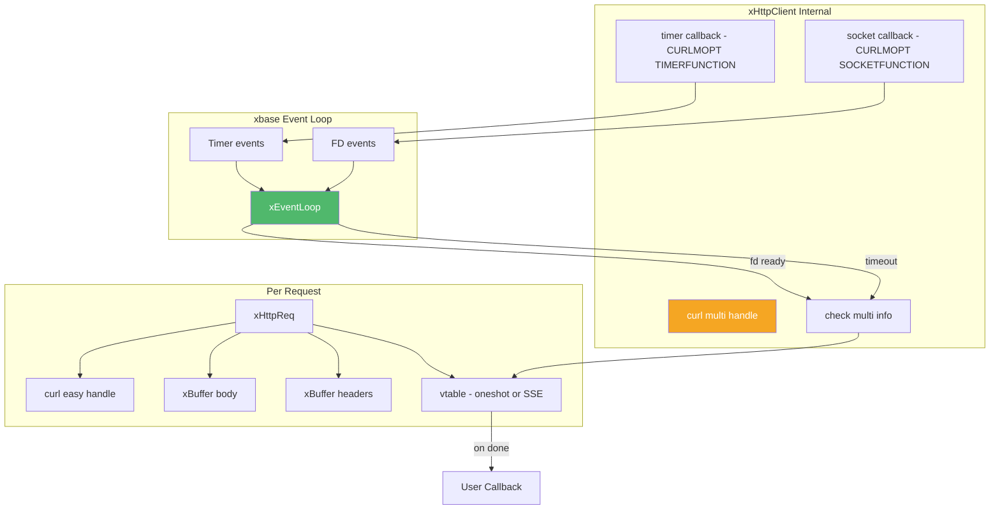
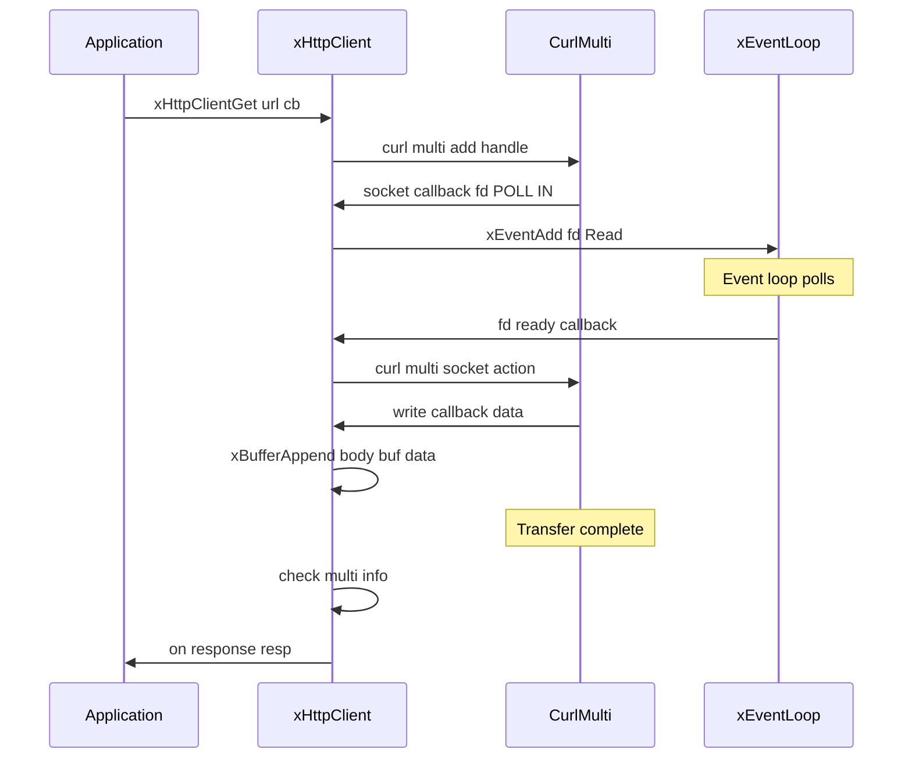
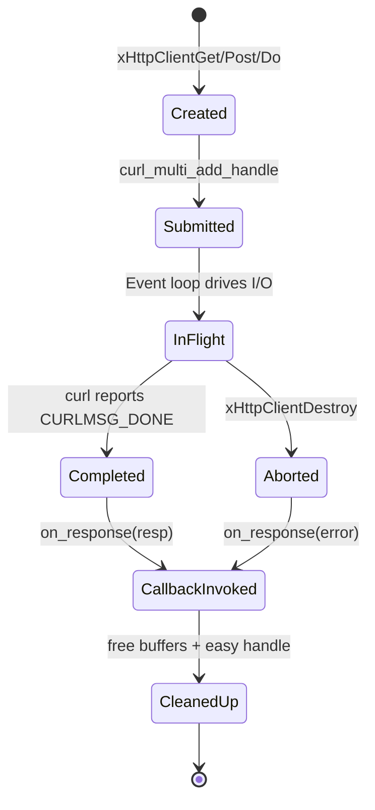

# client.h — Asynchronous HTTP Client

## Introduction

`client.h` provides `xHttpClient`, an asynchronous HTTP client that integrates libcurl's multi-socket API with xbase's event loop. All network I/O is non-blocking and driven by the event loop; completion callbacks are dispatched on the event loop thread. The client supports GET, POST, PUT, DELETE, PATCH, HEAD methods and Server-Sent Events (SSE) streaming.

## Design Philosophy

1. **libcurl Multi-Socket Integration** — Rather than using libcurl's easy (blocking) API or multi-perform (polling) API, xhttp uses the multi-socket API (`CURLMOPT_SOCKETFUNCTION` + `CURLMOPT_TIMERFUNCTION`). This allows libcurl to delegate socket monitoring to xEventLoop, achieving true event-driven I/O without dedicated threads.

2. **Single-Threaded Callback Model** — All callbacks (response, SSE events, done) are invoked on the event loop thread. No locks are needed in callback code.

3. **Vtable-Based Polymorphism** — Internally, each request carries a vtable (`xHttpReqVtable`) with `on_done` and `on_cleanup` function pointers. Oneshot requests and SSE requests use different vtables, sharing the same curl multi handle and completion infrastructure.

4. **Automatic Body Copy** — POST/PUT request bodies are copied internally (`malloc` + `memcpy`), so the caller doesn't need to keep the body alive after submitting the request.

## Architecture



## API Reference

### Types

| Type | Description |
| --- | --- |
| `xHttpClient` | Opaque handle to an HTTP client bound to an event loop |
| `xHttpClientConf` | Configuration struct for creating a client (TLS, HTTP version) |
| `xHttpResponse` | Response data delivered to the completion callback |
| `xHttpResponseFunc` | `void (*)(const xHttpResponse *resp, void *arg)` |
| `xHttpMethod` | Enum: `GET`, `POST`, `PUT`, `DELETE`, `PATCH`, `HEAD` |
| `xHttpVersion` | Enum: `Default`, `H1`, `H2`, `H2TLS`, `H2C` |
| `xHttpRequestConf` | Configuration struct for generic requests |
| `xSseEvent` | SSE event data delivered to the event callback |
| `xSseEventFunc` | `int (*)(const xSseEvent *ev, void *arg)` — return 0 to continue, non-zero to close |
| `xSseDoneFunc` | `void (*)(int curl_code, void *arg)` |
| `xTlsConf` | TLS configuration for the client (CA path, client cert/key, skip verify) |

### Lifecycle

| Function | Signature | Description | Thread Safety |
| --- | --- | --- | --- |
| `xHttpClientCreate` | `xHttpClient xHttpClientCreate(const xHttpClientConf *conf)` | Create a client. Pass `NULL` for defaults. | Not thread-safe |
| `xHttpClientDestroy` | `void xHttpClientDestroy(xHttpClient client)` | Destroy client. In-flight requests get error callbacks. | Not thread-safe |

### TLS Configuration

TLS is configured at client creation time via
`xHttpClientConf`. The `xTlsConf` fields are
deep-copied internally; the caller does not need to
keep them alive after creation.

#### `xTlsConf` Fields (Client)

| Field | Type | Description |
| --- | --- | --- |
| `ca` | `const char *` | Path to a CA certificate file for server verification. When set, the system CA bundle is bypassed. |
| `cert` | `const char *` | Path to a client certificate file (PEM) for mutual TLS (mTLS). |
| `key` | `const char *` | Path to the client private key file (PEM) for mTLS. |
| `key_password` | `const char *` | Passphrase for an encrypted client private key. |
| `skip_verify` | `int` | If non-zero, skip server certificate verification (useful for self-signed certs in development). |

All string fields are deep-copied internally; the caller does not need to keep them alive after the call.

### HTTP Version Configuration

The `xHttpClientConf.http_version` field controls the default HTTP
protocol version for all requests made through the client. It can be
overridden per-request via `xHttpRequestConf.http_version`.

| Value | Description |
| --- | --- |
| `xHttpVersion_Default` | Use client default (initially HTTP/1.1) |
| `xHttpVersion_H1` | Force HTTP/1.1 |
| `xHttpVersion_H2` | HTTP/2 with TLS (ALPN), fallback to H1 |
| `xHttpVersion_H2TLS` | HTTP/2 over TLS only, no fallback |
| `xHttpVersion_H2C` | HTTP/2 cleartext (Prior Knowledge) |

### Request Configuration

`xHttpRequestConf` provides full control over individual requests:

| Field | Type | Description |
| --- | --- | --- |
| `url` | `const char *` | Request URL (must not be NULL) |
| `method` | `xHttpMethod` | HTTP method (default: GET) |
| `body` | `const char *` | Request body, or NULL |
| `body_len` | `size_t` | Length of body in bytes |
| `headers` | `const char **` | NULL-terminated array of "Key: Value" |
| `timeout_ms` | `long` | Per-request timeout in ms (0 = no limit). For regular HTTP: total transfer timeout. For SSE: connection-phase timeout only; stalled streams are detected via low-speed-time instead. |
| `http_version` | `xHttpVersion` | HTTP version override (0 = use client default) |

### Convenience Requests

| Function | Signature | Description | Thread Safety |
| --- | --- | --- | --- |
| `xHttpClientGet` | `xErrno xHttpClientGet(xHttpClient client, const char *url, xHttpResponseFunc on_response, void *arg)` | Async GET request. | Not thread-safe |
| `xHttpClientPost` | `xErrno xHttpClientPost(xHttpClient client, const char *url, const char *body, size_t body_len, xHttpResponseFunc on_response, void *arg)` | Async POST request. Body is copied internally. | Not thread-safe |

### Generic Request

| Function | Signature | Description | Thread Safety |
| --- | --- | --- | --- |
| `xHttpClientDo` | `xErrno xHttpClientDo(xHttpClient client, const xHttpRequestConf *config, xHttpResponseFunc on_response, void *arg)` | Fully-configured async request. | Not thread-safe |

### SSE Requests

| Function | Signature | Description | Thread Safety |
| --- | --- | --- | --- |
| `xHttpClientGetSse` | `xErrno xHttpClientGetSse(xHttpClient client, const char *url, xSseEventFunc on_event, xSseDoneFunc on_done, void *arg)` | Subscribe to SSE endpoint (GET). | Not thread-safe |
| `xHttpClientDoSse` | `xErrno xHttpClientDoSse(xHttpClient client, const xHttpRequestConf *config, xSseEventFunc on_event, xSseDoneFunc on_done, void *arg)` | Fully-configured SSE request (e.g., POST for LLM APIs). | Not thread-safe |

## Usage Examples

### Simple GET Request

```c
#include <stdio.h>
#include <x/base/event.h>
#include <x/http/client.h>

static void on_response(const xHttpResponse *resp, void *arg) {
    (void)arg;
    if (resp->curl_code == 0) {
        printf("HTTP %ld\n", resp->status_code);
        printf("%.*s\n", (int)resp->body_len, resp->body);
    } else {
        printf("Error: %s\n", resp->curl_error);
    }
}

int main(void) {
    xEventLoop loop = xEventLoopCreate();

    xEventLoopEnter(loop);

    xHttpClient client = xHttpClientCreate(NULL);

    xHttpClientGet(client, "https://httpbin.org/get", on_response, NULL);

    xEventLoopRun(loop);
    xHttpClientDestroy(client);
    xEventLoopDestroy(loop);
    return 0;
}
```

### HTTPS with TLS Configuration

```c
#include <x/base/event.h>
#include <x/http/client.h>

static void on_response(const xHttpResponse *resp,
                        void *arg) {
    (void)arg;
    printf("Status: %ld\n", resp->status_code);
}

int main(void) {
    xEventLoop loop = xEventLoopCreate();

    xEventLoopEnter(loop);

    // Skip certificate verification (dev only)
    xTlsConf tls = {0};
    tls.skip_verify = 1;
    xHttpClientConf conf = {.tls = &tls};
    xHttpClient client =
        xHttpClientCreate(&conf);

    xHttpClientGet(
        client,
        "https://secure.example.com/api",
        on_response, NULL);

    xEventLoopRun(loop);
    xHttpClientDestroy(client);
    xEventLoopDestroy(loop);
    return 0;
}
```

### POST with Custom Headers

```c
#include <x/base/event.h>
#include <x/http/client.h>

static void on_response(const xHttpResponse *resp, void *arg) {
    (void)arg;
    printf("Status: %ld, Body: %.*s\n",
           resp->status_code, (int)resp->body_len, resp->body);
}

int main(void) {
    xEventLoop loop = xEventLoopCreate();

    xEventLoopEnter(loop);

    xHttpClient client = xHttpClientCreate(NULL);

    const char *headers[] = {
        "Content-Type: application/json",
        "Authorization: Bearer token123",
        NULL
    };

    xHttpRequestConf config = {
        .url       = "https://api.example.com/data",
        .method    = xHttpMethod_POST,
        .body      = "{\"key\": \"value\"}",
        .body_len  = 16,
        .headers   = headers,
        .timeout_ms = 5000,
    };

    xHttpClientDo(client, &config, on_response, NULL);

    xEventLoopRun(loop);
    xHttpClientDestroy(client);
    xEventLoopDestroy(loop);
    return 0;
}
```

## Use Cases

1. **REST API Integration** — Make async HTTP calls to microservices, cloud APIs, or webhooks from an event-driven C application.

2. **Secure Communication** — Pass TLS config
   via `xHttpClientConf` at creation time to
   configure custom CA certificates, client
   certificates for mTLS, or skip verification
   for development environments with self-signed
   certs.

3. **LLM API Calls** — Use `xHttpClientDoSse()` with POST method and JSON body to stream responses from OpenAI, Anthropic, or other LLM APIs. See [sse.md](sse.md) for a complete example.

4. **Health Checks / Monitoring** — Periodically poll HTTP endpoints using timer-driven GET requests within the event loop.

## Best Practices

- **Don't block in callbacks.** Callbacks run on the event loop thread. Blocking delays all other I/O.
- **Copy data you need to keep.** Response pointers (`body`, `headers`) are only valid during the callback.
- **Use `xHttpClientDo()` for complex requests.** The convenience helpers (`Get`/`Post`) are for simple cases; `Do` gives full control over method, headers, body, and timeout.
- **Destroy the client before the event loop.** `xHttpClientDestroy()` cancels in-flight requests and invokes their callbacks with error status.
- **Check `curl_code` first.** A `curl_code` of 0 means the HTTP transfer succeeded; then check `status_code` for the HTTP-level result.
- **Never use `skip_verify` in production.** It disables all certificate validation. Use a proper CA path or system CA bundle instead.
- **TLS config is set at creation time.** Pass
  `xHttpClientConf` with TLS settings when creating
  the client; it affects both oneshot and SSE
  requests. To change TLS config, destroy and
  recreate the client.
- **For SSE, `timeout_ms` only covers the connection phase.** Once the stream is established, stalled streams are detected via libcurl's low-speed-time mechanism instead of a hard timeout. This prevents premature disconnection during slow LLM token generation.

## Comparison with Other Libraries

| Feature | xhttp client.h | libcurl easy API | cpp-httplib | Python requests |
| --- | --- | --- | --- | --- |
| **I/O Model** | Async (event loop) | Blocking | Blocking | Blocking |
| **Event Loop** | xEventLoop integration | None (or manual multi) | None | None (asyncio separate) |
| **SSE Support** | Built-in (`GetSse`/`DoSse`) | Manual parsing | No | No (needs `sseclient`) |
| **TLS Config** | `xHttpClientConf.tls` at creation | `curl_easy_setopt` (manual) | Built-in | `verify`/`cert` params |
| **Thread Model** | Single-threaded callbacks | One thread per request | One thread per request | One thread per request |
| **Memory** | Automatic (xBuffer) | Manual (`WRITEFUNCTION`) | Automatic (std::string) | Automatic (Python GC) |
| **Language** | C99 | C | C++ | Python |

**Key Differentiator:** xhttp provides true event-loop-integrated async HTTP with built-in SSE support. Unlike libcurl's easy API (which blocks) or multi-perform API (which requires polling), xhttp uses the multi-socket API for zero-overhead integration with xEventLoop. The built-in SSE parser makes it uniquely suited for LLM API integration from C.

## Implementation Details

### libcurl + xEventLoop Integration



### Socket Callback Flow

When libcurl needs to monitor a socket, it calls `socket_callback`:

1. **CURL_POLL_REMOVE** — Unregister the fd from the event loop (`xEventDel`).
2. **CURL_POLL_IN/OUT/INOUT** — Register or update the fd with the event loop (`xEventAdd`/`xEventMod`).

Each socket gets an `xHttpSocketCtx_` that maps the fd to the client and event source.

### Timer Callback Flow

When libcurl needs a timeout:

1. **timeout_ms == -1** — Cancel any existing timer.
2. **timeout_ms == 0** — Schedule a 1ms timer (deferred to avoid reentrant `curl_multi_socket_action`).
3. **timeout_ms > 0** — Schedule a timer via `xEventLoopTimerAfter`.

When the timer fires, `curl_multi_socket_action(CURL_SOCKET_TIMEOUT)` is called.

### Request Lifecycle



### Response Structure

```c
XDEF_STRUCT(xHttpResponse) {
    long        status_code;  // HTTP status (200, 404, etc.), 0 on failure
    const char *headers;      // Raw headers (NUL-terminated)
    size_t      headers_len;
    const char *body;         // Response body (NUL-terminated)
    size_t      body_len;
    int         curl_code;    // CURLcode (0 = success)
    const char *curl_error;   // Human-readable error, or NULL
};
```

All pointers are valid only during the callback. The library manages their lifetime.
