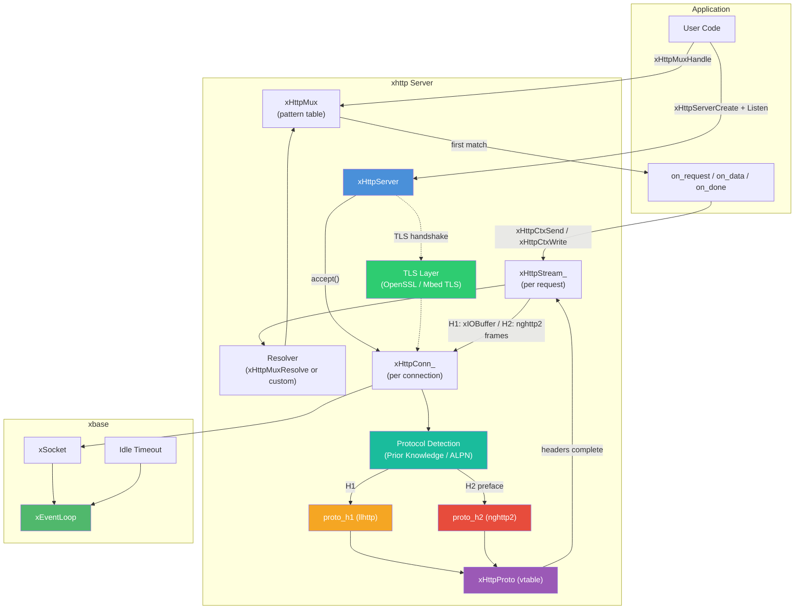
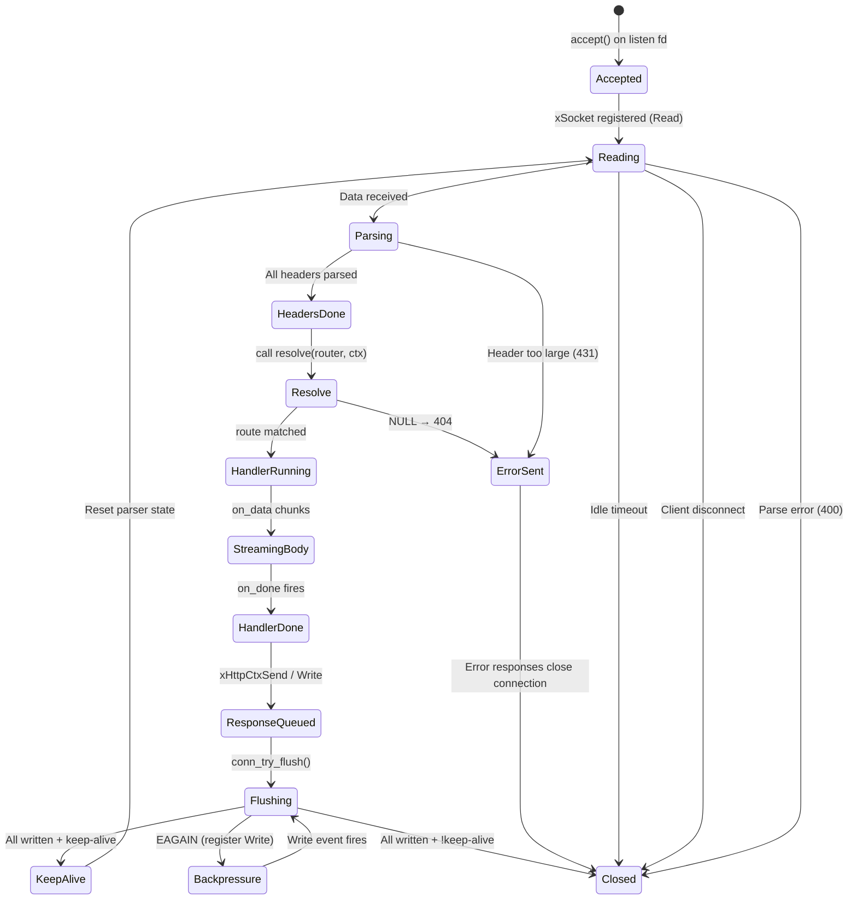
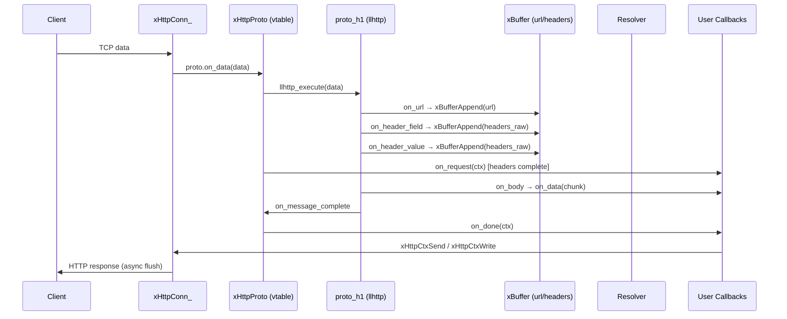

# server.h — Asynchronous HTTP/1.1 & HTTP/2 Server

## Introduction

`server.h` provides `xHttpServer`, an asynchronous, non-blocking HTTP server powered by xbase's event loop. The server supports both **HTTP/1.1** (llhttp) and **HTTP/2** (nghttp2, h2c Prior Knowledge) on the same port with automatic protocol detection. TLS/HTTPS listeners are supported via `xHttpServerListenTls()` with pluggable TLS backends (OpenSSL or Mbed TLS). All connection handling, request parsing, and response writing happen on a single thread — no locks or thread pools.

Routing is decoupled from the server: `xHttpServerCreate(conf)` takes a resolver callback that maps each incoming request to a `xHttpRouteInfo` (a struct of `on_request` / `on_data` / `on_done` callbacks). The built-in `xHttpMux` provides pattern-based routing; custom resolvers can dispatch on any criterion.

## Design Philosophy

1. **Single-Threaded Event-Driven I/O** — Accept, read, parse, dispatch, and write all happen on the event loop thread, eliminating synchronization overhead.

2. **Protocol-Abstracted Parsing** — Request parsing is delegated to a protocol handler behind the `xHttpProto` vtable. HTTP/1.1 (`proto_h1.c`) uses llhttp; HTTP/2 (`proto_h2.c`) uses nghttp2. Both share the same connection management, routing, and response-writing layers.

3. **Decoupled Resolver** — `xHttpServerConf.resolve` is a function pointer. The server does not own route state — your resolver returns a `xHttpRouteInfo *` (which may come from a `xHttpMux`, a static table, or computed on the fly). This makes routing trivially extensible.

4. **Streaming Request Body** — Request body chunks arrive via `on_data`; the request is complete when `on_done` fires. There is no `body`/`body_len` field on `xHttpCtx` and no `max_body_size` limit — the application decides how much to buffer.

5. **Response via `xHttpCtx*` functions** — `xHttpCtxSetStatus`, `xHttpCtxSetHeader`, `xHttpCtxSend` (one-shot), `xHttpCtxWrite` (streaming), `xHttpCtxYield` / `xHttpCtxResume` (async response), `xHttpCtxParam` (path parameters). No separate response writer handle.

6. **Defensive Limits** — Configurable limits on header size (default 8 KiB) and idle timeout (default 60 s) protect against slow clients. Violations produce appropriate 4xx error responses.

7. **Pluggable TLS** — TLS via `xHttpServerListenTls()` with `xTlsConf`. ALPN negotiation selects HTTP/1.1 or HTTP/2 over TLS. mTLS is supported when `ca` is set (verification enabled by default).

## Architecture



## API Reference

### Types

| Type | Description |
| --- | --- |
| `xHttpServer` | Opaque handle to an HTTP server bound to an event loop |
| `xHttpMux` | Opaque handle to the built-in pattern router |
| `xHttpCtx` | Per-request context (method, url, headers, internal response state) |
| `xHttpInitFunc` | `int (*)(xHttpCtx *ctx, void *arg)` — `on_request`, fired after headers |
| `xHttpDataFunc` | `int (*)(const char *data, size_t len, void *arg)` — `on_data`, request body chunks |
| `xHttpDoneFunc` | `void (*)(xHttpCtx *ctx, void *arg)` — `on_done`, request complete |
| `xHttpResolveFunc` | `const xHttpRouteInfo *(*)(void *router, xHttpCtx *ctx)` — maps a request to a route |
| `xHttpRouteInfo` | Struct returned by the resolver: `on_request` / `on_data` / `on_done` / `arg` |
| `xHttpServerConf` | Server creation config: `resolve`, `router`, `idle_timeout_ms`, `max_header_size` |
| `xHttpRouteConf` | Route registration for `xHttpMux`: `pattern` + the three callbacks + `arg` |
| `xTlsConf` | TLS configuration for HTTPS listeners |

### xHttpServerConf

```c
XDEF_STRUCT(xHttpServerConf) {
    xHttpResolveFunc resolve;         /* NULL → all requests get 404 */
    void            *router;          /* Opaque, passed to resolve  */
    int              idle_timeout_ms; /* 0 = default (60000 ms)     */
    size_t           max_header_size; /* 0 = default (8192 bytes)   */
};
```

Zero-initialize for defaults. If `resolve` is NULL, every request gets a 404.

### xHttpRouteConf

```c
XDEF_STRUCT(xHttpRouteConf) {
    const char  *pattern;     /* "METHOD /path" or "/path" (any method) */
    xHttpInitFunc on_request; /* After headers (may be NULL)            */
    xHttpDataFunc on_data;    /* Per body chunk (may be NULL)           */
    xHttpDoneFunc on_done;    /* At request completion (may be NULL)    */
    void         *arg;        /* Forwarded to all callbacks             */
};
```

### xHttpRouteInfo

Returned by the resolver. The library does not copy this struct — the pointer must remain valid for the duration of the request (typically it lives inside the `xHttpMux`'s route table or a static array).

```c
XDEF_STRUCT(xHttpRouteInfo) {
    xHttpInitFunc on_request;
    xHttpDataFunc on_data;
    xHttpDoneFunc on_done;
    void         *arg;
};
```

### Lifecycle

| Function | Signature | Description |
| --- | --- | --- |
| `xHttpServerCreate` | `xHttpServer xHttpServerCreate(const xHttpServerConf *conf)` | Create a server. `conf` may be NULL for defaults (no resolver → 404). |
| `xHttpServerListen` | `xErrno xHttpServerListen(xHttpServer server, const char *host, uint16_t port)` | Start listening for HTTP (cleartext). |
| `xHttpServerListenTls` | `xErrno xHttpServerListenTls(xHttpServer server, const char *host, uint16_t port, const xTlsConf *config)` | Start listening for HTTPS. ALPN selects H1/H2. Returns `xErrno_NotSupported` if no TLS backend was compiled. Can coexist with `Listen` on a different port. |
| `xHttpServerDestroy` | `void xHttpServerDestroy(xHttpServer server)` | Destroy server, close all connections. Safe to call with NULL. |

### Configuration

| Function | Description | Default |
| --- | --- | --- |
| `xHttpServerSetMaxHeaderSize(server, max_size)` | Set max header size. Exceeding → 431. Must be called before `Listen` / `ListenTls`. | 8192 bytes |

Idle timeout and max header size can also be set via `xHttpServerConf` at creation time.

### Mux (built-in router)

| Function | Signature | Description |
| --- | --- | --- |
| `xHttpMuxCreate` | `xHttpMux xHttpMuxCreate(void)` | Create a new multiplexer. |
| `xHttpMuxDestroy` | `void xHttpMuxDestroy(xHttpMux mux)` | Destroy the mux and free all registered routes. |
| `xHttpMuxHandle` | `xErrno xHttpMuxHandle(xHttpMux mux, const xHttpRouteConf *conf)` | Register a route. |
| `xHttpMuxResolve` | `const xHttpRouteInfo *xHttpMuxResolve(void *router, xHttpCtx *ctx)` | Resolver function — pass as `xHttpServerConf.resolve` with the mux as `router`. |

`pattern` follows Go's `http.HandleFunc` convention:

- `"GET /users/:id"` — matches only GET to `/users/:id`
- `"/users/:id"` — matches all methods to `/users/:id`

Routes are matched in registration order (first match wins). Path segments support `:param` capture — read with `xHttpCtxParam(ctx, "id", &len)`.

### Response writing — `xHttpCtx*` functions

| Function | Signature | Description |
| --- | --- | --- |
| `xHttpCtxSetStatus` | `void xHttpCtxSetStatus(xHttpCtx *ctx, int code)` | Set HTTP status (default 200). |
| `xHttpCtxSetHeader` | `xErrno xHttpCtxSetHeader(xHttpCtx *ctx, const char *key, const char *value)` | Add a response header. Call before `Send` or the first `Write`. |
| `xHttpCtxSend` | `xErrno xHttpCtxSend(xHttpCtx *ctx, const char *body, size_t body_len)` | Send a complete response (status + headers + body). Mutually exclusive with `Write`. May only be called once. |
| `xHttpCtxWrite` | `xErrno xHttpCtxWrite(xHttpCtx *ctx, const char *data, size_t len)` | Write streaming response data (no Content-Length). First call flushes status + headers. Mutually exclusive with `Send`. Stream is auto-ended when `on_done` returns. |
| `xHttpCtxYield` | `void xHttpCtxYield(xHttpCtx *ctx)` | Prevent the auto-200 sent when `on_done` returns without writing. Use when the response will be sent later from another callback. |
| `xHttpCtxResume` | `void xHttpCtxResume(xHttpCtx *ctx)` | Resume a yielded connection after sending the response. |
| `xHttpCtxParam` | `const char *xHttpCtxParam(xHttpCtx *ctx, const char *name, size_t *len)` | Look up a path parameter by name. Returns a pointer (NOT NUL-terminated) and sets `*len`, or NULL if not found. |

### TLS Configuration

| `xTlsConf` Field | Description |
| --- | --- |
| `cert` | Path to PEM certificate file (**required** for `ListenTls`). |
| `key` | Path to PEM private key file (**required**). |
| `ca` | Path to CA cert file for client verification (optional — enables mTLS). |
| `skip_verify` | Non-zero to skip peer verification. Default 0 (verify enabled). |

When `ca` is set and `skip_verify` is 0, the server performs mTLS — clients must present a valid certificate signed by the specified CA.

## Usage Examples

### Minimal server

```c
#include <stdio.h>
#include <x/base/event.h>
#include <x/http/server.h>

static int on_hello(xHttpCtx *ctx, void *arg) {
    (void)arg;
    xHttpCtxSetHeader(ctx, "Content-Type", "text/plain");
    xHttpCtxSend(ctx, "Hello, World!\n", 14);
    return 0;
}

int main(void) {
    xEventLoop loop = xEventLoopCreate();
    xEventLoopEnter(loop);

    xHttpMux mux = xHttpMuxCreate();
    xHttpRouteConf route = {
        .pattern    = "GET /hello",
        .on_request = on_hello,
    };
    xHttpMuxHandle(mux, &route);

    xHttpServerConf sconf = {0};
    sconf.resolve = xHttpMuxResolve;
    sconf.router  = mux;

    xHttpServer server = xHttpServerCreate(&sconf);
    xHttpServerListen(server, "0.0.0.0", 8080);

    printf("Listening on :8080\n");
    xEventLoopRun(loop);

    xHttpServerDestroy(server);
    xHttpMuxDestroy(mux);
    xEventLoopDestroy(loop);
    return 0;
}
```

### Echo server with streaming upload

`on_data` collects the request body; `on_done` sends the response once the body is fully received.

```c
#include <stdio.h>
#include <stdlib.h>
#include <string.h>
#include <x/base/event.h>
#include <x/http/server.h>

struct Echo {
    char  *buf;
    size_t len, cap;
};

static int on_data(const char *data, size_t len, void *arg) {
    struct Echo *e = arg;
    if (e->len + len > e->cap) {
        size_t ncap = e->cap ? e->cap * 2 : 1024;
        while (ncap < e->len + len) ncap *= 2;
        char *p = realloc(e->buf, ncap);
        if (!p) return 1;
        e->buf = p;
        e->cap = ncap;
    }
    memcpy(e->buf + e->len, data, len);
    e->len += len;
    return 0;
}

static void on_done(xHttpCtx *ctx, void *arg) {
    struct Echo *e = arg;
    xHttpCtxSetStatus(ctx, 200);
    xHttpCtxSetHeader(ctx, "Content-Type", "application/octet-stream");
    xHttpCtxSend(ctx, e->buf ? e->buf : "", e->len);
    free(e->buf);
    free(e);
}

int main(void) {
    xEventLoop loop = xEventLoopCreate();
    xEventLoopEnter(loop);

    xHttpMux mux = xHttpMuxCreate();

    xHttpRouteConf route = {
        .pattern = "POST /echo",
        .on_data = on_data,
        .on_done = on_done,
    };
    xHttpMuxHandle(mux, &route);

    xHttpServerConf sconf = {0};
    sconf.resolve = xHttpMuxResolve;
    sconf.router  = mux;

    xHttpServer server = xHttpServerCreate(&sconf);
    xHttpServerListen(server, "0.0.0.0", 9090);

    printf("Echo on :9090\n");
    xEventLoopRun(loop);

    xHttpServerDestroy(server);
    xHttpMuxDestroy(mux);
    xEventLoopDestroy(loop);
    return 0;
}
```

> When `on_done` is called, the request body has been fully delivered via `on_data`. Allocate the per-request state in `on_request` (or lazily in `on_data`) and free it in `on_done`.

### Path parameters

```c
static int on_get_user(xHttpCtx *ctx, void *arg) {
    (void)arg;
    size_t id_len = 0;
    const char *id = xHttpCtxParam(ctx, "id", &id_len);

    char body[128];
    int n = snprintf(body, sizeof(body),
                     "{\"user_id\": \"%.*s\"}\n", (int)id_len, id);

    xHttpCtxSetHeader(ctx, "Content-Type", "application/json");
    xHttpCtxSend(ctx, body, (size_t)n);
    return 0;
}

/* ... */
xHttpRouteConf route = {
    .pattern    = "GET /users/:id",
    .on_request = on_get_user,
};
xHttpMuxHandle(mux, &route);
```

### Server-Sent Events (streaming response)

```c
static int on_events(xHttpCtx *ctx, void *arg) {
    (void)arg;
    xHttpCtxSetHeader(ctx, "Content-Type", "text/event-stream");
    xHttpCtxSetHeader(ctx, "Cache-Control", "no-cache");

    xHttpCtxWrite(ctx, "data: hello\n\n", 13);
    xHttpCtxWrite(ctx, "data: world\n\n", 13);
    /* Stream auto-ends when on_request returns. */
    return 0;
}

xHttpRouteConf route = {
    .pattern    = "GET /events",
    .on_request = on_events,
};
xHttpMuxHandle(mux, &route);
```

For long-lived streams driven by external events, call `xHttpCtxYield(ctx)` in `on_request`, write chunks from other callbacks with `xHttpCtxWrite`, and call `xHttpCtxResume(ctx)` when finished (see [Yielded responses](#yielded-responses) below).

### Yielded responses

When the response cannot be sent synchronously from `on_request`/`on_done` — for example, it depends on another async operation (a database query, a sub-request via `xHttpClient`) — call `xHttpCtxYield(ctx)` to prevent the auto-200, then later call `xHttpCtxSend` (or `xHttpCtxWrite` + `xHttpCtxResume`) from a callback.

```c
static int on_start_async(xHttpCtx *ctx, void *arg) {
    (void)arg;
    xHttpCtxYield(ctx);                      /* don't auto-respond on return */

    /* Stash ctx somewhere and continue the work from another callback.
     * When ready:
    xHttpCtxSetHeader(ctx, "Content-Type", "text/plain");
    xHttpCtxSend(ctx, "done\n", 5);
    xHttpCtxResume(ctx);
     */
    return 0;
}
```

### HTTPS server

```c
xHttpMux mux = xHttpMuxCreate();
/* ... xHttpMuxHandle(mux, &route) ... */

xHttpServerConf sconf = {0};
sconf.resolve = xHttpMuxResolve;
sconf.router  = mux;

xHttpServer server = xHttpServerCreate(&sconf);

xTlsConf tls = {
    .cert = "/path/to/server.pem",
    .key  = "/path/to/server-key.pem",
};
xHttpServerListenTls(server, "0.0.0.0", 8443, &tls);
```

### HTTPS with mutual TLS (mTLS)

```c
xTlsConf tls = {
    .cert = "/path/to/server.pem",
    .key  = "/path/to/server-key.pem",
    .ca   = "/path/to/ca.pem",              /* enables client cert verification */
};
xHttpServerListenTls(server, "0.0.0.0", 8443, &tls);
```

### HTTP + HTTPS on different ports

```c
xHttpServerListen(server,   "0.0.0.0", 8080);
xHttpServerListenTls(server,"0.0.0.0", 8443, &tls);
```

Routes are shared — the same `xHttpMux` serves both listeners.

### Multiple routes with shared state

```c
typedef struct { int counter; } AppState;

static int on_count(xHttpCtx *ctx, void *arg) {
    AppState *s = arg;
    s->counter++;

    char body[64];
    int n = snprintf(body, sizeof(body), "{\"count\": %d}\n", s->counter);
    xHttpCtxSetHeader(ctx, "Content-Type", "application/json");
    xHttpCtxSend(ctx, body, (size_t)n);
    return 0;
}

static int on_health(xHttpCtx *ctx, void *arg) {
    (void)arg;
    xHttpCtxSend(ctx, "ok\n", 3);
    return 0;
}

/* ... */
AppState state = {0};

xHttpRouteConf count_route = {
    .pattern    = "POST /count",
    .on_request = on_count,
    .arg        = &state,
};
xHttpMuxHandle(mux, &count_route);

xHttpRouteConf health_route = {
    .pattern    = "GET /health",
    .on_request = on_health,
};
xHttpMuxHandle(mux, &health_route);
```

### Custom resolver (skip the mux)

The resolver is just a function pointer — you can dispatch on any criterion without using `xHttpMux`:

```c
static const xHttpRouteInfo *my_resolve(void *router, xHttpCtx *ctx) {
    (void)router;
    if (strcmp(ctx->url, "/health") == 0) {
        static const xHttpRouteInfo r = { .on_request = on_health };
        return &r;
    }
    return NULL;                             /* 404 */
}

xHttpServerConf sconf = { .resolve = my_resolve };
xHttpServer server = xHttpServerCreate(&sconf);
```

## Best Practices

- **Don't block in handlers.** All callbacks run on the event loop thread. Blocking delays every other connection.
- **Always call `xHttpCtxSend()` or `xHttpCtxWrite()`.** If `on_done` returns without writing, a default 200 OK with empty body is sent automatically — but it's better to be explicit.
- **Don't mix `Send` and `Write`.** `Send` is for one-shot responses (sets `Content-Length`); `Write` is for streaming (no `Content-Length`). They are mutually exclusive.
- **Use `xHttpCtxYield()` for async responses.** It prevents the auto-200 and lets you respond from a later callback. Always pair with `xHttpCtxResume()` when done.
- **Configure limits before listening.** `xHttpServerSetMaxHeaderSize()` and the `idle_timeout_ms` / `max_header_size` fields of `xHttpServerConf` must be set before `Listen` / `ListenTls`.
- **Register routes before listening.** Add all `xHttpMuxHandle()` calls before `xHttpServerListen()` — the mux is read on every request.
- **Free per-request state in `on_done`.** Memory allocated in `on_request` or `on_data` for a single request should be freed in `on_done`.
- **Copy data you need to keep.** `xHttpCtx` pointers (`method`, `url`, `headers`) and the `data` pointer in `on_data` are valid only during the callback.
- **Destroy server before event loop.** `xHttpServerDestroy()` closes all connections and frees all resources.

## Comparison with Other Libraries

| Feature | xhttp server.h | libuv + http-parser | libmicrohttpd | Go net/http | Node.js http |
| --- | --- | --- | --- | --- | --- |
| **I/O Model** | Async (event loop) | Async (event loop) | Threaded / select | Goroutines | Async (event loop) |
| **HTTP Parser** | llhttp (H1) + nghttp2 (H2) | http-parser / llhttp | Internal | Internal | llhttp |
| **Streaming Request Body** | `on_data` callback | Manual | Manual | `Body` reader | `data` event |
| **Streaming Response** | `xHttpCtxWrite` | Manual | Manual | `Flusher` | `write` |
| **Routing** | Pluggable resolver + `xHttpMux` | None | None | `ServeMux` | None |
| **Keep-Alive** | Automatic | Manual | Automatic | Automatic | Automatic |
| **HTTP/2** | h2c + h2 (ALPN) | Manual | No | Yes | No |
| **TLS/HTTPS** | Built-in (`ListenTls`, mTLS) | Manual | Built-in | Built-in | Built-in |
| **Language** | C99 | C | C | Go | JavaScript |

**Key Differentiator:** xhttp server combines a single-threaded event-loop model with a decoupled resolver pattern, streaming request/response bodies, and built-in HTTP/1.1 + HTTP/2 (h2c + ALPN) on the same port. Routing is not bolted onto the server object — any function matching `xHttpResolveFunc` can dispatch requests, so the same server can serve a `xHttpMux`, a hand-written dispatcher, or a hybrid.

## Implementation Details

### Connection Lifecycle



### Request Parsing Flow



### Routing

1. **Path match** — Segment-by-segment comparison. Static segments require exact match; `:param` segments match any non-empty string and capture the value.
2. **Method match** — Case-insensitive. A pattern without a method prefix (e.g. `"/any"`) matches any HTTP method.
3. **Fallback** — Path matches but no method matches → 405 Method Not Allowed. No path matches → 404 Not Found. Resolver returns NULL → 404.
4. **Parameter access** — Inside a handler, call `xHttpCtxParam(ctx, "id", &len)` to retrieve the captured value.

### Response Serialization

When `xHttpCtxSend()` is called:

1. Status line (`HTTP/1.1 <code> <reason>\r\n`) is written to the `xIOBuffer`.
2. `Content-Length` header is added automatically.
3. `Connection: keep-alive` or `Connection: close` is added based on the parser's determination.
4. User-set headers are appended.
5. Header section is terminated with `\r\n`.
6. Body is appended.
7. `conn_try_flush()` attempts an immediate `writev()`. If `EAGAIN`, the socket is registered for write events and flushing continues asynchronously.

For `xHttpCtxWrite()`, the first call flushes status + headers (with `Transfer-Encoding: chunked` for HTTP/1.1); subsequent calls append chunked data. For HTTP/2, `xHttpCtxWrite` submits DATA frames.

### Keep-Alive & Pipelining

- HTTP/1.1 connections default to keep-alive. After a response is fully flushed, the parser is reset and the connection waits for the next request.
- The parser is paused on `on_message_complete` to prevent parsing the next pipelined request before the current response is sent.
- Error responses always set `Connection: close`.

### HTTP/2 Support (h2c Prior Knowledge)

The server supports cleartext HTTP/2 (h2c) via the Prior Knowledge mechanism. HTTP/1.1 and HTTP/2 coexist on the same port — no TLS or Upgrade header required.

#### Protocol Detection

When a new connection is accepted, protocol detection is deferred until the first bytes arrive:

1. If the first 24 bytes match the HTTP/2 connection preface (`PRI * HTTP/2.0\r\n\r\nSM\r\n\r\n`), `xHttpProtoH2Init()` is called.
2. Otherwise, `xHttpProtoH1Init()` is called.
3. If fewer than 24 bytes have arrived but the prefix matches so far, the server waits for more data.

#### Stream Multiplexing

Under HTTP/2, a single TCP connection carries multiple concurrent streams:

- **`xHttpStream_`** — Per-request state (URL, headers, response state). HTTP/1.1 uses a single implicit stream (stream_id = 0); HTTP/2 creates a new stream for each request.
- **Deferred dispatch** — Completed streams are queued during `nghttp2_session_mem_recv()` and dispatched after it returns, avoiding re-entrancy.
- **Response framing** — Responses are submitted via `nghttp2_submit_response()` with HPACK-compressed headers and DATA frames.

#### Key Differences: H1 vs H2

| Feature | HTTP/1.1 (proto_h1) | HTTP/2 (proto_h2) |
| --- | --- | --- |
| Parser | llhttp (byte stream → request) | nghttp2 (byte stream → frame → stream) |
| Multiplexing | None (pipelining at best) | Native, multiple concurrent streams |
| Headers | Plain text `Key: Value` | HPACK compressed pseudo-headers + regular headers |
| Keep-alive | `Connection: keep-alive` header | Always persistent (multiplexed) |
| Response framing | Raw HTTP/1.1 status line + headers + body | `nghttp2_submit_response()` → HEADERS + DATA frames |
| Flow control | None | Built-in per-stream flow control |

### Idle Timeout

Each connection has an idle timeout (default 60 s). If no data is received within this period, the connection is closed automatically. The timeout is reset after each response is sent on a keep-alive connection.

## Relationship with Other Modules

- **xbase** — Uses [`xEventLoop`](../base/event.md) for I/O multiplexing, [`xSocket`](../base/socket.md) for non-blocking socket management, and socket timeouts for idle connection detection.
- **xbuf** — Uses [`xBuffer`](../buf/buf.md) for request parsing accumulation (URL, headers) and [`xIOBuffer`](../buf/io.md) for read/write buffering with scatter-gather I/O.
- **xnet** — Provides `xTlsConf` and the TLS backend abstraction used by `xHttpServerListenTls`.
- **llhttp** — External dependency. Incremental HTTP/1.1 parsing via callbacks, isolated behind the `xHttpProto` vtable in `proto_h1.c`.
- **nghttp2** — External dependency. HTTP/2 frame processing, HPACK header compression, and stream management, isolated behind the `xHttpProto` vtable in `proto_h2.c`.
- **OpenSSL / Mbed TLS** — External dependency (TLS backend, compile-time selection via `X_TLS_BACKEND`). Provides TLS handshake, encryption, certificate verification, and ALPN negotiation for `xHttpServerListenTls()`.
