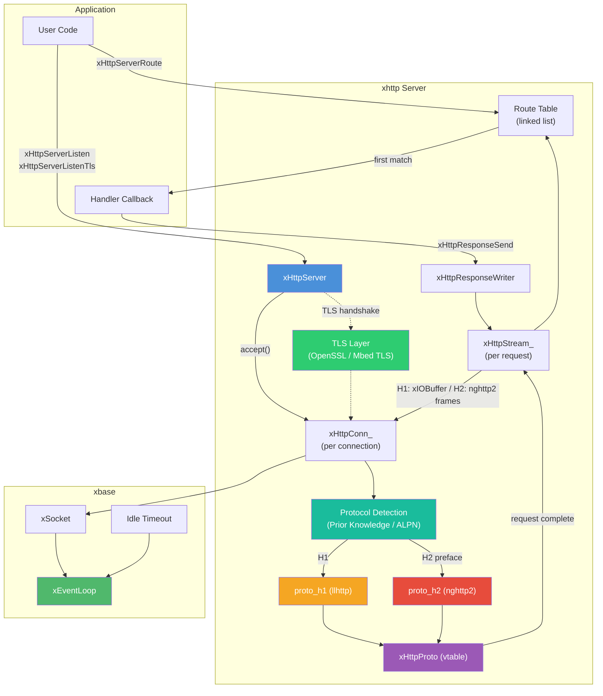
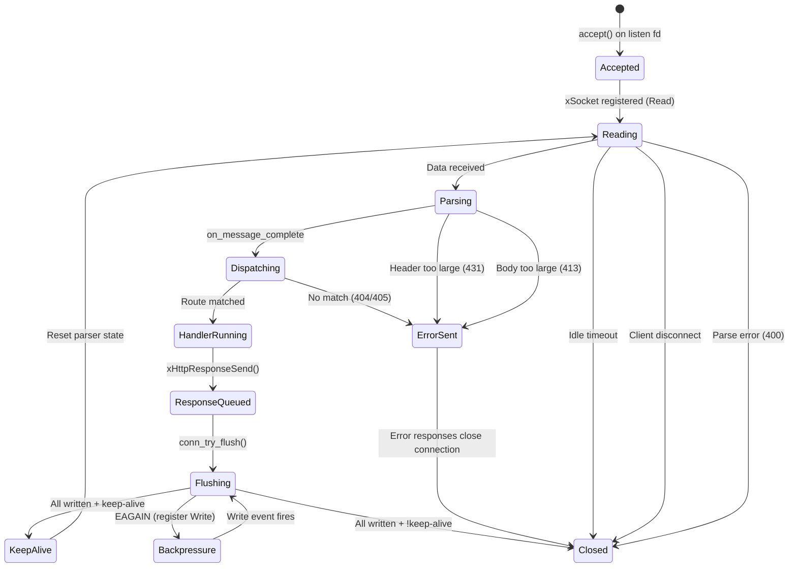
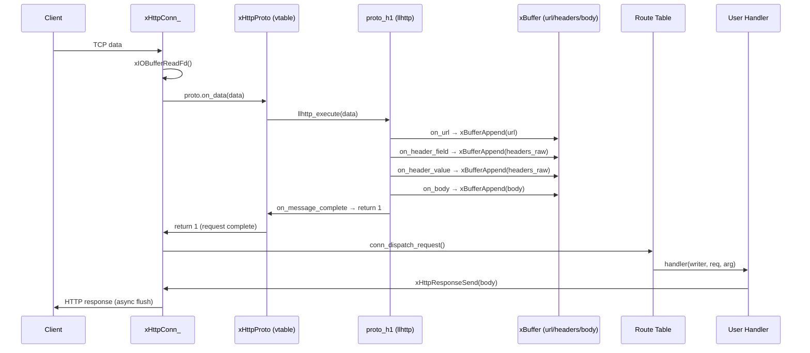
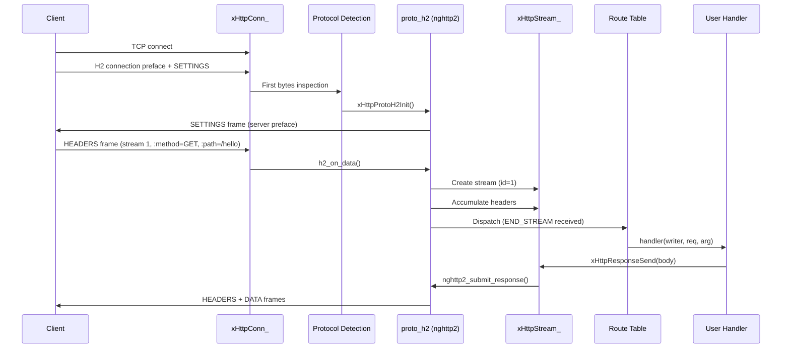

# server.h — Asynchronous HTTP/1.1 & HTTP/2 Server

## Introduction

`server.h` provides `xHttpServer`, an asynchronous, non-blocking HTTP server powered by xbase's event loop. The server supports both **HTTP/1.1** and **HTTP/2** (h2c, cleartext) on the same port, with automatic protocol detection via [Prior Knowledge](https://httpwg.org/specs/rfc9113.html#known-http). The protocol parsing layer is abstracted behind an `xHttpProto` vtable interface — HTTP/1.1 uses [llhttp](https://github.com/nodejs/llhttp), HTTP/2 uses [nghttp2](https://nghttp2.org/). All connection handling, request parsing, and response sending are driven by the event loop on a single thread — no locks or thread pools required. The server supports routing, keep-alive, configurable limits, automatic error responses, and **TLS/HTTPS** via `xHttpServerListenTls()` with pluggable TLS backends (OpenSSL or Mbed TLS).

## Design Philosophy

1. **Single-Threaded Event-Driven I/O** — The server registers listening and client sockets with [`xEventLoop`](../base/event.md). Accept, read, parse, dispatch, and write all happen on the event loop thread, eliminating synchronization overhead.

2. **Protocol-Abstracted Parsing** — Request parsing is delegated to a protocol handler behind the `xHttpProto` vtable interface. HTTP/1.1 (`proto_h1.c`) uses llhttp; HTTP/2 (`proto_h2.c`) uses nghttp2. Incremental callbacks accumulate URL, headers, and body into [`xBuffer`](../buf/buf.md) instances. This abstraction allows both protocols to share the same connection management, routing, and response serialization layers.

3. **Automatic Protocol Detection** — On each new connection, the server inspects the first bytes of incoming data. If the 24-byte HTTP/2 connection preface (`PRI * HTTP/2.0\r\n\r\nSM\r\n\r\n`) is detected, the connection is upgraded to HTTP/2; otherwise, HTTP/1.1 is used. This enables h2c (cleartext HTTP/2) via Prior Knowledge — ideal for internal service-to-service communication.

4. **First-Match Routing** — Routes are registered as pattern strings (e.g. `"GET /users/:id"` or `"/any"`) and matched in registration order. If the pattern starts with `/`, it matches any HTTP method; otherwise the first token is the method. Path patterns support both exact segments and `:param` segments.

5. **Writer-Based Response API** — Handlers receive an `xHttpResponseWriter` handle to set status, headers, and body. The response is serialized into an [`xIOBuffer`](../buf/io.md) and flushed asynchronously, with backpressure handled automatically.

6. **Defensive Limits** — Configurable limits on header size (default 8 KiB), body size (default 1 MiB), and idle timeout (default 60 s) protect against slow clients and oversized payloads. Violations produce appropriate 4xx error responses.

7. **Pluggable TLS** — TLS support is provided via `xHttpServerListenTls()` with `xTlsConf`. The TLS backend (OpenSSL or Mbed TLS) is selected at compile time via `X_TLS_BACKEND`. ALPN negotiation automatically selects HTTP/1.1 or HTTP/2 over TLS. Mutual TLS (mTLS) is supported when `ca` is set (verification is enabled by default).

## Architecture



## API Reference

### Types

| Type | Description |
| --- | --- |
| `xHttpServer` | Opaque handle to an HTTP server bound to an event loop |
| `xHttpResponseWriter` | Opaque handle to a response writer (valid only during handler) |
| `xHttpRequest` | Request data delivered to the handler callback |
| `xHttpHandlerFunc` | `void (*)(xHttpResponseWriter writer, const xHttpRequest *req, void *arg)` |
| `xTlsConf` | TLS configuration for HTTPS listeners (cert, key, CA, skip_verify) |

### xHttpRequest Fields

| Field | Type | Description |
| --- | --- | --- |
| `method` | `const char *` | HTTP method string (e.g. `"GET"`, `"POST"`) |
| `url` | `const char *` | Request URL / path (NUL-terminated) |
| `headers` | `const char *` | Raw request headers (NUL-terminated) |
| `headers_len` | `size_t` | Length of headers in bytes |
| `body` | `const char *` | Request body, or `NULL` if no body |
| `body_len` | `size_t` | Length of body in bytes |

All pointers are valid only for the duration of the handler callback.

### Lifecycle

| Function | Signature | Description |
| --- | --- | --- |
| `xHttpServerCreate` | `xHttpServer xHttpServerCreate(void)` | Create a server. |
| `xHttpServerListen` | `xErrno xHttpServerListen(xHttpServer server, const char *host, uint16_t port)` | Start listening on the given address and port. |
| `xHttpServerListenTls` | `xErrno xHttpServerListenTls(xHttpServer server, const char *host, uint16_t port, const xTlsConf *config)` | Start listening for HTTPS connections with TLS. ALPN selects H1/H2. Can coexist with `Listen` on a different port. Returns `xErrno_NotSupported` if no TLS backend was compiled. |
| `xHttpServerDestroy` | `void xHttpServerDestroy(xHttpServer server)` | Destroy server, close all connections, free all routes. |

### Route Registration

| Function | Signature | Description |
| --- | --- | --- |
| `xHttpServerRoute` | `xErrno xHttpServerRoute(xHttpServer server, const char *pattern, xHttpHandlerFunc handler, void *arg)` | Register a route. `pattern` combines method and path: `"GET /users/:id"` matches only GET; `"/users/:id"` matches all methods. Path supports `:param` segments. First match wins. |

### Request Parameters

| Function | Signature | Description |
| --- | --- | --- |
| `xHttpRequestParam` | `const char *xHttpRequestParam(const xHttpRequest *req, const char *name, size_t *len)` | Look up a path parameter by name. Returns a pointer to the value (NOT NUL-terminated) and sets `*len`, or returns `NULL` if not found. |

### Response

| Function | Signature | Description |
| --- | --- | --- |
| `xHttpResponseSetStatus` | `void xHttpResponseSetStatus(xHttpResponseWriter writer, int code)` | Set HTTP status code (default 200). |
| `xHttpResponseSetHeader` | `xErrno xHttpResponseSetHeader(xHttpResponseWriter writer, const char *key, const char *value)` | Add a response header. Call before `Send` or the first `Write`. |
| `xHttpResponseSend` | `xErrno xHttpResponseSend(xHttpResponseWriter writer, const char *body, size_t body_len)` | Send a complete response. May only be called once. Mutually exclusive with `Write`. |
| `xHttpResponseWrite` | `xErrno xHttpResponseWrite(xHttpResponseWriter writer, const char *data, size_t len)` | Write data to a streaming response. First call flushes headers (no `Content-Length`). Mutually exclusive with `Send`. |
| `xHttpResponseEnd` | `void xHttpResponseEnd(xHttpResponseWriter writer)` | End a streaming response. Optional — auto-called when the handler returns. |

### Configuration

| Function | Signature | Description | Default |
| --- | --- | --- | --- |
| `xHttpServerSetIdleTimeout` | `xErrno xHttpServerSetIdleTimeout(xHttpServer server, int timeout_ms)` | Set idle timeout for connections. | 60000 ms |
| `xHttpServerSetMaxHeaderSize` | `xErrno xHttpServerSetMaxHeaderSize(xHttpServer server, size_t max_size)` | Set max header size. Exceeding → 431. | 8192 bytes |
| `xHttpServerSetMaxBodySize` | `xErrno xHttpServerSetMaxBodySize(xHttpServer server, size_t max_size)` | Set max body size. Exceeding → 413. | 1048576 bytes |

All configuration functions must be called **before** `xHttpServerListen()` / `xHttpServerListenTls()`.

### TLS Configuration

#### `xTlsConf` Fields (Server)

| Field | Type | Description |
| --- | --- | --- |
| `cert` | `const char *` | Path to PEM certificate file (**required**). |
| `key` | `const char *` | Path to PEM private key file (**required**). |
| `ca` | `const char *` | Path to CA certificate file for client verification (optional). |
| `skip_verify` | `int` | If non-zero, skip peer verification. Default `0` (verify enabled). |

When `ca` is set and `skip_verify` is `0` (default), the server performs mutual TLS (mTLS) — clients must present a valid certificate signed by the specified CA.

## Usage Examples

### Minimal Server

```c
#include <stdio.h>
#include <x/base/event.h>
#include <x/http/server.h>

static void on_hello(xHttpResponseWriter w, const xHttpRequest *req, void *arg) {
    (void)req; (void)arg;
    xHttpResponseSetHeader(w, "Content-Type", "text/plain");
    xHttpResponseSend(w, "Hello, World!\n", 14);
}

int main(void) {
    xEventLoop loop = xEventLoopCreate();

    xEventLoopEnter(loop);

    xHttpServer server = xHttpServerCreate();

    xHttpServerRoute(server, "GET /hello", on_hello, NULL);
    xHttpServerListen(server, "0.0.0.0", 8080);

    printf("Listening on :8080\n");
    xEventLoopRun(loop);

    xHttpServerDestroy(server);
    xEventLoopDestroy(loop);
    return 0;
}
```

### JSON API with POST

```c
#include <stdio.h>
#include <string.h>
#include <x/base/event.h>
#include <x/http/server.h>

static void on_echo(xHttpResponseWriter w, const xHttpRequest *req, void *arg) {
    (void)arg;
    xHttpResponseSetHeader(w, "Content-Type", "application/json");
    xHttpResponseSend(w, req->body, req->body_len);
}

static void on_not_found(xHttpResponseWriter w, const xHttpRequest *req, void *arg) {
    (void)req; (void)arg;
    const char *body = "{\"error\": \"not found\"}";
    xHttpResponseSetStatus(w, 404);
    xHttpResponseSetHeader(w, "Content-Type", "application/json");
    xHttpResponseSend(w, body, strlen(body));
}

int main(void) {
    xEventLoop loop = xEventLoopCreate();

    xEventLoopEnter(loop);

    xHttpServer server = xHttpServerCreate();

    xHttpServerSetMaxBodySize(server, 4 * 1024 * 1024); /* 4 MiB */

    xHttpServerRoute(server, "POST /echo", on_echo, NULL);

    xHttpServerListen(server, NULL, 9090);
    xEventLoopRun(loop);

    xHttpServerDestroy(server);
    xEventLoopDestroy(loop);
    return 0;
}
```

### Server-Sent Events (SSE)

```c
#include <stdio.h>
#include <string.h>
#include <x/base/event.h>
#include <x/http/server.h>

static void on_events(xHttpResponseWriter w, const xHttpRequest *req, void *arg) {
    (void)req; (void)arg;
    xHttpResponseSetHeader(w, "Content-Type", "text/event-stream");
    xHttpResponseSetHeader(w, "Cache-Control", "no-cache");

    xHttpResponseWrite(w, "data: hello\n\n", 13);
    xHttpResponseWrite(w, "data: world\n\n", 13);
    /* xHttpResponseEnd(w) is optional; auto-called on return */
}

int main(void) {
    xEventLoop loop = xEventLoopCreate();

    xEventLoopEnter(loop);

    xHttpServer server = xHttpServerCreate();

    xHttpServerRoute(server, "GET /events", on_events, NULL);

    xHttpServerListen(server, NULL, 8080);
    printf("SSE server on :8080/events\n");
    xEventLoopRun(loop);

    xHttpServerDestroy(server);
    xEventLoopDestroy(loop);
    return 0;
}
```

### RESTful API with Path Parameters

```c
#include <stdio.h>
#include <string.h>
#include <x/base/event.h>
#include <x/http/server.h>

static void on_get_user(xHttpResponseWriter w, const xHttpRequest *req, void *arg) {
    (void)arg;
    size_t id_len = 0;
    const char *id = xHttpRequestParam(req, "id", &id_len);

    char body[128];
    int len = snprintf(body, sizeof(body),
                       "{\"user_id\": \"%.*s\"}\n", (int)id_len, id);

    xHttpResponseSetHeader(w, "Content-Type", "application/json");
    xHttpResponseSend(w, body, (size_t)len);
}

int main(void) {
    xEventLoop loop = xEventLoopCreate();

    xEventLoopEnter(loop);

    xHttpServer server = xHttpServerCreate();

    xHttpServerRoute(server, "GET /users/:id", on_get_user, NULL);

    xHttpServerListen(server, NULL, 8080);
    printf("REST API on :8080\n");
    xEventLoopRun(loop);

    xHttpServerDestroy(server);
    xEventLoopDestroy(loop);
    return 0;
}
```

### HTTPS Server

```c
#include <stdio.h>
#include <x/base/event.h>
#include <x/http/server.h>

static void on_hello(xHttpResponseWriter w, const xHttpRequest *req, void *arg) {
    (void)req; (void)arg;
    xHttpResponseSetHeader(w, "Content-Type", "text/plain");
    xHttpResponseSend(w, "Hello, HTTPS!\n", 14);
}

int main(void) {
    xEventLoop loop = xEventLoopCreate();

    xEventLoopEnter(loop);

    xHttpServer server = xHttpServerCreate();

    xHttpServerRoute(server, "GET /hello", on_hello, NULL);

    // TLS configuration
    xTlsConf tls = {
        .cert = "/path/to/server.pem",
        .key  = "/path/to/server-key.pem",
    };
    xHttpServerListenTls(server, "0.0.0.0", 8443, &tls);

    printf("HTTPS server on :8443\n");
    xEventLoopRun(loop);

    xHttpServerDestroy(server);
    xEventLoopDestroy(loop);
    return 0;
}
```

### HTTPS Server with Mutual TLS (mTLS)

```c
#include <stdio.h>
#include <x/base/event.h>
#include <x/http/server.h>

static void on_secure(xHttpResponseWriter w, const xHttpRequest *req, void *arg) {
    (void)req; (void)arg;
    xHttpResponseSetHeader(w, "Content-Type", "text/plain");
    xHttpResponseSend(w, "mTLS verified!\n", 15);
}

int main(void) {
    xEventLoop loop = xEventLoopCreate();

    xEventLoopEnter(loop);

    xHttpServer server = xHttpServerCreate();

    xHttpServerRoute(server, "GET /secure", on_secure, NULL);

    // Require client certificates
    xTlsConf tls = {
        .cert     = "/path/to/server.pem",
        .key      = "/path/to/server-key.pem",
        .ca       = "/path/to/ca.pem",
    };
    xHttpServerListenTls(server, "0.0.0.0", 8443, &tls);

    printf("mTLS server on :8443\n");
    xEventLoopRun(loop);

    xHttpServerDestroy(server);
    xEventLoopDestroy(loop);
    return 0;
}
```

### HTTP + HTTPS on Different Ports

```c
#include <stdio.h>
#include <x/base/event.h>
#include <x/http/server.h>

static void on_hello(xHttpResponseWriter w, const xHttpRequest *req, void *arg) {
    (void)req; (void)arg;
    xHttpResponseSend(w, "Hello!\n", 7);
}

int main(void) {
    xEventLoop loop = xEventLoopCreate();

    xEventLoopEnter(loop);

    xHttpServer server = xHttpServerCreate();

    xHttpServerRoute(server, "GET /hello", on_hello, NULL);

    // Serve HTTP on port 8080
    xHttpServerListen(server, "0.0.0.0", 8080);

    // Serve HTTPS on port 8443
    xTlsConf tls = {
        .cert = "/path/to/server.pem",
        .key  = "/path/to/server-key.pem",
    };
    xHttpServerListenTls(server, "0.0.0.0", 8443, &tls);

    printf("HTTP on :8080, HTTPS on :8443\n");
    xEventLoopRun(loop);

    xHttpServerDestroy(server);
    xEventLoopDestroy(loop);
    return 0;
}
```

### Multiple Routes with Shared State

```c
#include <stdio.h>
#include <x/base/event.h>
#include <x/http/server.h>

typedef struct {
    int counter;
} AppState;

static void on_count(xHttpResponseWriter w, const xHttpRequest *req, void *arg) {
    (void)req;
    AppState *state = (AppState *)arg;
    state->counter++;

    char body[64];
    int len = snprintf(body, sizeof(body), "{\"count\": %d}\n", state->counter);

    xHttpResponseSetHeader(w, "Content-Type", "application/json");
    xHttpResponseSend(w, body, (size_t)len);
}

static void on_health(xHttpResponseWriter w, const xHttpRequest *req, void *arg) {
    (void)req; (void)arg;
    xHttpResponseSend(w, "ok\n", 3);
}

int main(void) {
    xEventLoop loop = xEventLoopCreate();

    xEventLoopEnter(loop);

    xHttpServer server = xHttpServerCreate();

    AppState state = { .counter = 0 };

    xHttpServerRoute(server, "POST /count", on_count, &state);
    xHttpServerRoute(server, "GET /health", on_health, NULL);

    xHttpServerListen(server, NULL, 8080);
    xEventLoopRun(loop);

    xHttpServerDestroy(server);
    xEventLoopDestroy(loop);
    return 0;
}
```

## Best Practices

- **Don't block in handlers.** Handlers run on the event loop thread. Blocking delays all other connections.
- **Always call `xHttpResponseSend()` or `xHttpResponseWrite()`.** If the handler returns without sending, a default 200 OK with empty body is sent automatically — but it's better to be explicit.
- **Don't mix `Send` and `Write`.** `xHttpResponseSend()` is for one-shot responses; `xHttpResponseWrite()` is for streaming. They are mutually exclusive — calling one after the other returns `xErrno_InvalidState`.
- **Configure limits before listening.** `SetIdleTimeout`, `SetMaxHeaderSize`, and `SetMaxBodySize` must be called before `xHttpServerListen()` / `xHttpServerListenTls()`.
- **Register routes before listening.** Routes should be set up before the server starts accepting connections.
- **Use `xHttpServerListenTls()` for HTTPS.** Provide valid PEM certificate and key files. For mTLS, set `ca` (verification is enabled by default).
- **Serve HTTP and HTTPS on different ports.** Call both `xHttpServerListen()` and `xHttpServerListenTls()` on the same server instance to support both protocols simultaneously.
- **Destroy server before event loop.** `xHttpServerDestroy()` closes all connections and frees all resources.
- **Copy data you need to keep.** `xHttpRequest` pointers (`url`, `headers`, `body`) are only valid during the handler callback.

## Comparison with Other Libraries

| Feature | xhttp server.h | libuv + http-parser | libmicrohttpd | Go net/http | Node.js http |
| --- | --- | --- | --- | --- | --- |
| **I/O Model** | Async (event loop) | Async (event loop) | Threaded / select | Goroutines | Async (event loop) |
| **Event Loop** | xEventLoop integration | libuv | Internal | Go runtime | libuv (V8) |
| **HTTP Parser** | llhttp (H1) + nghttp2 (H2) | http-parser / llhttp | Internal | Internal | llhttp |
| **Streaming Response** | Built-in (`Write`/`End`) | Manual | Manual | Built-in (`Flusher`) | Built-in (`write`/`end`) |
| **Routing** | Built-in (first match) | None (manual) | None (manual) | Built-in (`ServeMux`) | None (manual) |
| **Keep-Alive** | Automatic | Manual | Automatic | Automatic | Automatic |
| **Thread Model** | Single-threaded | Single-threaded | Multi-threaded | Multi-goroutine | Single-threaded |
| **TLS/HTTPS** | Built-in (`ListenTLS`, mTLS) | Manual (libuv + OpenSSL) | Built-in | Built-in (`ListenAndServeTLS`) | Built-in (`https.createServer`) |
| **Language** | C99 | C | C | Go | JavaScript |

**Key Differentiator:** xhttp server provides a complete, single-threaded HTTP/1.1 & HTTP/2 server with built-in routing, streaming responses, TLS/HTTPS, and automatic keep-alive — all integrated with xEventLoop. HTTP/1.1 and HTTP/2 coexist on the same port via automatic protocol detection (Prior Knowledge for cleartext, ALPN for TLS). Unlike libuv + http-parser (which requires manual response assembly and TLS integration) or libmicrohttpd (which uses threads), xhttp keeps everything on one thread with zero synchronization overhead. The TLS layer supports mutual TLS (mTLS) with client certificate verification, and the streaming API (`xHttpResponseWrite`/`xHttpResponseEnd`) makes it straightforward to implement SSE or chunked streaming without external dependencies.

## Relationship with Other Modules

- **xbase** — Uses [`xEventLoop`](../base/event.md) for I/O multiplexing, [`xSocket`](../base/socket.md) for non-blocking socket management, and socket timeouts for idle connection detection.
- **xbuf** — Uses [`xBuffer`](../buf/buf.md) for request parsing accumulation (URL, headers, body) and [`xIOBuffer`](../buf/io.md) for read/write buffering with scatter-gather I/O.
- **llhttp** — External dependency. Provides incremental HTTP/1.1 request parsing via callbacks, isolated behind the `xHttpProto` vtable in `proto_h1.c`.
- **nghttp2** — External dependency. Provides HTTP/2 frame processing, HPACK header compression, and stream management, isolated behind the `xHttpProto` vtable in `proto_h2.c`.
- **OpenSSL / Mbed TLS** — External dependency (TLS backend, compile-time selection via `X_TLS_BACKEND`). Provides TLS handshake, encryption, certificate verification, and ALPN negotiation for `xHttpServerListenTls()`.

## Implementation Details

### Connection Lifecycle



### Request Parsing Flow



### Routing

Routes are stored in a singly-linked list and matched in registration order (first match wins):

1. **Path match** — Segment-by-segment comparison. Static segments require exact match; `:param` segments match any non-empty string and capture the value.
2. **Method match** — Case-insensitive comparison (`strcasecmp`). A pattern without a method prefix (e.g. `"/any"`) matches any HTTP method.
3. **Fallback** — If the path matches but no method matches → 405 Method Not Allowed. If no path matches → 404 Not Found.
4. **Parameter access** — Inside a handler, call `xHttpRequestParam(req, "id", &len)` to retrieve the captured value.

### Response Serialization

When `xHttpResponseSend()` is called:

1. Status line (`HTTP/1.1 <code> <reason>\r\n`) is written to the `xIOBuffer`.
2. `Content-Length` header is added automatically.
3. `Connection: keep-alive` or `Connection: close` is added based on the parser's determination.
4. User-set headers are appended.
5. Header section is terminated with `\r\n`.
6. Body is appended.
7. `conn_try_flush()` attempts an immediate `writev()`. If `EAGAIN`, the socket is registered for write events and flushing continues asynchronously.

### Keep-Alive & Pipelining

- HTTP/1.1 connections default to keep-alive. After a response is fully flushed, `proto.reset()` is called and the connection waits for the next request.
- The parser is paused in `on_message_complete` to prevent parsing the next pipelined request before the current response is sent.
- Error responses always set `Connection: close`.

### HTTP/2 Support (h2c Prior Knowledge)

The server supports cleartext HTTP/2 (h2c) via the Prior Knowledge mechanism. HTTP/1.1 and HTTP/2 coexist on the same port — no TLS or Upgrade header required.

#### Protocol Detection

When a new connection is accepted, protocol detection is deferred until the first bytes arrive:

1. If the first 24 bytes match the HTTP/2 connection preface (`PRI * HTTP/2.0\r\n\r\nSM\r\n\r\n`), `xHttpProtoH2Init()` is called.
2. If the prefix doesn't match, `xHttpProtoH1Init()` is called.
3. If fewer than 24 bytes have arrived but the prefix still matches so far, the server waits for more data before deciding.

#### Stream Multiplexing

Under HTTP/2, a single TCP connection carries multiple concurrent streams, each representing an independent request/response exchange:

- **`xHttpStream_`** — Per-request state (URL, headers, body, response writer). HTTP/1.1 uses a single implicit stream (stream_id = 0); HTTP/2 creates a new stream for each request.
- **Deferred dispatch** — Completed streams are queued during `nghttp2_session_mem_recv()` and dispatched after it returns, avoiding re-entrancy issues.
- **Response framing** — Responses are submitted via `nghttp2_submit_response()` with HPACK-compressed headers and DATA frames, then flushed through the connection's write buffer.

#### H2 Connection Lifecycle



#### Key Differences: H1 vs H2

| Feature | HTTP/1.1 (proto_h1) | HTTP/2 (proto_h2) |
| --- | --- | --- |
| Parser | llhttp (byte stream → request) | nghttp2 (byte stream → frame → stream) |
| Multiplexing | None (pipelining at best) | Native, multiple concurrent streams |
| Headers | Plain text `Key: Value` | HPACK compressed pseudo-headers + regular headers |
| Keep-alive | `Connection: keep-alive` header | Always persistent (multiplexed) |
| Reset | Per-request `proto.reset()` | No-op (streams are independent) |
| Response framing | Raw HTTP/1.1 status line + headers + body | `nghttp2_submit_response()` → HEADERS + DATA frames |
| Flow control | None | Built-in per-stream flow control |

#### Limitations

- **h2 over TLS** — TLS-based HTTP/2 (h2 with ALPN) is supported via `xHttpServerListenTls()`. Cleartext h2c uses Prior Knowledge.
- **No server push** — HTTP/2 server push is not implemented.
- **Streaming responses** — `xHttpResponseWrite()`/`xHttpResponseEnd()` for HTTP/2 streaming DATA frames is not yet fully implemented.

### Idle Timeout

Each connection has an idle timeout (default 60 s). If no data is received within this period, the connection is closed automatically via `xEvent_Timeout`. The timeout is reset after each response is sent on a keep-alive connection.
