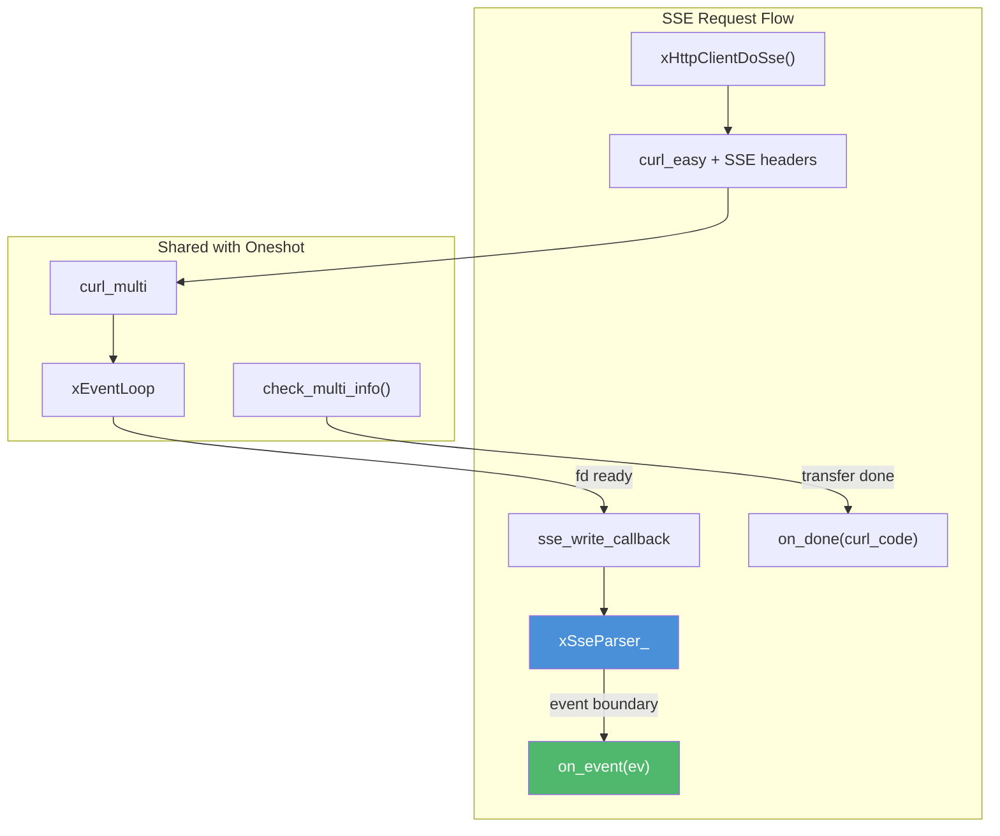
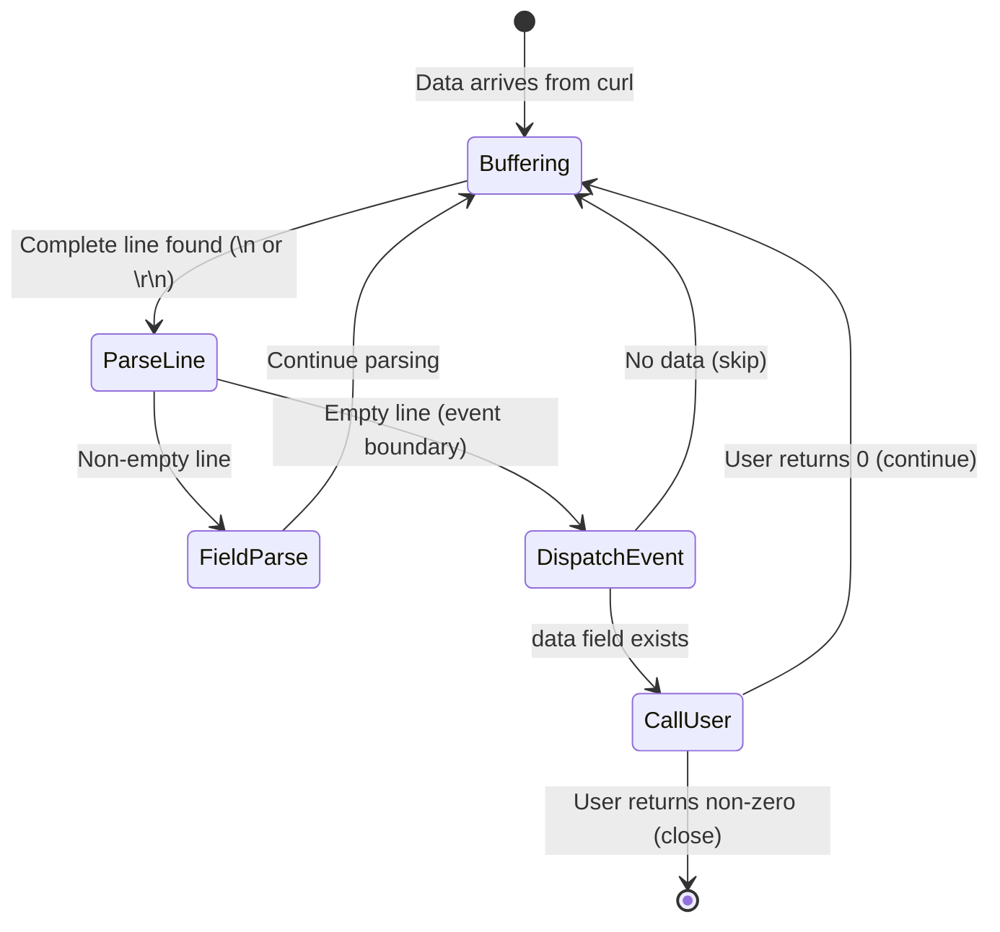
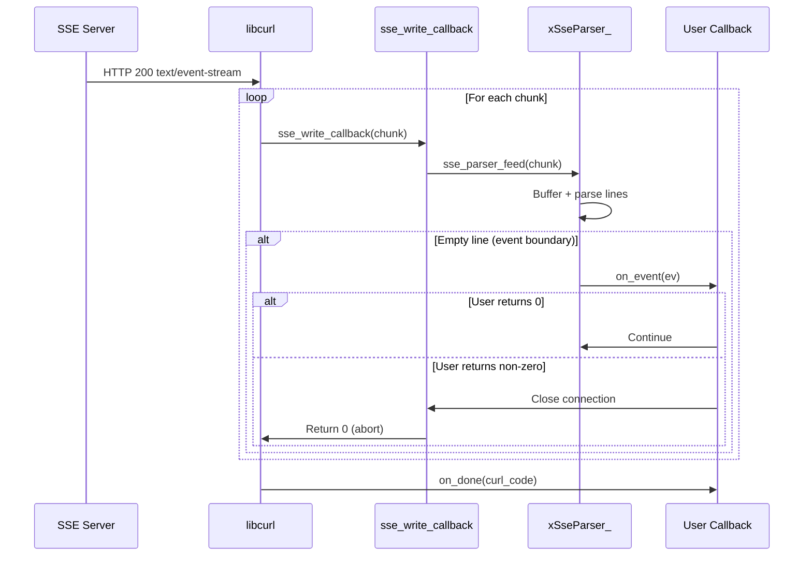

# sse.c — SSE Stream Client

## Introduction

`sse.c` implements Server-Sent Events (SSE) support for `xHttpClient`. It provides `xHttpClientGetSse()` and `xHttpClientDoSse()` which subscribe to SSE endpoints and parse the event stream according to the [W3C SSE specification](https://html.spec.whatwg.org/multipage/server-sent-events.html). Each parsed event is delivered to a callback as it arrives, enabling real-time streaming — ideal for LLM API integration.

## Design Philosophy

1. **W3C Spec Compliance** — The parser follows the W3C Server-Sent Events specification: field parsing (event, data, id, retry), comment handling, multi-line data joining with `\n`, and default event type "message".

2. **Streaming Parse** — Data is parsed incrementally as it arrives from libcurl's write callback. Complete lines are processed immediately; incomplete lines are buffered until more data arrives.

3. **Shared Infrastructure** — SSE requests reuse the same `curl_multi` handle and event loop integration as regular HTTP requests. The `xHttpReqVtable` mechanism allows SSE to plug in its own write callback and completion handler.

4. **User-Controlled Cancellation** — The `xSseEventFunc` callback returns an `int`: 0 to continue, non-zero to close the connection. This gives the user fine-grained control over when to stop streaming.

## Architecture



## API Reference

### Types

| Type | Description |
| --- | --- |
| `xSseEvent` | SSE event: `event` (type), `data`, `id`, `retry` |
| `xSseEventFunc` | `int (*)(const xSseEvent *ev, void *arg)` — return 0 to continue, non-zero to close |
| `xSseDoneFunc` | `void (*)(int curl_code, void *arg)` — called when stream ends |

### xSseEvent Fields

| Field | Type | Description |
| --- | --- | --- |
| `event` | `const char *` | Event type. `"message"` if omitted by server. |
| `data` | `const char *` | Event data. Multi-line data joined by `\n`. |
| `id` | `const char *` | Last event ID, or NULL. |
| `retry` | `int` | Retry delay in ms, or -1 if not set. |

### Functions

| Function | Signature | Description | Thread Safety |
| --- | --- | --- | --- |
| `xHttpClientGetSse` | `xErrno xHttpClientGetSse(xHttpClient client, const char *url, xSseEventFunc on_event, xSseDoneFunc on_done, void *arg)` | Subscribe to SSE endpoint (GET). | Not thread-safe |
| `xHttpClientDoSse` | `xErrno xHttpClientDoSse(xHttpClient client, const xHttpRequestConf *config, xSseEventFunc on_event, xSseDoneFunc on_done, void *arg)` | Fully-configured SSE request. | Not thread-safe |

## Usage Examples

### Simple SSE Subscription

```c
#include <stdio.h>
#include <x/base/event.h>
#include <x/http/client.h>

static int on_event(const xSseEvent *ev, void *arg) {
    (void)arg;
    printf("[%s] %s\n", ev->event, ev->data);
    return 0; // Continue receiving
}

static void on_done(int curl_code, void *arg) {
    (void)arg;
    printf("Stream ended (code=%d)\n", curl_code);
}

int main(void) {
    xEventLoop loop = xEventLoopCreate();

    xEventLoopEnter(loop);

    xHttpClient client = xHttpClientCreate(NULL);

    xHttpClientGetSse(client, "https://example.com/events",
                      on_event, on_done, NULL);

    xEventLoopRun(loop);
    xHttpClientDestroy(client);
    xEventLoopDestroy(loop);
    return 0;
}
```

### LLM API Streaming (OpenAI-Compatible)

```c
#include <stdio.h>
#include <string.h>
#include <x/base/event.h>
#include <x/http/client.h>

static int on_event(const xSseEvent *ev, void *arg) {
    (void)arg;

    // OpenAI sends "[DONE]" as the final data
    if (strcmp(ev->data, "[DONE]") == 0) {
        printf("\n--- Stream complete ---\n");
        return 1; // Close connection
    }

    // Parse JSON and extract content delta...
    printf("%s", ev->data);
    fflush(stdout);
    return 0;
}

static void on_done(int curl_code, void *arg) {
    (void)arg;
    if (curl_code != 0)
        printf("\nStream error (code=%d)\n", curl_code);
}

int main(void) {
    xEventLoop loop = xEventLoopCreate();

    xEventLoopEnter(loop);

    xHttpClient client = xHttpClientCreate(NULL);

    const char *body =
        "{"
        "  \"model\": \"gpt-4\","
        "  \"messages\": [{\"role\": \"user\", \"content\": \"Hello!\"}],"
        "  \"stream\": true"
        "}";

    const char *headers[] = {
        "Content-Type: application/json",
        "Authorization: Bearer sk-your-api-key",
        NULL
    };

    xHttpRequestConf config = {
        .url       = "https://api.openai.com/v1/chat/completions",
        .method    = xHttpMethod_POST,
        .body      = body,
        .body_len  = strlen(body),
        .headers   = headers,
        .timeout_ms = 60000, // 60s timeout for streaming
    };

    xHttpClientDoSse(client, &config, on_event, on_done, NULL);

    xEventLoopRun(loop);
    xHttpClientDestroy(client);
    xEventLoopDestroy(loop);
    return 0;
}
```

### Early Cancellation

```c
static int on_event(const xSseEvent *ev, void *arg) {
    int *count = (int *)arg;
    (*count)++;

    printf("Event #%d: %s\n", *count, ev->data);

    // Stop after 10 events
    if (*count >= 10) {
        printf("Received enough events, closing.\n");
        return 1; // Non-zero = close connection
    }
    return 0;
}
```

## Use Cases

1. **LLM API Integration** — Stream responses from OpenAI, Anthropic, Google Gemini, or any OpenAI-compatible API. Use `xHttpClientDoSse()` with POST method and JSON body.

2. **Real-Time Notifications** — Subscribe to server push notifications (chat messages, stock prices, IoT sensor data) via SSE endpoints.

3. **Log Streaming** — Tail remote log streams delivered as SSE events.

## Best Practices

- **Use `xHttpClientDoSse()` for LLM APIs.** Most LLM APIs require POST with a JSON body and custom headers. `GetSse` is only for simple GET endpoints.
- **Handle `[DONE]` signals.** Many LLM APIs send a special `[DONE]` data payload to signal the end of the stream. Return non-zero from `on_event` to close cleanly.
- **Set appropriate timeouts.** Streaming responses can take a long time. Set `timeout_ms` high enough (e.g., 60000ms) to avoid premature timeouts.
- **Don't block in `on_event`.** The callback runs on the event loop thread. Blocking delays all other I/O.
- **Copy event data if needed.** `xSseEvent` pointers are valid only during the callback.

## Comparison with Other Libraries

| Feature | xhttp SSE | `eventsource` (JS) | `sseclient-py` | libcurl (manual) |
| --- | --- | --- | --- | --- |
| **Spec Compliance** | W3C SSE | W3C SSE | W3C SSE | Manual parsing |
| **Integration** | xEventLoop (async) | Browser event loop | Blocking iterator | Manual |
| **POST Support** | Yes (`DoSse`) | No (GET only) | No (GET only) | Manual |
| **Cancellation** | Callback return value | `close()` | Break loop | `curl_easy_pause` |
| **Multi-line Data** | Auto-joined with `\n` | Auto-joined | Auto-joined | Manual |
| **Language** | C99 | JavaScript | Python | C |

**Key Differentiator:** xhttp's SSE implementation is unique in supporting POST-based SSE (via `xHttpClientDoSse`), which is essential for LLM API integration. Most SSE libraries only support GET. The incremental parser integrates seamlessly with the event loop, delivering events as they arrive without buffering the entire stream.

## Implementation Details

### SSE Parser State Machine



### SSE Field Parsing

Each non-empty line is parsed as a field:

| Line Format | Field | Value |
| --- | --- | --- |
| `:comment` | (ignored) | — |
| `event:type` | event_type | `"type"` |
| `data:payload` | data | `"payload"` (accumulated with `\n`) |
| `id:123` | id | `"123"` (persists across events) |
| `retry:5000` | retry | `5000` (ms, must be all digits) |
| `unknown:foo` | (ignored) | — |

**Multi-line data:** Multiple `data:` lines are joined with `\n`:

```text
data:line1
data:line2
data:line3

→ ev.data = "line1\nline2\nline3"
```

### Parser Internal Structure

```c
struct xSseParser_ {
    xBuffer  buf;          // Raw incoming data buffer
    size_t   pos;          // Parse position within buf
    int      error;        // Allocation failure flag

    char *event_type;      // Current event type (NULL = "message")
    char *data;            // Accumulated data lines
    char *id;              // Last event ID (persists across events)
    int   retry;           // Retry delay in ms (-1 = not set)
};
```

### Data Flow



### SSE Request Structure

```c
struct xSseReq_ {
    struct xHttpReq_   base;        // Base request (shared with oneshot)
    xSseEventFunc      on_event;    // Per-event callback
    xSseDoneFunc       on_done;     // Stream-end callback
    struct xSseParser_ parser;      // SSE parser state
    struct curl_slist  *sse_headers; // Accept: text/event-stream + user headers
};
```

The SSE request uses a dedicated vtable:

- `sse_on_done` — Invokes the user's `on_done` callback.
- `sse_on_cleanup` — Frees SSE-specific resources (parser, headers).

### Automatic Headers

`xHttpClientDoSse()` automatically adds:

- `Accept: text/event-stream`
- `Cache-Control: no-cache`

User-provided headers are merged after these defaults.
