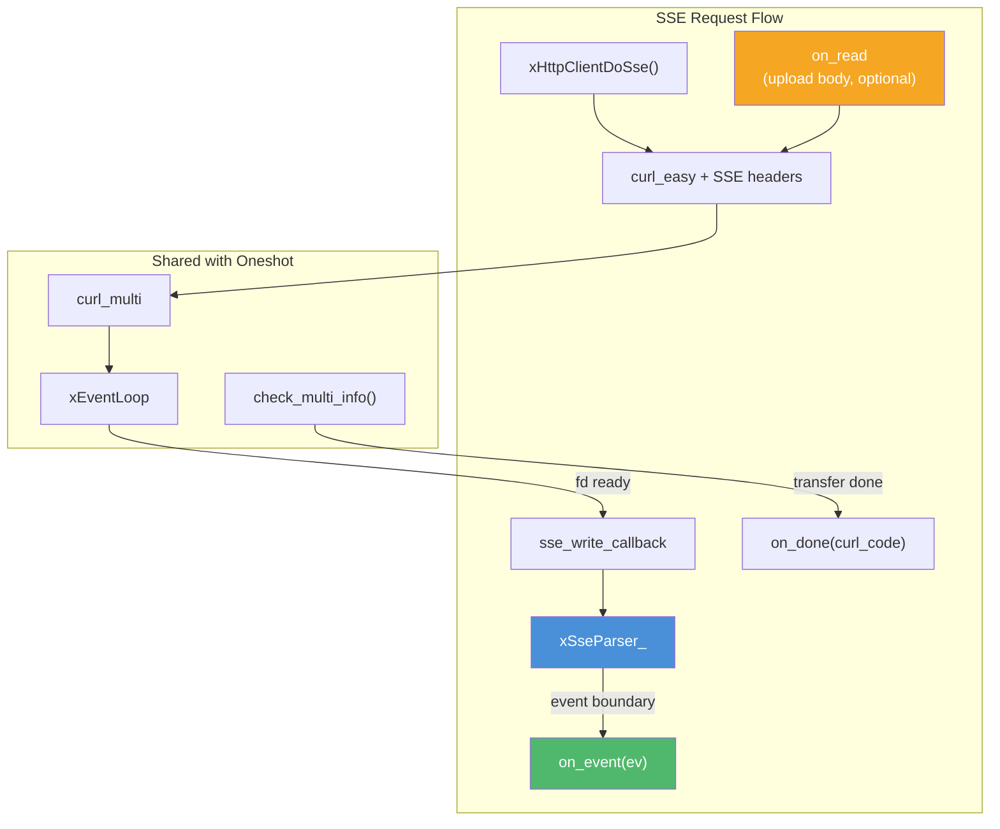
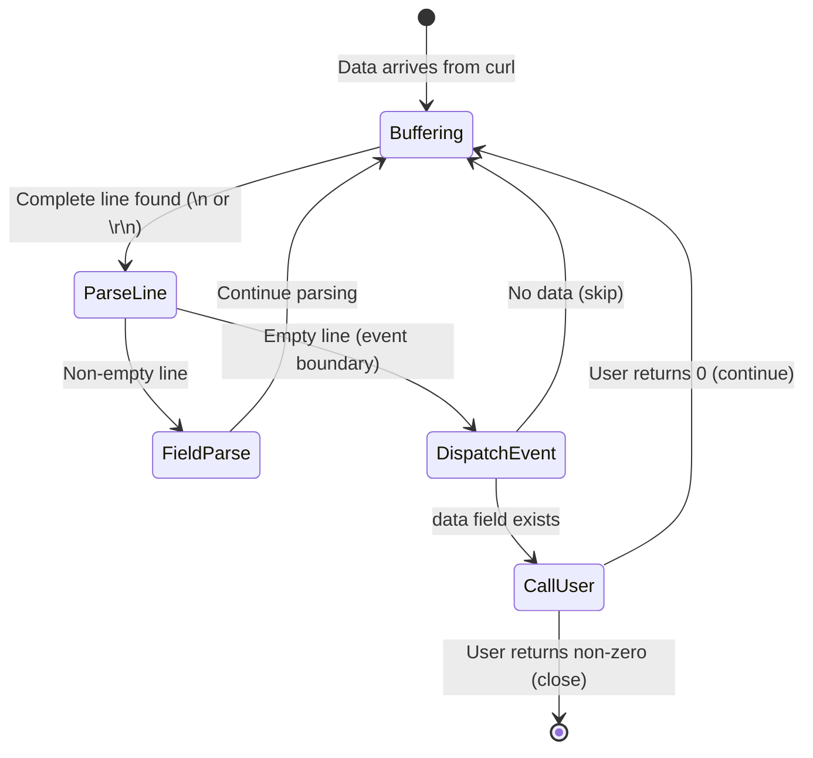
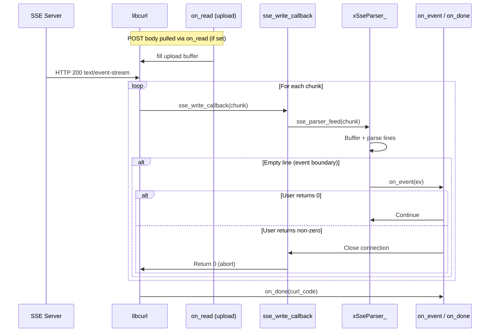

# sse.c — SSE Stream Client

## Introduction

`sse.c` implements Server-Sent Events (SSE) support for `xHttpClient`. It provides `xHttpClientGetSse()` and `xHttpClientDoSse()` which subscribe to SSE endpoints and parse the event stream according to the [W3C SSE specification](https://html.spec.whatwg.org/multipage/server-sent-events.html). Each parsed event is delivered to a callback as it arrives — ideal for LLM streaming integration.

## Design Philosophy

1. **W3C Spec Compliance** — Field parsing (`event`, `data`, `id`, `retry`), comment handling, multi-line data joining with `\n`, and default event type `"message"`.

2. **Streaming Parse** — Data is parsed incrementally as it arrives from libcurl's write callback. Complete lines are processed immediately; incomplete lines are buffered.

3. **Shared Infrastructure** — SSE requests reuse the same `curl_multi` handle and event-loop integration as regular HTTP requests. The `xHttpReqVtable` mechanism lets SSE plug in its own write callback and completion handler.

4. **POST + Request Body via `on_read`** — `xHttpClientDoSse()` takes a full `xHttpRequestConf`, so the request body for POST-based SSE (LLM APIs) is streamed via `on_read` — no `body`/`body_len` fields to keep alive. Set `content_length` for `Content-Length`, or leave it 0 for chunked.

5. **User-Controlled Cancellation** — The `xSseEventFunc` callback returns an `int`: 0 to continue, non-zero to close the connection.

## Architecture



## API Reference

### Types

| Type | Description |
| --- | --- |
| `xSseEvent` | SSE event: `event` (type), `data`, `id`, `retry` |
| `xSseEventFunc` | `int (*)(const xSseEvent *ev, void *arg)` — return 0 to continue, non-zero to close |
| `xSseDoneFunc` | `void (*)(int curl_code, void *arg)` — called when stream ends |
| `xHttpRequestConf` | Per-request config (used by `DoSse`) — URL, method, headers, `on_read` for body |

### xSseEvent Fields

| Field | Type | Description |
| --- | --- | --- |
| `event` | `const char *` | Event type. `"message"` if omitted by server. |
| `data` | `const char *` | Event data. Multi-line data joined by `\n`. |
| `id` | `const char *` | Last event ID, or NULL. |
| `retry` | `int` | Retry delay in ms, or -1 if not set. |

All strings are NUL-terminated and valid only during the callback.

### Functions

| Function | Signature | Description |
| --- | --- | --- |
| `xHttpClientGetSse` | `xErrno xHttpClientGetSse(xHttpClient client, const char *url, xSseEventFunc on_event, xSseDoneFunc on_done, void *arg)` | Subscribe to a GET SSE endpoint. |
| `xHttpClientDoSse` | `xErrno xHttpClientDoSse(xHttpClient client, const xHttpRequestConf *config, xSseEventFunc on_event, xSseDoneFunc on_done, void *arg)` | Fully-configured SSE request — POST + JSON body for LLM APIs. |

`xHttpClientDoSse()` automatically adds `Accept: text/event-stream`. User-provided headers in `config->headers` are merged after this default. The request body comes from `config->on_read` (with `config->content_length` providing the size, 0 for chunked) — there is no `body`/`body_len` field on `xHttpRequestConf`.

The `arg` passed to `DoSse`/`GetSse` is forwarded to all three callbacks: `on_event`, `on_done`, and `on_read`. A single struct holding both upload state and SSE state is the cleanest way to share context across them.

## Usage Examples

### Simple SSE subscription (GET)

```c
#include <stdio.h>
#include <x/base/event.h>
#include <x/http/client.h>

static int on_event(const xSseEvent *ev, void *arg) {
    (void)arg;
    printf("[%s] %s\n", ev->event, ev->data);
    return 0;                              /* continue */
}

static void on_done(int curl_code, void *arg) {
    (void)arg;
    printf("Stream ended (code=%d)\n", curl_code);
}

int main(void) {
    xEventLoop loop = xEventLoopCreate();
    xEventLoopEnter(loop);

    xHttpClient client = xHttpClientCreate(NULL);

    xHttpClientGetSse(client, "https://example.com/events",
                      on_event, on_done, NULL);

    xEventLoopRun(loop);
    xHttpClientDestroy(client);
    xEventLoopDestroy(loop);
    return 0;
}
```

### LLM API streaming (POST with JSON body)

The request body is provided via `on_read` — the same callback type used for regular POST uploads. Set `content_length` to send `Content-Length`, or leave it 0 for chunked transfer.

```c
#include <stdio.h>
#include <string.h>
#include <x/base/event.h>
#include <x/http/client.h>

/* Holds both upload state and SSE state — passed as `arg` to all
 * three callbacks (on_read, on_event, on_done). */
struct StreamCtx {
    /* upload state */
    const char *payload;
    size_t      payload_len;
    size_t      off;
    /* SSE state */
    int         got_done;
};

static size_t on_read_body(char *buf, size_t bufsize, void *arg) {
    struct StreamCtx *c = arg;
    size_t remaining = c->payload_len - c->off;
    if (remaining == 0) return 0;           /* EOF */
    size_t n = bufsize < remaining ? bufsize : remaining;
    memcpy(buf, c->payload + c->off, n);
    c->off += n;
    return n;
}

static int on_event(const xSseEvent *ev, void *arg) {
    (void)arg;
    if (strcmp(ev->data, "[DONE]") == 0) {
        printf("\n--- Stream complete ---\n");
        return 1;                           /* close connection */
    }
    printf("%s", ev->data);
    fflush(stdout);
    return 0;
}

static void on_done(int curl_code, void *arg) {
    struct StreamCtx *c = arg;
    c->got_done = 1;
    if (curl_code != 0)
        printf("\nStream error (code=%d)\n", curl_code);
}

int main(void) {
    xEventLoop loop = xEventLoopCreate();
    xEventLoopEnter(loop);

    xHttpClient client = xHttpClientCreate(NULL);

    static const char body[] =
        "{"
        "  \"model\": \"gpt-4\","
        "  \"messages\": [{\"role\": \"user\", \"content\": \"Hello!\"}],"
        "  \"stream\": true"
        "}";

    struct StreamCtx c = { body, sizeof(body) - 1, 0, 0 };

    const char *headers[] = {
        "Content-Type: application/json",
        "Authorization: Bearer sk-your-api-key",
        NULL,
    };

    xHttpRequestConf conf = {0};
    conf.url            = "https://api.openai.com/v1/chat/completions";
    conf.method         = xHttpMethod_POST;
    conf.content_length = c.payload_len;
    conf.headers        = headers;
    conf.timeout_ms     = 60000;            /* connection-phase timeout */
    conf.on_read        = on_read_body;

    xHttpClientDoSse(client, &conf, on_event, on_done, &c);

    xEventLoopRun(loop);
    xHttpClientDestroy(client);
    xEventLoopDestroy(loop);
    return 0;
}
```

> Note: `on_read`, `on_event`, and `on_done` all receive the same `arg` pointer, so a single `struct StreamCtx` holding both the upload payload and any SSE-side state is the natural way to share context across them.

### Early cancellation

Return non-zero from `on_event` to close the connection cleanly:

```c
static int on_event(const xSseEvent *ev, void *arg) {
    int *count = arg;
    if (++*count >= 10) {
        printf("Received 10 events, closing.\n");
        return 1;                           /* non-zero = close */
    }
    printf("#%d: %s\n", *count, ev->data);
    return 0;
}
```

## Use Cases

1. **LLM API Integration** — Stream responses from OpenAI, Anthropic, Google Gemini, or any OpenAI-compatible API. Use `xHttpClientDoSse()` with POST + JSON body.
2. **Real-Time Notifications** — Subscribe to server push (chat messages, stock prices, IoT sensor data) via GET SSE endpoints.
3. **Log Streaming** — Tail remote log streams delivered as SSE events.

## Best Practices

- **Use `xHttpClientDoSse()` for LLM APIs.** Most LLM APIs require POST with a JSON body and custom headers. `GetSse` is only for simple GET endpoints.
- **Handle `[DONE]` signals.** Many LLM APIs send a special `[DONE]` data payload to signal the end of the stream. Return non-zero from `on_event` to close cleanly.
- **Stream the request body via `on_read`.** Don't try to stuff the body into a `body`/`body_len` field — `xHttpRequestConf` has none. Use `on_read` + `content_length` for a known-size body, or `on_read` + `content_length = 0` for chunked.
- **Set appropriate timeouts.** `timeout_ms` covers the connection phase only; stalled streams are detected via libcurl's low-speed-time. A 60s timeout is reasonable for LLM streams.
- **Don't block in `on_event`.** The callback runs on the event loop thread. Blocking delays all other I/O.
- **Copy event data if needed.** `xSseEvent` pointers are valid only during the callback.

## Comparison with Other Libraries

| Feature | xhttp SSE | `eventsource` (JS) | `sseclient-py` | libcurl (manual) |
| --- | --- | --- | --- | --- |
| **Spec Compliance** | W3C SSE | W3C SSE | W3C SSE | Manual parsing |
| **Integration** | xEventLoop (async) | Browser event loop | Blocking iterator | Manual |
| **POST Support** | Yes (`DoSse`) | No (GET only) | No (GET only) | Manual |
| **Streaming Request Body** | `on_read` callback | N/A | N/A | `READFUNCTION` |
| **Cancellation** | Callback return value | `close()` | Break loop | `curl_easy_pause` |
| **Multi-line Data** | Auto-joined with `\n` | Auto-joined | Auto-joined | Manual |
| **Language** | C99 | JavaScript | Python | C |

**Key Differentiator:** xhttp's SSE implementation supports POST-based SSE (via `xHttpClientDoSse`), which is essential for LLM API integration, with the request body streamed via `on_read` — no body buffering required. The incremental parser integrates seamlessly with the event loop, delivering events as they arrive without buffering the entire stream.

## Implementation Details

### SSE Parser State Machine



### SSE Field Parsing

Each non-empty line is parsed as a field:

| Line Format | Field | Value |
| --- | --- | --- |
| `:comment` | (ignored) | — |
| `event:type` | event_type | `"type"` |
| `data:payload` | data | `"payload"` (accumulated with `\n`) |
| `id:123` | id | `"123"` (persists across events) |
| `retry:5000` | retry | `5000` (ms, must be all digits) |
| `unknown:foo` | (ignored) | — |

**Multi-line data:** Multiple `data:` lines are joined with `\n`:

```text
data:line1
data:line2
data:line3

 ev.data = "line1\nline2\nline3"
```

### Data Flow



### SSE Request Structure

```c
struct xSseReq_ {
    struct xHttpReq_   base;         /* Base request (shared with oneshot) */
    xSseEventFunc      on_event;     /* Per-event callback                 */
    xSseDoneFunc       on_done;      /* Stream-end callback                */
    struct xSseParser_ parser;       /* SSE parser state                   */
    struct curl_slist *sse_headers;  /* Accept: text/event-stream + user headers */
};
```

The SSE request uses a dedicated vtable:

- `sse_on_done` — Invokes the user's `on_done` callback.
- `sse_on_cleanup` — Frees SSE-specific resources (parser, headers).

### Automatic Headers

`xHttpClientDoSse()` automatically adds:

- `Accept: text/event-stream`

User-provided headers are merged after this default.
