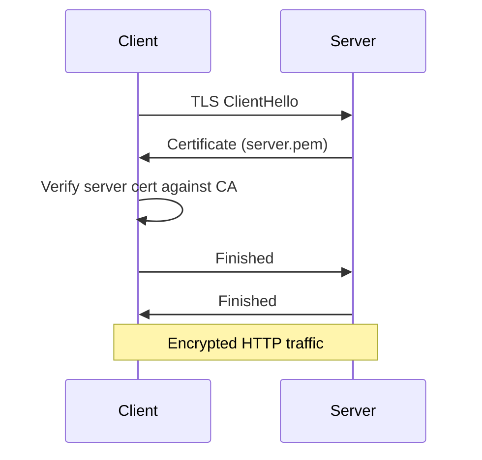
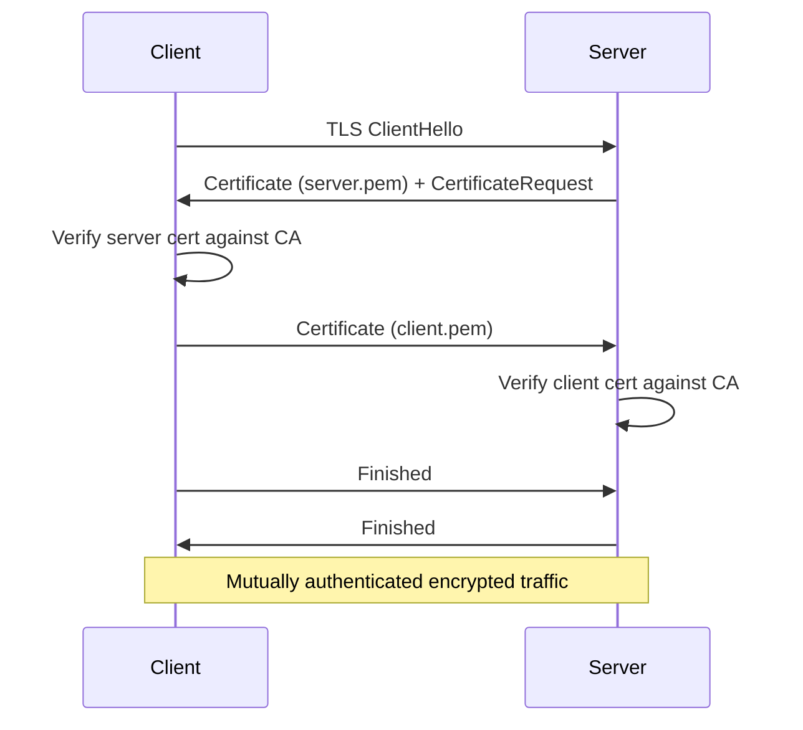

# TLS Deployment Guide

This guide covers end-to-end TLS deployment for xhttp, including certificate generation, server and client configuration, and mutual TLS (mTLS). For API reference, see [server.md](server.md) and [client.md](client.md).

## Prerequisites

- **OpenSSL CLI** — Used for certificate generation (`openssl` command).
- **TLS backend compiled** — libx must be built with `X_TLS_BACKEND=openssl` (or `mbedtls`). Without a TLS backend, `xHttpServerListenTls()` returns `xErrno_NotSupported`.

Check your build:

```bash
# If X_HAS_OPENSSL is defined, TLS is available
grep -r "X_HAS_OPENSSL" xhttp/
```

## Certificate Generation

### Self-Signed Certificate (Development)

For quick local development and testing:

```bash
openssl req -x509 -newkey rsa:2048 \
  -keyout server-key.pem \
  -out server.pem \
  -days 365 -nodes \
  -subj '/CN=localhost'
```

This produces:

- `server.pem` — Self-signed certificate
- `server-key.pem` — Unencrypted private key

> **Note:** Self-signed certificates are not trusted by default. Clients must either set `skip_verify = 1` or provide the certificate as a CA via `ca`.

### CA-Signed Certificates (Production / mTLS)

For mutual TLS or production-like setups, create a private CA and sign both server and client certificates.

#### Step 1: Create a CA

```bash
# Generate CA private key and self-signed certificate
openssl req -x509 -newkey rsa:2048 \
  -keyout ca-key.pem \
  -out ca.pem \
  -days 365 -nodes \
  -subj '/CN=MyCA'
```

#### Step 2: Generate Server Certificate

```bash
# Generate server key + CSR
openssl req -newkey rsa:2048 \
  -keyout server-key.pem \
  -out server.csr \
  -nodes \
  -subj '/CN=localhost'

# Sign with CA
openssl x509 -req \
  -in server.csr \
  -CA ca.pem -CAkey ca-key.pem -CAcreateserial \
  -out server.pem \
  -days 365

# Clean up CSR
rm server.csr
```

#### Step 3: Generate Client Certificate (for mTLS)

```bash
# Generate client key + CSR
openssl req -newkey rsa:2048 \
  -keyout client-key.pem \
  -out client.csr \
  -nodes \
  -subj '/CN=MyClient'

# Sign with the same CA
openssl x509 -req \
  -in client.csr \
  -CA ca.pem -CAkey ca-key.pem -CAcreateserial \
  -out client.pem \
  -days 365

# Clean up CSR
rm client.csr
```

After these steps you have:

| File | Description |
| --- | --- |
| `ca.pem` | CA certificate (trusted by both sides) |
| `ca-key.pem` | CA private key (keep secure, not deployed) |
| `server.pem` | Server certificate (signed by CA) |
| `server-key.pem` | Server private key |
| `client.pem` | Client certificate (signed by CA) |
| `client-key.pem` | Client private key |

## Deployment Scenarios

### 1. One-Way TLS (Server Authentication Only)

The most common setup: the client verifies the server's identity, but the server does not verify the client.



**Server:**

```c
xTlsConf tls = {
    .cert = "server.pem",
    .key  = "server-key.pem",
};
xHttpServerListenTls(server, "0.0.0.0", 8443, &tls);
```

**Client (with CA verification):**

```c
xTlsConf tls = {0};
tls.ca = "ca.pem";
xHttpClientConf conf = {.tls = &tls};
xHttpClient client =
    xHttpClientCreate(&conf);

xHttpClientGet(
    client,
    "https://localhost:8443/hello",
    on_response, NULL);
```

**Client (skip verification — development only):**

```c
xTlsConf tls = {0};
tls.skip_verify = 1;
xHttpClientConf conf = {.tls = &tls};
xHttpClient client =
    xHttpClientCreate(&conf);
```

### 2. Mutual TLS (mTLS)

Both sides authenticate each other. The server requires a valid client certificate signed by a trusted CA.



**Server:**

```c
xTlsConf tls = {
    .cert     = "server.pem",
    .key      = "server-key.pem",
    .ca       = "ca.pem",       // CA to verify client certs
};
xHttpServerListenTls(server, "0.0.0.0", 8443, &tls);
```

**Client:**

```c
xTlsConf tls = {0};
tls.ca   = "ca.pem";
tls.cert = "client.pem";
tls.key  = "client-key.pem";
xHttpClientConf conf = {.tls = &tls};
xHttpClient client =
    xHttpClientCreate(&conf);

xHttpClientGet(
    client,
    "https://localhost:8443/secure",
    on_response, NULL);
```

### 3. HTTP + HTTPS on Different Ports

A single `xHttpServer` can serve both cleartext HTTP and HTTPS simultaneously:

```c
// HTTP on port 8080
xHttpServerListen(server, "0.0.0.0", 8080);

// HTTPS on port 8443
xTlsConf tls = {
    .cert = "server.pem",
    .key  = "server-key.pem",
};
xHttpServerListenTls(server, "0.0.0.0", 8443, &tls);
```

Routes are shared — the same handlers serve both HTTP and HTTPS traffic.

## Complete End-to-End Example

A full working example: CA-signed mTLS with server and client.

### Generate Certificates

```bash
#!/bin/bash
set -e

# CA
openssl req -x509 -newkey rsa:2048 \
  -keyout ca-key.pem -out ca.pem \
  -days 365 -nodes -subj '/CN=TestCA'

# Server
openssl req -newkey rsa:2048 \
  -keyout server-key.pem -out server.csr \
  -nodes -subj '/CN=localhost'
openssl x509 -req -in server.csr \
  -CA ca.pem -CAkey ca-key.pem -CAcreateserial \
  -out server.pem -days 365
rm server.csr

# Client
openssl req -newkey rsa:2048 \
  -keyout client-key.pem -out client.csr \
  -nodes -subj '/CN=MyClient'
openssl x509 -req -in client.csr \
  -CA ca.pem -CAkey ca-key.pem -CAcreateserial \
  -out client.pem -days 365
rm client.csr

echo "Generated: ca.pem, server.pem, server-key.pem, client.pem, client-key.pem"
```

### Server Code

```c
#include <stdio.h>
#include <string.h>
#include <x/base/event.h>
#include <x/http/server.h>

static void on_secure(xHttpResponseWriter w, const xHttpRequest *req, void *arg) {
    (void)req; (void)arg;
    xHttpResponseSetHeader(w, "Content-Type", "text/plain");
    xHttpResponseSend(w, "mTLS OK!\n", 9);
}

int main(void) {
    xEventLoop loop = xEventLoopCreate();

    xEventLoopEnter(loop);

    xHttpServer server = xHttpServerCreate();

    xHttpServerRoute(server, "GET /secure", on_secure, NULL);

    xTlsConf tls = {
        .cert     = "server.pem",
        .key      = "server-key.pem",
        .ca       = "ca.pem",
    };
    xHttpServerListenTls(server, "0.0.0.0", 8443, &tls);

    printf("mTLS server listening on :8443\n");
    xEventLoopRun(loop);

    xHttpServerDestroy(server);
    xEventLoopDestroy(loop);
    return 0;
}
```

### Client Code

```c
#include <stdio.h>
#include <x/base/event.h>
#include <x/http/client.h>

static void on_response(const xHttpResponse *resp, void *arg) {
    (void)arg;
    if (resp->curl_code == 0) {
        printf("HTTP %ld: %.*s\n", resp->status_code,
               (int)resp->body_len, resp->body);
    } else {
        printf("TLS error: %s\n", resp->curl_error);
    }
}

int main(void) {
    xEventLoop loop = xEventLoopCreate();

    xEventLoopEnter(loop);

    xTlsConf tls = {0};
    tls.ca   = "ca.pem";
    tls.cert = "client.pem";
    tls.key  = "client-key.pem";
    xHttpClientConf conf = {.tls = &tls};
    xHttpClient client =
        xHttpClientCreate(&conf);

    xHttpClientGet(client, "https://localhost:8443/secure",
                   on_response, NULL);

    xEventLoopRun(loop);
    xHttpClientDestroy(client);
    xEventLoopDestroy(loop);
    return 0;
}
```

### Verify with curl

```bash
# One-way TLS (skip verify)
curl -k https://localhost:8443/secure

# One-way TLS (with CA)
curl --cacert ca.pem https://localhost:8443/secure

# mTLS
curl --cacert ca.pem \
     --cert client.pem \
     --key client-key.pem \
     https://localhost:8443/secure
```

## `skip_verify` Behavior

| Value | Behavior |
| --- | --- |
| `0` (default) | Peer verification enabled. Server verifies client cert (if `ca` is set); client verifies server cert. |
| non-zero | All peer verification disabled. **Development only.** |

## ALPN and HTTP/2 over TLS

When TLS is enabled, ALPN (Application-Layer Protocol Negotiation) automatically selects the HTTP protocol:

- If the client supports HTTP/2, ALPN negotiates `h2` and the connection uses HTTP/2 framing.
- Otherwise, ALPN falls back to `http/1.1`.

This is transparent to application code — the same routes and handlers work regardless of the negotiated protocol.

## Troubleshooting

| Symptom | Cause | Fix |
| --- | --- | --- |
| `xErrno_NotSupported` from `ListenTls` | No TLS backend compiled | Rebuild with `X_TLS_BACKEND=openssl` |
| Client gets `curl_code != 0`, `status_code == 0` | TLS handshake failed | Check cert paths, CA trust, and `skip_verify` settings |
| Self-signed cert rejected | Client verifies against system CA bundle | Set `ca` to the self-signed cert, or use `skip_verify = 1` for dev |
| mTLS handshake fails | Client didn't provide cert, or cert not signed by server's `ca` | Ensure client cert is signed by the same CA specified in server's `ca` |
| "wrong CA path" error | `ca` points to non-existent file | Verify the file path exists and is readable |
| Connection works with `skip_verify` but not without | Server cert CN doesn't match hostname, or CA not trusted | Use `ca` pointing to the signing CA, ensure CN matches the hostname |

## Security Best Practices

1. **Never use `skip_verify` in production.** It disables all certificate validation, making the connection vulnerable to MITM attacks.
2. **Keep private keys secure.** `ca-key.pem`, `server-key.pem`, and `client-key.pem` should have restricted file permissions (`chmod 600`).
3. **Use short-lived certificates.** Set reasonable expiry (`-days`) and rotate certificates before they expire.
4. **For mTLS, set `ca` on the server side.** Verification is enabled by default (`skip_verify = 0`), so the server will require a valid client certificate when `ca` is set.
5. **Don't deploy the CA private key.** Only `ca.pem` (the public certificate) needs to be distributed. Keep `ca-key.pem` offline or in a secure vault.
6. **Match CN/SAN to hostname.** The server certificate's Common Name (or Subject Alternative Name) should match the hostname clients use to connect.

## API Quick Reference

### Server Side

| Item | Description |
| --- | --- |
| `xTlsConf` | Struct: `cert`, `key`, `ca`, `key_password`, `alpn`, `skip_verify` |
| `xHttpServerListenTls()` | Start HTTPS listener with TLS config |

### Client Side

| Item | Description |
| --- | --- |
| `xTlsConf` | Struct: `cert`, `key`, `ca`, `key_password`, `alpn`, `skip_verify` |
| `xHttpClientConf` | Struct: `tls` (pointer to `xTlsConf`), `http_version` |
| `xHttpClientCreate()` | Create client with TLS config via `xHttpClientConf`. |

### WebSocket Client Side

| Item | Description |
| --- | --- |
| `xTlsConf` | Struct: `cert`, `key`, `ca`, `key_password`, `alpn`, `skip_verify` |
| `xTlsCtx` | Opaque shared TLS context from `xTlsCtxCreate()` |
| `xWsConnectConf` | Struct: `tls` (pointer to `xTlsConf`), `tls_ctx` (shared context, priority over `tls`) |
| `xWsConnect()` | Initiate async WebSocket connection with optional TLS. |

For full API details, see [server.md](server.md#tls-configuration) and [client.md](client.md#tls-configuration).
