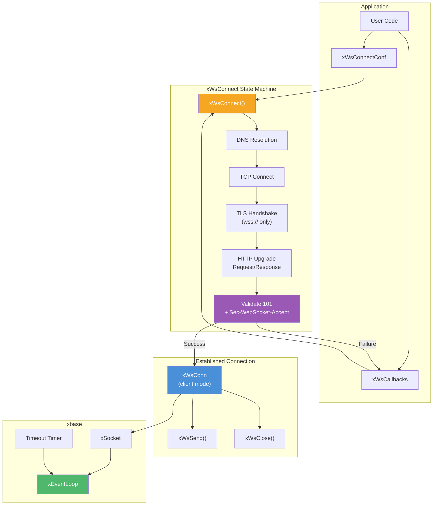
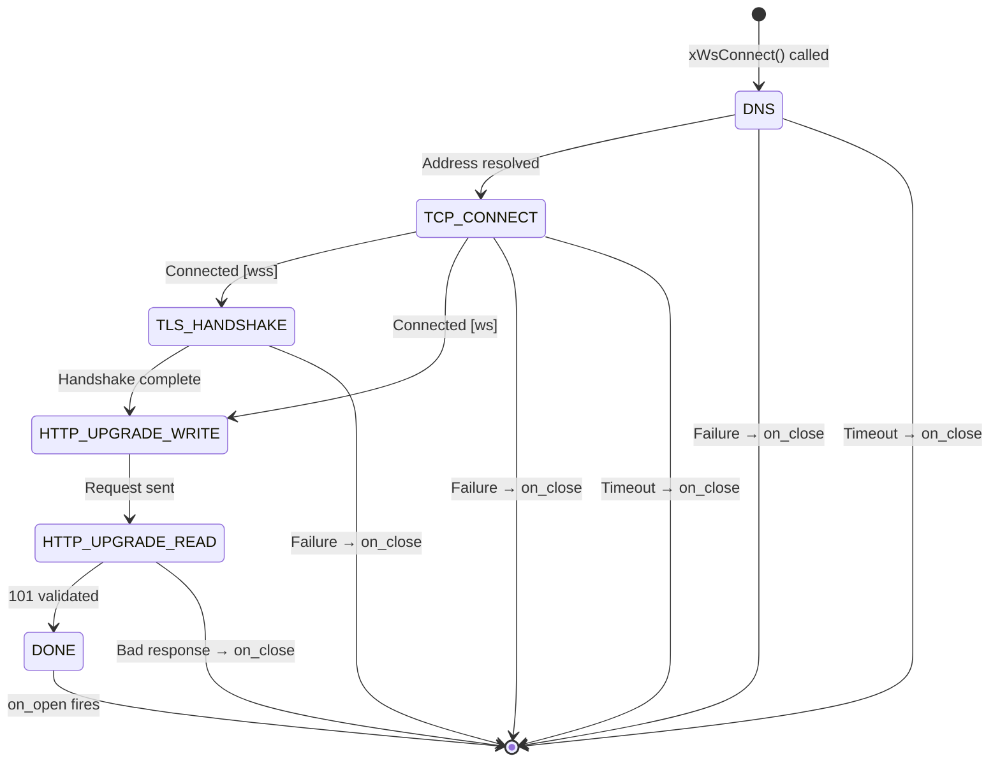
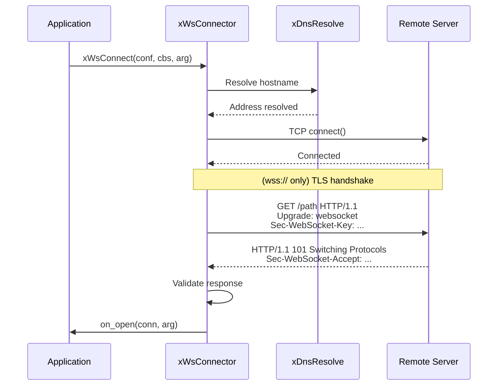

# ws.h — WebSocket Client

## Introduction

`ws.h` provides `xWsConnect()`, an asynchronous WebSocket client that integrates with xbase's event loop. The entire connection process — DNS resolution, TCP connect, optional TLS handshake, and HTTP Upgrade — runs fully asynchronously. Once connected, the same callback-driven model (`on_open`, `on_message`, `on_close`) and the same `xWsConn` handle are used for both client and server connections.

## Design Philosophy

1. **Fully Asynchronous Connection** — `xWsConnect()` returns immediately. The multi-phase connection process (DNS → TCP → TLS → HTTP Upgrade) is driven entirely by the event loop. No threads or blocking calls.

2. **Shared Connection Model** — Once the handshake completes, a client `xWsConn` is identical to a server `xWsConn`. The same `xWsSend()`, `xWsClose()`, and callback interfaces apply. Code that operates on `xWsConn` doesn't need to know which side initiated the connection.

3. **Failure via `on_close`** — If the connection fails at any stage (DNS, TCP, TLS, or HTTP Upgrade), `on_close` is invoked with an error code. `on_open` is never called for failed connections. Cleanup always happens in one place.

4. **Client-Side Masking** — Per RFC 6455, client-to-server frames must be masked. The library handles this automatically when the connection is created in client mode.

## Architecture



## API Reference

### Types

| Type | Description |
| --- | --- |
| `xWsConn` | Opaque WebSocket connection handle (shared with server) |
| `xWsOpcode` | Message type: `Text` (0x1), `Binary` (0x2) |
| `xWsCallbacks` | Struct of 3 optional callback pointers (shared with server) |
| `xWsConnectConf` | Configuration for `xWsConnect()` |

### xWsConnectConf

```c
XDEF_STRUCT(xWsConnectConf) {
    const char   *url;        /* ws:// or wss:// URL (required)            */
    const xTlsConf *tls;      /* TLS config for wss:// (NULL = defaults)   */
    xTlsCtx       tls_ctx;    /* Pre-created shared TLS context (priority) */
    const char   *headers;    /* Extra HTTP headers (NULL = none)          */
    int           timeout_ms; /* Connect timeout (0 = 10000 ms)            */
};
```

| Field | Description |
| --- | --- |
| `url` | WebSocket URL. Must start with `ws://` or `wss://`. Required. |
| `tls` | TLS configuration for `wss://` connections. `NULL` uses system CA with verification enabled. Ignored for `ws://`. Ignored when `tls_ctx` is set. |
| `tls_ctx` | Pre-created shared TLS context from `xTlsCtxCreate()`. Takes priority over `tls`. The caller retains ownership and must keep it alive for the lifetime of the connection. `NULL` = create from `tls` (or use defaults). |
| `headers` | Extra HTTP headers appended to the Upgrade request. Format: `"Key: Value\r\nKey2: Value2\r\n"`. `NULL` for none. |
| `timeout_ms` | Timeout for the entire connection process in milliseconds. `0` uses the default (10000 ms). |

### Callbacks

The same `xWsCallbacks` struct is used for both client and server connections. See [WebSocket Server](ws_server.md) for callback signature details.

**Client-specific behavior:**

- **`on_open`** — Called when the connection is fully established (101 validated). Not called on failure.
- **`on_close`** — Called on connection failure (DNS, TCP, TLS, or Upgrade error) **or** after a normal close. For failed connections, `conn` is `NULL`.

### Functions

#### xWsConnect

```c
xErrno xWsConnect(
    const xWsConnectConf *conf,
    const xWsCallbacks *callbacks,
    void *arg);
```

Initiate an asynchronous WebSocket client connection. Returns immediately; the connection process runs on the event loop.

**Parameters:**

- `conf` — Connection configuration (must not be NULL, `conf->url` required).
- `callbacks` — WebSocket event callbacks (must not be NULL).
- `arg` — User argument forwarded to all callbacks.

**Returns:** `xErrno_Ok` if the async connection started, `xErrno_InvalidArg` for bad parameters (NULL pointers, invalid URL scheme).

#### xWsSend

```c
xErrno xWsSend(
    xWsConn conn, xWsOpcode opcode,
    const void *payload, size_t len);
```

Send a message. Identical to the server-side API. Client frames are automatically masked per RFC 6455.

#### xWsClose

```c
xErrno xWsClose(xWsConn conn, uint16_t code);
```

Initiate a graceful close. Identical to the server-side API.

## Usage Examples

### Connect and echo

```c
#include <x/base/event.h>
#include <x/http/ws.h>
#include <stdio.h>
#include <string.h>

static void on_open(xWsConn conn, void *arg) {
    (void)arg;
    const char *msg = "Hello, server!";
    xWsSend(conn, xWsOpcode_Text, msg, strlen(msg));
}

static void on_message(xWsConn conn, xWsOpcode op, const void *data, size_t len, void *arg) {
    (void)conn; (void)op; (void)arg;
    printf("Received: %.*s\n", (int)len, (const char *)data);
    xWsClose(conn, 1000);
}

static void on_close(xWsConn conn, uint16_t code, const char *reason, size_t len, void *arg) {
    (void)conn; (void)reason; (void)len; (void)arg;
    printf("Closed: %u\n", code);
}

int main(void) {
    xEventLoop loop = xEventLoopCreate();
    xEventLoopEnter(loop);

    xWsConnectConf conf = {0};
    conf.url = "ws://localhost:8080/ws";

    xWsCallbacks cbs = {
        .on_open    = on_open,
        .on_message = on_message,
        .on_close   = on_close,
    };

    xWsConnect(&conf, &cbs, NULL);

    xEventLoopRun(loop);
    xEventLoopDestroy(loop);
    return 0;
}
```

### Secure connection (wss://)

```c
xTlsConf tls = {0};
tls.skip_verify = 1;                       /* dev only */

xWsConnectConf conf = {0};
conf.url        = "wss://echo.example.com/ws";
conf.tls        = &tls;
conf.timeout_ms = 5000;

xWsConnect(&conf, &cbs, NULL);
```

### Shared TLS context (multiple connections)

When creating many `wss://` connections (reconnect loops, connection pools), use a shared `xTlsCtx` to avoid reloading certificates on every connection:

```c
xTlsConf tls = {0};
tls.ca = "ca.pem";
xTlsCtx ctx = xTlsCtxCreate(&tls);

/* All connections share the same ctx */
xWsConnectConf conf = {0};
conf.url     = "wss://echo.example.com/ws";
conf.tls_ctx = ctx;                        /* shared, not copied */

xWsConnect(&conf, &cbs, NULL);

/* Destroy ctx only after all connections are closed. */
```

### Custom headers (authentication)

```c
xWsConnectConf conf = {0};
conf.url = "ws://api.example.com/stream";
conf.headers = "Authorization: Bearer token123\r\n"
               "X-Client-Version: 1.0\r\n";

xWsConnect(&conf, &cbs, NULL);
```

### Connection failure handling

```c
static void on_close(xWsConn conn, uint16_t code, const char *reason, size_t len, void *arg) {
    (void)reason; (void)len; (void)arg;
    if (conn == NULL) {
        /* Connection failed before the WebSocket was established */
        printf("Connection failed (code %u)\n", code);
        /* Optionally schedule a retry via xEventLoopPost / a timer */
        return;
    }
    printf("Disconnected: %u\n", code);
}
```

### Binary data

```c
static void on_open(xWsConn conn, void *arg) {
    (void)arg;
    uint8_t data[] = {0x00, 0x01, 0x02, 0xFF, 0xFE};
    xWsSend(conn, xWsOpcode_Binary, data, sizeof(data));
}
```

## Best Practices

- **Check the return value of `xWsConnect()`.** It returns `xErrno_InvalidArg` for obviously bad parameters (NULL pointers, unsupported URL scheme). Network errors are reported asynchronously via `on_close`.
- **Handle `conn == NULL` in `on_close`.** This indicates a connection failure before the WebSocket was established. Use this to implement retry logic.
- **Don't block in callbacks.** All callbacks run on the event loop thread.
- **Copy payload if needed.** The `payload` pointer in `on_message` is valid only during the callback.
- **Use `xWsClose()` for graceful shutdown.** The client sends a Close frame and waits for the server's response.
- **Set a reasonable timeout.** The default 10-second timeout covers DNS + TCP + TLS + Upgrade. Adjust via `conf.timeout_ms` for high-latency networks.
- **Never use `skip_verify` in production.** It disables all certificate validation. Use a proper CA path or system CA bundle instead.

## Comparison with Other Libraries

| Feature | xhttp WS Client | libwebsockets | wslay | civetweb |
| --- | --- | --- | --- | --- |
| I/O Model | Async (event loop) | Async (own loop) | Sync (user drives) | Threaded |
| Event Loop | xEventLoop | Own loop | None | pthreads |
| DNS | Async (xDnsResolve) | Async (built-in) | Manual | Blocking |
| TLS | Via xnet | Built-in | Manual | Built-in |
| Client Masking | Automatic | Automatic | Automatic | Automatic |
| Connection Timeout | Configurable | Configurable | Manual | Configurable |
| Language | C99 | C | C | C |
| Dependencies | xbase + xnet | OpenSSL | None | None |

**Key Differentiator:** xhttp's WebSocket client runs entirely on the xbase event loop with zero blocking calls. The multi-phase connection (DNS → TCP → TLS → Upgrade) is a single async state machine. Combined with the shared `xWsConn` model, client and server code use identical APIs for sending, receiving, and closing — making bidirectional WebSocket applications straightforward.

**TLS Context Sharing:** For `wss://` connections, the client supports a shared `xTlsCtx` (via `conf.tls_ctx`) that avoids reloading certificates and re-creating the SSL context on every connection. This is the same pattern used by `xTcpConnect` and `xTcpListener`, providing consistent TLS context management across all libx networking APIs.

## Implementation Details

### Connection State Machine

The `xWsConnector` drives the connection through five phases, all on the event loop thread:



### Phase Details

| Phase | What Happens |
| --- | --- |
| **DNS** | `xDnsResolve()` resolves the hostname asynchronously. On success, proceeds to TCP. |
| **TCP Connect** | Creates an `xSocket`, calls `connect()`. Waits for the writable event (EINPROGRESS). |
| **TLS Handshake** | For `wss://` URLs only. Initializes the TLS transport and drives the handshake via read/write events. |
| **HTTP Upgrade Write** | Builds the Upgrade request (with random `Sec-WebSocket-Key`) and flushes it to the server. |
| **HTTP Upgrade Read** | Reads the server's response, validates `HTTP/1.1 101`, `Upgrade: websocket`, `Connection: Upgrade`, and `Sec-WebSocket-Accept`. |

### Handshake Flow



### Timeout Handling

A configurable timeout (default 10 seconds) covers the entire connection process. If any phase takes too long, the timer fires, the connector is destroyed, and `on_close` is invoked with code 1006 (Abnormal Closure).

### Internal File Structure

| File | Role |
| --- | --- |
| `ws.h` | Public API (`xWsConnect`, `xWsConnectConf`) |
| `ws_connect.c` | Async connection state machine |
| `ws_handshake_client.h/c` | Build Upgrade request, validate 101 response |
| `ws_crypto.h` | SHA-1 + Base64 for `Sec-WebSocket-Accept` |
| `transport_tls_client.h` | TLS client transport init (shared `xTlsCtx` → per-connection SSL) |
| `transport_tls_client_openssl.c` | OpenSSL TLS client transport implementation |
| `transport_tls_client_mbedtls.c` | mbedTLS TLS client transport implementation |
