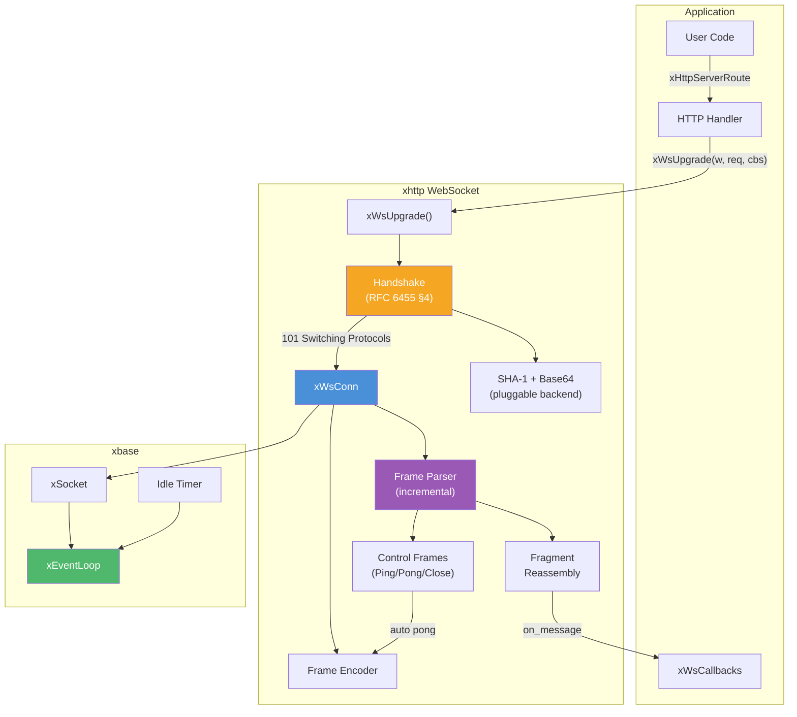
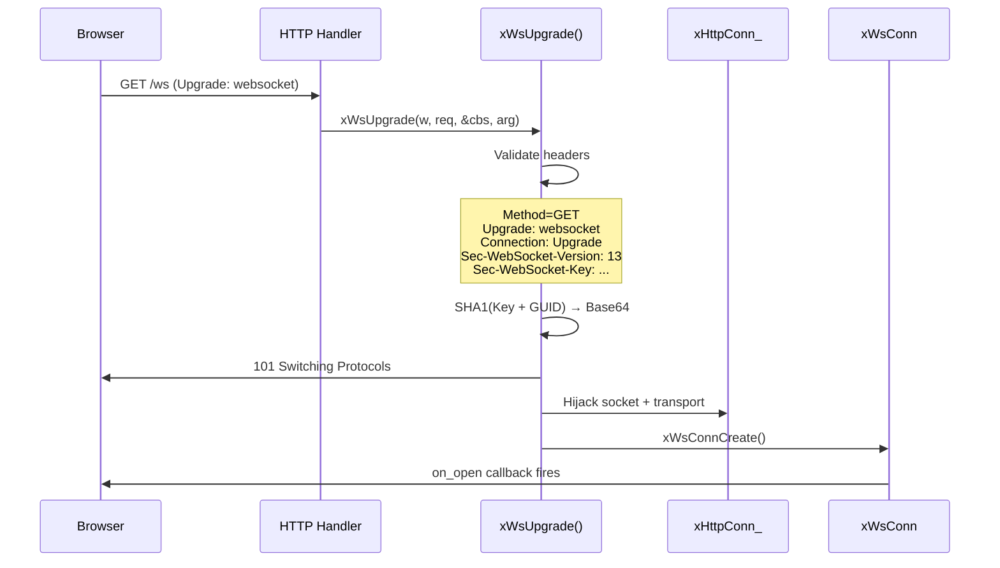
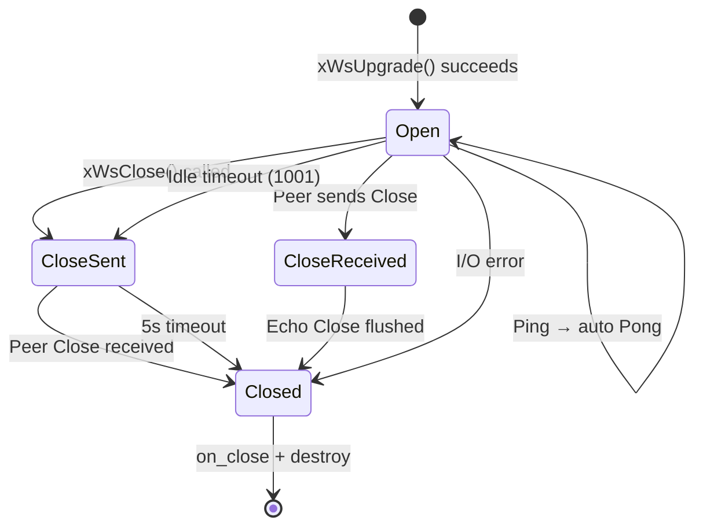

# ws.h — WebSocket Server

## Introduction

`ws.h` provides a callback-driven WebSocket interface integrated with the xhttp server. For pure WebSocket services, call `xWsServe()` to create a server in one line. For mixed HTTP + WebSocket endpoints, call `xWsUpgrade()` inside a regular HTTP handler to perform the RFC 6455 upgrade handshake. The library handles frame codec, ping/pong, fragment reassembly, and close negotiation automatically.

All callbacks are dispatched on the event loop thread — no locks or thread pools required.

## Design Philosophy

1. **Handler-Initiated Upgrade** — WebSocket connections start as regular HTTP requests. The user calls `xWsUpgrade()` inside an `xHttpHandlerFunc` to perform the upgrade. This keeps routing unified: WebSocket endpoints are just HTTP routes.

2. **Callback-Driven I/O** — Three optional callbacks (`on_open`, `on_message`, `on_close`) cover the full connection lifecycle. The library handles all framing, masking, and control frames internally.

3. **Automatic Protocol Handling** — Ping/pong is answered automatically. Fragmented messages are reassembled before delivery. Close handshake follows RFC 6455 §5.5.1 with a 5-second timeout for the peer's response.

4. **Connection Hijacking** — On successful upgrade, the HTTP connection's socket and transport layer are transferred to a new `xWsConn` object. The HTTP connection is destroyed; the WebSocket connection takes full ownership of the file descriptor.

5. **Pluggable Crypto Backend** — The handshake requires SHA-1 and Base64 for `Sec-WebSocket-Accept` computation. The crypto backend is selected at compile time: OpenSSL, Mbed TLS, or a built-in implementation.

## Architecture



## API Reference

### Types

| Type | Description |
| --- | --- |
| `xWsConn` | Opaque WebSocket connection handle |
| `xWsOpcode` | Message type: `Text` (0x1), `Binary` (0x2) |
| `xWsCallbacks` | Struct of 3 optional callback pointers |

### Callback Signatures

#### xWsOnOpenFunc

```c
typedef void (*xWsOnOpenFunc)(xWsConn conn, void *arg);
```

Called when the WebSocket connection is established. `conn` is valid until `on_close` returns.

#### xWsOnMessageFunc

```c
typedef void (*xWsOnMessageFunc)(
    xWsConn conn, xWsOpcode opcode,
    const void *payload, size_t len,
    void *arg);
```

Called when a complete message is received. Fragmented messages are reassembled before delivery. `payload` is valid only during the callback.

#### xWsOnCloseFunc

```c
typedef void (*xWsOnCloseFunc)(
    xWsConn conn, uint16_t code,
    const char *reason, size_t len,
    void *arg);
```

Called when the connection is closed (clean or abnormal). After this callback returns, `conn` is invalid.

### xWsCallbacks

```c
typedef struct {
    xWsOnOpenFunc    on_open;    // optional
    xWsOnMessageFunc on_message; // optional
    xWsOnCloseFunc   on_close;   // optional
} xWsCallbacks;
```

### Functions

| Function | Description |
| --- | --- |
| `xWsServe` | One-call WebSocket-only server |
| `xWsUpgrade` | Upgrade HTTP → WebSocket |
| `xWsSend` | Send a text or binary message |
| `xWsClose` | Initiate graceful close |

#### xWsServe

```c
xHttpServer xWsServe(
    const char *host,
    uint16_t port,
    const xWsCallbacks *callbacks,
    void *arg);
```

Convenience function that creates an HTTP server, registers a catch-all route that upgrades every incoming request to WebSocket, and starts listening. Returns the server handle for later cleanup via `xHttpServerDestroy()`, or `NULL` on failure.

**Parameters:**

- `host` — Bind address (e.g. `"0.0.0.0"`), or NULL.
- `port` — Port number to listen on.
- `callbacks` — WebSocket event callbacks (not NULL).
- `arg` — User argument forwarded to all callbacks.

**Returns:** Server handle, or `NULL` on failure.

#### xWsUpgrade

```c
xErrno xWsUpgrade(
    xHttpResponseWriter writer,
    const xHttpRequest *req,
    const xWsCallbacks *callbacks,
    void *arg);
```

Call inside an `xHttpHandlerFunc` to upgrade the HTTP connection to WebSocket. On success, the handler **must return immediately** — the HTTP connection has been hijacked.

On failure (bad headers, wrong method), an HTTP error response (400/405) is sent automatically and a non-Ok error code is returned.

**Parameters:**

- `writer` — Response writer from the handler.
- `req` — HTTP request from the handler.
- `callbacks` — WebSocket event callbacks (not NULL).
- `arg` — User argument forwarded to all callbacks.

**Returns:** `xErrno_Ok` on success.

#### xWsSend

```c
xErrno xWsSend(
    xWsConn conn, xWsOpcode opcode,
    const void *payload, size_t len);
```

Send a message over the WebSocket connection. The payload is framed and queued for asynchronous transmission.

**Parameters:**

- `conn` — WebSocket connection handle.
- `opcode` — `xWsOpcode_Text` or `xWsOpcode_Binary`.
- `payload` — Message data.
- `len` — Payload length in bytes.

**Returns:** `xErrno_Ok` on success, `xErrno_InvalidState` if the connection is closing.

#### xWsClose

```c
xErrno xWsClose(xWsConn conn, uint16_t code);
```

Initiate a graceful close. Sends a Close frame with the given status code. The connection remains open until the peer responds or a 5-second timeout expires.

**Parameters:**

- `conn` — WebSocket connection handle.
- `code` — Close status code (e.g., 1000 for normal).

**Returns:** `xErrno_Ok` on success.

### Close Status Codes

| Code | Constant | Meaning |
| --- | --- | --- |
| 1000 | `XWS_CLOSE_NORMAL` | Normal closure |
| 1001 | `XWS_CLOSE_GOING_AWAY` | Server shutting down |
| 1002 | `XWS_CLOSE_PROTOCOL_ERR` | Protocol error |
| 1003 | `XWS_CLOSE_UNSUPPORTED` | Unsupported data |
| 1005 | `XWS_CLOSE_NO_STATUS` | No status received |
| 1006 | `XWS_CLOSE_ABNORMAL` | Abnormal closure |

## Usage Examples

### Echo Server (with xWsServe)

```c
#include <x/base/event.h>
#include <x/http/ws.h>
#include <stdio.h>
#include <string.h>

static void on_open(xWsConn conn, void *arg) {
    (void)arg;
    const char *hi = "Welcome!";
    xWsSend(conn, xWsOpcode_Text, hi, strlen(hi));
}

static void on_message(xWsConn conn, xWsOpcode op, const void *data, size_t len, void *arg) {
    (void)arg;
    xWsSend(conn, op, data, len);
}

static void on_close(xWsConn conn, uint16_t code, const char *reason, size_t len, void *arg) {
    (void)conn; (void)reason; (void)len; (void)arg;
    printf("closed: %u\n", code);
}

static const xWsCallbacks ws_cbs = {
    .on_open    = on_open,
    .on_message = on_message,
    .on_close   = on_close,
};

int main(void) {
    xEventLoop loop = xEventLoopCreate();

    xEventLoopEnter(loop);

    xHttpServer srv = xWsServe("0.0.0.0", 8080, &ws_cbs, NULL);
    if (!srv) return 1;

    printf("ws://localhost:8080/\n");
    xEventLoopRun(loop);

    xHttpServerDestroy(srv);
    xEventLoopDestroy(loop);
    return 0;
}
```

### Echo Server (with xWsUpgrade)

```c
#include <x/base/event.h>
#include <x/http/server.h>
#include <x/http/ws.h>
#include <stdio.h>
#include <string.h>

static const xWsCallbacks ws_cbs = { ... };

static void ws_handler(xHttpResponseWriter w, const xHttpRequest *req, void *arg) {
    (void)arg;
    xWsUpgrade(w, req, &ws_cbs, NULL);
}

int main(void) {
    xEventLoop loop = xEventLoopCreate();

    xEventLoopEnter(loop);

    xHttpServer srv = xHttpServerCreate();

    xHttpServerRoute(srv, "GET /ws", ws_handler, NULL);
    xHttpServerListen(srv, "0.0.0.0", 8080);

    printf("ws://localhost:8080/ws\n");
    xEventLoopRun(loop);

    xHttpServerDestroy(srv);
    xEventLoopDestroy(loop);
    return 0;
}
```

### Per-Connection User Data

```c
typedef struct {
    char username[64];
    int  msg_count;
} Session;

static void on_open(xWsConn conn, void *arg) {
    Session *s = (Session *)arg;
    snprintf(s->username, sizeof(s->username), "user_%p", (void *)conn);
    s->msg_count = 0;
}

static void on_message(xWsConn conn, xWsOpcode op, const void *data, size_t len, void *arg) {
    Session *s = (Session *)arg;
    s->msg_count++;
    printf("[%s] msg #%d: %.*s\n", s->username, s->msg_count, (int)len, (const char *)data);
    xWsSend(conn, op, data, len);
}

static void ws_handler(xHttpResponseWriter w, const xHttpRequest *req, void *arg) {
    (void)arg;
    Session *s = calloc(1, sizeof(Session));
    xWsCallbacks cbs = {
        .on_open    = on_open,
        .on_message = on_message,
        .on_close   = on_close_free_session,
    };
    xWsUpgrade(w, req, &cbs, s);
}
```

### Graceful Server-Initiated Close

```c
static void on_message(xWsConn conn, xWsOpcode op, const void *data, size_t len, void *arg) {
    (void)op; (void)arg;
    if (len == 4 && memcmp(data, "quit", 4) == 0) {
        xWsClose(conn, 1000); // normal close
        return;
    }
    xWsSend(conn, op, data, len);
}
```

### JavaScript Client

```html
<script>
const ws = new WebSocket('ws://localhost:8080/ws');

ws.onopen = () => console.log('connected');

ws.onmessage = (e) => console.log('< ' + e.data);

ws.onclose = (e) =>
    console.log('closed: ' + e.code);

// Send a message
ws.send('Hello, server!');
</script>
```

## Best Practices

- **Return immediately after `xWsUpgrade()`.** On success, the HTTP connection is hijacked. Do not call any `xHttpResponse*` functions afterward.
- **Don't block in callbacks.** All callbacks run on the event loop thread. Blocking delays all other I/O.
- **Copy payload if needed.** The `payload` pointer in `on_message` is valid only during the callback. Copy the data if you need it later.
- **Use `xWsClose()` for graceful shutdown.** Avoid dropping connections without a Close handshake.
- **Handle `on_close` for cleanup.** Free per-connection resources in `on_close`, as the `xWsConn` handle becomes invalid after the callback returns.
- **Idle timeout is inherited.** The WebSocket connection inherits the HTTP server's `idle_timeout_ms` setting. Adjust it via `xHttpServerSetIdleTimeout()` if needed.

## Comparison with Other Libraries

| Feature | xhttp WS | libwebsockets | uWebSockets |
| --- | --- | --- | --- |
| Integration | xEventLoop | Own loop | Own loop |
| Upgrade | In HTTP handler | Separate | Separate |
| Fragment reassembly | Automatic | Automatic | Automatic |
| Ping/Pong | Automatic | Automatic | Automatic |
| Close handshake | RFC 6455 | RFC 6455 | RFC 6455 |
| TLS | Via xhttp | Built-in | Built-in |
| Language | C99 | C | C++ |
| Dependencies | xbase only | OpenSSL | None |

**Key Differentiator:** xhttp's WebSocket server is unique in its handler-initiated upgrade pattern. Instead of a separate WebSocket server, you register a normal HTTP route and call `xWsUpgrade()` inside the handler. This keeps routing, middleware, and mixed HTTP+WS endpoints unified under a single server instance.

## Implementation Details

### Upgrade Handshake Flow



### Connection Lifecycle



### Frame Processing

When data arrives on the socket, the incremental frame parser (`xWsFrameParser`) extracts complete frames from the `xIOBuffer`. Each frame is processed based on its opcode:

| Opcode | Handling |
| --- | --- |
| Text (0x1) | Deliver via `on_message` |
| Binary (0x2) | Deliver via `on_message` |
| Continuation (0x0) | Append to fragment buffer |
| Ping (0x9) | Auto-reply with Pong |
| Pong (0xA) | Ignored |
| Close (0x8) | Close handshake |

### Fragment Reassembly

Fragmented messages are reassembled transparently:

1. First fragment (FIN=0, opcode=Text/Binary) starts accumulation in `frag_buf`.
2. Continuation frames (opcode=0x0) append to `frag_buf`.
3. Final fragment (FIN=1, opcode=0x0) triggers reassembly and delivers the complete message via `on_message`.

Protocol violations (e.g., new message mid-fragment) result in a Close frame with status 1002.

### Close State Machine

```c
XDEF_ENUM(xWsCloseState){
    xWsCloseState_Open,          // Normal operating state
    xWsCloseState_CloseSent,     // We sent Close, waiting for peer
    xWsCloseState_CloseReceived, // Peer sent Close, we replied
    xWsCloseState_Closed,        // Connection fully closed
};
```

- **Server-initiated close:** `xWsClose()` sends a Close frame and transitions to `CLOSE_SENT`. A 5-second timer waits for the peer's Close response.
- **Peer-initiated close:** The peer's Close frame is echoed back, transitioning to `CLOSE_RECEIVED`. After the echo is flushed, `on_close` fires and the connection is destroyed.
- **Idle timeout:** After the configured idle period with no data, a Close frame with code 1001 (Going Away) is sent.

### Internal File Structure

| File | Role |
| --- | --- |
| `ws.h` | Public API (types, callbacks, functions) |
| `ws.c` | Connection lifecycle, I/O, frame dispatch |
| `ws_handshake_server.c` | Server upgrade handshake (RFC 6455 §4.2) |
| `ws_frame.h/c` | Frame codec (parse + encode) |
| `ws_crypto.h` | SHA-1 + Base64 interface |
| `ws_crypto_openssl.c` | OpenSSL backend |
| `ws_crypto_mbedtls.c` | Mbed TLS backend |
| `ws_crypto_builtin.c` | Built-in (no TLS dep) |
| `ws_serve.c` | `xWsServe()` convenience wrapper |
| `ws_private.h` | Internal data structures |
