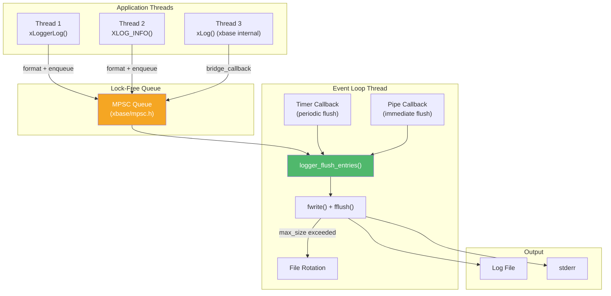

# xlog — Async Logging

## Introduction

**xlog** is moo's high-performance asynchronous logging module. It formats log entries on the calling thread and flushes them to a file (or stderr) on the event loop thread, decoupling I/O latency from application logic. Three operating modes — Timer, Notify, and Mixed — offer different trade-offs between flush latency and overhead.

## Design Philosophy

1. **Async by Default** — Log messages are formatted on the calling thread and enqueued via a lock-free MPSC queue. The event loop thread drains the queue and writes to disk, ensuring that logging never blocks the caller (except for Fatal level).

2. **Three Modes for Different Needs** — Timer mode batches writes for throughput; Notify mode uses a pipe for low-latency delivery; Mixed mode combines both, using the timer for normal messages and the pipe for high-severity entries.

3. **Event Loop Integration** — The logger is bound to an [`xEventLoop`](../base/event.md) and uses its timer and I/O facilities. This means no dedicated logging thread — the event loop thread handles both I/O and log flushing.

4. **Thread-Local Context** — `xLoggerEnter()` sets the current thread's logger, enabling the `XLOG_*()` macros and bridging xbase's internal `xLog()` calls to the async pipeline.

## Architecture



## Sub-Module Overview

| File | Description | Doc |
| --- | --- | --- |
| `logger.h` | Async logger API, macros, and configuration | [logger.md](logger.md) |

## Quick Start

```c
#include <x/base/event.h>
#include <x/log/logger.h>

int main(void) {
    xEventLoop loop = xEventLoopCreate();

    xLoggerConf conf = {
        .loop             = loop,
        .path             = "app.log",
        .mode             = xLogMode_Mixed,
        .level            = xLogLevel_Info,
        .max_size         = 10 * 1024 * 1024, // 10MB
        .max_files        = 5,
        .flush_interval_ms = 100,
    };

    xLogger logger = xLoggerCreate(conf);
    xLoggerEnter(logger); // Set as thread-local logger

    XLOG_INFO("Application started, version %d.%d", 1, 0);
    XLOG_WARN("Low memory: %zu bytes remaining", (size_t)1024);

    // Run event loop (processes log flushes)
    xEventLoopRun(loop);

    xLoggerLeave();
    xLoggerDestroy(logger);
    xEventLoopDestroy(loop);
    return 0;
}
```

## Relationship with Other Modules

- **xbase/event.h** — The logger is bound to an [`xEventLoop`](../base/event.md) for timer-driven and pipe-driven flush.
- **xbase/mpsc.h** — Uses the lock-free [`MPSC queue`](../base/mpsc.md) to pass log entries from producer threads to the event loop thread.
- **xbase/log.h** — `xLoggerEnter()` bridges xbase's internal [`xLog()`](../base/log.md) calls to the async logger via the thread-local callback mechanism.
- **xbase/atomic.h** — Uses [`atomic operations`](../base/atomic.md) for the lock-free entry freelist.
