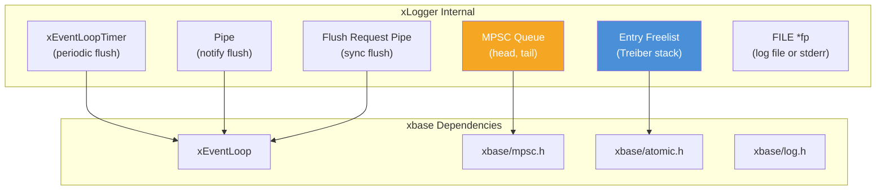
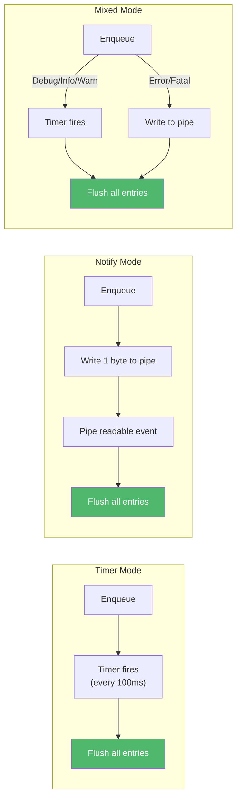
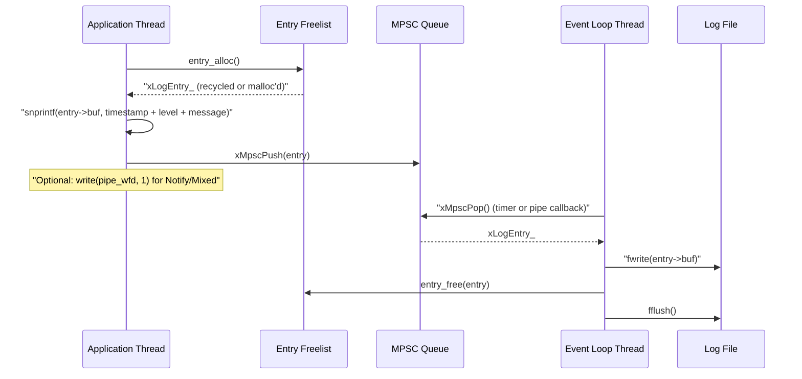

# logger.h — High-Performance Async Logger

## Introduction

`logger.h` provides `xLogger`, a high-performance asynchronous logger that formats log entries on the calling thread and flushes them to a file (or stderr) on the event loop thread. It supports three operating modes (Timer, Notify, Mixed), five severity levels, file rotation, synchronous flush, and seamless bridging with xbase's internal `xLog()` mechanism.

## Design Philosophy

1. **Format on Caller, Write on Loop** — Log messages are formatted (`snprintf`) on the calling thread into a pre-allocated entry buffer, then enqueued via the lock-free MPSC queue. The event loop thread dequeues and writes to disk. This decouples I/O latency from application logic.

2. **Three Operating Modes** — Different applications have different latency/throughput requirements:
   - **Timer** — Periodic flush (default 100ms). Best throughput, highest latency.
   - **Notify** — Pipe-based immediate notification. Lowest latency, highest overhead.
   - **Mixed** — Timer for normal messages, pipe for Error/Fatal. Best balance.

3. **Lock-Free Entry Pool** — A global Treiber stack freelist recycles log entry structs across all threads, avoiding `malloc`/`free` on the hot path.

4. **Fatal = Synchronous + Abort** — Fatal-level messages bypass the async queue entirely: they are written directly to the file and followed by `abort()`. This ensures the fatal message is never lost.

5. **xbase Bridge** — `xLoggerEnter()` registers a callback with xbase's `xLogSetCallback()`, routing all internal libx error messages through the async logger.

## Architecture



## API Reference

### Types

| Type | Description |
| --- | --- |
| `xLogger` | Opaque handle to an async logger |
| `xLogLevel` | Enum: `Debug`, `Info`, `Warn`, `Error`, `Fatal` |
| `xLogMode` | Enum: `Timer`, `Notify`, `Mixed` |
| `xLoggerConf` | Configuration struct for creating a logger |

### xLoggerConf Fields

| Field | Type | Default | Description |
| --- | --- | --- | --- |
| `loop` | `xEventLoop` | (required) | Event loop for timer/pipe callbacks |
| `path` | `const char *` | NULL (stderr) | Log file path |
| `mode` | `xLogMode` | `Timer` | Operating mode |
| `level` | `xLogLevel` | `Info` | Minimum log level |
| `max_size` | `size_t` | 0 (no rotation) | Max file size before rotation |
| `max_files` | `int` | 0 (no rotation) | Total files to keep (including current) |
| `flush_interval_ms` | `uint64_t` | 100 | Timer/Mixed flush interval |

### Functions

| Function | Signature | Description | Thread Safety |
| --- | --- | --- | --- |
| `xLoggerCreate` | `xLogger xLoggerCreate(xLoggerConf conf)` | Create a logger. | Not thread-safe |
| `xLoggerDestroy` | `void xLoggerDestroy(xLogger logger)` | Flush remaining entries and destroy. | Not thread-safe |
| `xLoggerLog` | `void xLoggerLog(xLogger logger, xLogLevel level, const char *fmt, ...)` | Write a log entry. Fatal is synchronous + abort. | **Thread-safe** |
| `xLoggerFlush` | `void xLoggerFlush(xLogger logger)` | Synchronously flush all pending entries. | **Thread-safe** |
| `xLoggerEnter` | `void xLoggerEnter(xLogger logger)` | Set as thread-local logger + bridge xbase log. | Thread-local |
| `xLoggerLeave` | `void xLoggerLeave(void)` | Clear thread-local logger. | Thread-local |
| `xLoggerCurrent` | `xLogger xLoggerCurrent(void)` | Get current thread's logger. | Thread-local |

### Convenience Macros

Using thread-local logger (set via `xLoggerEnter`):

| Macro | Expands To |
| --- | --- |
| `XLOG_DEBUG(fmt, ...)` | `xLoggerLog(xLoggerCurrent(), xLogLevel_Debug, fmt, ...)` |
| `XLOG_INFO(fmt, ...)` | `xLoggerLog(xLoggerCurrent(), xLogLevel_Info, fmt, ...)` |
| `XLOG_WARN(fmt, ...)` | `xLoggerLog(xLoggerCurrent(), xLogLevel_Warn, fmt, ...)` |
| `XLOG_ERROR(fmt, ...)` | `xLoggerLog(xLoggerCurrent(), xLogLevel_Error, fmt, ...)` |
| `XLOG_FATAL(fmt, ...)` | `xLoggerLog(xLoggerCurrent(), xLogLevel_Fatal, fmt, ...)` |

Explicit logger variants: `XLOG_DEBUG_L(logger, fmt, ...)`, etc.

## Usage Examples

### Basic File Logging

```c
#include <x/base/event.h>
#include <x/log/logger.h>

int main(void) {
    xEventLoop loop = xEventLoopCreate();

    xLoggerConf conf = {
        .loop  = loop,
        .path  = "app.log",
        .mode  = xLogMode_Timer,
        .level = xLogLevel_Info,
    };

    xLogger logger = xLoggerCreate(conf);
    xLoggerEnter(logger);

    XLOG_INFO("Server started on port %d", 8080);
    XLOG_DEBUG("This is filtered out (level < Info)");
    XLOG_WARN("Connection pool at %d%% capacity", 85);

    xEventLoopRun(loop);

    xLoggerLeave();
    xLoggerDestroy(logger);
    xEventLoopDestroy(loop);
    return 0;
}
```

### File Rotation Example

```c
xLoggerConf conf = {
    .loop      = loop,
    .path      = "/var/log/myapp.log",
    .mode      = xLogMode_Mixed,
    .level     = xLogLevel_Info,
    .max_size  = 50 * 1024 * 1024, // 50MB per file
    .max_files = 10,                // Keep 10 files (500MB total)
};
```

### Multi-Threaded Logging

```c
#include <pthread.h>
#include <x/log/logger.h>

static xLogger g_logger;

static void *worker(void *arg) {
    int id = *(int *)arg;
    xLoggerEnter(g_logger); // Each thread must enter

    for (int i = 0; i < 1000; i++) {
        XLOG_INFO("Worker %d: iteration %d", id, i);
    }

    xLoggerLeave();
    return NULL;
}

// In main():
// g_logger = xLoggerCreate(conf);
// pthread_create(&threads[i], NULL, worker, &ids[i]);
```

### Synchronous Flush Before Exit

```c
void graceful_shutdown(xLogger logger) {
    XLOG_INFO("Shutting down...");
    xLoggerFlush(logger); // Block until all entries are written
    xLoggerDestroy(logger);
}
```

## Use Cases

1. **Application Logging** — Primary use case: structured, async logging for server applications with file rotation and level filtering.

2. **libx Internal Error Capture** — Via `xLoggerEnter()`, all libx internal errors (from `xLog()`) are automatically routed through the async logger.

3. **Debug Logging** — Use `xLogMode_Notify` during development for immediate log output without timer delay.

## Best Practices

- **Call `xLoggerEnter()` on every thread** that uses `XLOG_*()` macros. Each thread needs its own thread-local context.
- **Use Mixed mode for production.** It provides the best balance: batched writes for normal messages, immediate notification for errors.
- **Set appropriate rotation limits.** Without rotation (`max_size = 0`), log files grow unbounded.
- **Call `xLoggerFlush()` before shutdown** to ensure all pending messages are written.
- **Don't log in tight loops at Debug level** without checking the level first. While the level filter is cheap, formatting still costs CPU.
- **Fatal messages are synchronous.** `XLOG_FATAL()` writes directly and calls `abort()`. Don't rely on async delivery for fatal messages.

## Comparison with Other Libraries

| Feature | xlog logger.h | spdlog | zlog | log4c |
| --- | --- | --- | --- | --- |
| **Language** | C99 | C++11 | C | C |
| **Async Model** | MPSC queue + event loop | Dedicated thread + queue | Dedicated thread | Synchronous |
| **Modes** | Timer / Notify / Mixed | Async (thread pool) | Async (thread) | Sync only |
| **Lock-Free** | Yes (MPSC + Treiber stack) | Yes (MPMC queue) | No (mutex) | No (mutex) |
| **Event Loop** | Integrated (xEventLoop) | None (own thread) | None (own thread) | None |
| **File Rotation** | Size-based (cascade rename) | Size-based | Size/time-based | Size-based |
| **Format** | printf-style | fmt-style / printf | printf-style | printf-style |
| **Thread-Local Context** | Yes (`xLoggerEnter`) | No | Yes (MDC) | Yes (NDC) |
| **Fatal Handling** | Sync write + abort | Flush + abort | Configurable | Configurable |

**Key Differentiator:** xlog is unique in integrating with an event loop rather than spawning a dedicated logging thread. This means the same thread that handles network I/O also handles log flushing, reducing context switches and thread count. The three-mode design (Timer/Notify/Mixed) gives fine-grained control over the latency/throughput trade-off that most logging libraries don't offer.

## Implementation Details

### Three Operating Modes



| Mode | Flush Trigger | Latency | Overhead | Best For |
| --- | --- | --- | --- | --- |
| **Timer** | Periodic timer (default 100ms) | Up to `flush_interval_ms` | Lowest (no per-message syscall) | High-throughput logging |
| **Notify** | Pipe write per message | ~Immediate | Highest (1 `write()` per message) | Low-latency debugging |
| **Mixed** | Timer + pipe for Error/Fatal | Low for errors, batched for info | Moderate | Production applications |

### Log Entry Lifecycle



### Log Entry Structure

```c
struct xLogEntry_ {
    xMpsc           node;       // MPSC queue node
    xLogLevel       level;      // Severity level
    int             len;        // Formatted message length
    char            buf[XLOG_ENTRY_BUF_SIZE]; // Formatted message (512 bytes)
    struct xLogEntry_ *free_next; // Freelist link
};
```

### Lock-Free Entry Freelist

The freelist uses a Treiber stack with atomic CAS:

- **Alloc:** Pop from freelist head (CAS loop). Fallback to `malloc()` if empty.
- **Free:** Push to freelist head (CAS loop). If count exceeds `XLOG_FREELIST_SIZE`, call `free()` instead.

The count check is intentionally racy (soft cap) to keep the fast path lean.

### File Rotation

When `written >= max_size` and `max_files > 1`:

1. Delete `path.{max_files-1}` (oldest)
2. Cascade rename: `path.{i-1}` → `path.{i}` for i = max_files-1 down to 2
3. Rename `path` → `path.1`
4. Reopen `path` in append mode

```text
app.log      → app.log.1
app.log.1    → app.log.2
app.log.2    → app.log.3
app.log.3    → (deleted if max_files=4)
```

### Synchronous Flush

`xLoggerFlush()` writes a byte to a dedicated flush-request pipe, triggering `logger_flush_req_cb` on the event loop thread. The caller then busy-waits (polling `xMpscEmpty()` every 1ms, up to 1 second) until the queue is drained.

### Log Format

```text
2025-04-04 16:30:00.123 INFO  Application started
2025-04-04 16:30:00.456 WARN  Low memory: 1024 bytes remaining
2025-04-04 16:30:01.789 ERROR Connection refused
```

Format: `YYYY-MM-DD HH:MM:SS.mmm LEVEL message\n`
