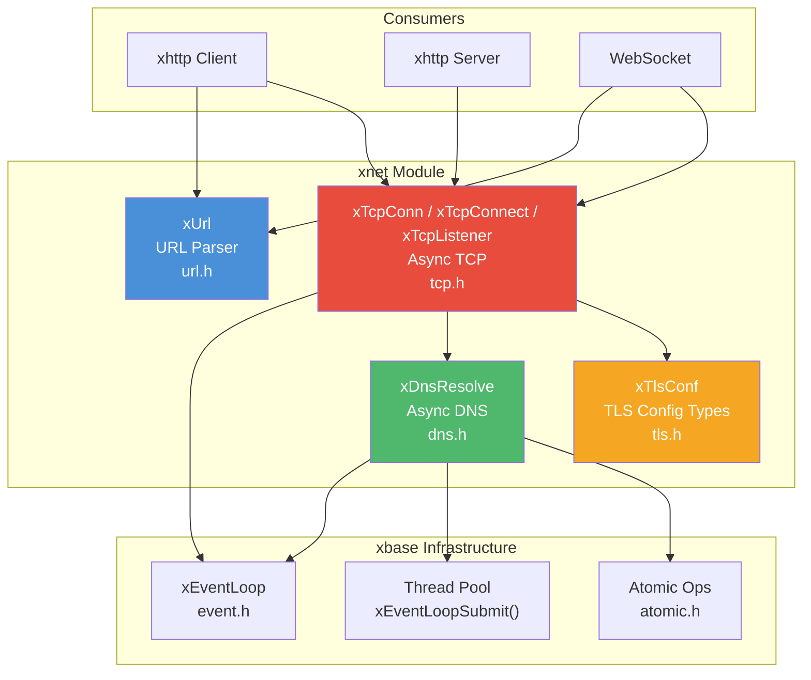

# xnet — Networking Primitives

## Introduction

**xnet** is moo's networking utility module, providing three foundational components for network programming: a lightweight URL parser, an asynchronous DNS resolver, and shared TLS configuration types. These building blocks are used internally by higher-level modules like xhttp, and are also available for direct use in application code.

## Design Philosophy

1. **Zero-Copy URL Parsing** — `xUrlParse()` makes a single internal copy of the input string. All component fields (scheme, host, port, etc.) are pointer+length pairs referencing this copy, avoiding per-field allocations.

2. **Async DNS via Thread-Pool Offload** — DNS resolution uses `getaddrinfo()` offloaded to the event loop's thread pool. The callback is always invoked on the event loop thread, keeping the async programming model consistent with the rest of moo.

3. **Shared TLS Types** — `xTlsConf` is a plain data structure shared across modules. It decouples TLS configuration from any specific TLS backend (OpenSSL, mbedTLS).

4. **Async TCP with Transport Abstraction** — `xTcpConnect` chains DNS → connect → optional TLS handshake into a single async operation. `xTcpConn` wraps an `xSocket` + `xTransport` vtable, providing `Recv`/`Send`/`SendIov` helpers that work transparently over plain TCP or TLS.

## Architecture



## Sub-Module Overview

| Header | Component | Description | Doc |
| --- | --- | --- | --- |
| `url.h` | `xUrl` | Lightweight URL parser | [url.md](url.md) |
| `dns.h` | `xDnsResolve` | Async DNS resolution | [dns.md](dns.md) |
| `tls.h` | `xTlsConf` | Shared TLS config types | [tls.md](tls.md) |
| `tcp.h` | `xTcpConn` / `xTcpConnect` / `xTcpListener` | Async TCP connection, connector & listener | [tcp.md](tcp.md) |

## Quick Start

```c
#include <stdio.h>
#include <x/base/event.h>
#include <x/net/url.h>
#include <x/net/dns.h>
#include <x/net/tls.h>

// 1. Parse a URL
static void url_example(void) {
    xUrl url;
    xErrno err = xUrlParse(
        "wss://example.com:8443/ws?token=abc", &url);
    if (err == xErrno_Ok) {
        printf("scheme: %.*s\n",
               (int)url.scheme_len, url.scheme);
        printf("host:   %.*s\n",
               (int)url.host_len, url.host);
        printf("port:   %u\n", xUrlPort(&url));
        printf("path:   %.*s\n",
               (int)url.path_len, url.path);
        xUrlFree(&url);
    }
}

// 2. Async DNS resolution
static void on_resolved(xDnsResult *result, void *arg) {
    (void)arg;
    if (result->error == xErrno_Ok) {
        int count = 0;
        for (xDnsAddr *a = result->addrs; a; a = a->next)
            count++;
        printf("Resolved %d address(es)\n", count);
    }
    xDnsResultFree(result);
    // stop the loop after resolution
}

static void dns_example(xEventLoop loop) {
    xDnsResolve(loop, "example.com", "443",
                NULL, on_resolved, NULL);
}

// 3. TLS configuration
static void tls_example(void) {
    xTlsConf client_tls = {0};
    client_tls.ca = "ca.pem";

    xTlsConf server_tls = {
        .cert = "server.pem",
        .key  = "server-key.pem",
    };
    (void)client_tls;
    (void)server_tls;
}
```

## Relationship with Other Modules

- **xbase** — The DNS resolver depends on [`xEventLoop`](../base/event.md) for thread-pool offload and uses [`atomic.h`](../base/atomic.md) for the cancellation flag.
- **xhttp** — The HTTP client uses `xUrl` for URL parsing, `xDnsResolve` for hostname resolution, and `xTlsConf` for TLS configuration. The WebSocket client supports both `xTlsConf` and a shared `xTlsCtx` for `wss://` connections. See the [TLS Deployment Guide](../http/tls.md) for end-to-end examples.
- **WebSocket** — The WebSocket client uses `xUrl` to parse `ws://` and `wss://` URLs, and optionally accepts a shared `xTlsCtx` to avoid per-connection TLS context creation.
