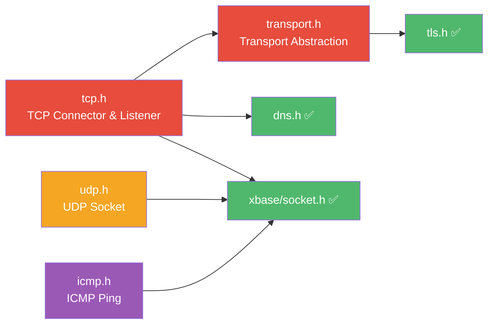

# xnet — TODO

> Planned additions to the xnet networking primitives module. Items are listed roughly in priority order.

## Current State

xnet currently provides three components:

| Header | Component | Status |
| --- | --- | --- |
| `url.h` | URL Parser | ✅ Done |
| `dns.h` | Async DNS Resolver | ✅ Done |
| `tls.h` | TLS Configuration Types + Context Management | ✅ Done |
| `transport.h` | Unified I/O Transport (Plain / TLS) | ✅ Done |
| `tcp.h` | Async TCP Connector & Listener | ✅ Done |

The following protocols are planned to be built on top of `xbase/socket.h` (async socket abstraction) and integrated into the xnet module.

---

## Transport Abstraction Layer

### transport.h — Unified I/O Transport (Plain / TLS)

Extract the transport vtable currently internal to xhttp (`xhttp/transport.h`) into a public, module-independent abstraction at the xnet level. This enables all higher-level protocols (TCP, HTTP, WebSocket, future QUIC) to consume a single read/write interface without caring whether the underlying connection is plain or TLS-encrypted.

### Current Situation

xhttp already has a well-designed `xHttpTransport` vtable with two implementations:

| Implementation | Backend | Location |
| --- | --- | --- |
| Plain TCP | `read(2)` / `writev(2)` | `xhttp/transport_plain.c` |
| TLS (OpenSSL) | `SSL_read` / `SSL_write` | `xhttp/transport_tls_openssl.c` |
| TLS (mbedTLS) | `mbedtls_ssl_read` / `mbedtls_ssl_write` | `xhttp/transport_tls_mbedtls.c` |

The problem: this abstraction is **private to xhttp** (`transport_private.h`), so xnet's planned TCP module cannot reuse it, and user applications cannot benefit from it either.

### Proposed Public API

```c
// xnet/transport.h — Public transport vtable

typedef struct xTransport_ xTransport;

XDEF_ENUM(xTransportResult) {
    xTransportResult_Done      =  0,  // Handshake complete
    xTransportResult_WantRead  =  1,  // Need more data (register read)
    xTransportResult_WantWrite =  2,  // Need to write (register write)
    xTransportResult_Error     = -1   // Handshake failed
};

XDEF_STRUCT(xTransport) {
    ssize_t      (*read)(void *ctx, void *buf, size_t len);
    ssize_t      (*writev)(void *ctx, const struct iovec *iov, int iovcnt);
    int          (*handshake)(void *ctx);   // NULL for plain
    const char * (*alpn)(void *ctx);        // NULL for plain
    void         (*destroy)(void *ctx);     // NULL if no cleanup
    void         *ctx;
};

// Plain TCP transport (maps directly to syscalls)
void xTransportPlainInit(xTransport *t, int fd);

// TLS transport (compile-time backend selection)
int  xTransportTlsClientInit(xTransport *t, xTlsCtx tls_ctx,
                              const char *hostname, int fd);
int  xTransportTlsServerInit(xTransport *t, xTlsCtx tls_ctx, int fd);
```

### Migration Path

1. Move `xHttpTransport` → `xTransport` in `xnet/transport.h`
2. Move plain and TLS implementations from `xhttp/` to `xnet/`
3. Update xhttp to `#include <x/net/transport.h>` and use `xTransport` internally
4. WebSocket client/server already use the vtable — just update the type name
5. New `xTcpConnect` / `xTcpListener` return connections with `xTransport` attached

### Design Principles

- **Zero-cost for plain TCP** — the plain implementation is just a thin wrapper around `read(2)` / `writev(2)`, no virtual dispatch overhead beyond the function pointer call
- **Compile-time TLS backend** — `X_TLS_BACKEND` selects OpenSSL or mbedTLS at build time, same as today
- **Composable** — `xTcpConnect()` optionally accepts a `xTlsConf*`; if non-NULL, the returned connection's transport is TLS, otherwise plain
- **ALPN-aware** — the `alpn()` callback enables automatic HTTP/2 vs HTTP/1.1 detection after TLS handshake, which xhttp already relies on

---

## TCP Support

### tcp.h — Async TCP Connector & Listener

Build higher-level TCP abstractions on top of `xSocket`, eliminating the boilerplate of non-blocking connect, bind/listen/accept, and connection lifecycle management.

### Connector (xTcpConnect)

- Non-blocking `connect()` with configurable timeout
- Integrated DNS resolution via `xDnsResolve()` — pass a hostname, get a connected socket
- Automatic `AF_INET` / `AF_INET6` selection based on DNS results (Happy Eyeballs style)
- Socket options: `TCP_NODELAY`, `SO_KEEPALIVE`, `SO_REUSEADDR`
- Callback: `void (*)(xTcpConn conn, xErrno err, void *arg)`

```c
// Proposed API sketch
typedef struct xTcpConn_ *xTcpConn;
typedef void (*xTcpConnectCb)(xTcpConn conn, xErrno err, void *arg);

xErrno xTcpConnect(const char *host, uint16_t port,
                    const xTcpConnectOpts *opts, xTcpConnectCb cb, void *arg);
```

### Listener (xTcpListener)

- `bind()` + `listen()` + async `accept()` loop
- Each accepted connection delivered as an `xSocket` via callback
- Support for `SO_REUSEPORT` (multi-listener on same port)
- Graceful shutdown: stop accepting, drain existing connections

```c
// Proposed API sketch
typedef struct xTcpListener_ *xTcpListener;
typedef void (*xTcpAcceptCb)(xTcpListener ln, xSocket client,
                             struct sockaddr *addr, socklen_t addrlen, void *arg);

xTcpListener xTcpListenerCreate(const char *bind_addr,
                                 uint16_t port, xTcpAcceptCb cb, void *arg);
void xTcpListenerDestroy(xTcpListener ln);
```

### Design Considerations

- The connector should compose with `xDnsResolve` internally, so the user just passes a hostname string
- Connection timeout should reuse `xSocket`'s idle-timeout mechanism where possible
- TLS upgrade can be layered on top: connect returns an `xTransport`; if `xTlsConf` is provided, the transport is automatically TLS

---

## UDP Support

### udp.h — Async UDP Socket

Provide a higher-level UDP abstraction with integrated event loop registration, allocation-free receive path, and optional "connected UDP" mode.

### Core (xUdpSocket)

- Async `sendto()` / `recvfrom()` with event-loop-driven callbacks
- Automatic non-blocking setup and event registration
- Configurable receive buffer size
- Idle-timeout support (detect silent peers)

```c
// Proposed API sketch
typedef struct xUdpSocket_ *xUdpSocket;
typedef void (*xUdpRecvCb)(xUdpSocket sock, const void *data, size_t len,
                           const struct sockaddr *addr, socklen_t addrlen, void *arg);

xUdpSocket xUdpSocketCreate(const char *bind_addr,
                              uint16_t port, xUdpRecvCb cb, void *arg);
xErrno xUdpSendTo(xUdpSocket sock, const void *data, size_t len,
                   const struct sockaddr *addr, socklen_t addrlen);
void xUdpSocketDestroy(xUdpSocket sock);
```

### Connected UDP Mode

- `xUdpConnect(sock, addr)` — call `connect()` on the UDP socket
- After connecting, use `xUdpSend()` / `xUdpRecv()` (no address per call)
- Reduces per-packet overhead and enables ICMP error delivery for the connected peer

### UDP Use Cases

- DNS resolver (could optionally use UDP transport instead of thread-pool `getaddrinfo`)
- QUIC transport (future)
- Game networking / real-time telemetry
- Custom RPC protocols over UDP

---

## ICMP Support

### icmp.h — Async ICMP (Ping)

Provide async ICMP echo request/reply for network diagnostics. Requires raw sockets (`SOCK_RAW`) or unprivileged ICMP (`SOCK_DGRAM` + `IPPROTO_ICMP` on Linux).

### Ping (xIcmpPing)

- Send ICMP Echo Request, receive Echo Reply with RTT measurement
- Support both IPv4 (ICMP) and IPv6 (ICMPv6)
- Configurable: TTL, payload size, timeout, interval, count
- Callback per reply: `void (*)(xIcmpPingResult *result, void *arg)`

```c
// Proposed API sketch
typedef struct xIcmpPing_ *xIcmpPing;

typedef struct {
    xErrno      error;      // xErrno_Ok on success, xErrno_Timeout on timeout
    uint16_t    seq;        // Sequence number
    uint8_t     ttl;        // TTL from reply
    double      rtt_ms;     // Round-trip time in milliseconds
    struct sockaddr_storage addr; // Responder address
} xIcmpPingResult;

typedef void (*xIcmpPingCb)(xIcmpPingResult *result, void *arg);

xIcmpPing xIcmpPingCreate(const char *host,
                            const xIcmpPingOpts *opts, xIcmpPingCb cb, void *arg);
void xIcmpPingStop(xIcmpPing ping);
void xIcmpPingDestroy(xIcmpPing ping);
```

### Platform Considerations

| Platform | Approach | Privilege Required |
| --- | --- | --- |
| Linux ≥ 3.0 | `SOCK_DGRAM` + `IPPROTO_ICMP` (unprivileged) | `net.ipv4.ping_group_range` sysctl |
| Linux (fallback) | `SOCK_RAW` + `IPPROTO_ICMP` | `CAP_NET_RAW` or root |
| macOS | `SOCK_DGRAM` + `IPPROTO_ICMP` (unprivileged) | No special privilege |

### ICMP Use Cases

- Network health monitoring
- Latency measurement
- Host reachability checks before establishing TCP/TLS connections

---

## Priority & Dependencies



| Priority | Component | Reason |
| --- | --- | --- |
| P0 | `transport.h` | Foundation — all higher-level protocols depend on a unified plain/TLS I/O interface |
| P0 | `tcp.h` | Most impactful — enables standalone TCP servers/clients without xhttp overhead |
| P1 | `udp.h` | Enables UDP-based protocols (DNS over UDP, QUIC groundwork, game networking) |
| P2 | `icmp.h` | Nice-to-have for diagnostics; lower priority since most apps don't need raw ICMP |
