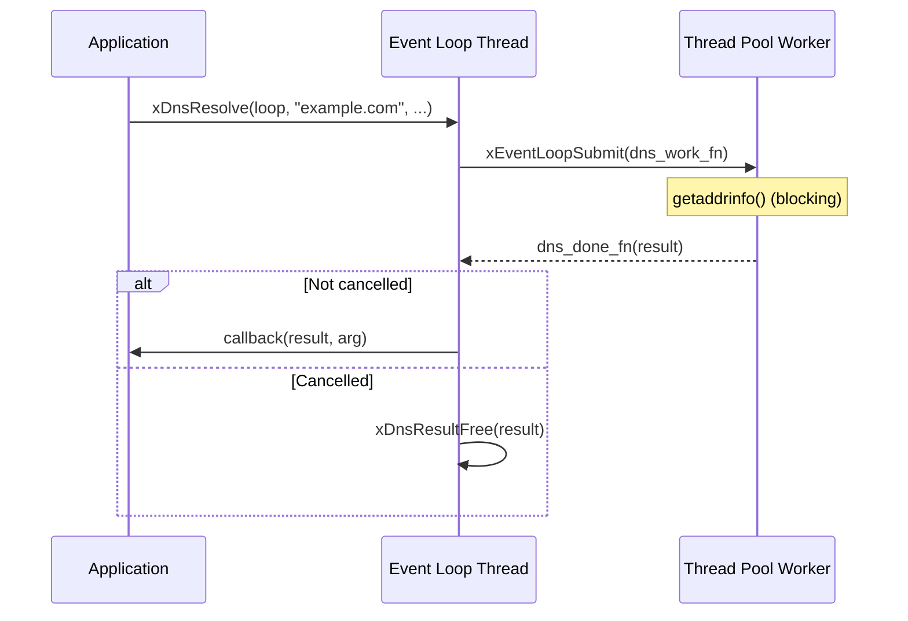
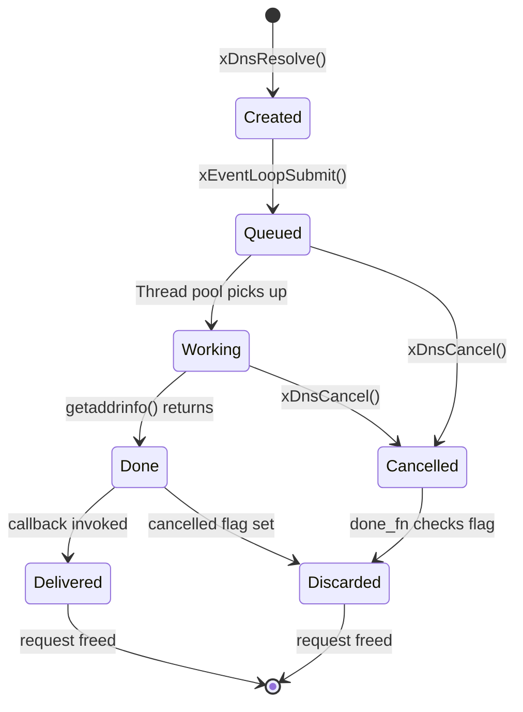

# dns.h — Asynchronous DNS Resolution

## Introduction

`dns.h` provides asynchronous DNS resolution by offloading `getaddrinfo()` to the event loop's thread pool. The completion callback is always invoked on the event loop thread, maintaining moo's single-threaded callback model. Queries can be cancelled before the callback fires.

## Design Philosophy

1. **Thread-Pool Offload** — `getaddrinfo()` is a blocking POSIX call. Rather than introducing a dedicated DNS thread, xnet reuses the event loop's existing thread pool via `xEventLoopSubmit()`.

2. **Event-Loop-Thread Callbacks** — The done callback runs on the event loop thread, so user code never needs synchronization. This is consistent with every other callback in moo.

3. **Linked-List Result** — Resolved addresses are returned as a linked list of `xDnsAddr` nodes, preserving the full `getaddrinfo()` result (family, socktype, protocol) for each address.

4. **Cancellation Support** — `xDnsCancel()` sets an atomic flag. If the worker has already finished, the done callback silently discards the result instead of invoking the user callback.

5. **IP Literal Fast Path** — If the hostname is an IPv4 or IPv6 literal, `AI_NUMERICHOST` is set automatically, skipping the actual DNS lookup.

## Architecture



## API Reference

### Core Functions

| Function | Signature | Description |
| --- | --- | --- |
| `xDnsResolve` | `xDnsQuery xDnsResolve(xEventLoop loop, const char *hostname, const char *service, const struct addrinfo *hints, xDnsCallback callback, void *arg)` | Start async DNS resolution |
| `xDnsCancel` | `void xDnsCancel(xEventLoop loop, xDnsQuery query)` | Cancel a pending query |
| `xDnsResultFree` | `void xDnsResultFree(xDnsResult *result)` | Free a resolution result |

### Types

| Type | Description |
| --- | --- |
| `xDnsQuery` | Opaque handle to a pending query |
| `xDnsResult` | Resolution result: `error` + `addrs` linked list |
| `xDnsAddr` | Single resolved address node |
| `xDnsCallback` | `void (*)(xDnsResult *result, void *arg)` |

### xDnsResult Fields

| Field | Type | Description |
| --- | --- | --- |
| `error` | `xErrno` | `xErrno_Ok` on success |
| `addrs` | `xDnsAddr *` | Linked list of addresses, or `NULL` |

### xDnsAddr Fields

| Field | Type | Description |
| --- | --- | --- |
| `addr` | `struct sockaddr_storage` | Resolved socket address |
| `addrlen` | `socklen_t` | Length of the address |
| `family` | `int` | `AF_INET` or `AF_INET6` |
| `socktype` | `int` | `SOCK_STREAM` or `SOCK_DGRAM` |
| `protocol` | `int` | `IPPROTO_TCP` or `IPPROTO_UDP` |
| `next` | `xDnsAddr *` | Next address, or `NULL` |

### Parameter Details for xDnsResolve

| Parameter | Required | Description |
| --- | --- | --- |
| `loop` | Yes | Event loop (must not be `NULL`) |
| `hostname` | Yes | Hostname or IP literal (non-empty) |
| `service` | No | Port string (e.g. `"443"`) or `NULL` |
| `hints` | No | `addrinfo` hints; `NULL` defaults to `AF_UNSPEC` + `SOCK_STREAM` |
| `callback` | Yes | Completion callback (must not be `NULL`) |
| `arg` | No | User argument forwarded to callback |

Returns a `xDnsQuery` handle, or `NULL` on invalid arguments.

## Usage Examples

### Basic Resolution

```c
#include <stdio.h>
#include <arpa/inet.h>
#include <x/base/event.h>
#include <x/net/dns.h>

static void on_resolved(xDnsResult *result, void *arg) {
    xEventLoop loop = (xEventLoop)arg;

    if (result->error != xErrno_Ok) {
        fprintf(stderr, "DNS failed: %d\n", result->error);
        xDnsResultFree(result);
        xEventLoopStop(loop);
        return;
    }

    for (xDnsAddr *a = result->addrs; a; a = a->next) {
        char buf[INET6_ADDRSTRLEN];
        if (a->family == AF_INET) {
            struct sockaddr_in *sin = (struct sockaddr_in *)&a->addr;
            inet_ntop(AF_INET, &sin->sin_addr, buf, sizeof(buf));
        } else {
            struct sockaddr_in6 *sin6 = (struct sockaddr_in6 *)&a->addr;
            inet_ntop(AF_INET6, &sin6->sin6_addr, buf, sizeof(buf));
        }
        printf("  %s (family=%d)\n", buf, a->family);
    }

    xDnsResultFree(result);
    xEventLoopStop(loop);
}

int main(void) {
    xEventLoop loop = xEventLoopCreate();

    xDnsResolve(loop, "example.com", "443", NULL, on_resolved, loop);
    xEventLoopRun(loop);
    xEventLoopDestroy(loop);
    return 0;
}
```

### IPv4-Only Resolution

```c
struct addrinfo hints = {0};
hints.ai_family   = AF_INET;
hints.ai_socktype = SOCK_STREAM;

xDnsResolve(loop, "example.com", "80", &hints, on_resolved, loop);```

### Cancelling a Query

```c
xDnsQuery q = xDnsResolve(loop, "slow.example.com", NULL, NULL, on_resolved, NULL);
// Cancel immediately — callback will NOT fire
xDnsCancel(loop, q);
```

### IP Literal (No DNS Lookup)

```c
// Resolves instantly via AI_NUMERICHOST
xDnsResolve(loop, "127.0.0.1", "8080", NULL, on_resolved, loop);

xDnsResolve(loop, "::1", "8080", NULL, on_resolved, loop);
```

## Thread Safety

| Operation | Thread Safety |
| --- | --- |
| `xDnsResolve()` | Call from event loop thread only |
| `xDnsCancel()` | Call from event loop thread only |
| `xDnsResultFree()` | Call from any thread (result is owned) |
| `xDnsCallback` | Always invoked on event loop thread |

## Error Handling

| Scenario | Behavior |
| --- | --- |
| `NULL` loop, hostname, or callback | Returns `NULL` (no query created) |
| Empty hostname | Returns `NULL` |
| `malloc` failure | Returns `NULL` |
| `getaddrinfo()` failure | Callback receives `result->error != xErrno_Ok` |
| Cancelled query | Callback is **not** invoked; result is freed internally |

## Best Practices

- **Always call `xDnsResultFree()`** in your callback. The callee owns the result.
- **Check `result->error` before iterating `addrs`.** On failure, `addrs` is `NULL`.
- **Use `xDnsCancel()` for cleanup.** If you destroy the object that owns the callback context, cancel the query first to prevent a use-after-free.
- **Pass `NULL` hints for typical use.** The defaults (`AF_UNSPEC` + `SOCK_STREAM`) cover most HTTP/WebSocket connection scenarios.
- **`xDnsCancel(loop, NULL)` is safe** — it's a no-op, so you don't need to guard against NULL handles.

## Implementation Details

### Internal Request Lifecycle



### Error Mapping

`getaddrinfo()` returns EAI\_\* codes. These are mapped to moo error codes:

| EAI Code | xErrno | Meaning |
| --- | --- | --- |
| `0` (success) | `xErrno_Ok` | Resolution succeeded |
| `EAI_NONAME` | `xErrno_DnsNotFound` | Host not found |
| `EAI_AGAIN` | `xErrno_DnsTempFail` | Temporary failure |
| `EAI_MEMORY` | `xErrno_NoMemory` | Out of memory |
| Other | `xErrno_DnsError` | Generic DNS error |

### IP Literal Detection

Before calling `getaddrinfo()`, the worker checks if the hostname is an IP literal using `inet_pton()`. If it is, `AI_NUMERICHOST` is added to the hints, which tells `getaddrinfo()` to skip DNS lookup entirely.

```c
// Pseudocode
if (inet_pton(AF_INET, hostname, buf) == 1 ||
    inet_pton(AF_INET6, hostname, buf) == 1) {
    hints.ai_flags |= AI_NUMERICHOST;
}
```
