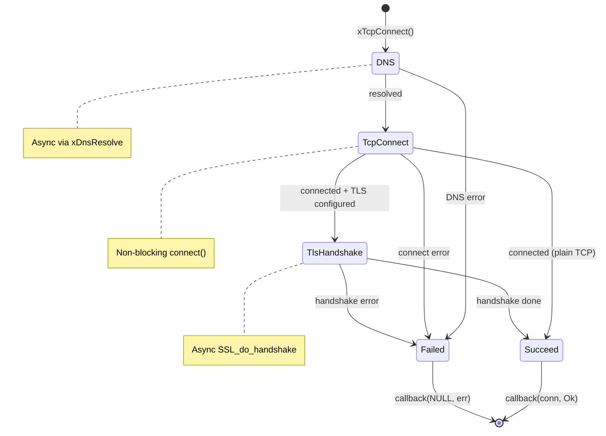
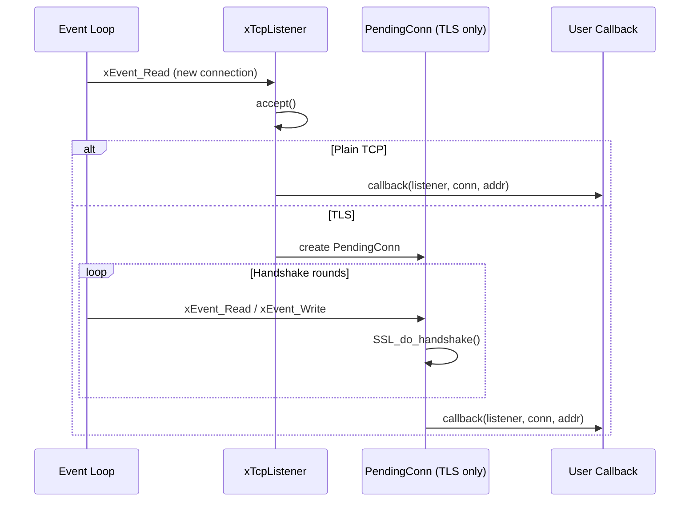
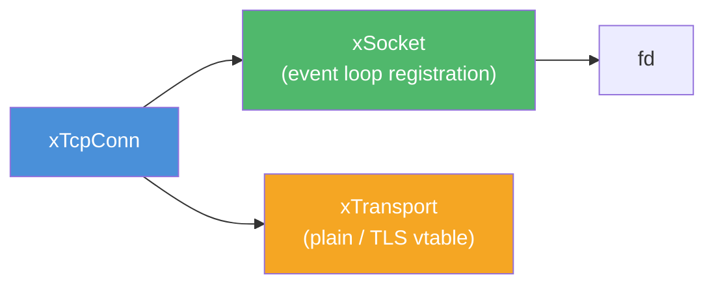

# tcp.h — Async TCP Connection, Connector & Listener

## Introduction

`tcp.h` provides three async TCP building blocks on top of libx's event loop:

- **xTcpConn** — a thin resource wrapper that pairs an `xSocket` with an `xTransport`, plus convenience `Recv`/`Send`/`SendIov` helpers.
- **xTcpConnect** — an async connector that performs DNS → socket → non-blocking connect → optional TLS handshake, delivering a ready-to-use `xTcpConn` via callback.
- **xTcpListener** — an async listener that accepts connections (with optional TLS) and delivers each as an `xTcpConn`.

All callbacks run on the event loop thread, consistent with the rest of libx.

## Design Philosophy

1. **Resource Wrapper, Not Callback Framework** — Unlike `xWsCallbacks`, we intentionally do **not** provide `on_data` / `on_close` callbacks at the TCP layer. WebSocket callbacks work well because the protocol defines message boundaries, close handshakes, and ping/pong — the library does real work before invoking user code. Raw TCP is a byte stream with no framing; an `on_data` callback would still deliver arbitrary fragments, leaving the user to reassemble and parse — no better than calling `xTcpConnRecv` directly. Instead, users register their own `xSocketFunc` callback via `xSocketSetCallback()` and drive I/O with `xTcpConnRecv` / `xTcpConnSend`.

2. **Transport Transparency** — `xTcpConn` wraps an `xTransport` vtable. For plain TCP, `read`/`writev` map to `read(2)`/`writev(2)`. For TLS, they map to `SSL_read`/`SSL_write`. The `Recv`/`Send`/`SendIov` helpers hide this detail so users never need to reach into `xTransport` internals.

3. **Full Async Connector Pipeline** — `xTcpConnect` chains DNS resolution → socket creation → non-blocking `connect()` → optional TLS handshake into a single async operation with a timeout. Each phase is driven by event loop callbacks.

4. **Ownership Transfer** — `xTcpConnTakeSocket` and `xTcpConnTakeTransport` allow higher-level protocols (e.g. WebSocket upgrade) to extract the underlying resources without closing them.

## Architecture

### Connector State Machine



### Listener Accept Flow



### xTcpConn Resource Ownership



`xTcpConnClose()` destroys in order: transport → socket → conn shell. Use `xTcpConnTakeSocket()` / `xTcpConnTakeTransport()` to extract resources before closing.

## API Reference

### xTcpConn — Connection

| Function | Signature | Description |
| --- | --- | --- |
| `xTcpConnRecv` | `ssize_t xTcpConnRecv(xTcpConn conn, void *buf, size_t len)` | Read up to `len` bytes; returns bytes read, 0 on EOF, -1 on error |
| `xTcpConnSend` | `ssize_t xTcpConnSend(xTcpConn conn, const char *buf, size_t len)` | Write `len` bytes; returns bytes written, -1 on error |
| `xTcpConnSendIov` | `ssize_t xTcpConnSendIov(xTcpConn conn, const struct iovec *iov, int iovcnt)` | Scatter-gather write; returns total bytes written, -1 on error |
| `xTcpConnTransport` | `xTransport *xTcpConnTransport(xTcpConn conn)` | Get the internal transport vtable |
| `xTcpConnSocket` | `xSocket xTcpConnSocket(xTcpConn conn)` | Get the underlying socket handle |
| `xTcpConnTakeSocket` | `xSocket xTcpConnTakeSocket(xTcpConn conn)` | Extract socket ownership (conn no longer owns it) |
| `xTcpConnTakeTransport` | `xTransport xTcpConnTakeTransport(xTcpConn conn)` | Extract transport ownership (conn no longer owns it) |
| `xTcpConnReader` | `xReader xTcpConnReader(xTcpConn conn)` | Get an `xReader` adapter bound to the connection's transport (see [io.h](../base/io.md)) |
| `xTcpConnWriter` | `xWriter xTcpConnWriter(xTcpConn conn)` | Get an `xWriter` adapter bound to the connection's transport (see [io.h](../base/io.md)) |
| `xTcpConnClose` | `void xTcpConnClose(xTcpConn conn)` | Close connection and free all resources |

### xTcpConnect — Async Connector

| Function | Signature | Description |
| --- | --- | --- |
| `xTcpConnect` | `xErrno xTcpConnect(const char *host, uint16_t port, const xTcpConnectConf *conf, xTcpConnectFunc callback, void *arg)` | Initiate async TCP connection |

#### xTcpConnectConf Fields

| Field | Type | Default | Description |
| --- | --- | --- | --- |
| `tls_ctx` | `xTlsCtx` | `NULL` | Pre-created shared TLS context (preferred); `NULL` for plain TCP or auto-create from `tls` |
| `tls` | `const xTlsConf *` | `NULL` | TLS config for auto-created ctx; ignored when `tls_ctx` is set; `NULL` for plain TCP |
| `timeout_ms` | `int` | `10000` | Connect timeout in milliseconds |
| `nodelay` | `int` | `0` | Set `TCP_NODELAY` if non-zero |
| `keepalive` | `int` | `0` | Set `SO_KEEPALIVE` if non-zero |

**TLS context resolution order:** `tls_ctx` (shared, not owned) → auto-create from `tls` → defaults (system CA, verify enabled). When `tls_ctx` is provided, the connector does not create or destroy the context — the caller retains ownership.

#### xTcpConnectFunc

```c
typedef void (*xTcpConnectFunc)(xTcpConn conn, xErrno err, void *arg);
```

On success: `conn` is valid, `err` is `xErrno_Ok`. On failure: `conn` is `NULL`, `err` indicates the error.

### xTcpListener — Async Listener

| Function | Signature | Description |
| --- | --- | --- |
| `xTcpListenerCreate` | `xTcpListener xTcpListenerCreate(const char *host, uint16_t port, const xTcpListenerConf *conf, xTcpListenerFunc callback, void *arg)` | Create and start a TCP listener |
| `xTcpListenerDestroy` | `void xTcpListenerDestroy(xTcpListener listener)` | Stop listening and free resources |

#### xTcpListenerConf Fields

| Field | Type | Default | Description |
| --- | --- | --- | --- |
| `tls_ctx` | `xTlsCtx` | `NULL` | TLS context from `xTlsCtxCreate()`; `NULL` for plain TCP |
| `backlog` | `int` | `128` | `listen()` backlog |
| `reuseport` | `int` | `0` | Set `SO_REUSEPORT` if non-zero |

#### xTcpListenerFunc

```c
typedef void (*xTcpListenerFunc)(xTcpListener listener, xTcpConn conn,
                                 const struct sockaddr *addr, socklen_t addrlen,
                                 void *arg);
```

Invoked for each accepted connection. The callee takes ownership of `conn`.

## Usage Examples

### Echo Server

```c
#include <string.h>
#include <x/base/event.h>
#include <x/base/socket.h>
#include <x/net/tcp.h>

static void on_conn_event(xSocket sock, xEventMask mask, void *arg) {
    xTcpConn conn = (xTcpConn)arg;
    (void)sock;

    if (mask & xEvent_Read) {
        char buf[4096];
        ssize_t n = xTcpConnRecv(conn, buf, sizeof(buf));
        if (n > 0) {
            xTcpConnSend(conn, buf, (size_t)n);
        } else {
            /* EOF or error: close */
            xTcpConnClose(conn);
        }
    }
}

static void on_accept(xTcpListener listener, xTcpConn conn,
                      const struct sockaddr *addr, socklen_t addrlen,
                      void *arg) {
    (void)listener; (void)addr; (void)addrlen; (void)arg;

    /* Register our own event callback on the connection's socket */
    xSocket sock = xTcpConnSocket(conn);
    xSocketSetCallback(sock, on_conn_event, conn);
    /* Socket is already registered for xEvent_Read by default */
}

int main(void) {
    xEventLoop loop = xEventLoopCreate();

    xEventLoopEnter(loop);

    xTcpListener listener =
        xTcpListenerCreate("0.0.0.0", 8080, NULL, on_accept, NULL);
    if (!listener) return 1;

    xEventLoopRun(loop);

    xTcpListenerDestroy(listener);
    xEventLoopDestroy(loop);
    return 0;
}
```

### Async Client

```c
#include <stdio.h>
#include <string.h>
#include <x/base/event.h>
#include <x/base/socket.h>
#include <x/net/tcp.h>

static void on_response(xSocket sock, xEventMask mask, void *arg) {
    xTcpConn conn = (xTcpConn)arg;
    xEventLoop loop = (xEventLoop)xSocketLoop(sock);
    (void)mask;

    char buf[4096];
    ssize_t n = xTcpConnRecv(conn, buf, sizeof(buf));
    if (n > 0) {
        printf("Received: %.*s\n", (int)n, buf);
    }
    xTcpConnClose(conn);
    xEventLoopStop(loop);
}

static void on_connected(xTcpConn conn, xErrno err, void *arg) {
    xEventLoop loop = (xEventLoop)arg;
    if (err != xErrno_Ok) {
        fprintf(stderr, "Connect failed: %d\n", err);
        xEventLoopStop(loop);
        return;
    }

    /* Send a request */
    const char *msg = "Hello, server!";
    xTcpConnSend(conn, msg, strlen(msg));

    /* Wait for response */
    xSocket sock = xTcpConnSocket(conn);
    xSocketSetCallback(sock, on_response, conn);
}

int main(void) {
    xEventLoop loop = xEventLoopCreate();

    xEventLoopEnter(loop);

    xTcpConnectConf conf = {0};
    conf.nodelay = 1;

    xTcpConnect("127.0.0.1", 8080, &conf, on_connected, loop);
    xEventLoopRun(loop);
    xEventLoopDestroy(loop);
    return 0;
}
```

### TLS Client (auto-create context)

```c
#include <x/net/tcp.h>
#include <x/net/tls.h>

static void on_tls_connected(xTcpConn conn, xErrno err, void *arg) {
    if (err != xErrno_Ok) { /* handle error */ return; }

    /* TLS is already established — Recv/Send are transparently encrypted */
    const char *msg = "GET / HTTP/1.1\r\nHost: example.com\r\n\r\n";
    xTcpConnSend(conn, msg, strlen(msg));
    /* ... register read callback ... */
}

void connect_tls(xEventLoop loop) {
    xTlsConf tls = {0};
    tls.ca = "/etc/ssl/certs/ca-certificates.crt";

    xTcpConnectConf conf = {0};
    conf.tls = &tls;

    xTcpConnect("example.com", 443, &conf, on_tls_connected, loop);
}
```

### TLS Client (shared context)

When making many connections to the same server, share a `xTlsCtx` to avoid reloading certificates each time:

```c
#include <x/net/tcp.h>
#include <x/net/tls.h>

static void on_connected(xTcpConn conn, xErrno err, void *arg) {
    if (err != xErrno_Ok) { /* handle error */ return; }
    /* ... use conn ... */
}

void connect_with_shared_ctx(xEventLoop loop) {
    // Create once, reuse for all connections
    xTlsConf tls = {0};
    tls.ca = "ca.pem";
    xTlsCtx ctx = xTlsCtxCreate(&tls);

    xTcpConnectConf conf = {0};
    conf.tls_ctx = ctx;  // shared, not owned by connector

    xTcpConnect("example.com", 443, &conf, on_connected, loop);
    xTcpConnect("example.com", 443, &conf, on_connected, loop);

    // ... later, after all connections are closed ...
    xTlsCtxDestroy(ctx);
}
```

### TLS Server

```c
#include <x/net/tcp.h>
#include <x/net/transport.h>

void start_tls_server(xEventLoop loop) {
    xTlsConf tls_conf = {
        .cert = "server.pem",
        .key  = "server-key.pem",
    };
    xTlsCtx tls_ctx = xTlsCtxCreate(&tls_conf);

    xTcpListenerConf conf = {0};
    conf.tls_ctx = tls_ctx;

    xTcpListener listener =
        xTcpListenerCreate("0.0.0.0", 8443, &conf, on_accept, NULL);
    /* ... run event loop ... */

    xTcpListenerDestroy(listener);
    xTlsCtxDestroy(tls_ctx);
}
```

### Ownership Transfer (Protocol Upgrade)

```c
/* After receiving an HTTP upgrade response on a TCP connection,
 * extract the socket and transport for the new protocol layer. */
xSocket    sock = xTcpConnTakeSocket(conn);
xTransport tp   = xTcpConnTakeTransport(conn);

/* Close the empty conn shell (no-op on resources) */
xTcpConnClose(conn);

/* sock and tp are now owned by the new protocol handler */
```

## Thread Safety

| Operation | Thread Safety |
| --- | --- |
| `xTcpConnect()` | Call from event loop thread only |
| `xTcpListenerCreate()` | Call from event loop thread only |
| `xTcpListenerDestroy()` | Call from event loop thread only |
| `xTcpConnRecv/Send/SendIov()` | Call from event loop thread only |
| `xTcpConnClose()` | Call from event loop thread only |
| `xTcpConnectFunc` callback | Always invoked on event loop thread |
| `xTcpListenerFunc` callback | Always invoked on event loop thread |

## Error Handling

| Scenario | Behavior |
| --- | --- |
| `NULL` loop, host, or callback in `xTcpConnect` | Returns `xErrno_InvalidArg` |
| DNS resolution failure | Callback receives `xErrno_DnsError` or `xErrno_DnsNotFound` |
| `connect()` failure | Callback receives `xErrno_SysError` |
| TLS handshake failure | Callback receives `xErrno_SysError` |
| Connect timeout | Callback receives `xErrno_Timeout` |
| `xTcpListenerCreate` bind/listen failure | Returns `NULL` |
| `xTcpConnRecv/Send` on `NULL` conn | Returns `-1` |
| `xTcpConnClose(NULL)` | No-op (safe) |
| `xTcpListenerDestroy(NULL)` | No-op (safe) |

## Best Practices

- **Always close connections with `xTcpConnClose()`** — it destroys the transport (TLS cleanup), removes the socket from the event loop, closes the fd, and frees the conn.
- **Register your own `xSocketFunc`** on the connection's socket via `xSocketSetCallback()` to receive read/write events, then use `xTcpConnRecv` / `xTcpConnSend` inside the callback.
- **Use `xTcpConnSendIov`** for multi-buffer writes (e.g. header + body) to avoid copying into a single buffer.
- **Set `nodelay = 1`** in `xTcpConnectConf` for latency-sensitive protocols (HTTP, WebSocket).
- **Use `xTcpConnTakeSocket` / `xTcpConnTakeTransport`** when upgrading protocols (e.g. HTTP → WebSocket) to avoid double-free.
- **Cancel or close before freeing context** — if you destroy the object that owns the connect callback context, ensure the connection attempt has completed or timed out first.
