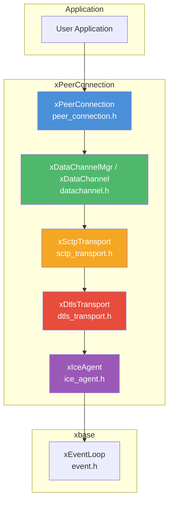
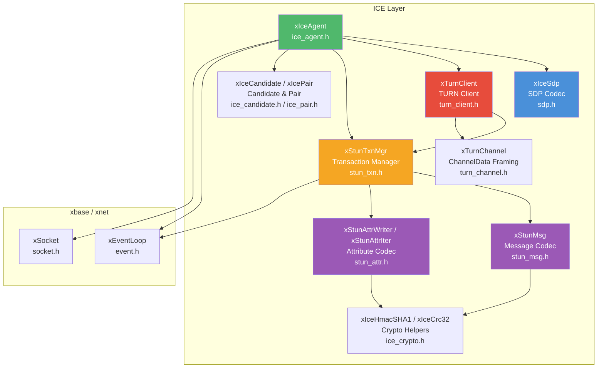

# xp2p — P2P Connectivity & WebRTC DataChannel

## Introduction

**xp2p** is libx's peer-to-peer connectivity module, providing a lightweight **WebRTC DataChannel** stack in pure C99. It implements the full protocol pipeline — **ICE** (NAT traversal) → **DTLS** (encryption) → **SCTP** (reliable/unreliable transport) → **DataChannel** (messaging) — orchestrated by a top-level `xPeerConnection` API that mirrors the browser `RTCPeerConnection`.

At the lower level, xp2p includes a complete STUN/TURN client stack, SDP encoding/decoding, and an event-driven ICE agent that handles candidate gathering, connectivity checks, and nomination. At the higher level, `xPeerConnection` manages SDP offer/answer negotiation, DTLS 1.2 handshake with self-signed ECDSA certificates, user-space SCTP association (via usrsctp), and the DataChannel Establishment Protocol (DCEP, RFC 8832).

## Design Philosophy

1. **Single-Threaded, Event-Driven** — The entire stack (ICE, DTLS, SCTP, DataChannel) runs on the libx event loop. All callbacks are invoked on the event loop thread, keeping the async programming model consistent with the rest of libx.

2. **RFC Compliance** — Implements ICE (RFC 8445), STUN (RFC 5389), TURN (RFC 5766), DTLS 1.2 (RFC 6347), SCTP (RFC 4960), and DataChannel (DCEP, RFC 8832) with proper message integrity, fingerprint, and retransmission.

3. **Pluggable DTLS Backend** — The DTLS layer supports both **OpenSSL** and **mbedTLS** at compile time, making xp2p suitable for both server and embedded environments. The ICE layer's built-in crypto (MD5, SHA-1, HMAC-SHA1, CRC-32) requires no external libraries.

4. **Layered Architecture** — The module is cleanly layered: STUN message codec → STUN transaction manager → TURN client → ICE agent → DTLS transport → SCTP transport → DataChannel. Each layer can be used independently, or composed via `xPeerConnection` for the full WebRTC experience.

5. **Minimal Footprint** — Unlike full WebRTC implementations (libwebrtc ~50 MiB), xp2p focuses exclusively on DataChannel connectivity with a shared library size of ~200 KiB.

## Architecture

### High-Level: PeerConnection Stack



### Protocol Stack

```text
┌─────────────────────────────┐
│       DataChannel (DCEP)    │  RFC 8832 — message framing
├─────────────────────────────┤
│       SCTP (usrsctp)        │  RFC 4960 — reliable/unreliable streams
├─────────────────────────────┤
│       DTLS 1.2              │  RFC 6347 — encryption
├─────────────────────────────┤
│       ICE (STUN/TURN)       │  RFC 8445 — NAT traversal
├─────────────────────────────┤
│       UDP                   │
└─────────────────────────────┘
```

### Low-Level: ICE Internals



## Sub-Module Overview

| Header | Component | Description | Doc |
| --- | --- | --- | --- |
| `peer_connection.h` | `xPeerConnection` | WebRTC PeerConnection — orchestrates ICE + DTLS + SCTP + DataChannel | [pc.md](pc.md) |
| `datachannel.h` | `xDataChannel` / `xDataChannelMgr` | WebRTC DataChannel (DCEP, RFC 8832) over SCTP streams | [pc.md](pc.md) |
| `dtls_transport.h` | `xDtlsTransport` | DTLS 1.2 transport with backend-agnostic design (OpenSSL / mbedTLS) | [pc.md](pc.md) |
| `sctp_transport.h` | `xSctpTransport` | SCTP over DTLS via usrsctp for WebRTC DataChannel | [pc.md](pc.md) |
| `ice_agent.h` | `xIceAgent` | Full ICE agent — gathering, checks, nomination, data send/recv | [ice.md](ice.md) |
| `ice_candidate.h` | `xIceCandidate` | Candidate representation and priority calculation (RFC 8445 §5.1.2.1) | — |
| `ice_pair.h` | `xIcePair` | Candidate pair priority and sorting (RFC 8445 §6.1.2.3) | — |
| `sdp.h` | `xIceSdp` | SDP offer/answer encoding and decoding (RFC 4566) | — |
| `stun_msg.h` | `xStunMsg` | STUN message header encoding/decoding (RFC 5389) | — |
| `stun_attr.h` | `xStunAttrWriter` / `xStunAttrIter` | STUN attribute encoding/decoding with integrity and fingerprint | — |
| `stun_txn.h` | `xStunTxnMgr` | STUN transaction manager with exponential-backoff retransmission | — |
| `turn_client.h` | `xTurnClient` | TURN allocation, permissions, channel bindings, and relay data (RFC 5766) | — |
| `turn_channel.h` | `xTurnChannel` | TURN ChannelData framing (RFC 5766 §11) | — |
| `ice_crypto.h` | `xIceHmacSHA1` / `xIceCrc32` | Built-in HMAC-SHA1, SHA-1, MD5, CRC-32 | — |

## Quick Start

### PeerConnection (Recommended)

The `xPeerConnection` API is the recommended entry point for most applications. It orchestrates the full ICE → DTLS → SCTP → DataChannel pipeline:

```c
#include <x/base/event.h>
#include <x/p2p/peer_connection.h>

#include <stdio.h>
#include <string.h>

static void on_state(xPeerConnection pc, xPeerConnectionState state, void *arg) {
    printf("PeerConnection state: %d\n", state);
}

static void on_dc_open(xDataChannel channel, void *arg) {
    printf("DataChannel open: %s\n", xDataChannelGetLabel(channel));
    const char *msg = "Hello DataChannel!";
    xDataChannelSendString(channel, msg, strlen(msg));
}

static void on_dc_message(xDataChannel channel, xDataChannelMsgType type,
                          const uint8_t *data, size_t len, void *arg) {
    printf("Received: %.*s\n", (int)len, (const char *)data);
}

int main(void) {
    xEventLoop loop = xEventLoopCreate();

    xEventLoopEnter(loop);

    xPeerConnectionConf conf = {0};
    conf.stun_server     = "stun.l.google.com:19302";
    conf.on_state_change = on_state;
    conf.on_dc_open      = on_dc_open;
    conf.on_dc_message   = on_dc_message;

    xPeerConnection pc = xPeerConnectionCreate(&conf);

    /* Create a DataChannel */
    xDataChannelConf dc_conf = {0};
    strncpy(dc_conf.label, "chat", sizeof(dc_conf.label) - 1);
    dc_conf.ordered = true;
    xPeerConnectionCreateDataChannel(pc, &dc_conf);

    /* Generate offer, exchange via signaling, then: */
    // char *offer = xPeerConnectionCreateOffer(pc);
    // xPeerConnectionSetLocalDescription(pc, offer);
    // ... send offer to remote, receive answer ...
    // xPeerConnectionSetRemoteDescription(pc, remote_answer);

    xEventLoopRun(loop);

    xPeerConnectionDestroy(pc);
    xEventLoopDestroy(loop);
    return 0;
}
```

See [pc.md](pc.md) for the full PeerConnection API reference, DataChannel API, connection lifecycle, and examples.

### ICE Agent (Low-Level)

For raw ICE connectivity without DTLS/SCTP/DataChannel, use the ICE agent directly:

```c
#include <x/base/event.h>
#include <x/p2p/ice_agent.h>

#include <stdio.h>
#include <string.h>

static void on_state(xIceAgent agent, xIceState state, void *arg) {
    printf("ICE state: %d\n", state);
    if (state == xIceState_Connected) {
        const char *msg = "Hello P2P!";
        xIceAgentSend(agent, (const uint8_t *)msg, strlen(msg));
    }
}

static void on_candidate(xIceAgent agent, const char *sdp, void *arg) {
    if (sdp) {
        printf("candidate: %s\n", sdp);
    } else {
        printf("gathering complete\n");
        // Exchange SDP with remote peer here
    }
}

static void on_data(xIceAgent agent, const uint8_t *data,
                    size_t len, void *arg) {
    printf("received: %.*s\n", (int)len, (const char *)data);
}

int main(void) {
    xEventLoop loop = xEventLoopCreate();

    xEventLoopEnter(loop);

    xIceConf conf = {0};
    conf.role            = xIceRole_Controlling;
    conf.stun_server     = "stun.l.google.com:19302";
    conf.enable_ipv6     = false;
    conf.on_state_change = on_state;
    conf.on_candidate    = on_candidate;
    conf.on_data         = on_data;

    xIceAgent agent = xIceAgentCreate(&conf);
    xIceAgentGather(agent);

    // After gathering, exchange SDP with remote peer:
    //   char *offer = xIceAgentCreateOffer(agent);
    //   // send offer to remote, receive answer
    //   xIceAgentSetRemoteDescription(agent, remote_answer);

    xEventLoopRun(loop);

    xIceAgentDestroy(agent);
    xEventLoopDestroy(loop);
    return 0;
}
```

See [ice.md](ice.md) for the full ICE agent API reference.

## Relationship with Other Modules

- **xbase** — Uses [`xEventLoop`](../base/event.md) for I/O multiplexing, [`xSocket`](../base/socket.md) for non-blocking UDP socket management, and timers for ICE connectivity checks and DTLS retransmission.
- **xbuf** — Uses [`xBuffer`](../buf/buf.md) for SDP string assembly and [`xIOBuffer`](../buf/io.md) for DTLS read/write buffering between the ICE and SCTP layers.
- **xnet** — Links against xnet for shared networking types.
- **usrsctp** — External dependency. Provides user-space SCTP (RFC 4960) for reliable/unreliable message delivery over the DTLS tunnel.
- **OpenSSL / mbedTLS** — External dependency (DTLS backend, compile-time selection). Provides DTLS 1.2 handshake, encryption, self-signed certificate generation, and SHA-256 fingerprint computation for SDP.
- **Application** — The `xPeerConnection` API exposes a callback-driven interface. Applications create a PeerConnection, exchange SDP offer/answer via a signaling channel, and send/receive messages over DataChannels once connected. For lower-level use, the ICE agent can be used directly.
