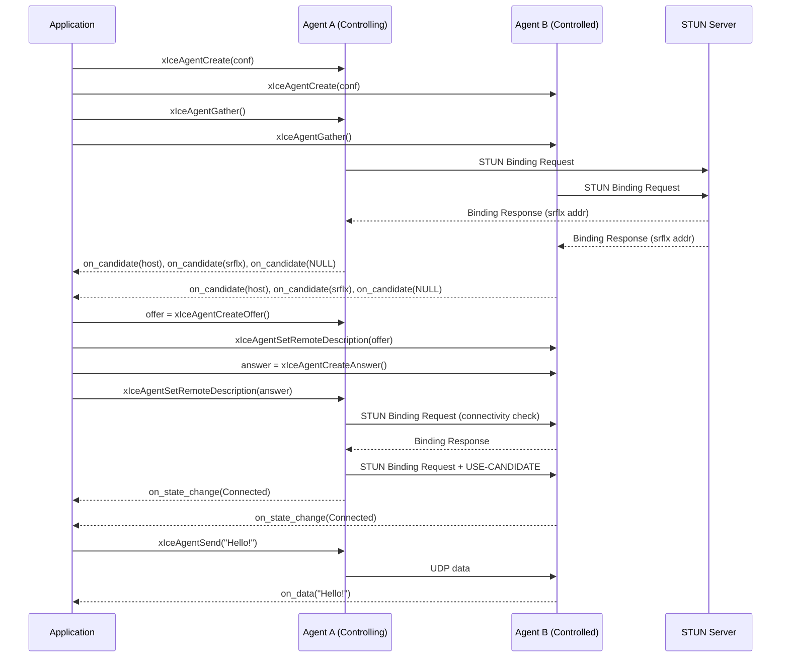

# ICE Agent — `ice_agent.h`

## Overview

`xIceAgent` is the central component of the xp2p module. It implements the full ICE (Interactive Connectivity Establishment) protocol as defined in [RFC 8445](https://datatracker.ietf.org/doc/html/rfc8445), providing NAT traversal and peer-to-peer UDP connectivity.

The agent handles:

- **Candidate gathering** — Enumerates local network interfaces (host candidates), queries STUN servers (server-reflexive candidates), and optionally allocates TURN relays (relay candidates).
- **Connectivity checks** — Performs STUN Binding request/response exchanges on all candidate pairs to find working paths.
- **Nomination** — Selects the best candidate pair for data transport (aggressive nomination in controlling mode).
- **Data transport** — Sends and receives application data over the nominated pair, with TURN relay fallback via ChannelData framing.
- **Consent freshness** — Periodically verifies the peer is still reachable (RFC 7675).

## Header

```c
#include <x/p2p/ice_agent.h>
```

## States

The ICE agent progresses through the following states:

```text
New → Gathering → Checking → Connected → Completed
                                ↘         ↗
                                 Failed
                                    ↓
                                  Closed
```

| State | Value | Description |
| --- | --- | --- |
| `xIceState_New` | 0 | Initial state, no activity yet |
| `xIceState_Gathering` | 1 | Gathering local candidates (host / srflx / relay) |
| `xIceState_Checking` | 2 | Performing connectivity checks on candidate pairs |
| `xIceState_Connected` | 3 | At least one valid pair found |
| `xIceState_Completed` | 4 | All checks done, nominated pair selected |
| `xIceState_Failed` | 5 | All checks failed, no valid pair |
| `xIceState_Closed` | 6 | Agent has been shut down |

## Roles

| Role | Value | Description |
| --- | --- | --- |
| `xIceRole_Controlling` | 0 | Initiates nomination (sends USE-CANDIDATE) |
| `xIceRole_Controlled` | 1 | Accepts nomination from the controlling agent |

## Configuration

```c
struct xIceConf {
    xIceRole     role;           // Controlling or Controlled
    bool         enable_ipv6;    // Enable IPv6 candidates (default: false)

    const char  *stun_server;    // STUN server "host:port" (or NULL)
    const char  *turn_server;    // TURN server "host:port" (or NULL)
    const char  *turn_username;  // TURN long-term credential username
    const char  *turn_password;  // TURN long-term credential password

    xIceOnStateChange on_state_change;  // State change callback
    xIceOnCandidate   on_candidate;     // New candidate callback
    xIceOnData        on_data;          // Data received callback
    void             *ctx;              // Forwarded to all callbacks
};
```

## Callbacks

### xIceOnStateChange

```c
typedef void (*xIceOnStateChange)(xIceAgent agent, xIceState state, void *arg);
```

Called when the agent transitions to a new state. Use this to detect when the connection is established (`Connected` / `Completed`) or has failed.

### xIceOnCandidate

```c
typedef void (*xIceOnCandidate)(xIceAgent agent, const char *candidate_sdp, void *arg);
```

Called when a new local candidate is gathered. The `candidate_sdp` is an SDP candidate line (e.g. `"candidate:..."`) suitable for Trickle ICE. When `candidate_sdp` is `NULL`, gathering is complete (end-of-candidates signal).

### xIceOnData

```c
typedef void (*xIceOnData)(xIceAgent agent, const uint8_t *data, size_t len, void *arg);
```

Called when application data is received on the nominated pair. The data buffer is valid only for the duration of the callback.

## API Reference

### Lifecycle

| Function | Description |
| --- | --- |
| `xIceAgentCreate(conf)` | Create a new ICE agent. Generates random ice-ufrag/ice-pwd. Returns `NULL` on failure. |
| `xIceAgentDestroy(agent)` | Destroy the agent, close sockets, cancel timers. Safe to call with `NULL`. |

### Gathering

| Function | Description |
| --- | --- |
| `xIceAgentGather(agent)` | Start candidate gathering. Enumerates interfaces, sends STUN/TURN requests. Candidates reported via `on_candidate`. |

### SDP Exchange

| Function | Description |
| --- | --- |
| `xIceAgentCreateOffer(agent)` | Generate an SDP offer string. Caller must `free()` the result. |
| `xIceAgentCreateAnswer(agent)` | Generate an SDP answer string. Caller must `free()` the result. |
| `xIceAgentSetRemoteDescription(agent, sdp)` | Parse remote SDP (ice-ufrag, ice-pwd, candidates) and start connectivity checks. |
| `xIceAgentAddRemoteCandidate(agent, sdp)` | Add a single remote candidate (Trickle ICE). |

### Data Transport

| Function | Description |
| --- | --- |
| `xIceAgentSend(agent, data, len)` | Send data through the nominated pair. Only valid in `Connected` or `Completed` state. |

## Candidate Types

| Type | Priority Pref | Description |
| --- | --- | --- |
| `host` | 126 | Direct local interface address |
| `srflx` | 100 | Server-reflexive (public address from STUN) |
| `prflx` | 110 | Peer-reflexive (discovered during checks) |
| `relay` | 0 | TURN relay address |

Priority is computed per RFC 8445 §5.1.2.1:

```text
priority = (2^24) × type_pref + (2^8) × local_pref + (256 - component_id)
```

## ICE Lifecycle Flow



## Example — Loopback Echo

The `examples/ice_echo.c` demo creates two agents in the same process, exchanges SDP, and echoes data:

```bash
# Default (host candidates only, no STUN)
./build/ice_echo

# With STUN server
./build/ice_echo -s stun.l.google.com:19302

# Filter to only use server-reflexive candidates
./build/ice_echo -s stun.l.google.com:19302 -f srflx

# Enable IPv6 candidate gathering
./build/ice_echo -6
```

### Command-Line Options

| Flag | Description |
| --- | --- |
| `-s host:port` | STUN server address (default: `stun.l.google.com:19302`). Pass `-s ""` to disable. |
| `-f type` | Filter candidates by type (`host`, `srflx`, `relay`). Default: keep all. |
| `-6` | Enable IPv6 candidate gathering (disabled by default). |

## Protocol Constants

| Constant | Value | Description |
| --- | --- | --- |
| `XICE_GATHER_TIMEOUT_MS` | 5000 | Candidate gathering timeout |
| `XICE_CHECK_TIMEOUT_MS` | 10000 | Connectivity check timeout |
| `XICE_CHECK_PACING_MS` | 50 | Check pacing interval |
| `XICE_CONSENT_INTERVAL_MS` | 15000 | Consent freshness interval (RFC 7675) |
| `XICE_MAX_CANDIDATES` | 32 | Max candidates per agent |
| `XICE_MAX_PAIRS` | 128 | Max candidate pairs |
| `XSTUN_INITIAL_RTO_MS` | 500 | Initial STUN retransmission timeout |
| `XSTUN_MAX_RETRANSMITS` | 7 | Max STUN retransmissions |
