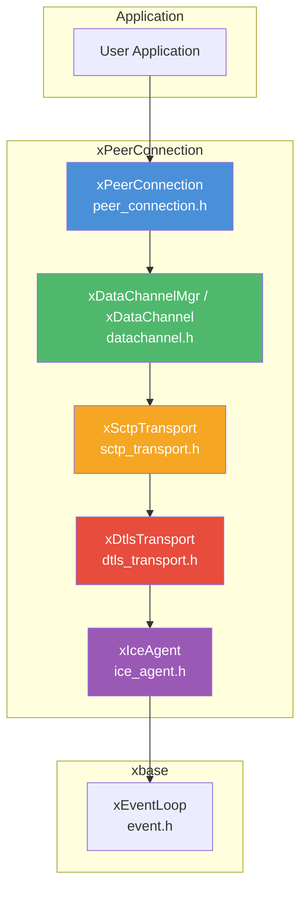
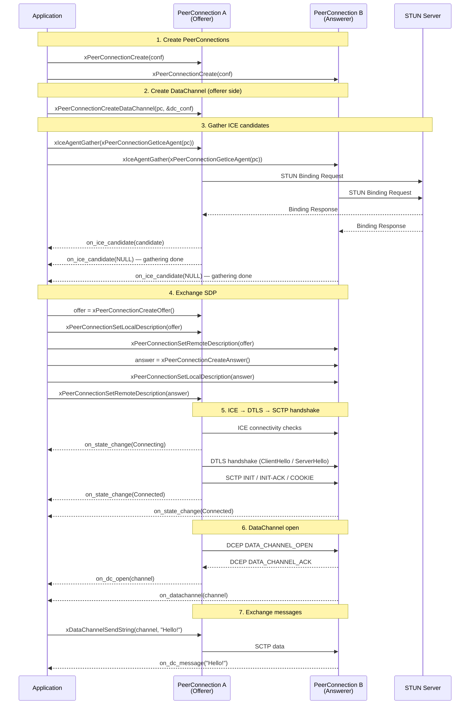

# PeerConnection — `peer_connection.h`

## Overview

`xPeerConnection` is the top-level WebRTC API in the xp2p module. It orchestrates the full protocol stack — **ICE** (connectivity) → **DTLS** (encryption) → **SCTP** (transport) → **DataChannel** (messaging) — into a single, easy-to-use handle that mirrors the browser `RTCPeerConnection` API.

The PeerConnection manages:

- **SDP Negotiation** — Create offer/answer, set local/remote descriptions, and add trickle ICE candidates.
- **ICE Connectivity** — Gathers candidates, performs connectivity checks, and selects the best path.
- **DTLS Encryption** — Performs a DTLS 1.2 handshake over the ICE transport with self-signed ECDSA P-256 certificates.
- **SCTP Association** — Establishes a user-space SCTP association (via usrsctp) over the encrypted DTLS channel.
- **DataChannel** — Implements the DataChannel Establishment Protocol (DCEP, RFC 8832) for creating reliable/unreliable message channels.

## Header

```c
#include <x/p2p/peer_connection.h>
```

## Architecture



## Protocol Stack

```text
┌─────────────────────────────┐
│       DataChannel (DCEP)    │  RFC 8832 — message framing
├─────────────────────────────┤
│       SCTP (usrsctp)        │  RFC 4960 — reliable/unreliable streams
├─────────────────────────────┤
│       DTLS 1.2              │  RFC 6347 — encryption
├─────────────────────────────┤
│       ICE (STUN/TURN)       │  RFC 8445 — NAT traversal
├─────────────────────────────┤
│       UDP                   │
└─────────────────────────────┘
```

## Connection States

```text
New → Connecting → Connected → Closed
                ↘            ↗
              Failed / Disconnected
```

| State | Value | Description |
| --- | --- | --- |
| `xPeerConnectionState_New` | 0 | Initial state, no activity yet. |
| `xPeerConnectionState_Connecting` | 1 | ICE/DTLS/SCTP handshake in progress. |
| `xPeerConnectionState_Connected` | 2 | DataChannel ready for use. |
| `xPeerConnectionState_Disconnected` | 3 | Connectivity lost (may recover). |
| `xPeerConnectionState_Failed` | 4 | Unrecoverable failure. |
| `xPeerConnectionState_Closed` | 5 | Explicitly closed by the application. |

## Configuration

```c
struct xPeerConnectionConf {
    /* ICE configuration */
    const char *stun_server;     /* STUN server "host:port" or NULL.       */
    const char *turn_server;     /* TURN server "host:port" or NULL.       */
    const char *turn_username;   /* TURN credential username.              */
    const char *turn_password;   /* TURN credential password.              */
    bool        enable_ipv6;     /* Enable IPv6 candidates (default: false). */

    /* SCTP port (0 = default 5000). */
    uint16_t sctp_port;

    /* Callbacks */
    xPeerConnectionOnStateChange  on_state_change;
    xPeerConnectionOnIceCandidate on_ice_candidate;
    xPeerConnectionOnDataChannel  on_datachannel;

    /* Default callbacks for remotely-opened DataChannels. */
    xDataChannelOnOpen    on_dc_open;
    xDataChannelOnMessage on_dc_message;
    xDataChannelOnClose   on_dc_close;
    void                 *ctx;   /* Forwarded to all callbacks. */
};
```

## Callbacks

### xPeerConnectionOnStateChange

```c
typedef void (*xPeerConnectionOnStateChange)(xPeerConnection pc,
                                             xPeerConnectionState state,
                                             void *arg);
```

Called when the overall connection state changes. Use this to detect when the full stack (ICE + DTLS + SCTP) is ready or has failed.

### xPeerConnectionOnIceCandidate

```c
typedef void (*xPeerConnectionOnIceCandidate)(xPeerConnection pc,
                                              const char *candidate_sdp,
                                              void *arg);
```

Called when a new local ICE candidate is gathered. When `candidate_sdp` is `NULL`, gathering is complete (end-of-candidates signal). Send each candidate to the remote peer via your signaling channel for Trickle ICE.

### xPeerConnectionOnDataChannel

```c
typedef void (*xPeerConnectionOnDataChannel)(xPeerConnection pc,
                                             xDataChannel channel,
                                             void *arg);
```

Called when the remote peer opens a DataChannel. The `channel` handle is ready for sending/receiving messages.

## API Reference

### Lifecycle

| Function | Description |
| --- | --- |
| `xPeerConnectionCreate(conf)` | Create a new PeerConnection. Internally creates an ICE agent and DTLS transport with a self-signed certificate. Returns `NULL` on failure. |
| `xPeerConnectionDestroy(pc)` | Destroy the PeerConnection and all owned resources (DataChannel, SCTP, DTLS, ICE). Safe to call with `NULL`. |

### SDP Negotiation

| Function | Description |
| --- | --- |
| `xPeerConnectionCreateOffer(pc)` | Generate a WebRTC SDP offer. Starts ICE gathering if not already started. Caller must `free()` the result. |
| `xPeerConnectionCreateAnswer(pc)` | Generate a WebRTC SDP answer. Should be called after `SetRemoteDescription` with the offer. Caller must `free()` the result. |
| `xPeerConnectionSetLocalDescription(pc, sdp)` | Set the local SDP description. Starts ICE gathering if not already started. |
| `xPeerConnectionSetRemoteDescription(pc, sdp)` | Parse remote SDP (ICE credentials, DTLS fingerprint, SCTP port) and add remote ICE candidates. |
| `xPeerConnectionAddIceCandidate(pc, sdp)` | Add a single remote ICE candidate (Trickle ICE). |

### DataChannel

| Function | Description |
| --- | --- |
| `xPeerConnectionCreateDataChannel(pc, conf)` | Create a new DataChannel. The channel opens once the SCTP association is established. Returns `NULL` on failure. |

### Accessors

| Function | Description |
| --- | --- |
| `xPeerConnectionGetState(pc)` | Get the current connection state. |
| `xPeerConnectionGetIceAgent(pc)` | Get the underlying ICE agent handle. |
| `xPeerConnectionGetDtlsTransport(pc)` | Get the DTLS transport handle. |
| `xPeerConnectionGetSctpTransport(pc)` | Get the SCTP transport handle. |
| `xPeerConnectionGetDataChannelMgr(pc)` | Get the DataChannel manager handle. |

## DataChannel API

Once a DataChannel is obtained (via `xPeerConnectionCreateDataChannel` or the `on_datachannel` callback), use the following APIs:

### DataChannel Configuration

```c
struct xDataChannelConf {
    char     label[256];          /* Channel label.                       */
    char     protocol[256];       /* Sub-protocol (optional).             */
    bool     ordered;             /* Ordered delivery (default: true).    */
    uint16_t max_retransmits;     /* Max retransmits (0 = reliable).      */
    uint16_t max_packet_life_time; /* Max lifetime ms (0 = reliable).     */

    /* Per-channel callbacks (override PeerConnection defaults). */
    xDataChannelOnOpen    on_open;
    xDataChannelOnMessage on_message;
    xDataChannelOnClose   on_close;
    xDataChannelOnError   on_error;
    void                 *ctx;
};
```

### DataChannel Functions

| Function | Description |
| --- | --- |
| `xDataChannelSendString(channel, str, len)` | Send a UTF-8 string message. |
| `xDataChannelSendBinary(channel, data, len)` | Send a binary message. |
| `xDataChannelClose(channel)` | Close the DataChannel. |
| `xDataChannelGetLabel(channel)` | Get the channel label. |
| `xDataChannelGetState(channel)` | Get the current channel state (`Connecting`, `Open`, `Closing`, `Closed`). |
| `xDataChannelGetStreamId(channel)` | Get the underlying SCTP stream ID. |

### DataChannel States

| State | Value | Description |
| --- | --- | --- |
| `xDataChannelState_Connecting` | 0 | OPEN sent, waiting for ACK. |
| `xDataChannelState_Open` | 1 | Channel is open for data. |
| `xDataChannelState_Closing` | 2 | Close initiated. |
| `xDataChannelState_Closed` | 3 | Channel is closed. |

## Connection Lifecycle Flow



## Example — Loopback Echo

The `examples/pc_echo.c` demo creates two PeerConnections in the same process, exchanges SDP between them, and echoes a DataChannel message:

```c
#include <x/base/event.h>
#include <x/p2p/peer_connection.h>

#include <stdio.h>
#include <stdlib.h>
#include <string.h>

static xEventLoop      g_loop;
static xPeerConnection g_pc_a; /* Offerer  */
static xPeerConnection g_pc_b; /* Answerer */

static void on_state_change(xPeerConnection pc, xPeerConnectionState state,
                            void *ctx) {
    const char *name = (const char *)ctx;
    printf("[%s] State: %d\n", name, state);
}

static void on_dc_open(xDataChannel channel, void *ctx) {
    const char *name = (const char *)ctx;
    printf("[%s] DataChannel open: %s\n", name, xDataChannelGetLabel(channel));

    if (strcmp(name, "PC-A") == 0) {
        const char *msg = "Hello DataChannel!";
        xDataChannelSendString(channel, msg, strlen(msg));
    }
}

static void on_dc_message(xDataChannel channel, xDataChannelMsgType type,
                          const uint8_t *data, size_t len, void *ctx) {
    const char *name = (const char *)ctx;
    printf("[%s] Received: %.*s\n", name, (int)len, (const char *)data);

    if (strcmp(name, "PC-B") == 0) {
        /* Echo back */
        xDataChannelSendString(channel, (const char *)data, len);
    } else {
        printf("Echo successful!\n");
        xEventLoopStop(g_loop);
    }
}

int main(void) {
    g_loop = xEventLoopCreate();

    xEventLoopEnter(g_loop);

    /* Create offerer */
    xPeerConnectionConf conf_a = {0};
    conf_a.stun_server     = "stun.l.google.com:19302";
    conf_a.on_state_change = on_state_change;
    conf_a.on_dc_open      = on_dc_open;
    conf_a.on_dc_message   = on_dc_message;
    conf_a.ctx             = (void *)"PC-A";
    g_pc_a = xPeerConnectionCreate(&conf_a);

    /* Create answerer */
    xPeerConnectionConf conf_b = {0};
    conf_b.stun_server     = "stun.l.google.com:19302";
    conf_b.on_state_change = on_state_change;
    conf_b.on_dc_open      = on_dc_open;
    conf_b.on_dc_message   = on_dc_message;
    conf_b.ctx             = (void *)"PC-B";
    g_pc_b = xPeerConnectionCreate(&conf_b);

    /* Create DataChannel on offerer */
    xDataChannelConf dc_conf = {0};
    strncpy(dc_conf.label, "echo", XDC_MAX_LABEL_LEN - 1);
    dc_conf.ordered = true;
    xPeerConnectionCreateDataChannel(g_pc_a, &dc_conf);

    /* Start gathering */
    xIceAgentGather(xPeerConnectionGetIceAgent(g_pc_a));
    xIceAgentGather(xPeerConnectionGetIceAgent(g_pc_b));

    /* After both sides finish gathering, exchange SDP:
     *   offer  = xPeerConnectionCreateOffer(g_pc_a);
     *   xPeerConnectionSetLocalDescription(g_pc_a, offer);
     *   xPeerConnectionSetRemoteDescription(g_pc_b, offer);
     *   answer = xPeerConnectionCreateAnswer(g_pc_b);
     *   xPeerConnectionSetLocalDescription(g_pc_b, answer);
     *   xPeerConnectionSetRemoteDescription(g_pc_a, answer);
     */

    xEventLoopRun(g_loop);

    xPeerConnectionDestroy(g_pc_a);
    xPeerConnectionDestroy(g_pc_b);
    xEventLoopDestroy(g_loop);
    return 0;
}
```

```bash
# Build and run
./build/pc_echo

# With custom STUN server
./build/pc_echo -s stun.l.google.com:19302

# Enable IPv6
./build/pc_echo -6
```

## DTLS Backend

The DTLS layer supports two TLS backends, selected at compile time:

| Backend | CMake Option | Description |
| --- | --- | --- |
| OpenSSL | `-DX_TLS_BACKEND=openssl` (default) | Uses OpenSSL for DTLS 1.2 handshake and encryption. |
| mbedTLS | `-DX_TLS_BACKEND=mbedtls` | Uses mbedTLS for DTLS 1.2 handshake and encryption. |

Both backends generate a self-signed ECDSA P-256 certificate at `xPeerConnectionCreate` time and compute a SHA-256 fingerprint for SDP `a=fingerprint`.

## Thread Safety

| Operation | Thread Safety |
| --- | --- |
| `xPeerConnectionCreate()` | Call from event loop thread only |
| `xPeerConnectionDestroy()` | Call from event loop thread only |
| `xPeerConnectionCreateOffer/Answer()` | Call from event loop thread only |
| `xPeerConnectionSetLocal/RemoteDescription()` | Call from event loop thread only |
| `xDataChannelSendString/Binary()` | Call from event loop thread only |
| All callbacks | Always invoked on event loop thread |

## Error Handling

| Scenario | Behavior |
| --- | --- |
| `NULL` loop or conf in `Create` | Returns `NULL` |
| ICE gathering failure | `on_state_change` reports `Failed` |
| DTLS handshake failure | `on_state_change` reports `Failed` |
| SCTP association failure | `on_state_change` reports `Failed` |
| Invalid remote SDP | `SetRemoteDescription` returns error `xErrno` |
| Send on closed DataChannel | Returns `xErrno` error |
| `xPeerConnectionDestroy(NULL)` | No-op (safe) |

## Best Practices

- **Exchange SDP after gathering completes** — Wait for the `on_ice_candidate(NULL)` signal before calling `CreateOffer` / `CreateAnswer` to include all candidates in the SDP. Alternatively, use Trickle ICE with `AddIceCandidate` for faster setup.
- **Set callbacks in conf before Create** — All callbacks must be configured in `xPeerConnectionConf` before calling `xPeerConnectionCreate`. They cannot be changed after creation.
- **Use per-channel callbacks for complex apps** — Set `on_open` / `on_message` / `on_close` in `xDataChannelConf` to override the PeerConnection-level defaults for individual channels.
- **Destroy in order** — Call `xPeerConnectionDestroy` which tears down DataChannel → SCTP → DTLS → ICE in the correct order. Do not destroy sub-components individually.
- **One event loop thread** — All PeerConnection operations and callbacks run on the event loop thread. Do not call PeerConnection APIs from other threads.

## Comparison with Other Libraries

| Feature | xp2p PeerConnection | libdatachannel | Pion (Go) | libwebrtc (Google) | webtransport-go |
| --- | --- | --- | --- | --- | --- |
| **Language** | C99 | C++ | Go | C++ | Go |
| **I/O Model** | Async (xEventLoop, single-threaded) | Async (internal thread pool) | Goroutines | Multi-threaded | Goroutines |
| **ICE** | Built-in (RFC 8445, full agent) | Built-in (libnice / libjuice) | Built-in | Built-in | N/A (QUIC) |
| **DTLS Backend** | Pluggable (OpenSSL / mbedTLS) | GnuTLS / OpenSSL | pion/dtls (pure Go) | BoringSSL | N/A (QUIC TLS) |
| **SCTP** | usrsctp (user-space) | usrsctp | pion/sctp (pure Go) | usrsctp | N/A |
| **DataChannel** | DCEP (RFC 8832) | DCEP (RFC 8832) | DCEP (RFC 8832) | DCEP (RFC 8832) | Datagrams / Streams |
| **Audio/Video** | Not supported (data-only) | Optional (via libSRTP) | Full media stack | Full media stack | Not applicable |
| **Binary Size** | ~200 KiB (shared lib) | ~1 MiB | ~10 MiB (static) | ~50 MiB | ~5 MiB |
| **Dependencies** | xbase, usrsctp, OpenSSL or mbedTLS | usrsctp, GnuTLS/OpenSSL | Pure Go (zero CGo) | Many (build system) | Pure Go |
| **Thread Model** | Single event loop thread | Internal thread pool | Per-connection goroutines | Complex multi-threaded | Per-connection goroutines |
| **API Style** | C function pointers (callbacks) | C++ lambdas / callbacks | Go interfaces / channels | C++ observers | Go interfaces |

**Key Differentiator:** xp2p provides a lightweight, data-only WebRTC stack in pure C99 with a single-threaded event-driven architecture. Unlike libwebrtc (which bundles a full media engine at ~50 MiB), xp2p focuses exclusively on DataChannel connectivity with minimal footprint (~200 KiB). The pluggable DTLS backend (OpenSSL or mbedTLS) makes it suitable for both server and embedded environments. Compared to libdatachannel (the closest C/C++ alternative), xp2p integrates directly with xbase's event loop — no internal thread pool — giving the application full control over scheduling and avoiding synchronization overhead.

## Relationship with Other Modules

- **xbase** — Uses [`xEventLoop`](../base/event.md) for I/O multiplexing, [`xSocket`](../base/socket.md) for non-blocking UDP socket management, and timers for ICE connectivity checks and DTLS retransmission.
- **xbuf** — Uses [`xBuffer`](../buf/buf.md) for SDP string assembly and [`xIOBuffer`](../buf/io.md) for DTLS read/write buffering between the ICE and SCTP layers.
- **usrsctp** — External dependency. Provides user-space SCTP (RFC 4960) for reliable/unreliable message delivery over the DTLS tunnel. Runs its own timer thread for retransmission.
- **OpenSSL / mbedTLS** — External dependency (DTLS backend, compile-time selection via `X_TLS_BACKEND`). Provides DTLS 1.2 handshake, encryption, self-signed certificate generation, and SHA-256 fingerprint computation for SDP.
