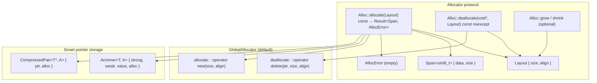

# Allocator

## Introduction

libx++ smart pointers (`Arc`, `Rc`, `Own`, `Box`) accept an optional `Alloc` template parameter that controls how the control block (or the pointed-to object) is allocated and deallocated. The default `GlobalAllocator` uses `::operator new` / `::operator delete` and is empty (zero overhead via EBO).

The protocol is modeled after Rust's `std::alloc::Allocator` trait: `allocate` returns a fat-pointer `Span<uint8_t>` (pointer + actual size), `deallocate` takes a `Layout` (size + align), and `grow`/`shrink` are optional with default implementations provided.

## Design Philosophy

1. **Rust-style `&self`.** `allocate` and `deallocate` are `const`-qualified. Stateful allocators track state via `mutable` members or atomic pointers — `std::atomic<T>::fetch_add` is itself `const`, so counters held by pointer work without any `mutable` dance. This lets callers pass `const Alloc&` if they only have a const reference.

2. **Layout bundles size + align.** Passing them as a pair avoids bugs from mismatched `deallocate(ptr, size)` calls where the size doesn't match the original allocation's alignment. `Layout::of<T>()` derives both from the type, so callers rarely construct one by hand.

3. **Fat-pointer return.** `allocate` returns `Result<Span<uint8_t>, AllocError>` rather than `Result<void*, AllocError>`. The `Span` carries the **actual** allocated size (which may be larger than requested — allocate-at-least semantics). Smart pointers ignore the slack; callers that want it (e.g. for a growable buffer) can use it.

4. **Empty allocator → zero overhead.** `GlobalAllocator` is an empty class. EBO (via inheritance for `ArcInner`/`RcInner`, via `CompressedPair` for `Own`/`Box`) collapses it to zero bytes, so `sizeof(Arc<T>) == sizeof(T*)` with the default allocator.

5. **Alloc lives in the control block, not the handle.** For `Arc`/`Rc`, the `Alloc` instance is stored inside `ArcInner`/`RcInner` — not inside the `Arc`/`Rc` handle. This keeps `sizeof(Arc<T, A>) == sizeof(T*)` for **any** `A`, stateful or not. For `Own`/`Box`, the `Alloc` is stored via `CompressedPair<T*, Alloc>` and grows the handle when stateful (no separate control block to hide it in).

## Architecture



### Layout

```cpp
struct Layout {
  size_t size;
  size_t align;

  template <class T> static Layout of();        // sizeof(T), alignof(T)
  static Layout array(size_t n, size_t a);      // n bytes, a alignment
};
```

### AllocError

`AllocError` is an empty struct. `allocate` returns `Result<Span<uint8_t>, AllocError>` — callers must handle the error path. (Smart pointers panic on allocation failure, matching the existing `::operator new` behavior that throws `std::bad_alloc`.)

### Span<uint8_t>

`Span<uint8_t>` is a non-owning fat pointer (pointer + length). The length is the **actual** allocated size, which may be larger than the requested `layout.size`. Smart pointers ignore the length; it's there for callers that want to use the slack.

### GlobalAllocator

The default. Empty class → EBO-eligible → zero storage overhead in `ArcInner` / `CompressedPair`.

```cpp
struct GlobalAllocator {
  Result<Span<uint8_t>, AllocError> allocate(Layout layout) const;
  void deallocate(void *ptr, Layout layout) const;
};
```

Uses C++17 aligned `::operator new` / `::operator delete` when available; falls back to non-aligned on C++11.

## API Reference

### Required methods

| Signature | Description |
| --- | --- |
| `Result<Span<uint8_t>, AllocError> allocate(Layout layout) const` | Allocate at least `layout.size` bytes with `layout.align` alignment. Returns the allocated span (pointer + actual size, >= layout.size) or an `AllocError`. |
| `void deallocate(void *ptr, Layout layout) const noexcept` | Free memory previously returned by `allocate`. `layout` must match the `Layout` passed to `allocate`. |

### Optional methods

| Signature | Description |
| --- | --- |
| `Result<Span<uint8_t>, AllocError> grow(void *ptr, Layout old_l, Layout new_l) const` | Grow an existing allocation. If not provided, `default_grow` (allocate + memcpy + deallocate) is used. |
| `Result<Span<uint8_t>, AllocError> shrink(void *ptr, Layout old_l, Layout new_l) const` | Shrink an existing allocation. If not provided, `default_shrink` is used. |

### Default grow / shrink

Free functions that implement grow/shrink as allocate + memcpy + deallocate. Used when the allocator doesn't provide its own.

```cpp
template <class A>
Result<Span<uint8_t>, AllocError> default_grow(const A &alloc, void *ptr,
                                                Layout old_l, Layout new_l);
template <class A>
Result<Span<uint8_t>, AllocError> default_shrink(const A &alloc, void *ptr,
                                                  Layout old_l, Layout new_l);
```

### Smart pointer factory methods

| Type | Default Alloc | Stateless custom | Stateful custom |
| --- | --- | --- | --- |
| `Arc<T, A>::make(args...)` | `GlobalAllocator{}` | `Arc<T, MyAlloc>::make(args...)` | — |
| `Arc<T, A>::make(alloc, args...)` | — | — | SFINAE: first arg convertible to `A` |
| `Arc<T, A>::make_in(alloc, args...)` | Explicit, no SFINAE | Explicit | Explicit |
| `Own<T>(p)`, `Own<T>(p, alloc)` | `GlobalAllocator{}` | — | Pass alloc instance |
| `Box<T, A>::from_raw(p, alloc)` | `GlobalAllocator{}` | — | Pass alloc instance |

`make()` uses SFINAE to detect whether the first argument is an `Alloc` instance (for stateful allocators) or a constructor argument for `T`. `make_in()` is the explicit form that always treats the first argument as the allocator — use it when SFINAE detection is ambiguous (T's first ctor arg is convertible to `Alloc`).

## Usage Examples

### Arc with default allocator

```cpp
auto a = Arc<std::string>::make("hello");
// sizeof(a) == sizeof(std::string*)
```

### Arc with stateful allocator

```cpp
struct CountingAllocator {
  std::atomic<int> *allocs;
  std::atomic<int> *deallocs;

  CountingAllocator(std::atomic<int> *a, std::atomic<int> *d) : allocs(a), deallocs(d) {}

  xpp::Result<xpp::Span<uint8_t>, xpp::AllocError> allocate(xpp::Layout layout) const {
    void *p = ::operator new(layout.size);
    if (!p) return xpp::Result<xpp::Span<uint8_t>, xpp::AllocError>(xpp::err, xpp::AllocError{});
    allocs->fetch_add(1, std::memory_order_relaxed);
    return xpp::Result<xpp::Span<uint8_t>, xpp::AllocError>(
        xpp::ok, xpp::Span<uint8_t>(static_cast<uint8_t *>(p), layout.size));
  }

  void deallocate(void *ptr, xpp::Layout) const {
    deallocs->fetch_add(1, std::memory_order_relaxed);
    ::operator delete(ptr);
  }
};

std::atomic<int> allocs{0}, deallocs{0};
CountingAllocator alloc(&allocs, &deallocs);

{
  auto a = Arc<int, CountingAllocator>::make(alloc, 42);  // SFINAE: alloc detected
  EXPECT_EQ(allocs.load(), 1);
  auto b = a.clone();                                       // no new alloc — shares inner
  EXPECT_EQ(allocs.load(), 1);
}
EXPECT_EQ(deallocs.load(), 1);
```

### Own / Box with custom allocator

```cpp
struct FileAlloc {
  void deallocate(void *p, xpp::Layout) const noexcept {
    if (p) fclose(static_cast<FILE *>(p));
  }
};

xpp::Own<FILE, FileAlloc> file(fopen("data.txt", "r"), FileAlloc{});
// sizeof(file) == sizeof(FILE*)  (FileAlloc is empty → EBO)
```

### make_in for the ambiguous case

```cpp
struct Logger {
  explicit Logger(GlobalAllocator) {}  // first ctor arg convertible to Alloc
};

// make(GlobalAllocator{}) would be ambiguous — SFINAE treats it as the alloc.
// Use make_in to force the alloc interpretation:
auto a = Arc<Logger>::make_in(GlobalAllocator{}, GlobalAllocator{});
//                     ^ alloc         ^ Logger ctor arg
```

### grow / shrink

```cpp
// Default implementation (allocate + memcpy + deallocate):
auto r = xpp::default_grow(alloc, old_ptr, old_layout, new_layout);

// Custom implementation (e.g. in-place realloc):
struct ReallocAllocator {
  // ... allocate / deallocate ...

  xpp::Result<xpp::Span<uint8_t>, xpp::AllocError> grow(void *ptr, xpp::Layout old_l,
                                                          xpp::Layout new_l) const {
    void *p = ::realloc(ptr, new_l.size);
    if (!p) return xpp::default_grow(*this, ptr, old_l, new_l);
    return xpp::Result<xpp::Span<uint8_t>, xpp::AllocError>(
        xpp::ok, xpp::Span<uint8_t>(static_cast<uint8_t *>(p), new_l.size));
  }
};
```

## Comparison

| Feature | xpp `Alloc` | `std::pmr::memory_resource` | Rust `Allocator` trait |
| --- | --- | --- | --- |
| Protocol | `allocate`/`deallocate` methods | `do_allocate`/`do_deallocate` virtuals | `allocate`/`deallocate` methods |
| Return type | `Result<Span<uint8_t>, AllocError>` | `void*` (throws on failure) | `Result<NonNull<[u8]>, AllocError>` |
| Layout | `Layout { size, align }` | `size_t` + `size_t` args | `Layout` struct |
| grow / shrink | Optional, default impl provided | Not in API | Optional, default impl provided |
| Empty alloc EBO | Yes (inheritance / CompressedPair) | N/A (type-erased) | Yes (zero-sized type) |
| Storage in smart pointer | Control block (Arc/Rc) or CompressedPair (Own/Box) | N/A | Control block (Arc/Rc) |
| Const-qualified | Yes (`allocate`/`deallocate` are `const`) | No (virtual, mutates vtable state) | Yes (`&self`) |
| Type-erased | No (template param) | Yes (dyn dispatch) | No (generic) |

## Implementation Notes

### EBO (Empty Base Optimization)

When `Alloc` is an empty class (like `GlobalAllocator`), it is stored as a **base class** of the control block (`ArcInner` / `RcInner`) or via `CompressedPair` (`Own` / `Box`), not as a member. This gives zero storage overhead:

- `sizeof(Arc<T, GlobalAllocator>) == sizeof(T*)`
- `sizeof(Own<T, GlobalAllocator>) == sizeof(T*)`
- `sizeof(ArcInner<T, GlobalAllocator>) == sizeof(strong) + sizeof(weak) + sizeof(T)` (no Alloc byte)

When `Alloc` is stateful, it is stored as a member and `sizeof` grows by `sizeof(Alloc)` (rounded for alignment). The `Arc`/`Rc`/`ArcWeak`/`Weak` handles themselves stay at `sizeof(T*)` because the `Alloc` lives in the control block, not in the handle — only `Own`/`Box` grow because they have no separate control block.

EBO is gated on `is_empty<A> && !is_final<A>` — final classes can't be inherited from, so they fall back to member storage even when empty.

### Deallocation lifecycle (Arc/Rc)

The trickiest part of the stateful-allocator path: the `Alloc` lives **inside** the control block that it's about to free. The deallocator moves the `Alloc` out before freeing:

```cpp
// In arc_dec_weak_and_maybe_dealloc:
if (inner->weak.fetch_sub(1, std::memory_order_release) == 1) {
  std::atomic_thread_fence(std::memory_order_acquire);
  Alloc a = std::move(inner->alloc_ref());   // move out
  Layout layout = Layout::of<ArcInner<T, Alloc>>();
  a.deallocate(inner, layout);                // free the memory that contained `a`
}
```

`Alloc` must be move-constructible (enforced by `static_assert` in `Arc`/`Rc`). For empty allocators the move is trivial; for stateful allocators it should be `noexcept` (move the resource handle, not copy it). The moved-from `Alloc` inside `inner` is never accessed again — its resources are now owned by the local `a`, whose destructor runs after `deallocate` returns.

### Destruction order (Own/Box)

The destructor calls `~T()` explicitly, then `alloc.deallocate(ptr, Layout::of<T>())` — separating object destruction from memory deallocation, matching Rust's `Allocator` trait. This is necessary because `deallocate` only frees memory; it does not call destructors.

For `T = void`, `~T()` is skipped via tag dispatch (`_::destroy_and_dealloc` checks `std::is_void<T>`), and `Layout{0, 1}` is used as a sentinel — `GlobalAllocator::deallocate` calls `::operator delete(ptr, 0, align_val_t(1))`, which is valid (size 0 is a no-op hint, the actual free still happens).

### Shared helpers in allocator.h

`allocator.h` defines three helpers in `xpp::_` shared by all smart pointers:

- `IsFinal<D>` — portable `is_final` (C++14 / `__is_final` intrinsic / fallback to `false`)
- `FirstIsAlloc<Alloc, Args...>` — SFINAE: true iff first arg in `Args...` is convertible to `Alloc`
- `destroy_and_dealloc<T, Alloc>(ptr, alloc)` — calls `~T()` (if not void) then `alloc.deallocate(ptr, Layout::of<T>())`

Extracting these to a shared header prevents redefinition when `arc.h` + `rc.h` + `box.h` are included together.
