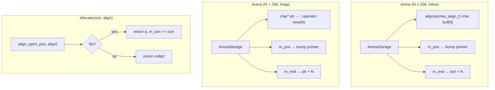

# Arena

## Introduction

`Arena<N>` is a fixed-size bump allocator for short-lived objects. Memory is allocated by bumping a pointer forward; individual allocations are never freed — only bulk-freed via arena destruction or `reset()`. This eliminates per-object `malloc`/`free` overhead for groups of objects with the same lifetime.

The size `N` is a compile-time template parameter. Small arenas (N ≤ 256) store the buffer inline (zero heap allocation); large arenas heap-allocate the buffer at construction (one allocation). `allocate()` returns `nullptr` when full — the caller checks and falls back to `::operator new` if needed.

## Design Philosophy

1. **Bump, never free individually.** A bump pointer moves forward on each `allocate()`. There is no per-object free-list, no fragmentation, no bookkeeping. The entire arena is freed in one shot when destroyed or `reset()`.

2. **Compile-time size, automatic storage.** The template parameter `N` determines the buffer size. `ArenaStorage<N>` specializes at compile time: N ≤ 256 → inline (the buffer is a member of the `Arena` object), N > 256 → heap (the buffer is `::operator new`'d at construction). The user writes `Arena<128>` or `Arena<4096>` and the storage strategy is automatic.

3. **`nullptr` on overflow, not auto-grow.** When the arena is full, `allocate()` returns `nullptr`. The caller checks and falls back to heap. This keeps the arena simple (no chunk list, no growth logic) and makes `owns()` a trivial O(1) pointer range check.

4. **No destructor tracking.** The arena does not call `~T()` — the caller is responsible for destructing objects before `reset()` or arena destruction. This keeps the arena zero-overhead. `make<T>()` constructs in-place, but the caller must call `~T()` manually.

5. **C++11, header-only, no dependencies.** `arena.h` includes only `<cstddef>`, `<cstdint>`, `<new>`, `<type_traits>`, `<utility>`. No libx dependency.

## Architecture



### ArenaStorage specialization

```text
Inline (N ≤ 256):                Heap (N > 256):
┌─────────────────────┐          ┌─────────────────────┐
│ ArenaStorage        │          │ ArenaStorage        │
│ ┌─────────────────┐ │          │ ┌─────────────────┐ │
│ │ buf[N]          │ │          │ │ ptr ────────────┼─┼──→ heap buffer
│ │ ████░░░░░░░░    │ │          │ └─────────────────┘ │
│ └─────────────────┘ │          │                     │
├─────────────────────┤          ├─────────────────────┤
│ m_pos, m_end        │          │ m_pos, m_end        │
└─────────────────────┘          └─────────────────────┘
sizeof = N + ~16                  sizeof = ~24
0 heap allocations                1 heap allocation
```

### Memory layout

```text
Arena<256> on the stack:

  [buf[0] ... buf[255]] [m_pos] [m_end]
  ↑                     ↑
  begin                 current bump position
  └─── capacity = 256 ─┘

  allocate(32):
    p = align_up(m_pos, align)
    m_pos = p + 32
    return p

  ┌──allocated──┬─── remaining ───┐
  │  ████████   │  ░░░░░░░░░░░░   │
  └─────────────┴─────────────────┘
  ↑             ↑                 ↑
  begin         m_pos             m_end
```

## API Reference

### Arena\<N\>

| Method | Returns | Description |
| -------- | --------- | ------------- |
| `Arena()` | | Construct. Inline: zero alloc. Heap: one `::operator new(N)`. |
| `allocate(size_t size, size_t align = alignof(max_align_t))` | `void*` | Bump-allocate. `nullptr` if overflow. |
| `make<T>(args...)` | `T*` | Allocate + placement-new. `nullptr` if overflow. Caller must `~T()`. |
| `owns(const void* p)` | `bool` | True if `p` is within this arena's buffer. O(1). |
| `reset()` | | `m_pos = begin`. Buffer stays allocated for reuse. |
| `total_capacity()` | `size_t` | Buffer size `N` (constexpr). |
| `remaining()` | `size_t` | Bytes left before overflow. |
| `used()` | `size_t` | Bytes handed out so far. |

### Move semantics

- **Inline arenas**: move copies the buffer and adjusts pointers. The moved-from arena is invalidated.
- **Heap arenas**: move steals the heap pointer. The moved-from arena is invalidated.
- Copy is deleted (bump allocators are not copyable).

### `owns()` — O(1) ownership check

```cpp
bool owns(const void* p) const {
    const char* cp = static_cast<const char*>(p);
    return cp >= m_storage.begin() && cp < m_end;
}
```

Used by dealloc paths to decide: arena-allocated → skip `::operator delete`; heap-allocated → call `::operator delete`.

## Usage Examples

### Basic bump allocation

```cpp
xpp::Arena<256> arena;

void* a = arena.allocate(64);   // bump, 0 malloc
void* b = arena.allocate(32);   // bump, 0 malloc
void* c = arena.allocate(128);  // bump, 0 malloc
// remaining = 256 - 64 - 32 - 128 = 32

void* d = arena.allocate(64);   // nullptr — overflow
// Caller checks and falls back to heap:
if (!d) d = ::operator new(64);
```

### Typed allocation with make\<T\>

```cpp
xpp::Arena<256> arena;

auto* str = arena.make<std::string>("hello");
auto* num = arena.make<int>(42);

EXPECT_EQ(*str, "hello");
EXPECT_EQ(*num, 42);
EXPECT_TRUE(arena.owns(str));

// Caller must destruct manually (arena doesn't track):
str->~basic_string();
// num is trivially destructible, no need.
```

### Reset for reuse

```cpp
xpp::Arena<256> arena;

// Phase 1: allocate some objects
arena.make<int>(1);
arena.make<int>(2);
// used = 8 (2 × sizeof(int), assuming alignment)

// Reset — buffer stays, bump pointer goes back to start
arena.reset();
EXPECT_EQ(arena.used(), 0u);

// Phase 2: reuse the same buffer
arena.make<int>(3);  // overwrites the old memory
```

### Overflow fallback pattern

```cpp
xpp::Arena<256> arena;

template <class T, class... Args>
T* alloc_or_heap(Args&&... args) {
    T* p = arena.make<T>(std::forward<Args>(args)...);
    if (!p) {
        // Arena full — fall back to heap
        p = new T(std::forward<Args>(args)...);
    }
    return p;
}

// Deallocation: check owns() to route correctly
template <class T>
void dealloc(T* p) {
    if (arena.owns(p)) {
        p->~T();           // arena-allocated: just destruct
        // memory freed when arena is destroyed/reset
    } else {
        delete p;          // heap-allocated: destruct + free
    }
}
```

### Large arena (heap storage)

```cpp
xpp::Arena<4096> arena;  // sizeof(arena) ≈ 24 bytes
                          // 1 heap allocation for 4KB buffer

void* p = arena.allocate(2048);
EXPECT_TRUE(arena.owns(p));
EXPECT_EQ(arena.total_capacity(), 4096u);
```

### Stack allocation (zero malloc)

```cpp
void process() {
    xpp::Arena<128> arena;  // on the stack, 0 malloc
    auto* tmp = arena.make<int>(42);
    // ...
    // arena destructed on scope exit — buffer is stack memory, no free needed
}
```

## Comparison

| Feature | `xpp::Arena<N>` | `kj::Arena` | `xSlab` |
| --------- | ------------------ | ------------- | --------- |
| Allocation | Bump (forward) | Bump (forward) | Free-list (fixed size) |
| Size | Compile-time (template param) | Runtime (constructor param) | Runtime (constructor param) |
| Growth | Fixed — `nullptr` on overflow | Chunk list (auto-grow) | Fixed — `nullptr` on overflow |
| Individual free | No | No | Yes (free-list) |
| Reset/reuse | Yes (`reset()`) | No | Yes (`xSlabReset`) |
| `owns()` | O(1) pointer range check | O(1) | O(1) |
| Inline storage | Yes (N ≤ 256, zero malloc) | No (always heap) | No (always heap) |
| Destructors | No tracking | Tracked (reverse order) | No tracking |
| Language | C++11 | C++14 | C99 |
| Thread safety | Single-thread | Single-thread | Single-thread (`xSlabMt` for multi) |

## Implementation Notes

### Inline vs heap threshold

The threshold is `k_arena_inline_threshold = 256`. This is chosen because:

- PromiseNode typical size: 24–48B. 256B fits 5–10 nodes — enough for a `.then()` chain.
- 256B inline is acceptable for stack allocation (default stack is 1–8MB).
- Larger arenas (4KB+) would waste stack space if inlined.

### ArenaStorage specialization

The storage is handled by `ArenaStorage<N, bool Inline>`:

- `ArenaStorage<N, true>` (N ≤ 256): `alignas(max_align_t) char buf[N]` — buffer is a member.
- `ArenaStorage<N, false>` (N > 256): `char* ptr` — buffer is heap-allocated at construction, freed at destruction.

`Arena<N>` has identical code for both cases — it calls `m_storage.begin()` to get the buffer start. The storage specialization is transparent to the arena logic.

### Alignment

The inline buffer is declared `alignas(std::max_align_t)`, ensuring it can hold any type without alignment issues. `allocate()` calls `align_up()` to round the bump pointer up to the requested alignment. The alignment padding is counted in `used()` but not in any allocation that the caller sees.

### No destructor tracking

Unlike `kj::Arena`, `xpp::Arena` does not maintain a destructor list. Rationale:

- PromiseNode has its own `destroy()` virtual method for arena-aware destruction.
- Adding a destructor list would add per-allocation overhead (function pointer + linked list node), defeating the purpose of a zero-overhead bump allocator.
- Callers who need destructor tracking can layer it on top (maintain their own list of objects to destruct).

### Move semantics for inline arenas

Moving an inline arena is tricky: `m_pos` and `m_end` point into the old object's `buf[N]` member. After move, the buffer contents are copied (memcpy), and the pointers are recomputed relative to the new object's buffer:

```cpp
Arena(Arena&& o) : m_storage(std::move(o.m_storage)) {
    if (N <= k_arena_inline_threshold) {
        size_t used = static_cast<size_t>(o.m_pos - (o.m_end - N));
        m_pos = m_storage.begin() + used;
        m_end = m_storage.begin() + N;
    } else {
        m_pos = o.m_pos;  // heap: pointers are absolute
        m_end = o.m_end;
    }
}
```

For heap arenas, the pointer is stolen (no copy needed) and the old arena is invalidated.
