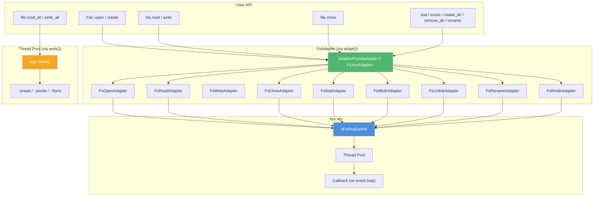

# Filesystem

## Introduction

`xpp::fs::File` provides Promise-based async file I/O that composes with `.then()`, `co_await`, `all()`, and `race()`. It wraps libx's `xfs` module, which offloads filesystem operations to a thread pool — callbacks never block the event loop.

Design: pread/pwrite with explicit offset (no seek), RAII destructor closes synchronously, buffer overloads for both C-style and `Span<uint8_t>`. Free functions cover directory operations (`create_dir`, `remove_dir`, `rename`, `exists`).

```cpp
xpp::EventLoop loop;
xpp::WaitScope scope(loop);

auto file = xpp::fs::File::open("data.txt").wait();
auto content = file.read_to_string().wait();
std::cout << content << std::endl;
// ~File() closes synchronously
```

With coroutines:

```cpp
xpp::Promise<void> process() {
    auto file = co_await xpp::fs::File::open("data.txt");
    auto data = co_await file.read_all();
    co_await xpp::fs::File::create("out.txt").then([&](xpp::fs::File out) {
        return out.write_all(data.data(), data.size());
    });
}
```

## Design Philosophy

1. **pread/pwrite, no seek** — All read/write take explicit `off_t offset`. Thread-safe (no shared file position), simpler API (one less concept), matches libx's `xFsReq.offset`.

2. **RAII with sync close** — `~File()` calls `close(fd)` synchronously if still open. Blocking but fast (`close()` is near-instant). Call `close()` explicitly for async close.

3. **Adapter pattern** — Each operation (open, read, write, close, stat, mkdir, rmdir, unlink, rename) has a typed `FsAdapter` that bridges `xFsReq` callbacks to `PromiseResolver<T>`. Same lifecycle as `TimerAdapter` and `WorkAdapter`.

4. **Blocking I/O offloaded** — `read_all`/`write_all`/`sync_all`/`stat` use `xpp::work()` to offload to the thread pool. Never blocks the event loop thread.

5. **Buffer overloads** — C-style `void* + size_t` (base, matches POSIX, works with all buffer types) and `Span<uint8_t>` (type-safe). No buffer ownership — caller manages lifetime.

6. **Negative = error** — `read`/`write` return `Promise<ssize_t>`: `>= 0` = bytes transferred, `< 0` = `-errno`. Matches POSIX convention.

## Architecture



### Two execution paths

```text
read(buf, len, offset)           read_all()
    │                                 │
    ▼                                 ▼
adapt<ssize_t, FsReadAdapter>     xpp::work([fd]{ pread loop })
    │                                 │
    ▼                                 ▼
xFsReqSubmit (xfs thread pool)   xWorkSubmit (xpp thread pool)
    │                                 │
    ▼                                 ▼
callback → PromiseResolver       result → PromiseResolver
```

Single-operation I/O (read, write, open, close) goes through `xFsReqSubmit` — libx's xfs thread pool. Multi-step operations (read_all, write_all, sync_all) use `xpp::work()` to offload a blocking loop to the thread pool.

## API Reference

### File

| Method | Returns | Description |
| -------- | --------- | ------------- |
| `open(path)` | `Promise<File>` | Open read-only (O_RDONLY) |
| `open(path, flags, mode)` | `Promise<File>` | Open with custom flags |
| `create(path, mode)` | `Promise<File>` | Create/truncate write-only |
| `from_raw_fd(fd)` | `File` | Take ownership of existing fd |
| `read(buf, len, offset)` | `Promise<ssize_t>` | Read at offset (C-style buffer) |
| `read(Span<uint8_t>, offset)` | `Promise<ssize_t>` | Read at offset (Span overload) |
| `write(buf, len, offset)` | `Promise<ssize_t>` | Write at offset (C-style) |
| `write(Span<const uint8_t>, offset)` | `Promise<ssize_t>` | Write at offset (Span) |
| `write(string, offset)` | `Promise<ssize_t>` | Write string at offset |
| `close()` | `Promise<void>` | Async close |
| `sync_all()` | `Promise<void>` | Flush to disk (fsync) |
| `stat()` | `Promise<Stat>` | File metadata (fstat) |
| `read_all()` | `Promise<vector<uint8_t>>` | Read entire file |
| `read_to_string()` | `Promise<string>` | Read as text |
| `write_all(buf, len)` | `Promise<void>` | Write all bytes from offset 0 |
| `raw_fd()` | `int` | Raw file descriptor |
| `is_open()` | `bool` | True if handle valid |

### Free functions

| Function | Returns | Description |
| ---------- | --------- | ------------- |
| `stat(path)` | `Promise<Stat>` | Stat by path |
| `exists(path)` | `Promise<bool>` | Check if path exists |
| `read(path)` | `Promise<vector<uint8_t>>` | Read entire file by path |
| `write(path, buf, len)` | `Promise<void>` | Write file by path (create/truncate) |
| `create_dir(path, mode)` | `Promise<void>` | Create directory |
| `remove_file(path)` | `Promise<void>` | Delete file |
| `remove_dir(path)` | `Promise<void>` | Remove empty directory |
| `rename(old, new)` | `Promise<void>` | Rename file or directory |

### Stat

| Field | Type | Description |
| ------- | ------ | ------------- |
| `size` | `off_t` | File size in bytes (-1 = error) |
| `mode` | `int` | File mode (st_mode) |
| `mtime` | `uint64_t` | Modification time (ms since epoch) |
| `ctime` | `uint64_t` | Change time (ms since epoch) |

## Usage Examples

### Open, read, close

```cpp
xpp::EventLoop loop;
xpp::WaitScope scope(loop);

auto file = xpp::fs::File::open("data.txt").wait();
char buf[4096];
ssize_t n = file.read(buf, sizeof(buf), 0).wait();
// ~File() closes synchronously
```

### Write with Span

```cpp
uint8_t data[] = {0x01, 0x02, 0x03};
auto file = xpp::fs::File::create("out.bin").wait();
file.write(xpp::Span<uint8_t>(data, 3), 0).wait();
```

### Read entire file

```cpp
auto content = xpp::fs::read("config.json").wait();
// content is std::vector<uint8_t>
```

### Check existence

```cpp
if (xpp::fs::exists("settings.json").wait()) {
    // file exists
}
```

### Directory operations

```cpp
xpp::fs::create_dir("output").wait();
xpp::fs::write("output/data.txt", buf, len).wait();
xpp::fs::rename("output/data.txt", "output/result.txt").wait();
xpp::fs::remove_dir("output").wait(); // fails if not empty
```

### Coroutine

```cpp
xpp::Promise<std::string> load_config() {
    auto file = co_await xpp::fs::File::open("config.json");
    co_return co_await file.read_to_string();
}
```

### Chained with then()

```cpp
xpp::fs::File::open("input.txt")
    .then([](xpp::fs::File f) {
        return f.read_to_string().then(
            [f = std::move(f)](std::string content) {
                // transform content
                return content + "\n# appended";
            });
    })
    .then([](std::string content) {
        return xpp::fs::write("output.txt", content.data(), content.size());
    })
    .wait();
```

## Comparison

| Feature | `xpp::fs::File` | `tokio::fs::File` | `std::fstream` |
| --------- | ------------------ | --------------------- | ----------------- |
| Async | Promise + thread pool | async + thread pool | blocking |
| Offset | explicit (pread/pwrite) | file cursor (seek) | file cursor (seek) |
| Buffer | `void*` / `Span<uint8_t>` | `&mut [u8]` / `&[u8]` | `char*` / stream ops |
| RAII close | sync close in dtor | close on drop (async) | close on dtor |
| Error | negative ssize_t | `Result<T, io::Error>` | stream state bits |
| Directory ops | `create_dir` / `remove_dir` / `rename` | `tokio::fs::create_dir` etc. | `std::filesystem` |
| Compose with async | `.then()` / `co_await` / `all()` / `race()` | `.await` / `tokio::join!` / `tokio::select!` | N/A |
| C++ standard | C++17 | N/A | C++11 |

## Implementation Notes

### FsAdapter lifecycle

Each adapter inherits `FsAdapterBase` which owns an `xFsReq`:

```cpp
adapt<T, FsXxxAdapter>(args...)
    → AdapterPromiseNode<T, FsXxxAdapter>  (allocates once)
        → FsXxxAdapter(resolver, args...)   (embedded, no separate alloc)
            → xFsReqSubmit(&m_req)          (submits to xfs thread pool)
            → callback on event loop thread
                → resolver.resolve(result)
            → ~FsXxxAdapter: if !done, xFsReqCancel
```

2 heap allocations per operation: `AdapterPromiseNode` + `Arc<ResolveState>`. Same as `TimerAdapter` and `WorkAdapter`.

### RAII close

```cpp
~File() { close_sync(); }

void close_sync() {
    if (m_open && m_fd >= 0) {
        xFsReq req = {.op = xFsOpClose, .file = fd, .cb = nullptr};
        xFsReqSubmit(&req);  // cb=NULL → synchronous
    }
}
```

`cb = nullptr` makes `xFsReqSubmit` block until the operation completes. `close(fd)` is near-instant (no disk I/O), so this is safe to call from a destructor.

### read_all / write_all use work() not adapt()

Single `read`/`write` go through `xFsReqSubmit` (one shot). But `read_all` needs to loop (fstat → allocate → pread loop). Implementing this as a chain of individual `read()` Promises would be complex and slow. Instead, `xpp::work()` offloads the entire loop to the thread pool in one shot.

### rename: buffer reuse for new path

`xFsReq` uses `buf` + `offset` (length) to pass the new path for rename. `FsRenameAdapter` stores the new path in a `std::string m_new_path` member to keep it alive for the duration of the async request.
