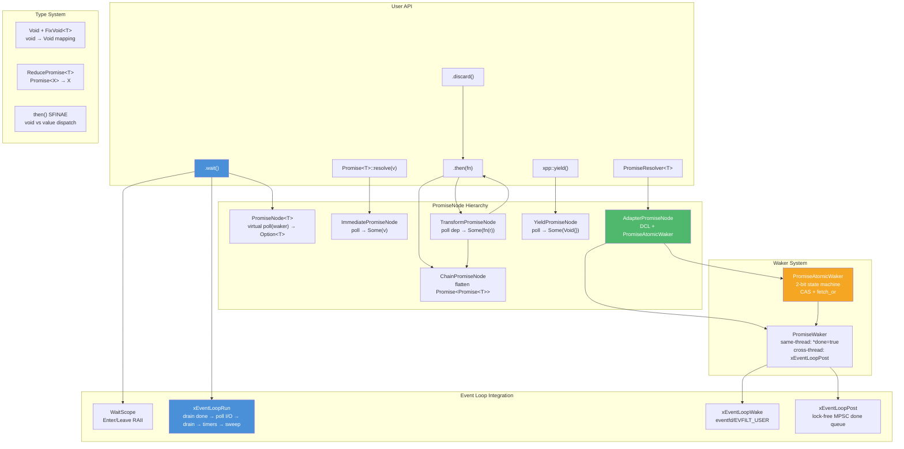

# promise.h — Composable Deferred Values

## Introduction

`promise.h` provides a type-safe Promise system for composable asynchronous programming within the libx event loop. It models the **Rust `Future` trait** in C++17: a deferred value is polled until it resolves, transformations are chained without nesting, and resolution can cross thread boundaries without a mutex.

The system consists of two public types:

- **`Promise<T>`** — A move-only deferred value. Create via `Promise::resolve(v)` (immediate) or `PromiseResolver::promise()` (deferred). Chain transformations with `.then(fn)`. Block and retrieve with `.wait()`.
- **`PromiseResolver<T>`** — A manual fulfillment handle. Create via `PromiseResolver::create()`, hand the associated `Promise` to the consumer, and call `.resolve(v)` when the value is ready — from any thread.

No separate runtime is needed. The event loop drives all polling via `xEventLoopRun` inside `wait()`.

## Design Philosophy

1. **One-Shot Polling** — `poll()` returns `Option<T>`: `Some(value)` means "ready, take it", `None` means "pending, waker stored". Once `Some` is returned, `poll()` must never be called again. There is no separate `take()` — readiness and value extraction are a single atomic operation.

2. **No Executor** — There is no global task spawner, no work-stealing scheduler, no reactor. The only scheduling primitive is `wait()`, which calls `xEventLoopRun` to drive the event loop. This keeps the Promise system zero-dependency and embeddable in any libx application.

3. **Auto-Flatten** — `.then(fn)` that returns `Promise<U>` is automatically flattened to `Promise<U>` rather than `Promise<Promise<U>>`. This is transparent to the caller and eliminates a layer of indirection in every chain.

4. **Lock-Free Cross-Thread Resolve** — `AdapterPromiseNode` and `PromiseAtomicWaker` coordinate `poll()` (event loop thread) and `resolve()` (any thread) without a mutex. A 2-bit atomic state machine handles the race where both sides arrive simultaneously — the registerer self-wakes to prevent lost notifications.

5. **Void-Aware Templates** — C++ forbids storing, passing, or returning `void` as a value. The `Void` unit type and `FixVoid<T>` metafunction map `void` → `Void` transparently so generic code can treat all promise types uniformly. SFINAE-based `then()` overloads dispatch on whether the transform function returns `void` or a value.

6. **Nested `wait()` Is Safe** — A `wait()` inside a `.then()` callback (which runs during another `wait()`) correctly re-enters `xEventLoopRun` without corrupting thread-local loop state. The earlier design called `xEventLoopLeave` on inner `Run` exit, which unbound the outer loop; this was fixed by removing Enter/Leave from `xEventLoopRun` and confining them to `WaitScope`.

## Architecture



### `wait()` Execution Flow

```mermaid
sequenceDiagram
    participant U as User
    participant P as Promise&lt;T&gt;
    participant N as AdapterPromiseNode
    participant W as PromiseAtomicWaker
    participant L as xEventLoop
    participant R as PromiseResolver (other thread)

    U->>P: wait()
    P->>N: poll(waker)
    N->>W: register_waker(waker)
    W-->>N: registered
    N-->>P: None (pending)
    P->>L: xEventLoopRun(X_RUN_DEFAULT)

    Note over L: drain done → poll I/O → timers → ...

    R->>N: resolve(value)
    N->>N: m_val = Some(value)
    N->>N: m_resolved.store(true, release)
    N->>W: wake()
    W->>L: xEventLoopPost(loop, set-done, &done)
    L-->>L: drain done → *done = true
    L-->>P: Run returns

    P->>N: poll(waker)
    N->>N: m_resolved.load(acquire) == true
    N-->>P: Some(value)
    P-->>U: value
```

## API Reference

### Types

| Type | Description |
| --- | --- |
| `Promise<T>` | Move-only deferred value. `then()`, `wait()`, `discard()`, `resolve()`. |
| `PromiseResolver<T>` | Manual fulfillment handle. `promise()`, `resolve()`, `is_pending()`. |
| `Void` | Unit type representing `void` as a storable value (`struct Void {}`). |
| `FixVoid<T>` | Metafunction: `FixVoid<T>::Type` → `T`; `FixVoid<void>::Type` → `Void`. |
| `ReducePromise<T>` | Metafunction: `ReducePromise<Promise<U>>::Type` → `U`; otherwise → `T`. |
| `PromiseWaker` | 16-byte waker: event loop handle + bool pointer. Trivially copyable. |
| `PromiseAtomicWaker` | Lock-free waker cell for `AdapterPromiseNode`. Non-copyable. |
| `WaitScope` | RAII guard for `xEventLoopEnter` / `xEventLoopLeave`. Non-copyable, non-movable. |
| `EventLoop` | RAII wrapper for `xEventLoop`. Must outlive all WaitScopes. |

### Promise\<T\> Members

| Member | Description |
| --- | --- |
| `Promise()` | Default ctor: empty promise. |
| `Promise(Promise &&)` | Move ctor. Source becomes empty. |
| `static Promise resolve(T v)` | Create an immediately-resolved promise. |
| `auto then(Func fn)` | Chain a transformation. Returns `Promise<U>` (auto-flattened). |
| `Promise<void> discard()` | Discard the value, return `Promise<void>`. |
| `T wait()` | Block until resolved, driving the event loop. Consumes the promise. |
| `static auto eval(Func fn)` | Wrap a synchronous function as a promise (void → then → fn). |
| `operator bool()` | True if non-empty (holds a node). |

### PromiseResolver\<T\> Members

| Member | Description |
| --- | --- |
| `static PromiseResolver create()` | Create a resolver. Allocates `AdapterPromiseNode`. |
| `Promise<T> promise()` | Obtain the associated Promise. Can be called at most once. |
| `void resolve(T v)` | Fulfill the promise. Thread-safe. Marks resolver consumed. |
| `bool is_pending()` | True before `resolve()` is called. Not atomic. |

### Free Functions

| Function | Signature | Description |
| --- | --- | --- |
| `yield` | `Promise<void> yield()` | Create an immediately-resolved `Promise<void>`, useful for starting chains. |

## Usage Examples

### Immediate Resolve + Chain

```cpp
#include <xpp/promise.h>

int main() {
    xpp::EventLoop loop;
    xpp::WaitScope scope(loop);

    int result = xpp::Promise<int>::resolve(10)
        .then([](int x) { return x * 2; })
        .then([](int x) { return x - 5; })
        .wait();
    // result == 15
}
```

### Deferred Resolve via Timer

```cpp
#include <xpp/promise.h>
#include <x/base/event.h>

int main() {
    xpp::EventLoop loop;
    xpp::WaitScope scope(loop);

    auto r = xpp::PromiseResolver<int>::create();
    auto p = r.promise();

    // Schedule resolve after 100ms
    xTimerStart(
        [](void *arg) {
            auto *rr = static_cast<decltype(r) *>(arg);
            rr->resolve(42);
        },
        &r, 100, 0);

    int result = p.wait();  // blocks ~100ms
    // result == 42
}
```

### Auto-Flatten (then Returns Promise)

```cpp
int result = xpp::Promise<int>::resolve(1)
    .then([](int x) {
        // Returns Promise<int>, auto-flattened to Promise<int>
        return xpp::Promise<int>::resolve(x * 10);
    })
    .wait();
// result == 10
```

### Void Promise Chain

```cpp
int counter = 0;
xpp::Promise<void>::resolve()
    .then([&]() { counter++; })
    .then([&]() { counter++; })
    .then([&]() { counter++; })
    .wait();
// counter == 3
```

### Cross-Thread Resolve

```cpp
#include <thread>

xpp::EventLoop loop;
xpp::WaitScope scope(loop);

auto r = xpp::PromiseResolver<std::string>::create();
auto p = r.promise();

std::thread worker([&]() {
    r.resolve(std::string("from another thread"));
});

std::string result = p.wait();  // blocks until worker thread resolves
// result == "from another thread"
worker.join();
```

### Nested wait()

```cpp
// wait() inside a .then() callback — safe since Enter/Leave moved to WaitScope.
int result = xpp::Promise<int>::resolve(1)
    .then([](int x) {
        // Inner wait — nests xEventLoopRun
        int inner = xpp::Promise<int>::resolve(x * 100).wait();
        return inner;
    })
    .wait();
// result == 100
```

### Deferred Outer + Deferred Inner (Nested)

```cpp
xpp::EventLoop loop;
xpp::WaitScope scope(loop);

auto outer_r = xpp::PromiseResolver<int>::create();
auto inner_r = xpp::PromiseResolver<int>::create();

// Schedule timers: outer at 60ms, inner at 30ms
// ...

int result = outer_r.promise()
    .then([&](int outer_val) {
        int inner_val = inner_r.promise().wait();  // nested Run
        return outer_val + inner_val;
    })
    .wait();
// Both timers fire, nested Run drains inner, outer continues.
```

### Using eval() for Synchronous Functions

```cpp
int result = xpp::Promise<void>::eval([] { return 42; }).wait();
// result == 42 — eval creates a yield() chain entry point
```

### Using yield() to Start a Chain

```cpp
int result = xpp::yield().then([] { return 1; }).wait();
// result == 1
```

## Best Practices

- **Always create a `WaitScope` before `wait()`.** It binds the event loop to the current thread via `xEventLoopEnter`. Without it, `EventLoop::current()` panics.
- **`PromiseResolver::resolve()` is thread-safe, `is_pending()` is not.** Check `is_pending()` only from the owner thread.
- **`promise()` can be called at most once per resolver.** The resolver retains a raw pointer for `resolve()` but the Promise owns the node via `Own<>`. Calling `promise()` twice yields a double-`Own` and use-after-free.
- **Don't `wait()` on an empty promise.** The default-constructed `Promise<T>()` has no node — `wait()` asserts. Check with `operator bool()` first.
- **Move semantics are ownership transfer.** After `std::move(promise)`, the source is empty (`operator bool() == false`). Use this to pass promises across scope boundaries.
- **Prefer `.then()` over manual polling.** The `then()` chain composes cleanly. Manual `poll()` on internal node types should remain within the `_` namespace.
- **`PromiseResolver` outlives the associated `Promise` in practice.** The resolver holds a raw pointer to the `AdapterPromiseNode`, whose lifetime is managed by the Promise's `Own<>`. If the Promise is destroyed first, resolving a dangling resolver is undefined behavior.
- **All callbacks run on the event loop thread.** No synchronization is needed within `.then()` callbacks for any state protected by single-thread access.
- **Nested `wait()` is safe but beware of deadlock scenarios.** If the inner promise is never resolved, the inner `wait()` will spin `xEventLoopRun` indefinitely — the outer promise can never complete either. This is not a bug; it is the same class of bug as an unresolved single promise. See `promise_deadlock_test.cpp` for detailed analysis.

## Comparison with Other Promise Libraries

| Feature | xpp Promise | JavaScript Promise | Rust Future | folly::Future |
| --- | --- | --- | --- | --- |
| **Execution model** | Caller-driven via `wait()` + event loop | Microtask queue, implicit scheduling | Poll-based, executor-driven | Executor-driven |
| **Runtime required** | None (just event loop) | Built into JS engine | Yes (tokio/smol/etc.) | Yes (folly executors) |
| **Chain syntax** | `.then(fn)` | `.then(fn)` | `.await` / combinator chains | `.thenValue(fn)` / `.via(ex)` |
| **Auto-flatten** | Yes (`ReducePromise`) | Yes (spec-mandated) | Via `flatten()` combinator | No (explicit `.unwrap()`) |
| **Cross-thread resolve** | Yes (lock-free `AtomicWaker`) | Via message passing | Via `Waker::wake_by_ref` | Yes (thread-safe core) |
| **Back-pressure** | Not applicable (one value) | Not applicable | Not applicable | Not applicable |
| **Cancellation** | `PromiseResolver` drop (no notify) | `AbortController` | Drop (no notify) | `Future::cancel()` |
| **Void handling** | `Void` unit type + `FixVoid` | `Promise<void>` (void not storable) | `Future<Output = ()>` | `Future<Unit>` |

**Key Differentiator:** xpp Promise requires no separate runtime, scheduler, or executor. `wait()` drives the libx event loop directly, making the system embeddable in any C++17 codebase from embedded systems to video players without pulling in a concurrency framework.

## Implementation Details

### PromiseNode Hierarchy

Five concrete node types implement the `PromiseNode<T>` interface:

| Node Type | Purpose | poll() Behavior |
| --- | --- | --- |
| `ImmediatePromiseNode<T>` | `Promise::resolve(v)` | Returns `Some(v)` — ignores waker |
| `TransformPromiseNode<U, T, F>` | `.then(fn)` | Polls dependency; if `Some`, applies `fn` and returns `Some(fn(r))` |
| `ChainPromiseNode<T>` | Auto-flatten `Promise<Promise<T>>` | Polls outer; when ready, extracts inner node and polls it |
| `AdapterPromiseNode<T>` | `PromiseResolver` bridge | DCL pattern: check resolved → register waker → double-check → return |
| `YieldPromiseNode` | `yield()` | Returns `Some(Void{})` — immediate void |

**TransformPromiseNode** has four partial specializations (`T→U`, `void→U`, `T→void`, `void→void`) to handle the void-unit-type mapping. Each specialization uses `_voidwrap::call` / `_voidwrap::call1` SFINAE helpers that detect whether the transform function returns `void` and wrap accordingly.

**ChainPromiseNode** uses `m_inner != nullptr` as a simple state machine: `nullptr` means "still polling outer", non-null means "outer done, polling inner". No enum, no extra branch.

**AdapterPromiseNode** is the only node type with lock-free thread safety:

```cpp
Option<ValueType> poll(const PromiseWaker &waker) override {
    // 1. Fast path: already resolved
    if (m_resolved.load(std::memory_order_acquire))
        return std::move(m_val);

    // 2. Register waker (may race with concurrent resolve)
    m_waker.register_waker(std::move(waker));

    // 3. Double-check: resolve may have occurred during register
    if (m_resolved.load(std::memory_order_acquire)) {
        m_waker.wake(); // Self-wake to set done flag
        return std::move(m_val);
    }

    return none; // Pending — waker registered
}

void resolve(T &&value) {
    m_val = Option<ValueType>(std::move(value));
    m_resolved.store(true, std::memory_order_release);
    m_waker.wake();
}
```

### PromiseAtomicWaker — Lock-Free 2-Bit State Machine

Coordinates `register_waker()` (poll side) and `wake()` (resolve side) without a mutex:

| State | Bits | Meaning |
| --- | --- | --- |
| WAITING | `00` | Idle — neither side active |
| REGISTERING | `01` | poll side is storing a new waker |
| WAKING | `10` | resolve side is waking the stored waker |
| RACE | `11` | Both sides collided — registerer self-wakes |

```plain
register_waker(new_waker):
    CAS(00 → 01)
    ├─ success → store waker → exchange(01 → 00)
    │            ├─ prev == 00 → done (no concurrent wake)
    │            └─ prev == 11 → self-wake (resolve happened during store)
    └─ failure →
         ├─ prev == 10 → wake(new_waker) — resolve already in progress
         └─ prev == 11 → spin/CAS again (race with another registerer)

wake():
    fetch_or(10)
    ├─ prev == 00 → exclusive → wake stored waker → store(00)
    └─ prev == 01 → race → just set WAKING bit
        └─ registerer's exchange sees 11 → self-wakes
```

The entire coordination is three atomic operations (`load_acquire`, `compare_exchange_strong`, `fetch_or` / `exchange_acq_rel`). No spin loops, no CAS retries beyond the single `compare_exchange_strong`. Memory ordering uses acquire/release consistently: `store(release)` on resolve, `load(acquire)` on poll, `fetch_or(acq_rel)` on wake to ensure the resolved value is visible before the waker fires.

At most one waker is ever stored in the cell. When `wake()` fires, the callback is pushed to `xEventLoopPost`'s MPSC done queue. `register_waker` discards any previously-stored waker without calling it — the poller supplies a fresh one each time.

### PromiseWaker — Same-Thread vs Cross-Thread

```cpp
void wake() const {
    if (m_loop == xEventLoopCurrent()) {
        *m_done = true;           // Same thread — 2 instructions
    } else {
        xEventLoopPost(m_loop,   // Cross-thread — MPSC enqueue + wake
            [](void *a) { *static_cast<bool *>(a) = true; }, m_done);
    }
}
```

The waker captures the event loop handle at creation time (`PromiseWaker::sync_wait()` calls `EventLoop::current()`). When fired from the same thread, it sets `*done = true` directly — zero syscall overhead. When fired from another thread, it posts to the loop's lock-free done queue and triggers `xEventLoopWake` to unblock `epoll_wait` / `kevent`.

### Nested wait() Correctness

The critical invariant for nested `wait()` is that `xEventLoopRun` does **not** call `xEventLoopLeave` on return. The Enter/Leave pair is scoped to `WaitScope`:

```cpp
class WaitScope {
public:
    explicit WaitScope(const EventLoop &loop) : m_loop(loop.handle()) {
        if (m_loop) xEventLoopEnter(m_loop);   // Thread-local binding
    }
    ~WaitScope() {
        if (m_loop) xEventLoopLeave();         // Unbind on scope exit
    }
    // Non-copyable, non-movable
};
```

This means the call stack can be:

```plain
wait()  (outer)
  poll()  →  None
  xEventLoopRun()  →  timer fires → resolve inner → then() callback
    .then(fn)  →  fn calls inner_promise.wait()
      wait()  (inner)
        poll()  →  Some(result)  →  return
    fn returns result
  while(!done) ... done==true  →  poll  →  Some  →  return
```

Both `xEventLoopRun` calls see the same thread-local loop handle because `WaitScope`'s `Enter` was called once at the outermost scope. Neither inner `Run` exit unbinds it.

## Integration Status

| Consumer | Node Type | Reason |
| --- | --- | --- |
| `PromiseResolver::create()` | `AdapterPromiseNode` | Deferred cross-thread resolution |
| `Promise::resolve(v)` | `ImmediatePromiseNode` | Immediate synchronous completion |
| `.then(fn)` | `TransformPromiseNode` / `ChainPromiseNode` | Value transformation / auto-flatten |
| `yield()` | `YieldPromiseNode` | Chain entry point for eval() |
