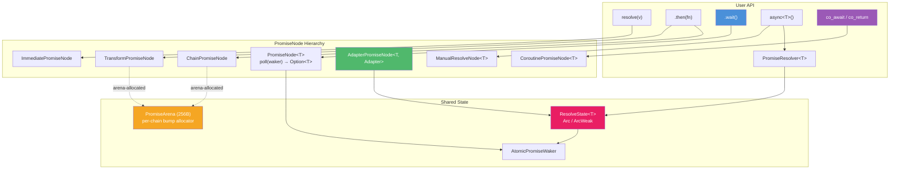

# Promise\<T\> — Composable Deferred Values

[← libxpp](../README.md)

## Introduction

`Promise<T>` provides a type-safe async programming system within the libx event loop. It combines the poll-based model from Rust's `Future` trait with the node-hierarchy and per-chain arena allocation from KJ (Cap'n Proto), plus native C++20 coroutine support — `Promise<T>` itself is the coroutine return type, with no separate `Task<T>`.

The core API (`.then()`, `.wait()`, `resolve()`, `all()`, `race()`) is C++11. C++20 is required only for `co_await` / `co_return`.

`wait()` drives the event loop on the calling thread, like Tokio's single-threaded `current_thread` runtime — no background thread pool is needed.

`Promise<T>` supports two equivalent coding styles — pick whichever fits your compiler and preference:

With C++11 `then()` callbacks:

```cpp
xpp::Promise<int> compute() {
    return fetch_value()
        .then([](int x) { return x * 2; });
}
int result = compute().wait();  // drives event loop, returns 2x
```

With C++20 `co_await` / `co_return`:

```cpp
xpp::Promise<int> compute() {
    int x = co_await fetch_value();
    co_return x * 2;
}
int result = compute().wait();  // same poll mechanism, same result
```

Both are backed by the same `poll()`-based state machine. `wait()` drives the event loop on the calling thread, like Tokio's single-threaded `current_thread` runtime — no background thread pool is needed.

## Design Philosophy

1. **One-Shot Polling** — `poll()` returns `Option<T>`: `Some(value)` = ready, `None` = pending. No separate `take()`.
2. **Single-Threaded Executor** — Like Tokio's `current_thread` runtime. The event loop is both reactor (I/O) and scheduler (timers/callbacks). `wait()` polls futures on the calling thread; no background thread pool needed. `co_await` is optional (C++20).
3. **Auto-Flatten** — `.then(fn)` returning `Promise<U>` becomes `Promise<U>`, not `Promise<Promise<U>>`.
4. **Lock-Free Cross-Thread Resolve** — `PromiseResolver` holds `ArcWeak`; `resolve()` silently drops if Promise is destroyed.
5. **Void-Aware Templates** — `Void` + `FixVoid<T>` maps `void → Void` for uniform generic code.
6. **Nested `wait()` Is Safe** — `WaitScope` owns the loop binding; nested `Run` calls don't unbind it.
7. **Per-Chain Arena** — `.then()` chains bump-allocate nodes in a shared 256-byte arena, reducing malloc calls from O(N) to O(1) per chain. Overflow nodes fall back to heap transparently.
8. **Coroutine-Native** — `Promise<T>` is both a poll-based node container and a C++20 coroutine return type. `co_await` drives the same `poll()` mechanism as `.then()`.
9. **Adapter Pattern** — External async operations (timers, thread pool, custom I/O) bridge into the poll world via `AdapterPromiseNode` + `PromiseResolver`.

## Architecture



## Topics

- [Deferred Resolution](deferred.md) — `async()`, `PromiseResolver`, cross-thread resolve
- [Timers & Timeouts](timers.md) — `after(ms)`, timeout pattern with `race`
- [Combinators](combinators.md) — `all()`, `race()`, concurrent composition
- [Utilities](utils.md) — `try_next()`, sequential fall-through
- [Custom Adapters](adapter.md) — `adapt`, `work`, Adapter contract, `TimerAdapter`, `WorkAdapter`
- [C++20 Coroutines](coroutine.md) — `co_await` / `co_return` with `Promise<T>` (no `Task<T>`)
- [Internals](internals.md) — `PromiseNode` hierarchy, waker system, `ResolveState`

## API Reference

### Promise\<T\>

| Member | Description |
| -------- | ------------- |
| `auto then(Func fn)` | Chain transform. If `fn` returns `Promise<U>`, auto-flattens to `Promise<U>` |
| `Promise<void> discard()` | Drop value, return `Promise<void>` |
| `T wait()` | Block + drive event loop. Moves node out of promise (promise left empty) |
| `operator co_await()` | (C++20 only) Await in coroutine. Rvalue-qualified |
| `operator bool()` | True if non-empty (holds a node) |

### PromiseResolver\<T\>

| Member | Description |
| -------- | ------------- |
| `void resolve(T v)` | Fulfill with value. Thread-safe. Silently drops if Promise destroyed |
| `void resolve()` | (void specialization) Fulfill with no value |
| `bool is_pending()` | True if Promise alive and unresolved |

### Free Functions

| Function | Description |
| ---------- | ------------- |
| `resolve(v)` | Immediately-resolved promise. T deduced from argument |
| `yield()` | Immediately-resolved `Promise<void>` |
| `after(ms)` | Resolve after `ms` milliseconds. Returns `Promise<void>` |
| `defer(fn)` | Defer sync function as promise. T deduced from return type |
| `work(fn)` | Run func on thread pool. T deduced from return type |
| `adapt<T, Adapter>(args...)` | Custom adapter-backed promise |
| `async<T>()` | → `pair<Promise<T>, PromiseResolver<T>>` |
| `all(Promise<Ts>...)` | Wait for all → `tuple` or `void` |
| `race(Promise<T>, Promise<T>...)` | First resolved wins |
| `try_next(items, fn)` | Try each item sequentially, return first `ok` |
